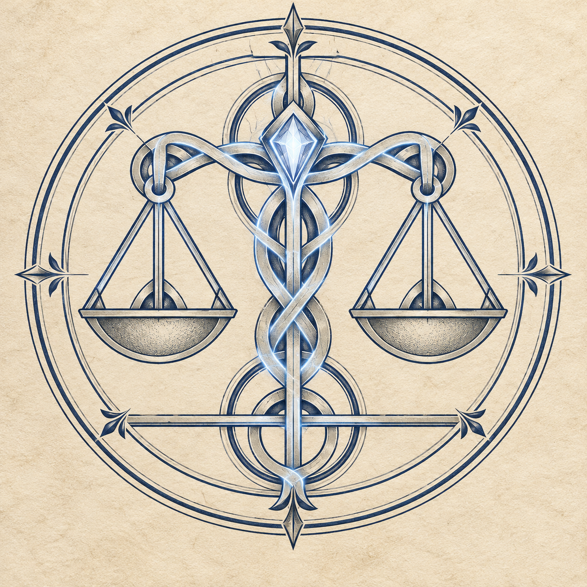

# Guild Accord emblem

Isaac approved this artwork on 2026-10-07 and requested that it be saved and
pushed to GitHub. This is the selected second version, preserved without edits.

The direction is **arcane bureaucracy**: formal agreements, shared oaths and
measured authority. Isaac clarified that the Accord has an industrial side,
but industry does not define the whole institution. The earlier heavy metal
medallion was replaced by fine ink, parchment and restrained magical light.

The level scales interpret the Accord's motto, “Balance before Dominion.”
The interwoven bands evoke the Concord Lattice and the obligations joining
its guilds, academies and Orders. The central crystal evokes the Soul Crystal
fragments offered upon joining. These are the design's intended associations;
the illustration does not specify a working, power or mechanical effect.

Lore consulted:

- [The Guild Accord](../../../wiki/Factions,%20Bloodlines%20%26%20Institutions/The%20Guild%20Accord.md)
- [The Guild Accord in the Modern Era](../../../wiki/The%20Guild%20Accord/The%20Guild%20Accord%20in%20the%20Modern%20Era%20%E2%80%94%20Divisions,%20Companies,%20Academies%20and%20Offices.md)
- [Accord Standing Inventory](../../../desktop/inventories/accord.md)

No fixed emblem was found in the consulted pages. The imagery is an approved
artistic interpretation; saving it does not amend rules or publish a wiki page.

Generated with Codex's built-in image generation tool. The exact final edit
prompt is retained in [generation-prompt.txt](generation-prompt.txt). Its input
was the first metal-medallion concept from the same conversation.
