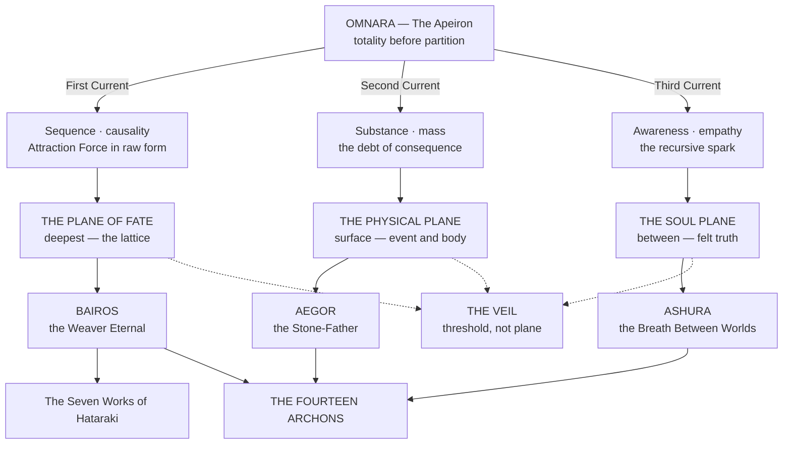
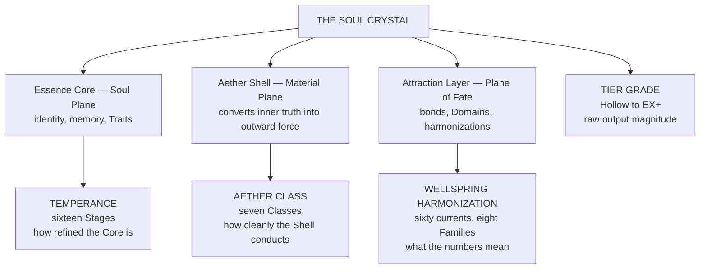
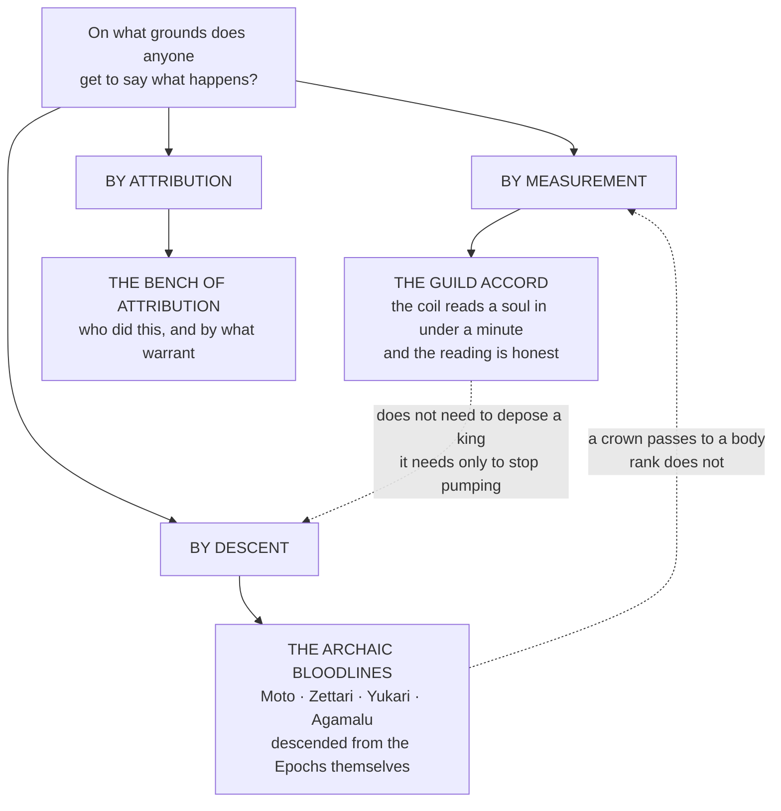
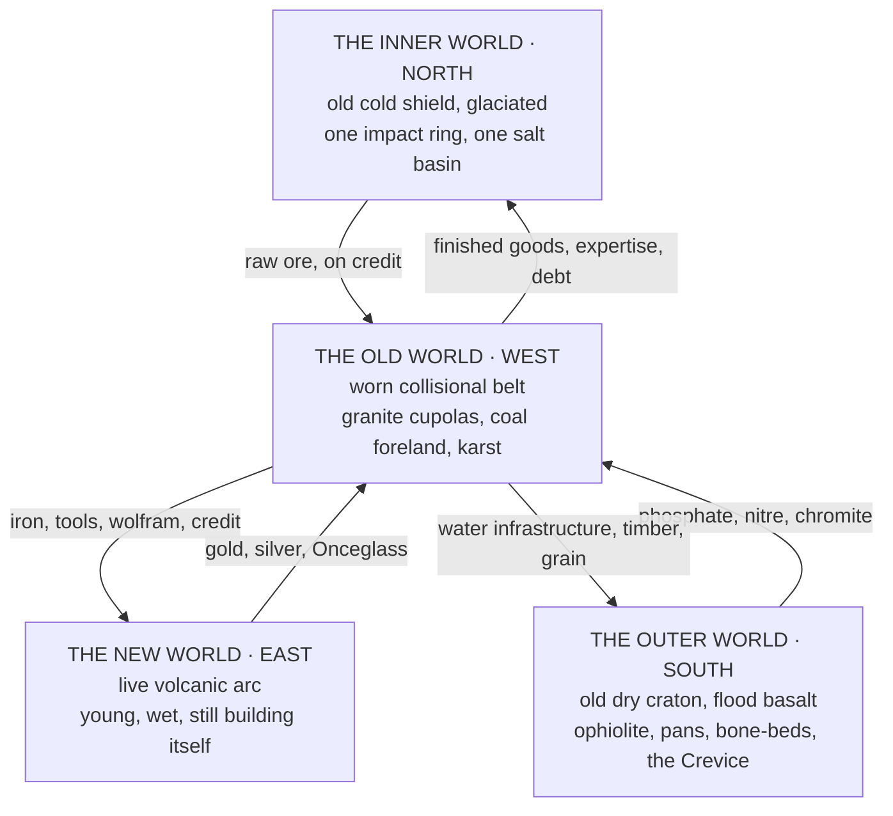

# WOTR conversion brief — common to every item

You are converting an item from the old Trello board (*The Dawn of Iridescent
Sovereignty Lost*, the pre-Fracture-of-Worlds era) into current War of the Realms
canon. The world has changed since the card was written. Your output must fit the
world as it is now, in the format of the exemplar for your item type, with every
number derived from the Fracture of Worlds tables below.

## The five laws of this conversion

1. **Only the source's facts, on the current world's terms.** Keep every fact the
   card gives (who, what, history, relationships, powers) unless it contradicts
   current canon; then convert it and say so in the migration note. Do not add
   history the card does not give.
2. **Numbers come off the tables, and you commit to them.** Level, Stage, Band,
   Grades, Sub-Stats, EU, η all derive from what the card states (an old "Stage IX
   — Reflection" is converted to the FOW Stage of the same numeral; the card's power
   description places the Level within that Stage's Band; Grades follow the Tier
   Grade ranges). Where the card gives nothing to derive from, choose the most
   conservative value consistent with the card and the tables, and state the
   choice in one line of the migration note. Isaac has delegated these calls:
   never write "pending Isaac", "estimate" or "TBD" in a slot; write the number.
3. **Verify every proper noun.** Realms, factions, deities, eras, glyph systems,
   languages. Use the `wiki` tool: `wiki("Purganeth")`, `wiki("Parun glyph")`. If it
   exists in current canon, use the current form. If it does not exist, keep it
   only if the card cannot make sense without it, and flag it in the migration
   note as *unattested in current canon*. Old era names convert per the Errata
   table below. Old naming registers convert per the Moto Reversion table (Büri →
   Moto, Ajiin → Hataraki, Altan → Kōkan, Khar Ild → Kurosetsu ...).
4. **Nothing is explained by old-system vocabulary.** "Essence types", "Aether
   Class: <free text>", "Path: Body/Spirit/Judgment", "mana", "spells" as a class —
   these are converted to the current vocabulary: the seven Aether Classes, the
   Four Paths, the Eight Primaries, Wellsprings by Family, Categories, the Four
   Crafts (Chantcraft is folded into Spellcraft, ruled 2026-09-12).
5. **Every technique carries a Counter** (mandatory) and the summary card
   Effect / Cost / Limit / Counter / What nobody knows. A technique must be
   statable as "it does X to Y, which under Z produces W".

## Output

Write the finished markdown to the output path you were given. Start with the
title as `# <Name> · <Epithet>` (characters, artifacts) or `# <Name>` (techniques,
beasts), then a one-paragraph *migration note* in a blockquote stating what was
converted, what was unattested, and what is pending Isaac. Then the sections in
the exemplar's order with the exemplar's exact headings. Prose sections obey the
prose law (no em dashes, no "not X but Y", no countdown negation; you may call
`verify_scene` on a prose section). Under 16,000 characters.

Do not call `create_character` or write to Notion; a review pass runs first.

## What changed since the board (the lore delta)

- **Naming.** Moto register for the Moto bloodline; the Büri/Mongolian register is dead (ruled 2026-09-12). Five naming strata: Japonic (archaic bloodlines), Korean (Mahuo), Chinese (lineage halls), Northern English and Norse (chartered families and commons), Far-Northern carried-name logic. Naming register is not ethnicity.
- **The Draw Age (Pack Eleven).** Wellsprings as standing currents; a worked site is a *Core* in common speech; Cores recharge; draw is a guild-licence good (commoners burn oil); the Guild of Measurewrights measures, the Guild Accord governs; gunpowder exists and armour survives; the technology ceiling is everything invented 1800–1900 and nothing after; Wells can generate hostile entities.
- **The system is Fracture of Worlds.** Sixteen Stages (FOW names: Murmuring, Welling, Ascension, Flourishing, Splintering, Glory, Refraction, Transcendence, Invocation, Realization ...), five Bands by Level, Tier Grades by stat value, eight Primaries with eight Sub-Stats each, seven Aether Classes, Coherence Band and η, the Soul Crystal (Essence Core, Aether Shell, Attraction Layer).
- **Magic.** Sixty Wellsprings in eight Families, each with a Physics Domain; twenty-six Magical Categories; Four Crafts (Magicraft, Spellcraft, Runecraft, Draftcraft; Chantcraft folded into Spellcraft); the Design Chain is prose-legal; mechanism is on the page; the Origin layer is explicable (ruled 2026-09-12).
- **Chronology.** The Errata below governs dates and era names; Epoch figures are myth, not arithmetic.
- **Cosmology.** Omnara and the Division; the Fourteen Archons in six pairs and a dyad; the Fourteen Titans; the Three Epochs; the Celestial Host. Verify any deity or entity the card names.

## Errata to the Received Registers (dates and eras)

# Errata to the Received Registers

*The Conversion of Superseded Dates, with a Ruling on the Epochs*
> Issued by the Guild of Measurewrights under the Hexagonal Oath, as a companion instrument to the Concordance of Ages. Year 715 of the Imperial Age, Withering Era.
> 
> This document does not amend the Concordance. It states how a reader holding an older register is to convert what is in front of them.

---

## I. Why an Errata Rather Than a Recension

The Concordance withdrew the received chronology. It did not, and could not, withdraw the several hundred documents written against it.
The Archives requested a full recension, meaning that every affected register be reissued in corrected form. The Guild declined, for two reasons and one of them is not administrative convenience.
> **The first reason is that a recension destroys the evidence.** A charter written in the old count is a record of what its signatories believed, and a bloodline claim written against a date that no longer exists is still a claim, still binding on its parties, and still the only surviving proof that the claim was made. Reissuing it silently corrected would leave the Accord holding a shelf of documents that all agree with each other and none of which anyone has read.
**The second reason is that the conversion is mechanical.** Where a superseded register gives a date in the old count, the correction is a substitution and not a judgement, and a reader who has this instrument in hand can perform it without consulting the Guild. Six substitutions cover the whole corpus.

---

## II. The Ruling on Epochs

Before the substitutions, a distinction the Guild has been asked for since the Concordance was sealed.
> The Concordance governs **the Ages**. It does not govern **the Epochs**, and no reader should attempt to convert one into the other.
The Ages are historical. They are counted, attested, and dated by physical evidence, and the whole of them runs from Year minus fourteen hundred to the present. The Epochs are cosmological. They concern the Division of Omnara, the three currents, the Plane of Fate, the Soul Plane, the Physical Plane, the Titans, and the Archons. Their durations are given in the surviving records as figures in the tens and hundreds of thousands, and the Guild has examined those figures and found that not one of them derives from a count.
No calendar existed. No observer stood outside the Epoch to mark its passage. The numbers are theological quantities in the shape of durations, and the Guild considers them **accurate as statements about magnitude and meaningless as statements about years**.
This is not a demotion. A bloodline that traces itself to the Second Epoch is making a claim about origin and not about arithmetic, and the claim is unaffected by the Concordance. The Yukari registers stating that Senri Yukari perceived Ashura's approach across a hundred and twenty thousand years remain as written. The Zettari registers claiming two hundred thousand years of continuous lineage remain as written, and the Guild notes that the Zettari's own archive describes that figure as *held out of conviction*, which is the correct description and does the Guild's work for it.
| Finding | Statement |
|---|---|
| **The rule** | An Epoch figure is not to be placed on the Age count, subtracted from it, or reconciled with it. A document that gives both is giving a myth and a measurement and expects the reader to know which is which. |
| **The consequence** | No bloodline codex, no Archonic register, no Path or Wellspring origin account requires amendment under the Concordance. The Guild has examined the principal registers of the Yukari, the Zettari, the Moto, and the Alftian codices and finds that not one of them cites an Age. They were never in conflict with the count. **They were in a different conversation.** |

---

## III. The Six Substitutions

Where a superseded register uses the term at left, the reader substitutes the term at right. Where a date is attached, the reader converts it by the note given.
| Superseded term | Corrected term | Note on conversion |
|---|---|---|
| The Age of Deliberation | The Reconstruction Age, early | Dates given as "thirty thousand" are withdrawn. The era runs −450 to −225 in the corrected count |
| The Dragon Empire | The late Reconstruction kingdoms | Dates given as "twelve thousand" are withdrawn. The period runs −225 to −60. No single polity is attested; the received name describes a trading and military region |
| The Pyrrhean Epidemic | The Antediluvian collapse | Withdrawn as a distinct era. The events attributed to it belong to the closing century of the Antediluvian Calendar, circa −550 to −450 |
| The Imperial Calendar | The Imperial Age | The count itself is unchanged. Year Zero is Year Zero. Only the name of the age is corrected |
| The Withering Age | The Withering Era | Where a register places the Withering before the Voyager Era, the register is inverted and the reading is to be reversed. The Withering opens Year 645 |
| The Renaissance Era, The Fractured Era | **No corrected term** | Neither appears in any sealed chronology. A register citing them is citing Divisional correspondence and should be read as opinion |

### On the Withdrawn Figures

Every number in the old count above about two thousand derives from a single stratigraphic method that read seasonal ash layers as annual ones, at a site where the ash falls four times a year. The error compounds by a factor near forty across the depth of the section.
> A reader encountering an old figure may convert it by **dividing by forty** and treating the result as an order of magnitude rather than a date. The Guild offers this reluctantly and only because it knows the alternative is that readers will invent a worse rule.

---

## IV. Registers Requiring No Action

The Guild has surveyed the principal holdings and records the following as conforming already, so that no clerk spends a season correcting what is not wrong.
**Documents stamped in the Voyager Era at low Imperial years** · The Concord Codex at Imperial Year 000, the Heart Vault inner seal at Imperial Year 013, the Hall of the Vanguard engraving at Imperial Year 014, and the High Concordant's Lattice writ at Imperial Year 027 are all correct as sealed. The Voyager Era is the opening era of the Imperial Age and runs to Year 070. The apparent paradox in the first edition of the Four Ceilings arose from placing it five centuries late and has been withdrawn.
**Bloodline and Path registers** · See Section II. None cite an Age.
**Wellspring registers** · The sixty Wellsprings are described by law and behaviour rather than by date. Where a Wellspring register gives an era of discovery, it is giving the era in which somebody wrote it down, which is a fact about scribes.
**Technique and glyph registers** · Unaffected. A glyph combination has no date.
**The Guild Accord instruments** · The Codex articles, the Divisions, the Tiered Path, and the Gate network all date to the Voyager Era and are correct as written.

## Cosmology, in brief

# Cosmology & Metaphysics

> Three planes, nested rather than stacked. Fourteen crowned ideas administering the principles that make the planes legible to each other. One threshold where the laws of all three become negotiable. And, running underneath the whole architecture, a count that was wrong by a factor near forty until somebody checked the ash.
> *"Reality is the shape that possibility chooses to wear for a little while. The Plane of Fate is the wardrobe."* — Fragment of the Lattice of Names

---

## The Architecture

Everything in this section descends from a single event that no surviving record explains. Before it there was **Omnara**, the state of totality before totality required compartments. After it there were three currents, and from the three currents three planes, and from the three planes three sovereign intelligences, and from the tension between those three the **Fourteen Archons** condensed into conceptual sovereignty.
The planes are nested, not stacked. The **Plane of Fate** lies deepest, the lattice upon which all possibility rests. The **Soul Plane** lies between, the stratum through which abstract law becomes a soul's felt truth. The **Physical Plane** sits at the surface, where truth becomes event, body, ruin, and mountain range. Wherever one plane's law borders another's, a transition zone must exist, and that transition zone is the **Veil**.

> **The hierarchy of law.** Titanic Law governs the geologic and cosmic architecture of the Realms. **Archonic Law** governs the conceptual forces that give physical and energetic phenomena their meaning. **Wellspring Law** governs the behaviour of Essence currents and Aether. All spells, Domains, Soul Crystal mutations, Wellspring Paths, and godlike abilities must draw from one of these three strata. No magic exists outside the lattice Omnara's Division created.

---

## The Count

The cosmological record and the historical record are two different conversations, and the Guild of Measurewrights has ruled formally that they are not to be reconciled with one another.
The **Epochs** are cosmological. Their durations survive in figures running to the tens and hundreds of thousands, and the Guild has examined every one of those figures and found that not one derives from a count. No calendar existed. No observer stood outside an Epoch to mark its passage. The **Ages** are historical, counted and attested by physical evidence, and the whole of them runs from Year −1,400 to the present.
A document giving both is giving a myth and a measurement, and expects the reader to know which is which.
> Every claim resting on antiquity is worth less than it was before the Concordance was sealed. A house that held title by right of thirty thousand years now holds it by right of six hundred. The title is not weaker in law. It is weaker in the only currency such claims actually trade in.

---

## The Magic System, in brief

# The Magic System

> The Continuum does not grant power. It measures a soul, records what the measurement found, and permits exactly as much as the architecture will bear. Everything in this section is an account of that measurement: what it reads, what it refuses to read, and what it costs to move the needle.
> *"Temperance is not a buff. It is a confession of how much you have survived."*
> **Where the numbers live.** Everything on this page is the account. The arithmetic underneath it is **Fracture of Worlds — The Living System**, filed at the foot of this section in twenty-two Parts across eight pages. Bands and Temperance Gates, the Tier Grade thresholds, the Sub-Stat ceiling per Stage, all sixty-four Path gates, Threshold Catalysts, Resonant Pairs, Strike Force and Durability benchmarks, Aether Class efficiency, the η table, Domain costs.
>
> Read it when a value is in question, not before. This page tells you what the system is. Fracture of Worlds tells you what the number has to be.

---

## The Six Things That Carry the System

Everything after these is detail.
| Number | The rule |
|---|---|
| **One** | Reality has three planes. Matter, soul, and fate. Every act of magic crosses all three at once. Remove one and the working fails, without exception and without appeal. |
| **Two** | Aether is the ocean. Essence is your water. Aether is infinite and belongs to no one. Essence is Aether you have drawn in, circulated, and stamped with your identity, and there is only ever as much of it as you have earned. |
| **Three** | You cast through a Soul Crystal, not through a wand, a word, or a will. The Crystal has three layers, one per plane, and its architecture decides what you are capable of long before your ambition gets a vote. |
| **Four** | Power is refined, not accumulated. Temperance is subtraction. Sixteen Stages, each one a structural reorganization of the Crystal under pressure you did not ask for. You do not climb them by training. You climb them by surviving something that changes you. |
| **Five** | Everything costs. Essence is spent, not summoned. Domains bleed. Traits fatigue. Overchannel scars. A practitioner who tells you a technique is free is either lying or has not yet paid the invoice. |
| **Six** | The system does not lie and it does not forgive. Your numbers are the Continuum's honest assessment of the soul carrying them. They can be improved. They cannot be argued with. |

---

## The Four Axes

A practitioner is not described by one number. Four independent measurements run alongside each other, and the gaps between them are as diagnostic as the values themselves.

> Temperance sets the **ceiling**. Tier Grade reports the **magnitude**. Aether Class decides how much of the magnitude actually **arrives**. Wellspring harmonization changes what the magnitude **means** without changing the number by a single point.
>
> Two practitioners at identical stat values and identical Stage can produce wildly different results if one is Class III Resonant and the other is Class I Muridic. The stats are the same. The delivery is not.

---

## Factions, Bloodlines and Institutions, in brief

# Factions, Bloodlines & Institutions

> Two systems of legitimacy occupy the same ground and neither can abolish the other. **The Crown holds** the land, the law, the levy, and the right to hang, legitimate by descent. **The Accord holds** the assay, the rank, the credit, the writ, and the arrays, legitimate by measurement.
>
> *Neither side says this out loud. Both sides have costed it.*
> *"Balance before Dominion."* — carved into every Guild Hall gate across every realm

---

## The Argument This Section Is About

Every institution in the four quarters is an answer to one question: **on what grounds does anyone get to say what happens.**

| Institution | Its claim | Its vulnerability |
|---|---|---|
| **The Guild Accord** | Legitimacy by measurement. It recognises no bloodline, honours rank in every member polity, and issues the only portable legal identity most people will ever hold | It is a bureaucracy that compresses what it administers, and **it has a sixth Division whose existence the public Codex does not acknowledge** |
| **The archaic bloodlines** | Legitimacy by descent, and the descent is not metaphorical — three of them trace to the three Epochs directly | A crown passes to a body. **A kingdom whose heir assays weak has a strategic problem no amount of ancestry solves** |
| **The third parties** | Sanctum Lux, the Bench of Attribution, and the Paths each claim an authority that answers to neither crown nor coil | Being answerable to no one is only an advantage until somebody asks who audits you |

---

## The Registers

| Register | Voice |
|---|---|
| **The Concord Codex** | Statutory and liturgical at once. Articles numbered, laws named, every section closing on an engraving with a date attached. It is a legal instrument that believes it is scripture, **and it is not entirely wrong** |
| **The bloodline codices** | Inheritance documents. Written by lineages about themselves, for their own descendants, with the specific unreliability that implies |
| **Restricted Article XII** | The Black Concord's own record, which exists to be burned. *If this record is read, you were meant to* |

## Geography, in brief

# Geography & the Four Quarters

> Borders move. **Bedrock does not.** A shaft sunk on the northern shield behaves the same whichever charter is over the headframe, and a shaft sunk in the eastern ash will kill your men the same way regardless of which flag is over it.
> *Any surveyor who reads this ledger politically has read it wrong.*

---

## The Four Quarters

All four were emplaced in the **First Eon**, which under the Concordance closes at Year −900, and nothing has been added to any of them since. The Measurewrights have been asked whether the corrected count makes the deposits younger, and answer that it does not. **It makes them nearer.** A seam emplaced fourteen hundred years ago and half drawn down in the last six hundred is a different object, politically, from a seam emplaced before memory, and every chartered company in the western quarter is presently discovering the difference.
| Quarter | Substrate | Condition | The bind it lives under |
|---|---|---|---|
| **North** · Inner World | Old cold shield, glaciated, one impact ring, one salt basin | Superb bearing stock, high ambient Essence, no infrastructure | Cheap array heat, expensive everything else |
| **West** · Old World | Worn collisional belt, granite cupolas, coal foreland, karst | Deepest workings, most complete infrastructure, exhausted ground and depleted Essence | **Total array dependency for survival, not production** |
| **East** · New World | Live volcanic arc, young, wet, mobile | Richest surface ore, self-supplying cement, mobile Wellsprings | Almost no array dependency outside the eastern arc |
| **South** · Outer World | Old dry craton, flood basalt, ophiolite, pans, bone-beds, Crevice | No array industry possible; materials requiring no processing | Extraction by hand at scale, value added elsewhere |

> **The pattern worth stating plainly.** The quarter with the most Essence has the least industry. The quarter with the most industry has the least Essence. And the two quarters in between have each solved the problem by refusing to build anything that would create the dependency in the first place.
>
> The Accord's standing assumption that industrial capability follows from magical capability **is not supported anywhere in the ledger.**

---

## The Twin Rating

A material has two independent worths, and the persistent error of the trade is treating them as one.

## The Sixty Wellsprings by Family (assign harmonisations from this list only)

- **Caloria — Thermodynamics**: Pyreveil · The Fire of Renewal; Exuroth · The Trial Flame; Ignivale · The Wellspring of the Spark; Cinerion · The Ash Veil; Solfatara · The Fuming Earth; Manganthra · The Catalyst of Change; Cataclysm · The Shattered Law; Pyraeon · The Ember Crown; Catharsis · The Wellspring of Release; Penanceflare · The Light of Contrition
- **Fluxia — Fluid Dynamics**: Phreatis · The Waters of Memory; Somnalis · The Dream Veil; Thaloré · The Wellspring of Depth; Oblation · The Offering Flame
- **Fulguria — Electromagnetism**: Judicium · The Wellspring of Truth; Aurevane · The Wellspring of Light; Cymorath · The Air of Ascent; Orrenthal · The Metallic Heart; Luminalis · The Hidden Light; Abyntheus · The Outer Pulse
- **Limina — Entropy, Void and Mind**: Letheveil · The Waters of Forgetting; Lethegraal · The Cup of Forgetting; Hypnather · The Sleep Crown; Mirithane · The Wellspring of Reflection; Oneirion · The Wellspring of Dream; Eidolyn · The Shaping Mind; Anamnesis · The Wellspring of Remembrance; Dissolution · The Unbinding Stream; Tenebra · The Hidden Shadow; Oblivara · The Dark Mirror; Nyxial · The Nocturne Flame; Nihiloth · The Hollow Law; Vantabriel · The Wellspring of Night
- **Materia — Material Science**: Materia Primordia · The First Substance; Monolithion · The Enduring Monument; Chthonica · The Root Deep; Basilithe · The Stone Will; Tarturon · The Fire of Reckoning; Coagula · The Unifying Pulse; Fixatio · The Binding Flame; Coagulatio · The Returning Stone; Terranova · The Living Earth
- **Spatium — Spatial Geometry**: Transmutatio · The Law of Change; Transference · The Living Exchange; Eclipseron · The Shadowed Star
- **Vectoria — Mechanics**: Fractura · The Breaking Point; Petralon · The Foundation Stone; Ascensio · The Ladder of Ascent; Sublimatio · The Ascending Breath; Sublimare · The Rising Breath; Abython · The Abyssal Pulse; Absolution · The Cleansing Current; Penance · The Atoning Path
- **Vitalia — Biochemistry**: Anima Spirare · The Soul's Breath; Verdantia · The Green Pulse; Benediction · The Wellspring of Grace; Rebirthine · The Cycle Eternal; Mortalis · The Black Gate; Redemption · The Light Reclaimed; Contrition · The Broken Flame; Phreatis · The Waters of Memory

## The Magical Categories

The Magical Categories answer what kind of thing it is — Arts, Drafts, Conjunction, Synergia, Harmonia, Ritus, Phenomena, Glyphica, Manifestus, Viaforma, Traitus, Mechanica, Crystalia, Wellsprings, Animatria, Vocatia, Vectra, Mnemata, Aetherica, Concordia, Domain Weaving, Claustra, Silentia, Auguria, Transitus, Votia.

## The seven Aether Classes

| The Seven Aether Classes -- Shell Conductivity, not Power (Part Seventeen) |
| Class | Name | Band / Crystal Correlate | Efficiency Loss | Description |
| Class 0 | The Dormant | Precedes Band F; Dormant Crystal | No output above Hollow Grade possible | Sealed, unresponsive Shell. The soul dreams without memory and leaves no lasting metaphysical trace. |
| Class I | The Muridic | Band F; Awakened Crystal | ~30-40% efficiency loss | The awakening Shell flickers with first resonance; Essence leaks unevenly, emotion distorts weather and mood. |
| Class II | The Harmonic | Bands E-D; Harmonic Crystal | ~15-25% efficiency loss | The attuned Shell holds rhythm; simple spellwork stabilizes; bonds form without tearing the self. |
| Class III | The Resonant | Band C; Resonant Crystal | ~5-10% efficiency loss | The conductor Shell: Essence and Aether exchange freely. First Class at which stat values translate to combat output at near-full fidelity. |
| Class IV | The Luminous | No single Crystal Tier correlate -- a Shell-specific peak | Negligible | The lucid Shell thins; Wellsprings respond with minimal prompting. Most often a Spirit Path Shell that clarified faster than Core or Layer. |
| Class V | The Radiant | Band B; Radiant Crystal (first true Domain) | Output begins exceeding theoretical maximum | The world-bending Shell: Aether bends toward the bearer; can stabilize Realmgates and hold Domains against collapse. |
| Class VI | The Voidic | Lateral, not sequential -- Split-Shell Entities, deep Limina harmonization | Qualitatively different, not merely reduced | The inverted Shell devours, remembers, and reflects instead of emitting. Ardency output removes things rather than dealing damage conventionally. |
| Class Omega | The Absolute | Band SSS; Absolute Crystal; Apotheosis Threshold | Stat output no longer a separate measurement | The Aether Shell dissolves as a distinct boundary. Being and Continuum interpenetrate -- Archons, Titans, World Spirits. |
| Aether Class is a multiplier on stat expression: raw stat values set the ceiling, Class determines how much of that ceiling translates to observable output. Class II->III produces the largest single fidelity jump; Class V->VI is the most dramatic qualitative shift; the jump to Class Omega produces output the stat system can no longer track. |
| Essence Typology -- The Eight Families as Soul Disposition (Part Eighteen) |

## The FOW scale

### Core Progression
| Bands and Temperance Clusters (Part One / Three) |
| Band | Level Range | Temperance Cluster | Stat Pts / Level | Concentration Cap | XP Range / Level | Total Band XP (approx.) | Threshold Gate to Advance |
| Band I -- Mortal Foundation | 1-100 | Stage I-IV (Murmuring-Flourishing) | 20.0 | 8.0 | 200-2,000 | ~90,000 | Stage IV must be reached before Level 100 can be surpassed |
| Band II -- Awakened | 101-200 | Stage V-VII (Splintering-Refraction) | 25.0 | 8.0 | 2,500-12,000 | ~650,000 | Stage VII must be reached before Level 200 can be surpassed |
| Band III -- Sovereign | 201-300 | Stage VIII-X (Transcendence-Realization) | 30.0 | 12.0 | 15,000-80,000 | ~4,200,000 | Stage X must be reached before Level 300 can be surpassed |
| Band IV -- Mythic | 301-400 | Stage XI-XII (Dissonance-Emanation) | 35.0 | 16.0 | 100,000-600,000 | ~32,000,000 | Stage XII must be reached before Level 400 can be surpassed |
| Band V -- Absolute | 401-500 | Stage XIII-XIV (Principality-Zenith) | 40.0 | 20.0 | 800,000-8,000,000 | ~320,000,000 | No Band beyond V; Stage XIV pressure has no ceiling short of the Apotheosis approach |
| Hard cap: Level 500. Beyond it, sufficient Soul Crystal pressure begins the Apotheosis approach, a qualitative event outside numbered progression, not further leveling. |
| Sixteen Temperance Stages -- Stat Ceilings and Tier Gates (Parts Five, Eight, Sixteen) |
| Stage # | Stage Name | Band | Max Tier Grade | Stat Ceiling | Threshold Catalyst (to reach this Stage) |
| I | Murmuring | F | E-Grade | 50.0 | -- (starting stage) |
| II | Welling | F | D-Grade | 100.0 | First genuine contact with a Wellspring current under personal pressure |
| III | Ascension | F | C-Grade | 175.0 | First technique developed independently, not from instruction |
| IV | Flourishing | F | B-Grade | 275.0 | Formation of the first genuine Spirit Axis bond |
| V | Splintering | E | B-Grade (instability risk above 320) | 350.0 | Surviving contact with a force 2+ Tiers above current ceiling; Crystal fractures along emotional lines |
| VI | Glory | D | A-Grade | 400.0 | Willingly accepting genuine soul-cost to preserve something valued above one's own structural integrity |
| VII | Refraction | C | A-Grade (late push toward S-Grade) | 475.0 | First Domain seed activation, however fragile |
| VIII | Transcendence | B | S-Grade | 550.0 | Resolving a core internal contradiction documented in the Crystal's fracture record; first true Domain forms |
| IX | Invocation | A | S-Grade (late push toward SS-Grade) | 625.0 | Calling on Wellsprings/Titans/Archonic law as co-authors; Domain consolidates into a Realm |
| X | Realization | A | SS-Grade | 725.0 | Domain achieves Continuum accommodation, the world begins answering back |
| XI | Dissonance | S | SS-Grade (fracture risk above 700) | 750 (structurally unstable) | Deliberately entering contact with an existence-ending force and remaining coherent long enough to choose how it is met |
| XII | Emanation | S | SSS-Grade | 950.0 | Emerging from Dissonance with a Crystal denser than before entry; fractures become features |
| XIII | Principality | SS | X-Grade | 1200.0 | Achieving Domain coherence sufficient for Continuum registration; First World Spirit threshold |
| XIV | Zenith | SSS | EX-Grade | 1500.0 | Accumulated doctrine becomes recognizable to a Hollow Throne, not a breakthrough, a recognition; Full World Spirit |
| XV | Revelation (beyond canon) | -- | EX+-Grade | 2200.0 | Genuine exchange with an Archon/Titan as a participant rather than witness or casualty; first step of Apotheosis approach |
| XVI | Apex (beyond canon) | -- | Perpetual, uncapped | No ceiling beneath Apotheosis | Holding a Principle in the Soul Crystal without fracturing, even momentarily |
| Forced advancement past a Temperance gate (alchemy, bloodline exploitation, external imposition) is not impossible but generates exponentially increasing Crystal Fracture Events until the stat collapses or the Threshold is passed through crisis. |

### Physical Benchmarks
| Strike Force by Tier Grade (Part Eleven) |
| Tier Grade | Stat Range | Peak Force (N) | Energy Yield (J) | TNT Equiv. | Real-World Comparison |
| Hollow | 1-10 | 200-800 N | 40-300 J | -- | Untrained to athletic human punch |
| F-Grade | 11-25 | 0.2-0.5 MN | 300 J - 15 kJ | -- | Trained athlete to industrial press |
| E-Grade | 26-50 | 2-5 MN | 15 kJ - 0.3 MJ | -- | Compact car impact concentrated into a limb |
| D-Grade | 51-100 | 20-70 MN | 0.3-7 MJ | -- | Heavy industrial press to demolition charge |
| C-Grade | 101-175 | 0.1-0.3 GN | 7 MJ - 1.046 GJ | 0.005-0.25 t | Small Building to low Building level |
| B-Grade | 176-275 | 1-5 GN | 1.046-46 GJ | 0.25-11 t | Building to Large Building level |
| A-Grade | 276-400 | 20-100 GN | 46 GJ - 4.184 TJ | 11-1,000 t | City Block to Multi-City Block level |
| S-Grade | 401-550 | 0.5-2 TN | 4.184-24.3 TJ | 1-5.8 kt | Small Town to Town level |
| SS-Grade | 551-725 | 10-200 TN | 41.8-418 TJ | 10-100 kt | Town to Large Town level (nuclear yield range) |
| SSS-Grade | 726-950 | 1-5 PN | 418 TJ - 4.184 EJ | 100 kt - 1 Tt | Large Town to Small Country level |
| X-Grade | 951-1,200 | 50-500 PN | 4.184 EJ - 124 YJ | 1 Tt - 29.6 Et | Country to Moon level |
| EX-Grade | 1,201-1,500 | 5-50 EN | 124 YJ - 6.9e37 J | 29.6 Et - 16.5 Rt | Moon to Large Planet level |
| EX+ | 1,501+ | >50 EN | >6.9e37 J | >16.5 Rt | Brown Dwarf and beyond (stellar scale at upper range) |
| Zenith | Stage XV | Unquantified | Unquantified | -- | Continuum recalibration required |
| Ranges are the ceiling of clean, sustainable output at the Grade's upper boundary; the curve steepens near each ceiling. Overchannel can spike output 2-5x sustainable ceiling at the cost of Crystal Fracture risk. |

## Moto Reversion table (old → governing)

- Artemis Amagiri Büri → Artemis Amagiri Moto
- the Büri bloodline → the Moto bloodline
- Souma Tsagaan Büri → Souma Byakuya Moto
- Enkhtuya Büri → Emira
- Tsagiin Ajiin → Jikan no Shigoto
- Bükhel Mörgöl → Sōhai
- Chuluun Büri → Sonzai
- Mergen Ajiin → Chishiki no Shigoto
- Bükhel Ajiin → Zentai-sei no Hataraki
- Ajiin Devter → Hataraki no Sho
- Möngke Büri → Bara Moto
- Sarnai Büri → Mizuki Moto
- Saruul Büri → Yukazuri
- Söröl Ajiin → Hametsu no Go
- Ariun Ajiin → Junketsu no Go
- Tegsh Ajiin → Shigoto no Baransu
- Temür Büri → Sodoku Moto
- Muken Büri → Muken Moto
- Süld Ajiin → Seirei no Go
- Tengeriin → Tengan
- Khar Ild → Kurosetsu
- Ar Nutag → Okuchi
- Sātūlagi → (struck; the Inner World / Kharven)
- Satulagi → (struck)
- Vāimoana → Wadatsumi
- Vaimoana → Wadatsumi
- Tsagaan → Byakuya
- Süldiin → Reigan
- Möngön → Shirogane
- Iltgel → Meigan
- Takhil → Gisei
- Altan → Kōkan
- Ulaan → Kurenai
- Khökh → Tenrai
- Manan → Amagiri
- Ajiin → Hataraki
- Nüdel → Shingan
- Zasag → Kamigan
- Büri → Moto
- Ünen → Asami
- Zes → Akagane

## Rules in force that bind every conversion (brief; `rule(id)` for full text)

R15-1-LATIN_CHANT_SURVIVES  [Pack Fifteen §1]  live
  Latin for chant-based magic is not a register rule but a texture choice Isaac made, and it stands unless he says otherwise.

R14-2-ESTIMATE_MARKING  [Pack Fourteen §2]  live
  Where a value is not on any sheet, it is written in the author notes as an estimate inside the documented range for that Stage and Band, marked as such, and never invented to feel right.

R14-2-LOADOUT_MANDATE  [Pack Fourteen §2]  live
  Before any scene with a named practitioner, and before designing any technique, Natalie loads that character's Fracture of Worlds line from the character sheet, the Stat Sheet workbook, or the Notion card (in that preference order), verified against Fracture_of_Worlds.md. The line covers Level/Band/Stage/Path, Tier Grades, Coherence Band and eta, Aether Class, Soul Crystal tier/state, Essence Typology, Wellspring harmonisations, EU/Flux Density/AU-s, Traits/Domain/Attraction or Obsession sustainment, and any Resonant Pair reached.

R14-3-STATS_DECIDE_TABLE  [Pack Fourteen §3]  live
  Names which stat answers each Table Rule 5 adjudication question (who bends the room, who closes measure first, whether a working beats armour, whether a read lands, duration and pushing a working, draw cost, wound behaviour, resistance to a hostile working, sustained technique vs refusal, and what a Path gate forecloses), so adjudication is reconstructible from named stats.

R14-3-TRACEABILITY  [Pack Fourteen §3]  live
  Every outcome in a fight must trace to a row in the §3 table, and the author notes must say which.

R14-4-DIAGNOSTIC_CHANNEL  [Pack Fourteen §4]  live
  Stat names, Sub-Stat names, Grades, Bands, eta, AU/s, EU counts, Aether Class, Crystal State and Category names reach the page only in a mouth, an instrument, a document, or a practitioner's private count, rationed per Pack Twelve §5, and class-marked per Pack Nine.

R14-4-EFFECTS_CHANNEL  [Pack Fourteen §4]  live
  Every stat that decided an outcome must show on the page as behaviour and physics; grade letters and stat names never appear in narration, only their consequences.

R14-4-SUBSTAT_DIAGNOSTIC_ONLY  [Pack Fourteen §4]  live
  Sub-Stat names are the finest grain the system has, and only a faculty reading reaches for them; nobody else does.

R14-5-BUILD_TERMS_LIST  [Pack Fourteen §5]  live
  Build a canonical term list, wotr_terms.txt, extracted from Fracture_of_Worlds.md, the glossary, the Codex Lists sheet and the Categories page, one term per line with its class, for the verification script to check against.

R14-5-CANONICAL_TERMS  [Pack Fourteen §5]  live
  The full Fracture of Worlds terminology (Stages, Bands, Tier Grades, Coherence Bands, Aether Classes, Soul Crystal tiers/states, Primary Stats/Sub-Stats, speed components, Resonant Pairs, Threshold/Fracture Events, EU/Flux/AU-s/eta, the recovery model, Families, Wellsprings, Categories, Crafts, Planes, Aether/Residue/Saturation, Essence terms, Soul Crystal layers, Attraction/Obsession Force, Mechanism Vocabulary, the Domain timeline, and the Trait system) is used exactly, with no approximation.

R14-5-NEAR_MISS_FAIL  [Pack Fourteen §5]  live
  A term not in the source is flagged as originated; a near-miss (a renamed Stage, a misspelt Wellspring, a misassigned Family, a misaligned Category) fails verification outright rather than warning.

R14-6-CHECK27  [Pack Fourteen §6]  live
  Every capitalised system term in the draft is matched against wotr_terms.txt; unknown terms are listed, and near-misses (edit distance one or two from a canonical term) fail.

R14-6-CHECK28  [Pack Fourteen §6]  live
  Any Grade letter, Stage name, Band, eta, AU/s, EU figure, or Sub-Stat name outside quotation marks, italics, or a marked document block fails.

R14-6-CHECK29  [Pack Fourteen §6]  live
  The author notes must contain a Stat Ledger (§7) for every named practitioner or the run fails.

R14-6-NUMBERS_GREP  [Pack Fourteen §6]  live
  Any figure in the Stat Ledger is grepped against Fracture_of_Worlds.md before presenting; if it is not there, it is marked an estimate.

R14-7-STAT_LEDGER_CONTENTS  [Pack Fourteen §7]  live
  Every scene's author notes carry, per named practitioner: Stage, Band, Coherence Band, Aether Class and Crystal State going in; the stats the scene stressed and the §3 row each outcome traced to; EU spent and whether the tenth-of-reserve line was crossed; Crystal State coming out and any Threshold Event risk; and what healed by the next scene. This is the mechanical half, alongside the narrative Ledger.

R14-8-ABILITY_GUIDE_FOW_LINE  [Pack Fourteen §8]  live
  Every technique entry in the Ability and Technique Design Guide (sixth edition) carries an FOW line beneath the Codex line: governing Primary Stat and Sub-Stats, Stage floor, Grade required, Path gate if any, Resonant Pair if any.

R14-8-CHARACTER_SHEET_FOW_LINE  [Pack Fourteen §8]  live
  The character sheet template is otherwise unchanged; its Techniques section gains the FOW line.

R14-8-COMBAT_GUIDE_ADJUDICATION  [Pack Fourteen §8]  live
  §3's stat-to-question table becomes the adjudication chapter of the Combat Craft Guide (third edition).

R14-8-STAT_SHEET_SOURCE_OF_TRUTH  [Pack Fourteen §8]  live
  The Stat Sheet workbook becomes a source of truth for numbers alongside the Notion cards; where the two disagree, the disagreement is flagged, not resolved.

R13-2-CATEGORY_ACROSS_STRATA  [Pack Thirteen §2]  live
  The twenty-six Categories say what kind of thing came out; their alignment tag names which Plane carries the cost and which the counterplay; Category is workbook/Codex-line by default and may be named in diagnostic voice to tell the reader where to hit.

R13-2-CRAFT_DEFINITION  [Pack Thirteen §2]  live
  The Craft (per Pack Ten) is which mouth a working came out of — speaking, cutting, pouring, writing — and it sets the durability of a projected form.

R13-2-STRATUM_THREE_ESSENCE  [Pack Thirteen §2]  live
  The Essence stratum is the soul's water: Soul Crystal architecture (Essence Core, Aether Shell, Attraction Layer) and cost (EU, eta, Flux Density, Crystal State); real-science analogue is efficiency, impedance, resonance, fatigue, phase change of the vessel.

R13-2-STRATUM_TWO_WELLSPRING  [Pack Thirteen §2]  live
  The Wellspring stratum is the law: each of the Sixty carries a Core Law, Family and Physics Domain assigned as real physics, and its law is stated as that real law with a directional operator; the glyph constrains degrees of freedom rather than creating the effect.

R13-2-THREE_STRATA_MANDATE  [Pack Thirteen §2]  live
  Every working explained on the page is explained at three strata (the Aether, the Wellspring, the Essence), in the Technical Register, through one of Pack Twelve's four voices; the strata's causal order need not be the order on the page.

R13-3-INVENTION_STEP  [Pack Thirteen §3]  live
  Textbook physics is the floor for a technique, not the ceiling; the technique is what a practitioner does with the phenomenon that a physicist could not.

R13-3-PHENOMENON_BANK  [Pack Thirteen §3]  live
  One originated technique seed per Physics Domain (Exuroth, Orrenthal, Absolution, Eclipseron, Fixatio, Mortalis, Somnalis, Vantabriel), each with Wellspring/Category assigned after the phenomenon per the Ability Guide; all eight are pending ratification (see R13-E).

R13-3-PHENOMENON_MANDATE  [Pack Thirteen §3]  live
  Before shipping, every new working/technique/ability names in the author notes the real phenomenon it runs on, the Physics Domain and Wellspring it specialises, the Category and alignment tag, the Mechanism Vocabulary term it dramatises, and the fault the mechanism creates (which must fall out of the phenomenon, not from stamina or convenience).

R13-6-ANIME_GRAMMAR_TRANSLATION_AID  [Pack Thirteen §6]  live
  Anime shape-vocabulary (Nen's shroud/stop/output/expression, Naruto's shape/nature split, JJK's vow and reversal, Bleach's release) is used only to identify which shape a working needs, then written in WOTR's own words; it never appears as page vocabulary.

R13-6-WOTR_FIRST  [Pack Thirteen §6]  live
  The glossary and Codex's own nouns (the Planes, Aether, Essence, the Soul Crystal and its layers, Crystal States, Attraction/Obsession Force, the Sixty, the Families, the Categories, the Mechanism Vocabulary, EU/Flux Density/AU-s/eta/Band/Grade/Stage) are used in preference to anything borrowed.

R13-7-RESEARCH_RULE  [Pack Thirteen §7]  live
  Before any set piece, first display, finisher or new working, Natalie searches at minimum once each for the real phenomenon, the real weapon/injury/physiology, and the nearest anime or CRP precedent for the shape, consulting the Codex Spell Index and Magical Categories page, and names what was consulted in the author notes; a set piece written from memory is a failed set piece.

R13-9-ABILITY_GUIDE_CHAPTERS  [Pack Thirteen §9]  live
  The Ability and Technique Design Guide (sixth edition) carries this pack's §2 and §3 as its explanation and invention chapters.

R13-9-NOTION_PHYSICS_LINE  [Pack Thirteen §9]  live
  The Notion Magical Categories page and Lexicon page each gain a "Physics Domain and real phenomenon" line per entry, giving §3 a wiki home.

R12-1-DESIGN_CHAIN_RETURNS  [Pack Twelve §1]  live
  Pack Seven's confinement of the Design Chain to the workbook is struck; the chain returns to the page at §3.

R12-1-NUMBER_BAN_STRUCK  [Pack Twelve §1]  live
  Pack Seven's ban on numbers attached to metaphysical quantities is struck, subject to the rationing rule at §5.

R12-1-PACK_SEVEN_REPEALED  [Pack Twelve §1]  live
  Pack Seven, the Soft Magic Amendment, is repealed in full; six of its specific provisions are individually struck (see the other §1 rows), and where Twelve conflicts with Seven, Seven is struck.

R12-1-PACK_SEVEN_SURVIVORS  [Pack Twelve §1]  live
  The power economy remains a hard rail (finite, spent, shown on the page), the ladder remains real, and explaining a mechanism does not license a free technique; a fully explained technique that costs nothing is worse than an unexplained one.

R12-3-CARD_PLUS_CHAIN  [Pack Twelve §3]  live
  Technique writeups now carry the full Design Chain in place of the old five-line format; the five-line format (Effect, Cost, Limit, Counter, What nobody knows) survives only as a summary card at the head of an entry, with the chain below it.

R12-3-COUNTER_MANDATORY  [Pack Twelve §3]  live
  Ability entries retain the Counter field as mandatory; explanation makes counterplay easier to write, not optional.

R12-3-DESIGN_CHAIN_RETURNS  [Pack Twelve §3]  live
  The Design Chain (Trigger, Function, Mechanism, Numerical Effect, Target Response, Consequence, Limitation, Weakness, Cost, Counterplay) is fully prose-legal, distributed through the scene rather than workbook-only.

R12-3-NAMED_INVENTOR_RULE  [Pack Twelve §3]  live
  Every technique was derived by somebody for a specific problem; a documented technique is counterable by anyone who studied it, while a self-derived technique must be read live in the exchanges before it kills, shown in full rather than summarised.

R12-5-NEVER_INVENT_NUMBER  [Pack Twelve §5]  live
  Every metaphysical figure is checked against source and never invented; where unspecified, it is flagged as an estimate.

R12-5-NUMBERS_DIAGNOSTIC_ONLY  [Pack Twelve §5]  live
  EU, AU/s, eta, Coherence, Grade and Band numbers may not reach third-person narration on the narration's own authority; they are legal only in diagnostic voice (a faculty reading, a practitioner counting reserve, a document, an instrument, or a speaking character).

R12-6-RITUAL_SPECIFICATION  [Pack Twelve §6]  live
  A rite has a fully specified bill of goods, an order of operations, and a list of ways it goes wrong.

R12-8-ABILITY_GUIDE_REWRITE  [Pack Twelve §8]  live
  The Ability and Technique Design Guide (sixth edition) has Sections 1 and 2 rewritten off §1 to §3; the two-ledger split is retired in favour of one ledger with a summary card; character-first design order survives untouched and unaffected by this pack.

R12-8-SCENE_STANDARDS_BANS_STRUCK  [Pack Twelve §8]  live
  Scene Standards' sentence-level bans on mechanism explanation and metaphysical numbers are struck; everything else in Scene Standards stands.

R11-4-DIRECTION_AXIS  [Pack Eleven §4]  live
  Wild-type Wells make the environment the enemy (Materia/Spatium dominant); Spirit-type make the Crystal the enemy, authoring the delver from inside (Caloria/Fulguria/some Vectoria) and kill experienced parties; Medium-type are both reciprocally, the largest survey gap.

R11-4-WELL_NAMING  [Pack Eleven §4]  live
  Guild register calls it a Core Concentration; common tongue calls it a Well; going in is a descent, and the people who do it are delvers or well-rats.

R10-1-CATEGORIES_AXIS  [Pack Ten PART ONE]  live
  The Magical Categories (Arts, Drafts, Conjunction, Synergia, Harmonia, Ritus, Phenomena, Glyphica, Manifestus, Viaforma, Traitus, Mechanica, Crystalia, Wellsprings, Animatria, Vocatia, Vectra, Mnemata, Aetherica, Concordia, Domain Weaving, Claustra, Silentia, Auguria, Transitus, Votia) are ratified as live canon, answering what kind of thing a working is, alongside the Four Crafts' answer of how it is performed.

R10-1-CRAFT_VS_CATEGORY  [Pack Ten PART ONE]  live
  Craft and Category cross like Family and Method at a coarser grain — Craft is the mouth a working comes out of, Category is the shape of the thing that comes out; the same category can be delivered by different crafts with different results.

R10-2-CATEGORY_READ_EXCEPTION  [Pack Ten PART TWO]  live
  A scene's single diagnostic read (the Apparatus Rule's existing budget, not a new one) may be spent naming the category instead of a Wellspring or Family; naming a category doesn't trip Check 20, but it still costs the scene's only read.

R10-2-CATEGORY_REGISTER_DEFAULT  [Pack Ten PART TWO]  live
  Category names sit at Wellspring/Family register, not common tongue, and stay workbook and Codex-line by default.

R10-3-ANIMATRIA_SHAPE  [Pack Ten PART THREE]  live
  An Animatria shape moves with the caster's active attention, can obey or strain against instruction, and stops being anything if the live line back to its maker is severed (Silence, a killed caster, a broken focus).

R10-3-CRAFT_DURABILITY_TABLE  [Pack Ten PART THREE]  live
  Spellcraft holds only while attention holds; Runecraft is fixed and degrades like any inscription; Draftcraft is bottled, cruder, and buyer-triggerable; Chantcraft requires the sustaining choir and is pending Chantcraft's own ruling.

R10-3-MANIFESTUS_SHAPE  [Pack Ten PART THREE]  live
  A Manifestus shape is involuntary, arriving on a pressure or emotion spike, short-lived by nature, and reads as a Trait bleeding through rather than a tool being used; nobody aimed it.

R10-3-PROJECTED_FORM_LICENSE  [Pack Ten PART THREE]  live
  Ability Effect fields may render a working as an externalised shape (animal, elemental figure, guardian silhouette) instead of only as discharge, pressure, or weather.

R10-3-TRAITUS_SHAPE  [Pack Ten PART THREE]  live
  A Traitus shape is passive and permanent, not fired or summoned but a standing mark of what the Crystal has become, visible only under a specific condition and gone the instant that condition lapses.

R10-3-UNCHANGED_CONSTRAINTS  [Pack Ten PART THREE]  live
  A projected shape still counts toward the one splash-panel beat per scene (Pack Nine), still costs the one diagnostic read per scene if the category is named, and the ignorance quota/misreading budget are untouched — a POV may see a projected shape and get it wrong.

R9-1-FOUR_CRAFTS_RATIFIED  [Pack Nine PART ONE]  live
  Magicraft, Spellcraft, Runecraft and Draftcraft are confirmed canon as the naming scheme for how a working is performed; Chantcraft stays pending.

R8-11-PROSE_RETAINS_PACK7  [Pack Eight 1.1]  live
  No sentence in a scene explains why a working produced its effect, no metaphysical quantities appear on the page, and the sheet's full mechanism appears in a scene only as body, room, target and cost.

R8-11-SHEET_EXPLAINS  [Pack Eight 1.1]  live
  A character sheet, codex entry or technique writeup states the literal operation in plain functional language, with no atmosphere or withholding, so a reader can adjudicate a fight from the sheet alone.

R8-12-NAMING_EQUALS_PHENOMENON_STRUCK  [Pack Eight 1.2]  live
  The Ability Guide line "ability naming equals the phenomenon itself, Ruin is Ruin" is repealed by this pack's Section Two.

R8-12-SHEET_GETS_OPERATIONAL_ACCOUNT  [Pack Eight 1.2]  live
  Pack Seven's rule that the page gets only Effect/Cost/Limit/Counter and everything else stays workbook is amended: the Design Chain remains workbook, but the operational account of how an ability functions becomes sheet content.

R8-13-ENTRY_STRUCTURE  [Pack Eight 1.3]  live
  An entry runs, in order: true name and gloss, classification block, release (where carried), description (2-6 sentences), techniques (1-3 functional lines each), cost, limit, counter (mandatory on Signature), what nobody knows, and Codex (one line at the foot).

R8-14-CLASSIFICATION_BLOCK  [Pack Eight 1.4]  live
  Class (Offensive/Defensive/Supplementary), Family (one of the Eight), Wellspring (from the Sixty, primary first), Method (one of eight named methods), Physics Domain (one of the Nine), Grade (fixed Tier Grade scale), Range (real units), and Medium — all drawn from live WOTR taxonomy, nothing invented.

R8-15-DESCRIPTION_STYLE  [Pack Eight 1.5]  live
  The description is written the way a man teaching it would write it: flat operational prose, no mood, no cadence work, no elegiac register — that belongs in scenes.

R8-16-OVERUSE_STRAINS_FAILURE  [Pack Eight 1.6]  live
  "Overuse strains him" remains a failing drawback and always was.

R8-16-PHYSICAL_NUMBERS_ONLY  [Pack Eight 1.6]  live
  Drawback numbers are physical (metres, seconds, kilograms, degrees, counts, durations); never a number attached to Essence, Coherence, resonance or Wellspring output — Pack Seven's metaphysical-units ban holds on the sheet as firmly as on the page.

R8-21-FIRST_DRAFT_REPEALED  [Pack Eight 2.1]  live
  Pack Eight Section Two's first draft, which set the naming language by filing body, is repealed by the version in this file.

R8-21-NAME_IN_OWN_LANGUAGE  [Pack Eight 2.1]  live
  The true name is in the practitioner's own language; neither the Accord, the Guild, nor the Family has a claim on it, and a register's Latin gloss never appears in the practitioner's own mouth.

R8-21-REGISTER_NOT_ETHNICITY  [Pack Eight 2.1]  live
  A Japonic-sounding name is evidence about a house's linguistic descent and nothing else; this ruling is unchanged from elsewhere.

R8-21-REGISTER_TABLE  [Pack Eight 2.1]  live
  Where a request specifies a register, that register governs and the name is built in it first: Concord/Accord/Guild/Sanctum Lux is Latinate; Ketsuen/Japonic houses use Japanese; Korean-register houses use Korean; Büri is Mongolian; Dawi is stressed Germanic-Norse compound; Eresse is Latinate with elvish morphology; Parunic and older strata use Parun etymology.

R8-22-BY_NAME_POETRY  [Pack Eight 2.2]  live
  The by-name, where an art has one, sits after the gloss and is what other characters call it — the one place poetry is allowed.

R8-22-LITERAL_GLOSS  [Pack Eight 2.2]  live
  The gloss is the true name's plain English meaning, flat and literal, no poetry or interpretation; if the literal meaning is dull, the name is wrong and gets rebuilt rather than dressed up.

R8-23-NAME_HIERARCHY  [Pack Eight 2.3]  live
  Naming runs art, then technique, then form; the art carries the character and is spoken once at release then assumed, while individual techniques are spoken every time they are used.

R8-24-RELEASE_MECHANIC  [Pack Eight 2.4]  live
  An art with a true name may carry a release call (imperative verb plus name); it is never required for the art to function, costs a beat for a measurable output increase, and is spoken indistinguishably by a man in real danger or a man showing off.

R8-25-ESCALATION_SUFFIX  [Pack Eight 2.5]  live
  A stronger expression of a known art takes a modifier on the existing true name; new names are reserved for genuinely new arts.

R8-26-GLOSS_DEPENDENCE_FAILS  [Pack Eight 2.6]  live
  A working whose meaning must be glossed for the scene to land is a working that failed; fix the working, not the gloss.

R8-26-GLOSS_NEVER_IN_PROSE  [Pack Eight 2.6]  live
  The gloss never appears in prose, with no translation apposition; the reader gets it from the sheet or from another character explaining it in dialogue for their own reason.

R8-26-NAME_NEVER_NARRATED  [Pack Eight 2.6]  live
  The true name is spoken by a character; it never appears in narration.

R8-26-NO_SELF_TRANSLATION  [Pack Eight 2.6]  live
  Nobody translates their own technique's name aloud, ever.

R8-27-STANDING_TASK  [Pack Eight 2.7]  live
  A naming pass runs per culture; existing techniques already established in prose are flagged, not renamed, cashing the release-and-true-name mechanic pitched since the fifth edition and requiring rewritten first displays across the major cast.

R8-3-WORKED_EXAMPLES_PENDING  [Pack Eight 3]  live
  Two full worked entries (AUCTORITAS in Latin register, KŌMYAKU in Japanese register) demonstrate the new entry format; per the Ratification Ledger, nothing in them is canon until Isaac rules, and the Division's "four hundred and six" catalogued errata count is explicitly self-flagged as an invented, unsized figure.

R8-4-RETROACTIVE_TASKS  [Pack Eight 4]  live
  Folded into the cost audit: re-cut every existing technique entry into the §1.3 structure; add a classification block to every entry from live taxonomy only, flagging any entry with no legal Codex combination; run the §2.1 naming pass per culture, flagging prose-established names rather than renaming; run a drawback pass checking every Cost line against the overuse-strains-him test and the metaphysical-units ban; write Counter lines onto every Signature technique that lacks one.

R7-1-CHARACTER_FIRST  [Pack Seven PART ONE]  live
  Refusal, wound and conviction produce the phenomenon; the Codex files it afterward and is not a generator.

R7-5-CHARACTER_FIRST_REDERIVATION  [Pack Seven PART FIVE]  live
  For each major character, state what they refuse, what they survived, and what they believe that costs them, then check the phenomenon actually comes out of it; where it does not, the ability needs rebuilding from the person, not the Physics Domain.

R7-5-COST_AUDIT  [Pack Seven PART FIVE]  live
  An estimated sixty percent of existing technique entries fail the test that "overuse strains him" is not a real cost; every failure needs a real cost category, something the character still carries when nobody is fighting.

R6-7-GOVERNING_RULE  [Pack Six PART II.7]  live
  Texture comes from the Standing Inventory; mechanism comes from the Codex; a scene that reaches for the Codex when it needs texture has failed.

R5-A-SKELETON_UNCHANGED  [Pack Five A]  live
  WOTR runs an Eastern skeleton under Western flesh; the systematic density (Stages, Wellsprings, Bands/Grades/Coherence/eta, Codex glyph grammar, Family/Physics Domain, the character sheet, the Design Chain, EU costs) does not get diluted, softened, or made impressionistic.

R5-B-DECLARATION_TO_INFERENCE  [Pack Five B]  live
  A character is established by what they choose under pressure, what they refuse, what they notice first, and what others say about them when absent — not by being vividly themselves in every line; the reader assembles the person.

... 89 more (load_rules)