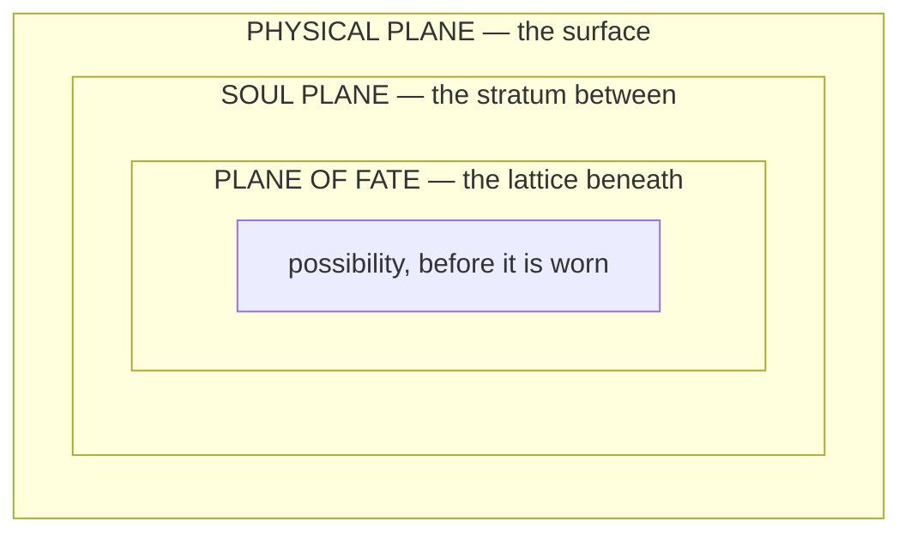

# Omnara and the Division

> *"The Apeiron does not remember the Division, for it was not conscious in any way the post-Division cosmos would recognize. To remember requires sequence. Omnara contained all sequences simultaneously, and therefore remembered nothing, and therefore forgot nothing, and therefore was everything that memory and forgetting would later describe."* — Lattice of Names, Fragment Zero

---

## Omnara — The Apeiron

### The Formless Totality · The Womb Before Naming

Before causality drew its first breath, before weight existed to anchor thought, before awareness discovered itself in the dark between uncounted infinities, there was Omnara.
Omnara is the name given by the earliest Parunic archivists to the state of absolute undifferentiated unity that preceded all existence. The word itself is borrowed from the Proto-Parunic root **omn**, meaning "completeness without boundary," and **ara**, meaning "womb" or "the place from which emergence is permitted." Together, Omnara translates roughly as **The Womb of All Completion**, a title the archivists used with visible reluctance, aware that naming the unnameable was itself a kind of transgression.
> Omnara was not a being. Omnara was not a force. Omnara was the condition of totality before totality required compartments.
Every law that would later govern reality, every Archon that would later embody a principle, every Wellspring that would later hum through the veins of the world, every soul that would later struggle toward Temperance, all of it existed within Omnara as potential without partition. Fate was not yet separate from Body. Spirit had no boundary against Matter. Attraction and Obsession were the same current flowing in a direction that did not yet exist.
To call Omnara a god would be to diminish it by suggesting it had intention prior to the mechanisms of intention. To call it a place would be to impose space upon something that predated the geometry of placement. Omnara simply was, and within that **was** lay everything the cosmos would ever become, compressed into a singularity of undifferentiated meaning.

---

## The Division

The Division is the cosmological event that ended the Apeiron and birthed the tripartite architecture of existence. No surviving record describes why it occurred. The oldest fragments suggest that it was not a choice, but an inevitability encoded within Omnara's own totality: a unity that contains all possibilities must eventually contain the possibility of its own separation.
From Omnara's singularity, three primal currents unfurled, each carrying a distinct axis of what existence would require to function as a coherent system.

### The Three Currents

| Current | What it carried | What rose from it |
|---|---|---|
| **The First Current** | The architecture of sequence, causality, and the permission for events to unfold in ordered relation to one another. This current became **Attraction Force** in its rawest form: the capacity for one thing to recognize another across the void of uncreated space. | **The Plane of Fate** |
| **The Second Current** | Substance, mass, endurance, and the debt of physical consequence. It compacted potential into weight, turning the infinite into the finite, the imagined into the endured. | **The Physical Plane** |
| **The Third Current** | Awareness, empathy, the recursive spark that allows thought to discover itself thinking. It breathed will into matter and choice into destiny. | **The Soul Plane** |

### Nested, Not Stacked

The three planes are nested, not stacked. The **Plane of Fate** lies deepest, the lattice upon which all possibility rests. The **Soul Plane** lies between, the stratum through which abstract law becomes a soul's felt truth. The **Physical Plane** sits at the surface, where truth becomes event, body, ruin, and mountain range.

> *"Reality is the shape that possibility chooses to wear for a little while. The Plane of Fate is the wardrobe."* — Fragment of the Lattice of Names
> Wherever distinct planar laws border each other, a transition zone must exist. That transition zone is the **Veil**, and it is a structural necessity generated by the three-plane cosmology rather than a fourth plane in its own right.
