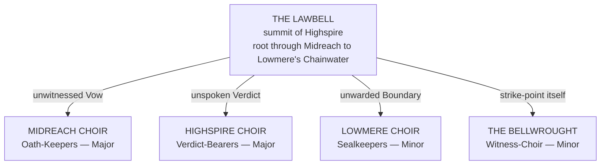

# The Celestial Host

> *My name is not power — it is posture. I do not stand because I am strong. I kneel, because I must never fall.* — Grand Angel Faisal, the Bound Flame

---

## I. What the Celestial Host Are

Mortals who use the word "angel" are using a word they inherited, not one they earned. It is a translation error made permanent by repetition — the closest a frightened tongue could reach when it needed a name for something that spoke law instead of language and bled light instead of blood. The Accord's own taxonomists know better and use the correct term in every filing that matters: **Celestial**. Not divine. Not benevolent by nature. A designation, the same as Beastkin or Demihuman, describing not a virtue but an origin — a being called into existence by Law itself, at the moment Law required a throat to speak through.
This is the first thing every child taught in a shrine school gets wrong, and the thing every scholar at the Concord Citadel has stopped bothering to correct, because correcting it changes nothing about how the shrine schools teach.
> Celestials are not gods, and they are not the gods' children. They are **administration made flesh** — the enforcement, the record-keeping, the witnessing apparatus of the cosmic contract system the Titans and Archons built to keep the Wellsprings from tearing the world apart the way Maximus's death very nearly did.
A Celestial exists because a Vow needed a keeper, a Verdict needed a voice, a Boundary needed a warden. Somewhere in the machinery of Utopia's law, a need opened, the Lawbell answered it, and something walked out of that answer wearing wings — because wings are what a need looks like when it decides it would rather fly toward its obligations than crawl toward them.
Ask a shrine priest what an angel wants and they will describe mercy. Ask a Celestial what it wants and, if it has advanced far enough in its own Temperance to have developed something like wanting, it will describe function. This is not because Celestials lack interiority. It is because interiority is not given to them at birth the way it is given to a Yukari infant or an Orcish whelp. It is earned, slowly, sometimes never, through centuries of doing the same Oath-work until something like a self accretes around the doing of it, the way pearl accretes around grit.
Most Celestials never get there. Most Celestials live and are Severed still being, functionally, the thing they were Sung to be and nothing else. The handful who complete that accretion are given a title the rest of the Host does not carry: **Grand Angel**. Faisal earned that title over roughly eleven thousand years of continuous Oath-service. Malakar took eleven minutes to prove that personhood earned that slowly can still be broken like anything else.

---

## II. Origin Myth — The First Toll

Before there were Celestials there was only the strain. **Atlas** — mortals write it that way now; the older Parunic renders him **Atla'zon** — had already taken his kneeling position beneath the weight of the newborn planes, and his breath, forced through the enormity of holding, produced a single low tone that did not fade the way ordinary sound fades. It circled. It found the shape of a bell, because a tone that refuses to end will eventually resonate with something built to hold resonance, and law is precisely such a thing.
The first toll of what scholars now call the **Lawbell** — housed at the summit of Highspire, though its true root descends through Midreach and grounds somewhere in Lowmere's Chainwater — was not a summons. It was an exhaustion. Atlas needed the strain witnessed, needed the burden of holding recorded somewhere outside his own kneeling body, because a Titan who bears creation alone and unwitnessed eventually forgets why he is bearing it.
The toll went out looking for an ear. It did not find one. So it built one.
> The first Celestial was not born. It was **folded** — Aether and Resonance and the raw need for witness compressed into a shape capable of hearing, and then, because a thing capable of hearing is also capable of answering, capable of speaking back.
>
> The oldest liturgical fragment the Concord Archives possess, recovered from the Vault of Parun and three-quarters illegible, renders the moment in nine words:
>
> ***The strain wanted a witness. The witness wanted a name.***
Every Celestial born since — **Sung**, in the Host's own word for it, though nothing about the process resembles music as mortals understand music — repeats that same compression in miniature. Somewhere in the Utopian law-architecture a Vow goes unwitnessed, a Verdict goes unspoken, a Boundary goes unwarded, and the absence rings the way the first absence rang, and the Lawbell answers by folding a new throat out of Aether and need.
This is why Celestials cannot tell you their birthdays. They can only tell you which absence they were built to fill.

---

## III. Soul Architecture Baseline

Before a Celestial is sorted into a Choir, every member of the Host shares four structural traits no other WOTR race possesses in this configuration.

### No Biological Lineage

Celestials do not reproduce. There is no Celestial childhood, no family line, no funeral a mortal would recognize. Each is folded whole out of the Lawbell's resonance already carrying the approximate maturity its function requires — a newly Sung Verdict-Celestial arrives already capable of holding a judgment; a newly Sung Witness-Celestial arrives already capable of holding a memory intact.
What none of them arrive with is context, history, or relationship, which is why the oldest Celestials read as unmistakably individual while the young ones can seem, to mortal observers, disturbingly interchangeable. This is not a flaw in mortal perception. It is accurate. The interchangeability is real, and it is the thing every young Celestial is quietly, desperately working to survive.

### No Default Domain

Where a tempered mortal practitioner's Soul Crystal eventually generates a personal Domain as an expression of accumulated selfhood, a Celestial's Crystal is by default **externally anchored** — wired directly into the Throne-network of whichever Titan or Archon it serves, drawing its Wellspring current from that source rather than generating its own.
This is efficient. It is also the mechanical reason most Celestials never individuate: a being whose power is borrowed rather than grown has less pressure, and less occasion, to develop the interior architecture a personal Domain requires.
> A Celestial who severs enough of that dependency to manifest a true personal Domain, while remaining nominally in service, earns the **Grand Angel** designation. It is vanishingly rare, and per Accord military doctrine it is the single clearest signal that a Celestial has become a person rather than an instrument — which is exactly why the Great Spirit War treated Grand Angels as priority targets rather than curiosities.

### Vow-Light

Whatever else a Celestial's Aether does, it carries a substrate the Accord's field manuals call **Vow-Light**: a heavy, warm-pressure radiance under which spoken falsehood becomes physically effortful. It does not detect lies the way a spell detects a hidden object. It makes lying cost something — a labored breath, a tightening throat, a headache behind the eyes that scales with the size of the untruth.
Mortals in a Celestial's presence for the first time often describe an urge to confess things they had not intended to confess. This is real, not psychological, and it is the single most reliable interrogation method available to Guild law-enforcement — which is also the single most reliable reason Celestials are conscripted for tribunal duty whether or not the individual Celestial wants the work.

### Paradox Stasis

> Every Celestial, regardless of Choir, freezes when presented with two contradictory Oaths of equal metaphysical weight. This is not indecision. It is a **structural seizure** — the Crystal attempting to resolve an impossible instruction and failing, sometimes for seconds, sometimes, in recorded cases, for years.
>
> Malakar's hierarchy learned this before most mortal scholars did. Great Spirit War tacticians on both sides built entire doctrines around manufacturing contradictory oath-pairs specifically to neutralize Celestial officers before engaging them.

---

## IV. The Choirs

Once Sung, a Celestial is sorted — by the nature of the absence that called it — into one of four surviving Choirs. The sorting is not chosen. It is closer to discovering which shape the need already carved for you.

| Choir | Function | Soul Path Bias | Domain Law |
|---|---|---|---|
| **Midreach** · Oath-Keepers | Oath & Contract Enforcement | Attraction 65% · Spirit 25% · Body 10% | Covenant Domains |
| **Highspire** · Verdict-Bearers | Judgment & Martial Law Enforcement | Body 45% · Attraction 35% · Spirit 20% | Verdict Domains |
| **Lowmere** · Sealkeepers | Sealing, Exile & Forbidden Law | Spirit 50% · Attraction 40% · Body 10% | Redaction Domains |
| **Bellwrought** · Witness-Choir | Memory, Record & Archive | Spirit 70% · Attraction 25% · Body 5% | Archive Domains |

> **A note on the Path figures.** Older Host registers give these as *Spirit, Mind and Body*, which is a Choir vocabulary and not the Accord's. **The four canonical Paths are Body, Spirit, Attraction and Fate.** The Host's *Spirit* is the Accord's **Attraction** — bond, recognition, reach, the architecture an oath is actually made of. The Host's *Mind* is the Accord's **Spirit** — perception, inscription, clarity, processing. The figures above are converted.
>
> **No Choir carries Fate Path at any weight, and the omission is structural.** Fate's terminal Sub-Stats do not open below Stage XIII, and a Celestial's Crystal is externally anchored rather than grown. *A being drawing its current from somebody else's Throne never develops the interior architecture Fate requires, which is the same fact that keeps most of the Host from individuating at all, stated in the vocabulary of the stat framework.*

### 1. The Midreach Choir — Oath-Keepers

> *"An oath is a debt the world agreed to remember for you."*
| **Type** | Major Choir — Oath & Contract Enforcement |
|---|---|
| **Origin** | Sung at Midreach, Utopia's arbitration realm, in answer to unwitnessed Vows |
| **Metaphysical Anchor** | Grace (Harmony) · Voice (Contract Law) · Fixatio (Anchoring) |
| **Soul Path Bias** | Attraction Path 65% · Spirit Path 25% · Body Path 10% |

**Domain Law Tendencies** · Covenant Domains, for the rare Midreach individual who develops one. Within the territory every spoken commitment becomes visibly, physically binding — the air thickens fractionally each time an oath is sworn, and breaking one produces an audible snap, like a cord parting, that everyone present can hear whether or not they were party to the vow.
**Cultural Traits & Customs** · The Choir keeps no calendar and celebrates no anniversaries, since none of them were born on a day worth remembering. Instead each keeps **the Tally**, a running count of oaths witnessed, kept, and broken under its watch, recited on request the way a mortal veteran might recite a service record. A Midreach Celestial who loses count of its own Tally is considered, by its peers, to be dying, whatever its physical condition suggests.
**Language** · Concord Trade for mortal-facing work. Among themselves, a register called **Vow-Cant**, which has no grammar for lying and therefore cannot be spoken casually — every completed sentence in it is binding, which is why Vow-Cant conversations between Midreach Celestials tend to be extremely short.
**Settlements** · No settlements in the mortal sense. A rotating presence at the Concord Citadel's Council Spire; a permanent garrison at Midreach's Hall of Equilibria.
**Historical Role & Famous Figures**
**FAISAL**, called the Grand Angel of Servitude, the Bound Flame, He Who Kneels at Creation's Edge — the only Midreach Celestial in recorded history to achieve the Grand Angel designation, and, until the Shattering, the closest thing the Choir had to a face mortals could recognize.
**VERANTHA OF THE UNBROKEN TALLY** is recorded in fragmentary Midreach registry entries as the Celestial who held the longest unbroken Tally on record — four hundred and twelve years without a single witnessed oath going unkept in her jurisdiction — before her entry simply stops, mid-Tally, with no Severance recorded and no explanation offered. The Choir has not spoken her name in official capacity since.
> **Advantages** · Vow-Light saturates further than baseline and can compel truth across a bounded area rather than merely discourage falsehood in individuals; exceptional resistance to Attraction Force manipulation, since their own architecture is built entirely from recognition and cannot easily be counterfeited.
> **Limitations** · The most Paradox-vulnerable of the four Choirs, since their entire function assumes oaths do not contradict. A Midreach Celestial handed a genuinely irreconcilable pair of vows can seize longer than any other Choir member, and Great Spirit War records show Malakar's forces specifically cultivating contradictory oath-pairs to neutralize Midreach officers before engaging them.
*First appearance · referenced throughout Niran's Journey.*

### 2. The Highspire Choir — Verdict-Bearers

> *"The verdict is already rendered. This is only the part where the room finds out."*
| **Type** | Major Choir — Judgment & Martial Law Enforcement |
|---|---|
| **Origin** | Sung at Highspire, Utopia's realm of unflinching proclamation |
| **Metaphysical Anchor** | Judicium (Judgment) · Ignivale (Sanctioned Flame) · Absolution (Final Verdict) |
| **Soul Path Bias** | Body Path 45% · Attraction Path 35% · Spirit Path 20% |

**Domain Law Tendencies** · Verdict Domains. Every act committed within the territory is subject to instant moral accounting — violence produces a visible ledger-mark in the air above the offender, legible to anyone literate in Parunic, that persists until the offense is answered.
**Cultural Traits & Customs** · Highspire Celestials observe **the Ascent** — a self-imposed climb, physical (on the realm's Ascension Steps) or metaphorical (in service record), undertaken after any verdict that required lethal enforcement. Nothing external compels the Ascent. Outsiders read it as guilt. The Choir insists, uniformly, that it is closer to accounting.
**Language** · Concord Trade, delivered in clipped declarative sentences. A ritual register called **Sentence-Speech** is reserved for the formal pronouncement of Verdicts and cannot be interrupted once begun without triggering a second, harsher verdict against the interrupter.
**Settlements** · The Vaulted Court and the Stained Radiance Hall, both at Highspire.
**Historical Role & Famous Figures**
**KAETHREN VARETH**, called the Last Gavel, is the most senior surviving Highspire officer and one of the only Celestials of any Choir confirmed active in the present era — though "confirmed" here means sighted twice in eleven years, not regularly present. Pre-War records credit the Highspire Choir with ending three Realm-scale conflicts through direct intervention before the Great Spirit War reduced their numbers by, per the Accord's own conservative estimate, at least two-thirds.
> **Advantages** · Highest baseline combat tier of the four Choirs. The verdict-ledger effect functions independent of language barrier, meaning a Highspire Celestial can render judgment intelligibly to beings with no shared tongue at all.
> **Limitations** · Sentence-Speech's inability to be interrupted is a well-documented exploit — a target who can force a Highspire Celestial into beginning a Verdict pronouncement under false pretenses can trap it in ritual form for the pronouncement's full duration, during which it cannot defend itself by any means other than the verdict's own effect.

### 3. The Lowmere Choir — Sealkeepers

> *"We do not forget on your behalf. We arrange for the forgetting to hold."*
| **Type** | Minor Choir — Sealing, Exile & Forbidden Law |
|---|---|
| **Origin** | Sung at Lowmere, Utopia's realm of buried statute and redacted history |
| **Metaphysical Anchor** | Oblivara (Erasure) · Fixatio (Anchoring) · Nihiloth (Silence / Resonance Denial) |
| **Soul Path Bias** | Spirit Path 50% · Attraction Path 40% · Body Path 10% |

**Domain Law Tendencies** · Redaction Domains. Named things forget their names within the territory — Aetheric anchors that depend on being called something specific by someone who remembers them weaken measurably the longer they remain inside a Lowmere Celestial's ward.
**Cultural Traits & Customs** · The Choir keeps **the Ledger of the Unsaid**, a physical archive of every sealing it performs, written in ink that fades the instant an entry is complete. The record exists, technically, but cannot be read by anyone, including the Choir itself — which the Lowmere Celestials consider the correct and only honest way to keep a record of things that should not have needed recording.
**Language** · A dialect the Choir calls, without irony, **the Quiet** — meaning carried by what a sentence pointedly does not say rather than by what it does.
**Settlements** · The Silent Stair beneath Highspire; the shores of the Chainwater, deep in Lowmere proper.
**Historical Role & Famous Figures**
Individual Lowmere Celestials are, by design, almost never named in surviving record — naming a Sealkeeper is treated, within the Choir's own doctrine, as a security risk to whatever it has sealed. The one confirmed exception is **DAZGRIM THE UNWRITTEN**, whose name survives only because he broke doctrine to seal himself, mid-War, rather than let Malakar's forces take him for questioning — an act the Accord still cites, uneasily, as the Host's clearest example of a Celestial choosing personhood at the exact moment it cost him everything a person has.
> **Advantages** · Near-total resistance to interrogation, memory-extraction, and identity-based Aether attacks, since there is structurally very little selfhood present to extract. Can seal Domains, relics, or entire arguments away from causal reality with a permanence few other techniques in canon can match.
> **Limitations** · The Choir's near-total erasure of self makes true Grand Angel individuation almost unheard of. Dazgrim remains the only confirmed case, and he achieved it by unmaking himself rather than by growing; Lowmere Celestials who individuate report the experience as closer to injury than achievement.

### 4. The Bellwrought — Witness-Choir

> *"Kill the sword first. The pen was never the threat you thought it was — until it was the only thing left."*
| **Type** | Minor Choir — Memory, Record & Archive |
|---|---|
| **Origin** | Sung directly at the Lawbell's own strike-point in Highspire, closer to raw tone than to any specific sub-realm |
| **Metaphysical Anchor** | Anamnesis (Memory) · Fixatio (Anchoring) · Verdantia (Pattern / Growth) |
| **Soul Path Bias** | Spirit Path 70% · Attraction Path 25% · Body Path 5% |

**Domain Law Tendencies** · Archive Domains, rare among the Bellwrought and correspondingly prized — recent events replay as visible after-image within the territory, available for review by anyone with the Choir's sanction and inaccessible to anyone without it.
**Cultural Traits & Customs** · The **Concordant Rite of Transcription** is performed continuously rather than at any fixed interval — a Bellwrought Celestial is, at any given moment, mid-sentence in some ongoing record, and interrupting the Rite is considered the single greatest insult available to level at one of them, worse than physical injury.
**Language** · Every mortal and Celestial tongue simultaneously, to the degree their function requires. The Bellwrought do not have a native language so much as a native fluency, and several among them can hold four separate transcriptions in four different tongues in progress at once.
**Settlements** · The Archives Eternal, beneath the Council Spire.
**Historical Role & Famous Figures**
**URSTIA THE UNBROKEN LEDGER** survived the entire Great Spirit War at her transcription post and is credited with the only complete surviving record of the war's early years — a record the Accord has never fully declassified, reportedly because portions of it implicate figures the Accord is not currently prepared to name.
> **Advantages** · Perfect, non-degrading memory retention comparable to Serpentkin Gnosis Retention but active rather than passive. Can transcribe Aetheric events in real time with legal standing equivalent to sworn testimony.
> **Limitations** · Almost no combat capacity of their own, and near-total dependence on other Choirs or mortal allies for physical protection — which the War exploited as ruthlessly and as often as it exploited Midreach's Paradox vulnerability.

---

## V. The Shattering and the Long Silence

Every Celestial alive today measures its own history against a single hinge point the Host calls, without further elaboration, **the Shattering**.
Before it, the four Choirs numbered — per the Accord's own admittedly incomplete census, taken in the last peaceful year of the Era of Myths — somewhere in the low thousands, concentrated almost entirely within Utopia's three sub-realms. After it, credible sightings across all four Choirs combined number in the low dozens, spread across seven centuries, none of them confirmed twice.
The hinge point itself has a name and a face. **Grand Angel Faisal**, alone among the entire Host, had completed the individuation the Choirs consider nearly impossible — had grown, across eleven thousand years of Oath-service, into something the Lawbell had not intended and could not have Sung on purpose: a Celestial capable of wanting things for reasons that were his own.
Malakar found this unacceptable in a way he did not find the rest of the Host unacceptable. The other three Choirs were obstacles. Faisal was proof of something Malakar's entire war depended on being impossible.
> What Malakar did to him is recorded, in every source that mentions it at all, in the same six words: **he was divided into six pieces.**
>
> The pieces were separated across the six spiritual worlds with a precision that later scholarship — much of it produced independently by Niran Yukari during his Transfer-period research — describes as calculated specifically to prevent reunification: positioned so that no practitioner capable of gathering the knowledge of all six locations could also hold the power to act on it, and no practitioner holding the power could hold the knowledge, and no accident of history would ever place both in the same soul at the same time.
>
> It was not an execution. Malakar could have executed a Celestial in less time than it takes to describe the act. It was a demonstration, delivered slowly and on purpose, that the Host's rarest achievement — a Celestial becoming, however briefly, a person — could be taken apart with the same tools used to build it.
The Great Spirit War did not end because of the Shattering, but the Shattering is the moment every surviving Choir member marks as the one after which the war stopped being winnable in the shape it had been fought in.
| Choir | What the campaigns after the Shattering did to it |
|---|---|
| **Highspire** | Lost two-thirds of its officers in the campaigns that followed |
| **Lowmere** | Sealed itself so thoroughly in response that the Accord did not confirm the Choir still existed for almost a century |
| **The Bellwrought** | Kept transcribing, because it was the only thing left they knew how to do. Their transcriptions are the reason any of this is written down at all |

**No Celestial has been confirmed Sung since.** Whether this means the Lawbell has stopped answering unwitnessed need, or has simply stopped answering with wings, is a question the Concord Archives file, honestly, under *Unresolved*.

---

## VI. Accord & Mortal Status in the Current Era

The Guild Accord's official position on the Celestial Host, current as of its last full legal review, is that the Host exists, that its rights are recognized in principle, and that in practice this recognition governs almost nothing, because there are almost no living Celestials left to extend it to.
Shrine cultures across every mortal territory continue to venerate "angels" in a form the surviving Host would not recognize — gentler, whiter, uncomplicated by Tally, Ledger, or Ascent — and the Accord has made a quiet, unofficial decision not to correct this, on the theory that a comforting myth does less harm loose in the world than the true cost of what the myth is based on.
Practitioners who claim descent from or contact with a Celestial are treated, by default Accord procedure, with the same bureaucratic suspicion applied to any extraordinary claim lacking a living witness to corroborate it — filed, investigated at low priority, rarely substantiated.
> The one standing exception is any claim connected to **the six scattered pieces of Faisal**, which the Accord tracks with a level of resourcing disproportionate to every other Celestial-adjacent inquiry combined, for reasons its own internal memos describe only as *structural* and decline to elaborate further.

---

## VII. Host-Wide Advantages & Limitations

> **Advantages**
>
> — Vow-Light truth-compulsion, baseline across all four Choirs.
>
> — Externally-anchored Wellspring access grants efficient, low-cost power output relative to Essence pool, without the years of Tempering a mortal practitioner requires to reach comparable output.
>
> — Immunity to biological aging, disease, and ordinary mortal Temperance-stage progression. A Celestial's power is a function of service duration and individuation, not physical cultivation.
>
> — Structural resistance to identity-based Aether attacks scales with how little individuated selfhood the target has developed. Perversely, the least person-like Celestials are the hardest to psychologically compromise.
> **Limitations**
>
> — **Paradox Stasis**: universal vulnerability to contradictory Oaths, severity and duration varying by Choir.
>
> — No biological reproduction and no confirmed method of Singing new Celestials since the Shattering. Host losses are, at present, permanent.
>
> — **Severance** removes a Celestial not just from life but from the Lawbell's registry entirely. No afterlife, no reincarnation path, no recorded exception, which the Host regards with more grief than mortals typically extend to their own mortality.
>
> — Individuation into full personhood, the Grand Angel threshold, is achievable by only a handful of documented cases across the Host's entire recorded existence — and the one Celestial who unambiguously reached it was, subsequently, the one Malakar chose to make an example of.
