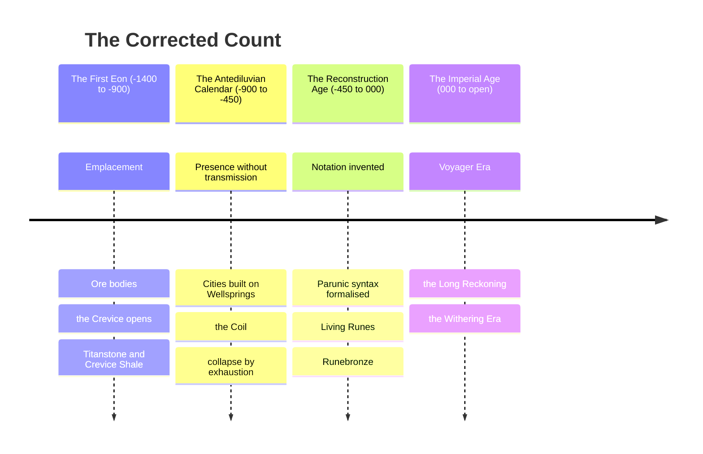

# The Concordance of Ages

*The Fixing of the Count, in Four Ages and One Continuous Reckoning*
> Prepared by the Guild of Measurewrights under the Hexagonal Oath, at the standing request of the Research and Archives Division, and sealed in the Archives Eternal beneath the Council Spire of the Concord Citadel. Year 715 of the Imperial Age, Withering Era.
> 
> This instrument supersedes every register preceding it. The Guild has been asked for a count that a surveyor, a magistrate, and a bloodline claimant can all use without translation, and has produced one.

---

## I. The Rule of the Count

One count, running in both directions from a single hinge, and no other count recognised anywhere under Accord writ.
The hinge is the sealing of the Concord Codex in the Concord Lattice. The Accord names that **Year Zero** and the Guild accepts it, less for its significance than for its witnesses. Four archives attest the same season independently, and a calendar wants a witnessed date more than an important one.
Years after the hinge are notated plainly. Years before it carry the negative and are read as distance backward, so that −450 stands four hundred and fifty years before the Codex was sealed. The whole of reckoned history runs from **−1,400 to the present**, which is two thousand one hundred and fifteen years, and the Guild states plainly that this is a shorter history than the Archives has been in the habit of claiming.
> The longer figures in circulation — the thirty thousand and the twelve thousand and the twenty-five thousand — are not reduced. **They are withdrawn.** They originate in a single stratigraphic method the Guild has tested and found to count seasonal ash layers as annual ones, at a Wellspring site where the ash falls four times a year. The error compounds by a factor near forty across the whole depth of the section, and every figure derived from that method carries it.
>
> The Guild has been asked whether this was known before now and has answered that it was suspected, and that the suspicion was inconvenient.
The consequence is not a smaller world. It is a world in which a bloodline can be traced, a grudge can be inherited by someone who remembers its cause, and a long-lived person can have stood in more than one age and be asked what it was like. The Guild regards that as the count doing its job.

---

## II. The Four Ages

### The First Eon

**Span** · −1,400 to −900. Five hundred years.
**Character** · The emplacement. Ore bodies, the northern shield, the flood-basalt province, the ophiolite belt, the Crevice.
**Close** · No catastrophe. The Eon ends where the first kept record begins, and the boundary is a fact about writing rather than about the world.
Everything the four quarters have ever dug out of the ground was put there in this age, and nothing has been added since. **Skill compounds. Ore does not.** That one asymmetry has governed every economy that followed and will govern the next, and it is the reason the Old World is the first civilisation able to see the bottom of the thing it stands on.
| First Eon material | Standing |
|---|---|
| **Titanstone** | The shattered remains of slumbering World Spirits. Near-immortal in density, carrying a metaphysical weight sufficient that a cracked block takes a city down with it. It is found rather than quarried. |
| **Crevice Shale** | Fractures nearby Realm law. Forbidden to move, hold, or trade under **Article III of the Concord Codex** — a law about a rock, and the only such law the Accord has ever written. |

The Guild takes no position on the theology of the age and observes only that both materials behave as though something decided their properties. That is a statement about behaviour and carries no claim about intent.

### The Antediluvian Calendar

**Span** · −900 to −450. Four hundred and fifty years.
**Character** · Presence without transmission. Enormous individual capability, no conduit, no storage, no notation.
**Close** · Collapse by exhaustion, repeated across unconnected cities that had no means of warning one another.
The Antediluvians could do extraordinary things with Essence and could not move it one pace. That is the whole of their technology and the whole of their fate. A person standing inside a Wellspring's field can work with it, and a person outside that field cannot, so a civilisation that wants a great many people working must put a great many people on top of the source.
They built on Wellsprings. Not near them. **On them.** Every excavated site shares the same plan, a dense settlement wrapped concentrically around a source with the most valuable structures innermost, which reads to a modern surveyor exactly like a diagram of field strength and was almost certainly arrived at by trial.
> A body is the only Essence conduit that walks. Lacking any means of sending Essence anywhere, the Antediluvians moved practitioners instead, taken from wherever they were found and held at the works that needed them until they were used up. Surviving tablets record throughput, loss, and replacement rate in the same columns as grain.
>
> The Accord treats this as a moral fact. It was a technical one as well, and the two readings do not compete.

#### The Coil

The most important instrument in the modern economy was built to sort people.
Hauling a practitioner across three hundred leagues is expensive, and hauling one who turns out to be useless is a loss the ledger notices. So somebody wound a conductor into a ring and discovered that it answers measurably to the Essence character of whatever is set inside it, and for the first time in history a question that had been a matter of somebody's judgement produced a number instead.
Every holding coil in every Accord assay house is a refinement of that ring. The trade in Holding-grade material, which is the trade the modern world runs on, descends without a break from an instrument built to decide which people were worth the journey. *The Guild has included this in the plain register rather than the appendices, over the Research Division's written objection.*
> **A distinction the trade literature blurs and the Guild does not.** The **principle** is Antediluvian and among the oldest instruments in the record. The **coil** is not. A ring that answers to what is set inside it tells one reader something; **a coil that gives the same number in two kingdoms is a different device entirely**, and that device is a Voyager Era product of shared units, sealed reference standards and annual calibration.
>
> *Fourteen hundred years separate the two, and everything the Accord's legitimacy rests on lives in the gap.*

#### The Collapse

When a Wellspring began to fail, an Antediluvian city could not answer by leaving. It could only answer by drawing harder on the source that was already failing, and drawing harder meant bringing in more bodies. The archaeological record of four and a half centuries is that loop running to completion, in a dozen places, none of which knew the others existed.
> **What the Guild records and does not interpret.** A site drawn from without reciprocity does not merely thin. **The current stops recognising visitors and begins taking from them**, which the modern register calls a site running under Obsession Force and treats as a hazard classification rather than a history.
>
> Every excavated Antediluvian settlement sits on a source that was drawn to exhaustion by a population that had no other option. *The Guild has surveyed nine of them. It has recorded the density readings and declined to publish a finding on what the sites are now doing, on the grounds that the finding would be a theological claim and the Guild does not make those.*
>
> **The exclusion perimeters around all nine were set by the Enforcement Division and have never been reduced.**
*The Guild asks that this paragraph be read alongside Section III.*

### The Reconstruction Age

**Span** · −450 to 000. Four hundred and fifty years.
**Character** · Notation. The invention of writing Essence down, and everything that follows from it.
**Close** · The sealing of the Concord Codex, which is Year Zero and the founding of the Accord.
The Age produced no machine and contains the largest single break in the history of making. Parunic syntax was formalised out of whatever the Antediluvians had been doing by feel, glyphs were assigned stable meanings, and the combinations were catalogued. **Kessian Yorul** cut the first Living Runes into bone, inscriptions that draw on the bearer's own circulation. **Mnirah Valein** codified the Twelve Stages of Spirit Infusion and, in doing so, established that capability could be graded, taught, and required before permission was granted, which is the ancestor of every guild licence now in force.
> Before notation, an effect required a practitioner standing in the room. After notation, an effect could be laid into a substrate and left there, and it would keep working when nobody was watching.
>
> Every array, every ward-network, every pump and fan and grid beneath every modern city descends from that sentence. The Imperial Age did not invent the array. It inherited the idea and eventually had the money to build one at scale.
Making in this age is bloomery iron, charcoal, and the first material in history designed to hold an inscription rather than merely tolerate one. **Runebronze** is melt-forged with minor glyphs, durable under basic enchantment, and still carried by minor guild knight orders. Somebody worked out that the glyph could go in during the melt instead of after the cooling, and the entire subsequent tradition of Holding-grade manufacture is a footnote to that discovery.
The Age's doctrine, that Wellsprings must be respected rather than exploited, is read by the Archives as wisdom learned from the Antediluvian collapse. The Guild records a less flattering reading and does not endorse it: a civilisation with no conduit and no pump cannot exploit a Wellspring at scale even when it wishes to, and a virtue that costs nothing to hold is difficult to tell apart from an incapacity that has been given a name. **The doctrine was tested when the capacity arrived. It did not survive the test.**

### The Imperial Age

**Span** · 000 to open. Seven hundred and fifteen years and running.
**Character** · One continuous count, unbroken, never reset. The first age to know its own date the whole way through.
**Close** · None. The Age has not ended and the Guild declines to say when it will.
The significance of the Imperial Age is that it can be audited. Every age before it must be assembled from ash layers, foundation courses, and the arguments of dead clerks. This one has receipts. The Accord's power rests less on its enforcement divisions than on the fact that it can state what happened and prove the date, and every rival authority in the four quarters has had to argue against a ledger rather than against a story.
The Age divides into three eras. The Guild stresses that these are **eras within one age and not ages in themselves**, since the count does not break, the grammar does not break, and the institution sealed at Year Zero is the institution sitting in the Council Spire this morning.

#### The Voyager Era · 000 to 070 IC

The founding and the opening of the routes, and the two are the same event viewed from different divisions.
The first decades built nothing. They established shared units, sanctioned notation, and the first assay houses, which is to say they established that two people in different kingdoms could specify the same thing and mean it. Every history of the era skips this and every history of the era is wrong to. The Guild Accord, the Concord Codex, the Lattice, the Divisions, the Tiered Path, and the first nine Concord Gates all date to this seventy-year window, and the documents bearing the stamp of Imperial Year 013 and Imperial Year 027 in the Voyager Era are correct as written and require no correction.
The enabling technology of the expansion was **the chart and not the ship**. What the routes brought back broke the money. Eastern placer gold is won by hand from black-sand river bars with no permission required from anybody, which meant bullion arrived in the western quarter in quantities no mint controlled and no crown could meter. Prices roughly doubled within a generation. The western guilds spent thirty years blaming hoarding, foreign merchants, bad harvests, and moral decline, and then a Babylan theorist observed that when the quantity of money rises faster than the quantity of goods the money is worth less, which is not a moral fact and cannot be legislated against.
Wage earners lost. Wages are customary and adjust slowly, prices are not and do not. *The Voyager Era is commemorated with a public holiday in four kingdoms and the holiday commemorates the charts.*

#### The Long Reckoning · 070 to 645 IC

Five hundred and seventy-five years, the body of the Age, and the era in which the ceilings fell. They fell in an order nobody planned, and each solution created the problem the next answered.
| Ceiling | Held at | Fell |
|---|---|---|
| **Water** | Sixty fathoms below the adit line, held everywhere, under every flag, in every age preceding | Year 90 to 130, to Phreatis-fed lift arrays — Fluxia family, Fluid Dynamics |
| **Air** | Depth kills by atmosphere before it kills by roof | Year 150 to 175, to Vectoria draught arrays, funded by the bodies the pumps had already produced |
| **Heat** | Charcoal will not liquefy iron, and had not, in any age | Year 260 to 310, to Ignivale and Pyraeon forge-arrays — Caloria family, Thermodynamics. Everything above the fourth tier of making comes out of that window, Aethersteel first among it |
| **Haulage** | Rock is heavy and ropes have a limit | **Never fell.** Was merely lied to, by Weight Ablation glyphwork that misreports the load to the rope rather than lightening it. The industry is built around that lie rather than through it |

What the era built was a dependency. A pumped shaft must be pumped forever, since the array does not stop when the ore stops and the water returns at the rate it always wanted to the moment the array does. A modern western pit is a permanent argument with the water table conducted at a fixed hourly cost, and the west lost the ability to walk away from that argument some time around Year 140 without noticing it had happened.
> By the close of the era the western quarter had arranged its industry and a substantial part of its food supply so that a sustained Essence shortage becomes a **mass drowning within ninety hours** and a **famine within a season**. It did this incrementally, profitably, and with no individual decision anywhere in the chain that looks wrong on its own terms.

#### The Withering Era · 645 IC to open

The bill. Seventy years so far.
The ambient Wellspring density of the western quarter began to fall measurably around Year 645 and has fallen every year since. The Research Division describes the phenomenon as *contested*. Every pump-master between Ironlink and the Greaves districts describes it as *Tuesday*.
Nothing about the Withering resembles the collapse that closed the Antediluvian Calendar, which is why it took a generation to name. There is no plague, no war of sufficient scale, no visible catastrophe anyone can point at. The great houses buy Essence supply the way an army buys grain, a bad year in supply closes shafts still full of ore, and the price of certainty has risen in each of seventy consecutive years without a single year in which anybody could say what had specifically gone wrong.
A civilisation that feeds itself through an Essence dependency has arranged for a Wellspring failure to become a famine. The Accord made that doctrine at its founding and the western quarter has spent seven centuries quietly outrunning it.

---

## III. The Repeating Figure

*The Guild has been instructed to keep its findings to matters of date and has requested one exception, which the Research Division granted on condition that it be marked as commentary. It is marked.*
> The Antediluvian answer to a failing Wellspring was to draw harder on the Wellspring that was failing, and to bring in more bodies to do the drawing. The current western answer is to contract for supply from further away, at a higher price, on a longer term.
>
> These are the same answer with a longer haul, and the second is being given by an institution that possesses a complete written record of what the first one cost.
The Guild does not predict. It observes that in the compressed count, the distance between the height of the Antediluvian Calendar and the present day is fourteen hundred years, that this is a distance a Wellspring remembers, and that several persons now living were born before the first pump-master noticed the fall.

---

## IV. The Concordance in Full

| Age | Opens | Closes | Span and Notation |
|---|---|---|---|
| **The First Eon** | −1,400 | −900 | 500 years · ⟨FE⟩ |
| **The Antediluvian Calendar** | −900 | −450 | 450 years · AC |
| **The Reconstruction Age** | −450 | 000 | 450 years · RA |
| **The Imperial Age** | 000 | open | 715 years and running · IC |
| · the Voyager Era | 000 IC | 070 IC | 70 years · founding and expansion |
| · the Long Reckoning | 070 IC | 645 IC | 575 years · the ceilings fall |
| · the Withering Era | 645 IC | open | 70 years and running · present |

*Four ages. Three eras within the fourth. One count, from −1,400 to the present, with no interregnum, no reset, and no gap in which a claim may be hidden.*

---

## V. What Remains Open

The Guild closes the count and records three matters it cannot close, on the standing principle that a discrepancy papered over is a discrepancy that will be found later by somebody with less patience.
**The Antediluvian founding** · They kept a calendar and counted forward in it from a founding the Guild cannot locate, so their internal dates cannot be converted and appear here in Imperial reckoning by stratigraphy alone. Somewhere under the ash there is a Year One that would fix four and a half centuries to the season.
**The First Eon's opening** · The figure of −1,400 marks the oldest datable emplacement and not the beginning of the world. What lies before it is undated and the Guild declines to guess at its depth.
**The Withering's mechanism** · The Guild can state the rate to three places and has done so annually for seventy years. It cannot state the cause, and will not manufacture one to satisfy a Division that has asked four times for better news.

---

> *Attested and sealed. Guild of Measurewrights, under the Hexagonal Oath, in the Archives Eternal beneath the Council Spire. Year 715 of the Imperial Age, Withering Era. Every register preceding this instrument is withdrawn.*
