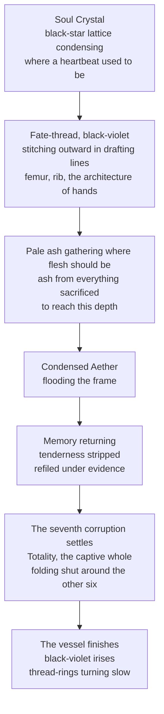

# The Crossing and the Making of the God Hand

> The single sustained first-person account of the Soul Plane experienced from inside, recorded across a Transfer in which the crossing party's Physical Plane vessel was dissolved and a replacement assembled out of Soul Plane architecture. It is the closest thing the record holds to a description of what the Veil looks like from the other side of it.

---

## I. What the Soul Plane Is, From Inside

The darkness was not empty. It had been expected to be. The absence of the Physical Plane's constant noise, the cessation of Cymorath input, a silence following the crossing the way silence follows the last note of a song.
Instead: everything.
> The Soul Plane does not speak in vibration. It does not carry pressure or temperature or the acoustic signatures a Physical Plane sensory Wellspring is built to catalogue. Those are the Physical Plane's languages. The Soul Plane speaks in something older, something that bypasses the Crystal's sensory pathways entirely and arrives at the awareness directly, the way a memory arrives — not through the ears, not through the skin, but through the specific architecture of **having-been-there** that the soul maintains as its primary recording medium.
**Every world spirit.** Their presences distributed across the Soul Plane's archive layer like stars across a sky with no horizon, each one a point of sustained luminosity carrying the harmonic of an awareness present for longer than any mortal timescale can measure. They do not watch. They do not address. They are simply there.
**Every connection.** The threads running between the Plane of Fate and the Physical World, the connective tissue of causality. Not as thread-visualisations, the luminous filaments of silver-white and deep blue and gold-violet that correspond to each plane's contribution when read through the Veil. Here as themselves. Unfiltered. Unmediated. The raw architecture of how everything connects to everything.
> The **Ketsumōgan** had been a keyhole.
>
> This was the room.

### Light, movement, and distance

Three properties of the Soul Plane behave nothing like their Physical Plane counterparts, and the account is the primary source for all three.
| Property | On the Physical Plane | On the Soul Plane |
|---|---|---|
| **Light** | Electromagnetic radiation bouncing off surfaces | **Recognition.** The luminosity the archive produces when it acknowledges something present in its field as significant. It does not illuminate from outside. It recognises from inside |
| **Movement** | Traversal of space | Arrival at the point of connection rather than travel toward it |
| **Organisation** | By distance | **By bond** |

---

## II. The Soulstream and the Dead

Below the archive layer runs the tissue between worlds, the striated dark where the Physical Plane's density gives out and the Soul Plane's memory presses close. It is not restful and it is not empty. It is crowded beyond anything the living imagine.
The dead move through it in currents. Not ghosts, which is what the living call the dead to make them smaller. These are souls in transit — **the Soulstream itself, Sylorin's long river running through the threshold** — and contact with one delivers a full life whole. A fisherman's forty years of salt and rope-burn and a daughter he never apologised to. A soldier who died believing the wrong man loved her. A child. A king. A woman who spent sixty years tending a garden and thought, at the end, only of the frost coming for her plums.
> Others came to this place before and went mad from the weight. The account's distinguishing feature is that its subject catalogued it instead.
>
> *"The dead deserve better than to be current. A river remembers nothing. It only carries."*

---

## III. The Reconstruction

The old vessel's material — the Essence and Aether and Physical Plane substrate constituting the body — is returned to the medium it came from. What replaces it is assembled from different materials: not Physical Plane substrate but **the Soul Plane's architecture itself**, the quality of Essence that exists there, which carries memory, carries intention, and carries the accumulated weight of everything ever recorded in the archive.
The sensation is not pleasure. It is **coherence** — an architecture that had been operating at a fraction of its designed capacity abruptly given access to the whole of it. Every Wellspring carried by the crossing party was present at full realised depth rather than at the partial harmonisations and averse frictions a Stage VII mortal Crystal can sustain: **Cymorath, Judicium, Anamnesis, Fixatio, Monolithion, Vantabriel, Luminalis, Anima Spirare.** The versions that existed before the Physical Plane's limitations compressed them into channels a mortal body could survive.

- ****What was sacrificed to reach the depth****
  The body that remembered fear. The love that recognised him as human. The old meaning of his own name.

  The boy who heard disaster coming and ran through the streets shouting warnings no one heeded would have drowned here, trying to hold each of those passing lives like water in cupped hands. That boy remained behind — the old shadow hanging in the dark a few span back, detached, small, shaped like a child with black hair and frightened eyes, watching what the rest of him was becoming.
> *"I did not sell my soul. I gave it structure. There is a difference, and the difference is everything. A man who sells his soul receives payment. I received responsibility."*
> **On the seven, and which seven.** The corruptions named in this account are corruptions of **the Seven Works of Hataraki** — Ruin, Purity, Spirit, Temporality, Knowledge, Balance and Totality — authored by Bara in the Plane of Fate before chronology. *Totality is the seventh Work, which is why it settles last and folds shut around the other six.*
>
> **These are not the seven Cacodaemonic Corruptions of the Heresiology**, which are inversions of the seven stages of the Great Work and belong to alchemy. Two documents, two sevens, no relation beyond the number. **The archivists who conflated them produced the standard error in the secondary literature and the Guild has corrected it four times.**

### On threads and what the Transfer does to them

The account's most load-bearing metaphysical claim is that **threads are not severed by the Transfer. They are extended.** A bond running from a preserved pattern in the archive layer to a reconstruction zone remains alive and continues to carry, and the preserved party is incorporated into the new vessel's deepest layer — below the Crystal, below the Wellsprings, below the seven positions and the Ketsumōgan, at the layer where the soul holds what it will not let go of regardless of what the architecture above it requires.
- ****Reimei, and what the archive preserves****
  Not her body. Her soul — the preserved pattern the Soul Plane's archive maintains as its record of every awareness that passed through its threshold and was significant enough to the web's architecture to warrant permanent preservation. She is not alive in the way the Physical Plane defines alive. She is present in the way the Soul Plane defines present: as a pattern that has not been forgotten, held permanently, without loss, at the fidelity it arrived with.

  The silver eyes, carrying Boundary-sight's depth without the Physical Plane's limitation on what depth can see. The dark auburn hair that is not hair but the archive's record of hair, carrying the warmth the Aldren family's mixed heritage produced in the Physical Plane's rendering.

  *"Our dream. Our fight. All of it is yours now."*

  *"I never left. That is what they never understand about death. The thread extends. The bond holds. The love does not end because the body that carried it returned to its material. I am in the architecture now. I am in the vessel they are building around you. Every time you reach for the place where I was, you will find me. Not as a ghost. Not as a memory. As a load-bearing element in the structure. Because that is what I chose to be when I chose you."*

---

## IV. The Claim and the Title

The title arrived in the archive layer with the weight of a name that had been waiting to be spoken for a very long time. **Not created in that moment. Released.**
> **The God Hand.**
>
> The hand that reached into the architecture of fate and held it accountable.
>
> The hand Senri refused to close for forty years, because closing it would have meant admitting what the hand was for.
A second claim was made on the same title, from a different direction, before the last thread set. A woman's voice arriving from everywhere, warm the way a verdict is warm when it happens to fall in your favour. The Soulstream bent around the sound.
- ****The exchange, as recorded****
  *"Yes. Take heed, Niran."*

  *"You feel them, don't you. Every soul that has ever passed through this dark. Every grief that was allowed to remain grief. Others came to this place before you and went mad from the weight. You are cataloguing it."*

  "Someone should. The dead deserve better than to be current. A river remembers nothing. It only carries."

  *"Your power will rise past anything they have ever seen. Past the Titans' patience. Past the Archons' law. The Plane weighed the cost of your dream, little crow, and found the arithmetic sound. But arithmetic is cold, and I am not. So hear my claim before the last thread sets: you shall be my hand upon the living world. My correction. My God Hand."*

  "You assume I was built to be held."

  *"I assume you were built to be aimed. There is no shame in it. An arrow does not resent the bow. It resents missing."*

  "Then aim," said Septarch, "and learn what I do to bows."
The convergence of registers is the other thing the account establishes. The lower register is the original voice — quiet, committed, the frequency that makes rooms reorganise. The upper register is the other thing, formed across the cold blood and the black spots and the narrowing Cymorath and the seven corruptions aligning into positions. The two do not fight. They converge the way two rivers converge at a junction, each carrying its own current and its own history, the junction eliminating neither and producing a third thing from both that is wider and deeper and carries the combined weight.
> *We are legion.*
> *We are truth.*
> *They will not understand what we have to do.*
The Veil thinned above, light bleeding through from the living world, and the ascent began with the dead parting in silence — every soul in the current turning, just slightly, to watch him pass. **Seven years began their patient work.**
