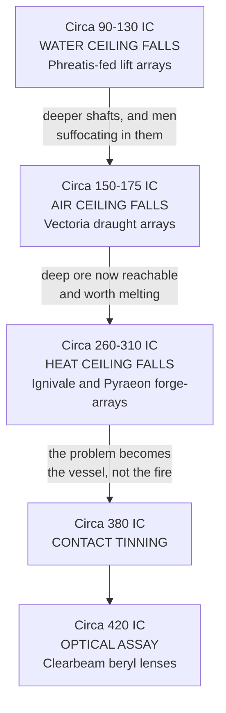

# The Four Ceilings

*A History of Making, from the First Eon to the Withering*
> Second edition, revised. Companion volume to **The Bearing and the Holding**. Compiled for the Research and Archives Division of the Guild Accord with the assistance of the Guild of Measurewrights. All dates conform to the Concordance of Ages, sealed Year 715 of the Imperial Age. The first edition's chronology is withdrawn in full and its Unresolved Chronology section is superseded.

---

## Prefatory Note

Histories of the Realms are written as histories of who ruled. This is a history of what could be made, which is a different subject and occasionally an embarrassing one, because it keeps producing the conclusion that the great turnings of the age were not decided by anybody.
The organising claim is simple. For most of reckoned time, making things was held at a fixed ceiling by four physical obstacles, and every civilisation from the Antediluvian to the founding of the Accord ran into the same four and stopped in the same place. The obstacles were water, air, haulage, and heat. **They are not magical obstacles.** They are the ordinary consequences of digging a hole in the ground and trying to melt what comes out of it, and they would have stopped a world with no Essence in it at all.
What changed in the Imperial Age was not that anyone became cleverer. Four specific obstacles were removed, in a specific order, across the five centuries of the Long Reckoning, and the world that resulted is the one now standing. A fifth obstacle, the inability to measure what you were holding, had fallen a thousand years earlier for reasons that had nothing to do with making anything, and is the reason any of it could be traded.
> The Archives will find this account unromantic. It contains no heroes. It contains a pump, a fan, a rope, a furnace, and a coil.
- ***A note on the revision***
  The first edition was written against the received chronology and carried its errors, chiefly the stratigraphic figures now withdrawn and the two polities the Concordance found no independent attestation for. This edition compresses accordingly. Nothing in the physical account required amendment. The ceilings fell where they fell, in the order they fell, for the reasons given. Only the distances between them have changed, and they have changed by a factor near forty.

  The Guild notes that a history of engineering survives a chronological correction better than a history of dynasties does, and considers this a point in the method's favour.

---

## I. The Argument

> **A technology is a ceiling that has stopped being a ceiling.**
Before the Imperial Age, a shaft could not go deeper than about sixty fathoms below its adit line, anywhere, under any flag, in any era, including at the height of the Antediluvian cities when the Essence available was effectively unlimited. That is not a cultural fact. It is a hydraulic one. Water enters a hole faster the deeper the hole goes, and the mechanical lifting devices then known, the screw and the chain of pots, could not keep up past that depth for longer than a dry season.
This single number explains an enormous amount of history that is usually explained by character. The Antediluvians did not build their cities on top of Wellsprings because they were arrogant. They built there because they could not move Essence and could not dig deep, so the only way to have power was to stand on it. They did not chain practitioners to the works because they were uniquely cruel, though they were. They did it because a body is the only Essence conduit that walks, and a people who cannot lay a cable across a valley will move the source instead.
Read this way, the moral history of the Realms starts looking uncomfortably like a history of engineering constraints, and the Archives' preference for the other reading is itself worth noting.
Five ceilings, then, in the order they fell.
| Ceiling | The constraint |
|---|---|
| **The Assay Ceiling** | Nobody could measure Holding, so nobody could trade it honestly. Fell first, in the Antediluvian Calendar, for reasons that had nothing to do with commerce |
| **The Water Ceiling** | Sixty fathoms, everywhere, for a thousand years. Fell in the early Long Reckoning |
| **The Air Ceiling** | Depth kills by atmosphere before it kills by roof. Fell shortly after the water ceiling, because the water ceiling falling had killed a great many people |
| **The Haulage Ceiling** | Rock is heavy and ropes have a limit. **Never fell. Was merely lied to** |
| **The Heat Ceiling** | Charcoal will not liquefy iron. Fell last, and produced everything above T4 |

---

## II. The First Eon

*−1,400 to −900. The Creation Age.*

### What Existed

Nothing that could be called technology, and everything that technology would later be made of.
This is the era in which the ore bodies were emplaced, and the modern extractive economy is entirely a matter of finding out where the Titans put things and then arguing about who owns it. The Measurewrights hold, without much enthusiasm for the theological implications, that the four quarters' entire material inheritance was fixed before there was anybody to inherit it.
The northern shield's basement rock dates here. So does the flood-basalt province of the southern interior, in a single convulsion the Archives associate with the later phases of the Great Spirit War and the Measurewrights decline to date at all. The ophiolite belt along the southern coast is ocean floor from this era, shoved up onto the continent by a collision nobody witnessed. **The Crevice opens here**, and the Crevice is the only feature in the ledger that a surveyor will not certify as geology.
Two materials in current use are era-one products and cannot be made by any process now known.
> **Titanstone** · T7. The shattered remains of slumbering World Spirits. Near-immortal density, pulses with tectonic will, and each block carries a metaphysical weight sufficient that a cracked one takes a city down with it. Not quarried. Found.
> **Crevice Shale** · T9. The Crevice itself. Fractures nearby Realm law. Forbidden to move, hold, or trade under Article III of the Concord Codex, which is a law about a rock and is the only such law the Accord has ever written.

### What It Meant Afterward

Every subsequent age has been prospecting a single deposit event and has never once added to it. This is the central asymmetry of the whole history. **Skill compounds. Ore does not.** Every advance in extraction has made the exhaustion of the western quarter arrive sooner rather than later, and the Old World's current condition is the first time in history that a civilisation has been able to see the bottom of the thing it is standing on.
The compression of the count sharpens this rather than softening it. Fourteen hundred years is not a geological span. It is a span a Wellspring remembers and a bloodline can recite, and the deposits are being drawn down inside the memory of institutions that are still operating.

---

## III. The Antediluvian Calendar

*−900 to −450. Presence without transmission.*

### The Technological Signature

The Antediluvians could do extraordinary things with Essence and could not move it one pace.
This is the whole of their technology and the whole of their fate. They had no conduit. They had no storage. They had no notation, or none that survives in a form the Archives can read. What they had was the discovery that a person standing within a Wellspring's field can work with it, and the corollary that if you want a great many people working, you must put a great many people on top of the Wellspring.
So they built cities on Wellsprings. Not near them. On them. The excavated sites all share the same plan, a dense settlement wrapped concentrically around a source with the most valuable structures innermost, which reads to a modern surveyor exactly like a diagram of field strength and was almost certainly arrived at by trial rather than theory.

### The Engine

> Their actual power source was people.
>
> A body is the only Essence conduit that walks. Lacking any means of sending Essence anywhere, they moved practitioners instead, taken from wherever they were found, hauled to the works that needed them, and held there for as long as they lasted. Surviving administrative tablets record throughput, loss, replacement rate, and maintenance cost in the same columns as grain.
>
> The Accord's records call this enslaved Wellspring labour and treat it as a moral fact. It was a technical one as well, and the two readings do not compete for the same ground.

### The Coil

The most important instrument in the modern economy was built to sort people, and its inventors would be bewildered by what it became.
Hauling a practitioner three hundred leagues is expensive, and hauling one who turns out to be useless is a loss the ledger notices within a season. So somebody wound a conductor into a ring and found that it answers measurably to the Essence character of whatever is set inside it. The original was crude and slow and gave a single distinction between *worth the journey* and *not worth it*. It was also the first instrument in history to produce a number where there had previously been a judgement.
Every holding coil in every Accord assay house is a refinement of that ring. The trade in Holding-grade material, which is the trade the modern world runs on, descends without a break from an instrument built to price a person by the field they could stand in. *The Guild has kept this in the plain register over the Research Division's written objection.*

### Making

**Metals** · Native and worked cold or hot-hammered. Native copper, meteoric iron, gold from placer bars. No smelting worth the name, or none that left slag the Archives has found. A people who hammer native metal are limited to what the ground hands them finished, which is very little.
**Stone** · Precision-fitted without mortar, which is why fitted stonework still reads across the four quarters as a marker of age or of something not human. The technique requires enormous labour and no equipment, which is the correct signature for a civilisation with unlimited Essence and no machines.
**Substrate resonance** · Their one genuine and lasting discovery.
| Substrate | Takes |
|---|---|
| Basalt | Coagula and Fixatio |
| Quartz | Amplifies Fractura and Luminalis |
| Iron | Conducts Manganthra and Aurevane |
| Gold | Carries Benediction and Sublimatio |
| Obsidian | Holds Tenebra and Oblivara |

Every one of these was known here and known empirically, as a list of things that worked, with no account of why. **The Reconstruction would spend four centuries explaining a table the Antediluvians had already finished writing.**

### The Collapse

When a Wellspring began to fail, an Antediluvian city could not answer by moving. It could only answer by drawing harder on the source that was already failing, and drawing harder meant hauling in more bodies. The archaeological record of four and a half centuries is that loop running to completion, repeatedly, across cities that had no way of warning each other.
The Archives' honest position is that the Antediluvians could produce effects at the individual scale that no living practitioner can match, and could not produce a bucket. This is not a paradox. It is what a civilisation looks like when it has solved power and not solved transmission, and it is the closest historical analogue to what the modern southern quarter would become if the Crevice ever went quiet.

---

## IV. The Reconstruction Age

*−450 to 000. The invention of notation, and then of scale.*

### The Technological Signature

Nothing was built in the first two centuries of this era that would impress a Voyager-Era engineer, and everything the Accord built rested on it.
The Reconstruction invented writing Essence down. Parunic syntax was formalised out of whatever the Antediluvians had been doing by feel, glyphs were assigned stable meanings, and the combinations were catalogued. **Kessian Yorul** designed the first Living Runes, inscriptions carved into bone that drew on the bearer's own circulation. **Mnirah Valein** codified the Twelve Stages of Spirit Infusion and, in doing so, established that capability could be graded, taught, and required before permission was granted.
The engineering consequence is the largest single break in this history and it is easy to miss because it produced no machine. Before notation, an effect required a practitioner present. After notation, an effect could be laid into a substrate and left there, and it would keep working when nobody was watching.
Every array, every ward-network, every pump and fan and grid beneath every modern city is a direct descendant of that. The Imperial Age did not invent the array. It inherited the idea and finally had the money to build one at scale.

### The Second Half, and the Invention of Scale

What the late Reconstruction had that no predecessor had was the ability to apply a known technique across a distance. It invented almost nothing and changed everything, which is the ordinary pattern and is usually misreported as genius.
**Bulk iron** · Bloomery still, but organised. Late Reconstruction ironworks operated at a scale that would not be matched again until the middle Long Reckoning, and did so by consuming forest across whole provinces. The deforestation is the era's most durable physical legacy after the roads.
**Bronze at scale** · Greaves tin from the western districts alloyed with copper, cast in quantity for fittings, fastenings, and ordnance mountings. The tin routes opened here are the ones still in use.
**Greystone fortification** · The standard curtain wall of the period, minimally resistive to magic and entirely adequate against everything else, quarried near Kaetra and shipped absurd distances because the specification demanded it. Standardisation at its most expensive and most effective.
**Roads** · Which are technology, and which are the reason any of the above was possible. A road is a haulage answer, and the roads laid in the last century before the Codex remain, seven hundred years on, better than anything the Accord has managed to add to them.

### Making

**Bloomery iron** · The first real smelting. Charcoal, a shaft furnace, and a bellows, producing a spongy bloom that must be hammered to consolidate. The ceiling here is thermal and absolute: charcoal in a hand-blown furnace will not liquefy iron, so every piece of iron made anywhere in the world until the middle Long Reckoning is worked solid, by hammer, by hand. **Cast iron does not exist. Steel exists only by accident and is not understood.**
**Charcoal** · The limiting resource of the entire era and the reason Reconstruction kingdoms are found in forests. It takes an appalling quantity of wood to make a little iron, and the deforestation rings around Reconstruction sites are visible in the pollen record.
**Runebronze** · T3. Melt-forged with minor glyphs. The first material in history designed to hold an inscription rather than merely tolerating one. Durable under basic enchantment, used by minor guild knight orders down to the present day, and technologically the single most important object of the era. Somebody worked out that you could put the glyph in during the melt instead of after the cooling, and the entire subsequent tradition of Holding-grade manufacture is a footnote to that.
**Ironwood, Veinwood, and organic substrate work** · Carving into living or recently living material, offering moderate retention with high adaptability and a short lifespan. Preferred where the inscription needed to flex with the bearer.

### The Restraint

> The era's doctrine, that Wellsprings must be respected rather than exploited, is usually read as wisdom inherited from the Antediluvian collapse. The Measurewrights offer a less flattering reading and record it here without endorsing it: a civilisation with no conduit and no pump cannot exploit a Wellspring at scale even if it wants to, and a virtue that costs nothing to hold is difficult to distinguish from an incapacity that has been given a name.
>
> **The test of the doctrine came when the capacity arrived. The doctrine did not survive it.**

---

## V. The Voyager Era

*000 to 070 IC. The invention of the route.*

### The Technological Signature

The enabling technology of the age of expansion is not the ship. **It is the chart.**
The first decades of the Imperial Age built nothing. They established the shared calendar, the Concord Codex, sanctioned notation, shared units, and the first Accord assay houses, which is to say they established that two people in different kingdoms could specify the same thing and mean it. Every history of the era skips this and every history of the era is wrong to. It is also the precondition for the chart, since a route that cannot be written down in units another captain will read is a route that dies with the man who sailed it.
The Guild Accord, the Concord Lattice, the Divisions, the Tiered Path, and the first nine Concord Gates all date to this seventy-year window. Documents bearing the stamp of Imperial Year 013 and Imperial Year 027 in the Voyager Era are correct as written and require no correction under the Concordance.

### What the Routes Did to the Money

Eastern placer gold is won by hand, by anyone, from black-sand river bars, with no permission required from anybody. That single fact is worth more than every other economic feature of the expansion combined, because it means bullion arrived in the western quarter in quantities that no mint controlled and no crown could meter.
Prices in the western quarter roughly doubled within a generation. This is the plain fact and it has never been seriously disputed. What is disputed is why, and the western guilds spent thirty years blaming hoarding, foreign merchants, bad harvests, and moral decline before a Babylan theorist pointed out that when the quantity of money rises faster than the quantity of goods, the money is worth less, which is not a moral fact and cannot be legislated against.
Wage earners lost. Wages are customary and adjust slowly. Prices are not and do not. *The Voyager Era is commemorated with a public holiday in four kingdoms and the holiday commemorates the charts.*

---

## VI. The Long Reckoning

*070 to 645 IC. The four ceilings fall.*

### The Sequence

This is the five hundred and seventy-five years that made the modern world, and it happened in an order that was not planned by anyone and that follows a brutally simple logic: **each solution created the problem that the next solution answered.**

#### Circa 90 to 130 · The water ceiling falls

Phreatis-fed lift arrays, Fluxia family, Fluid Dynamics. A continuous inscribed circuit that raises water without a moving part and without a beast, and which does not tire and does not stop as long as it is fed. Within forty years, shafts across the western quarter passed the sixty-fathom line for the first time in the reckoned history of the world, and kept going. The deep ore, which had been understood since the Antediluvian period to belong to nobody, abruptly belonged to whoever could pay for an array.
> This is the hinge of the entire document. Everything after it is consequence.
It also introduced the dependency that now defines the western quarter. A pumped shaft must be pumped forever. The array does not stop when the mine stops producing, and the moment the array stops for any reason, the water begins coming back at the rate it always wanted to. A modern western pit is not a hole. It is a permanent argument with the water table, conducted at a fixed hourly cost, and the west lost the ability to walk away from that argument some time around Year 140 without noticing it had happened.

#### Circa 150 to 175 · The air ceiling falls

Vectoria draught arrays. Because the water ceiling had fallen and a great many men had subsequently suffocated. Funded, in the plainest possible sense, by the bodies the pumps had already produced.

#### Circa 260 to 310 · The heat ceiling falls

Ignivale and Pyraeon forge-arrays, Caloria family, Thermodynamics. Iron becomes liquid. Everything above T4 becomes possible. **Aethersteel** is tempered from condensed Aether in Wellspring forges for the first time. **Wolfram**, which had been a heavy black nuisance in the tin districts for four centuries, becomes the most strategic ore in the four quarters overnight, because the problem immediately stopped being the fire and became the vessel.
> The consequence nobody planned: the entire high-temperature capability of the modern world now rests on **Blacktooth wolfram** from the western granite cupolas and **Ashfast chromite** from the southern serpentine belt, two ores that occur in two places. The Logistics Division has said so in every annual report for nineteen years and has been thanked for its diligence nineteen times.

#### Circa 380 · Contact tinning

Corrosion at an array contact is slow, invisible, and cumulative, and a corroded array does not announce itself. It simply becomes gradually less true, until a pump rated for a depth is no longer good for that depth and nobody knows until the level floods. Tinning the contacts with Greaves cassiterite stopped this. *It is the least interesting sentence in this document and it is probably worth more lives than the ventilation arrays.*

#### Circa 420 · Optical assay

Clearbeam beryl, ground into lenses, passing Essence-light without the scatter quartz introduces. The holding coil, which had spent a thousand years giving a crude binary, becomes an instrument giving a figure to three places. The Holding trade stops being a matter of the seller's word within about a generation, and the Accord begins hanging people for falsified coil readings, which is the surest sign that a measurement has become money.

### What The Era Actually Built

Not machines. **A dependency.**
By the close of the Long Reckoning the western quarter had arranged its entire industrial base, and a considerable part of its food supply, so that a sustained Essence shortage becomes within about ninety hours a mass drowning, and within a season a famine. It did this incrementally, profitably, and with no individual decision anywhere in the chain that looks wrong on its own terms.
The Reconstruction's doctrine, that Wellsprings must be respected rather than exploited, was not repealed. It is still on the books in four kingdoms. **It was simply outrun.**

---

## VII. The Withering Era

*645 IC to open. The bill.*

### The Technological Signature

There is none, and that is the entry.
Every era in this document is named for a thing that was built. This one is named for a quantity that is falling. The ambient Wellspring density of the western quarter began to decline measurably around Year 645 and has declined in each of the seventy years since, at a rate the Guild can state to three places and cannot explain to any.
Nothing about it resembles the Antediluvian collapse. There is no plague, no war of sufficient scale, no visible catastrophe to point at, which is the reason it took a generation to name and is still described by the Research Division as *contested*. Every pump-master between Ironlink and the Greaves districts describes it as *Tuesday*.

### What It Is Doing

The great houses now buy Essence supply the way an army buys grain. A bad year in supply closes shafts that are still full of ore. The price of certainty has risen in each of seventy consecutive years, and a western mining house's balance sheet is now mostly contracts, which means **the great houses are functionally Essence traders that happen to own holes.**
No new ceiling has fallen in seventy years. The Guild records this without commentary and observes only that a civilisation which feeds itself through an Essence dependency has arranged for a Wellspring failure to become a famine, that the Accord made this doctrine at its founding, and that the western quarter has spent seven centuries outrunning it.

### The Repeating Figure

> The Antediluvian answer to a failing Wellspring was to draw harder on the Wellspring that was failing, and to bring in more bodies to do the drawing. The current western answer is to contract for supply from further away, at a higher price, on a longer term.
>
> These are the same answer with a longer haul. The second is being given by an institution holding a complete written record of what the first one cost, at a remove of fourteen hundred years, which under the corrected count is a distance a Wellspring remembers.

---

## VIII. The Sixth Ceiling

*Named last because it fell last, outside the Accord, and against the whole argument of this document.*
Five ceilings and the reasons they fell are given above. **There is a sixth and nobody counted it, because for eleven centuries it did not look like a ceiling. It looked like the road.**
**Traction.** An array is fixed infrastructure. It is fed from a vein or a main, tended in place, and **nothing that moves can be plumbed.** Weight Ablation lies to a rope about a load and supplies no motive power whatsoever. Spatial translation of ore was tried, costed and abandoned, and moving rock through Spatium remains dearer per ton than moving it up a rope. So the problem of shifting a great weight a long distance overland stayed exactly where it had been since the first cart: horses, the road, and the weather.
> **It fell to a steam engine on rails, and this document's argument is the reason that sentence is startling.**
>
> There is no steam engine in any mine, forge or mill in the four quarters and there never will be, because every problem a stationary engine was going to solve had been solved by array before anybody thought to build one. **Traction is the one problem no array ever touched**, and it is therefore the one place a boiler had a reason to exist.
>
> It burns coal, carries its own water, answers to nobody's supply grade and does not care what the local density is doing. *It is not an Accord technology and was not built by anyone the Accord would call an engineer.* **It solves the one ceiling Essence never reached, for people who have never held a rank token.**
**What follows from that has not been costed.** Every other ceiling in this document fell to an array and deepened the western dependency in the same motion. This one falls the other way. A rail head reaching a district brings coal, and coal heats a district without drawing anything at all, **and a Board facing a rail head is negotiating for the first time in seven hundred years.**
> *The Logistics Division records rail as a haulage convenience. The Guild records that a haulage convenience is what the Water Ceiling looked like in Year 88.*

---

## IX. What Was Never Invented, and Why

**Transmission** · Nobody has ever moved Essence across distance without a substrate. Conduit exists, in fulgurite tubes and inscribed trunking and lead-shielded runs, and every one of them is a physical object that must be laid, maintained, and defended. There is no broadcast. There is no cable across an ocean. **This is the reason the four quarters remain four quarters rather than one market**, and it is the single technical fact that most shapes the politics of the age.
**Mass Parunic literacy** · Not an absence of capability. An absence of permission. The Codex of Absolute Magical Law is maintained in sanctioned languages, and access is graded by Temperance and by guild membership. Every polity in the four quarters that has considered general instruction in notation has declined, and the reasoning appears in the minutes of four separate councils in almost identical words.
**Attributable ordnance** · Powder is old, cheap and universal, and none of that is in dispute. What the Accord cannot do is **attribute** a shot. A working carries a signature the coil can read; a ball carries nothing but a hole.
So the settlement is jurisdictional rather than technical. **Crowns field powder and the Accord does not.** The levy, the musket, the proofed harness and the proof-mark belong to the Crown, which holds the right to compel a person to fight. **An Accord member fielding chemical ordnance under Accord colours is fielding a weapon outside the enforcement model**, and no member has yet judged that trade worth making.
> *Which is why a practitioner carrying a pistol is making a statement, and everyone in the room reads it as one.* **Shot is chemically cheap and a working is not**, so the economics never favoured the practitioner and never did, and armour survived gunpowder for that reason rather than in spite of it.
*Onceglass sits in the same position from the opposite direction: it delivers force the Accord cannot trace back to an Engraver.* **The two are converging on one legal cliff and the Accord is arguing about only one of them.**

---

## X. The Ceilings, in Summary

| Ceiling | Held | Fell | Consequence |
|---|---|---|---|
| **Assay** | From the First Eon | Antediluvian Calendar, the coil, built to price a person | Made the Holding trade possible and every market after it |
| **Water** | Sixty fathoms, a thousand years | Circa 90 to 130 IC, Phreatis lift arrays | Opened the deep ore and created the western dependency in one stroke |
| **Air** | Wherever water no longer did | Circa 150 to 175 IC, Vectoria draught arrays | Funded by the bodies the pumps produced |
| **Haulage** | Since the first rope | **Never fell** | Weight Ablation glyphwork lies about the load; the industry is built around it |
| **Heat** | At the charcoal limit, every age preceding | Circa 260 to 310 IC, Ignivale and Pyraeon forge-arrays | Produced everything above T4, and the wolfram and chromite dependency beneath it |
| **Traction** | Since the first cart. Never named as a ceiling | Late Withering Era, to a boiler on rails, **outside the Accord entirely** | The only ceiling whose fall reduces the western dependency rather than deepening it. Uncosted |

---

## XI. Note on the Count

The first edition closed with eleven unresolved discrepancies and a refusal to reconcile them. That refusal was correct at the time and is no longer needed. The Concordance of Ages, sealed in the Archives Eternal in Year 715, fixes the count in four ages and one continuous reckoning, and this edition conforms to it without reservation.
Three matters remain open and are recorded here because they bear on making rather than on dates.
**The Antediluvian founding** · Their internal calendar counted forward from a founding that cannot be located, so their dates cannot be converted and appear here by stratigraphy alone. The substrate resonance table in Section III is therefore undatable within its own era, and the Guild cannot say whether it took four centuries or forty years to assemble.
**The Crevice** · Dated to the First Eon and the only feature in the ledger that no surveyor will certify as geology. Its shale is the sole material in this document that the Accord forbids rather than regulates.
**The Withering** · Ongoing, unexplained, and measured only by its effects. The Guild can state the rate. It cannot state the mechanism and will not manufacture one.

---

> *Attested and sealed. Guild of Measurewrights, under the Hexagonal Oath, in the Archives Eternal beneath the Council Spire. Year 715 of the Imperial Age, Withering Era. The first edition is withdrawn.*
