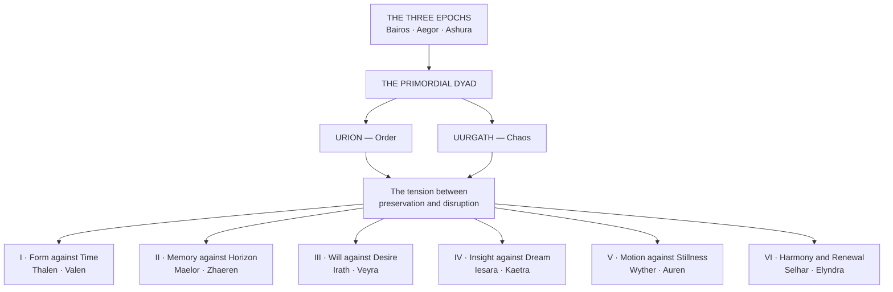
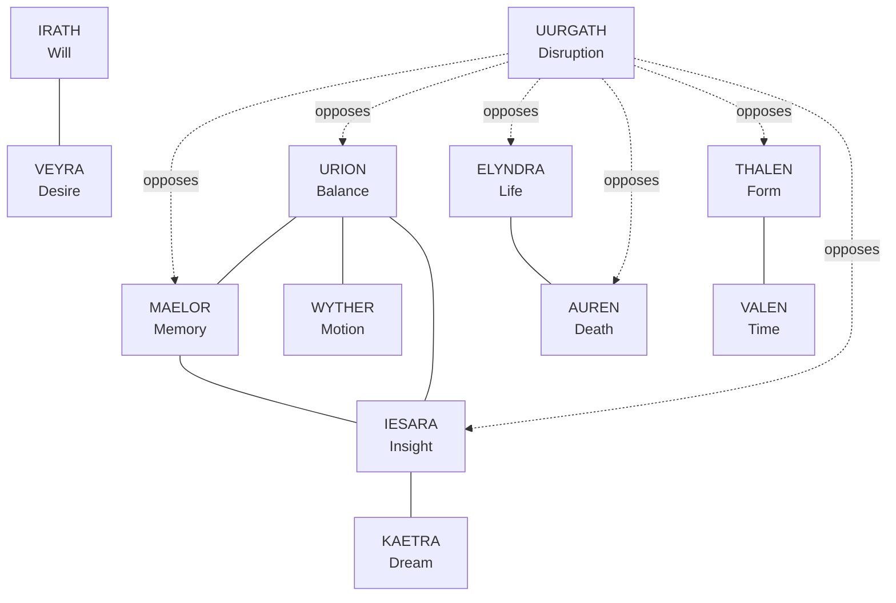
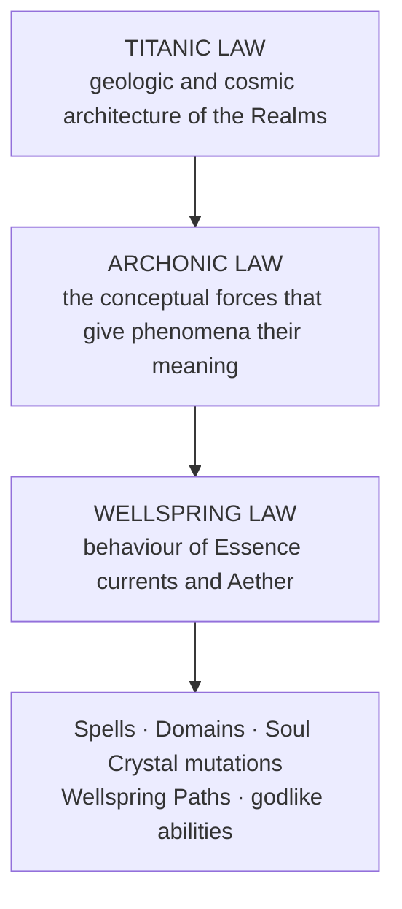

# The Fourteen Archons

> *"To wield Archonic magic is not to use power. It is to invoke function. It is to call upon the labor of a crowned idea and ask it to work through you, briefly, at the cost of everything the idea was always going to be permitted to take."* — Codex of Three Planes, attributed to the Spiritwright Erindael of the Second Accord

---

## Emergence

The Archons did not appear simultaneously. They emerged from the tension between the three Epochs, crystallizing as the cosmos discovered that certain principles required sovereign intelligence to sustain them.
The **Works of Hataraki**, authored by Bara before time, contained the raw meanings from which Archonic consciousness would later condense. The Archons are therefore not identical to the Works, nor do they replace them. They are **crowned ideas**, meanings that rose into conceptual sovereignty, while the Works represent those same meanings at their most stripped-down and fundamental level.
> Fourteen Archons compose the complete **Pantheon of Abstract Dominion**. No entity may claim Archonhood unless directly raised by the Pantheon.
They emerged in a specific cosmological sequence: first the **Primordial Dyad**, born from the fundamental opposition between Order and Chaos, and then **six Dialectical Pairs**, born from the tension between preservation and disruption that the Dyad's eternal conflict generated.
Each Archon's domain shapes cognition, destiny, and the emotional gravity of all beings. Each grants access to a distinct expression of **Archonic Magic**, the conceptual force that operates between Titanic Law and Wellspring Law in the metaphysical hierarchy. The magic granted by each Archon is not a technique or a school. It is a principle made actionable, a slice of cosmic grammar that the practitioner channels through Temperance, Soul Crystal alignment, and Wellspring resonance.

> The six pairs are not adversaries locked in war. They are the left hand and the right hand of a single gesture, each incomplete without the other, each dangerous without the other's counterbalance.

---

## The Complete Registry

Listed in order of emergence, with governing Archon, common name, thematic designation, and primary function.
| Archon | Magic | Designation | Primary function |
|---|---|---|---|
| **I. URION** | Order Magic | *Judicaris* | Equilibrium, judgment, cosmic fairness, enforced symmetry |
| **II. UURGATH** | Chaos Magic | *Nihilaris* | Unmaking, entropy, pattern erasure, terminal dissolution |
| **III. THALEN** | Form Magic | *Formaris* | Architecture, geometry, structural law, spatial anchoring |
| **IV. VALEN** | Time Magic | *Chronaris* | Sequence, duration, causal enforcement, temporal governance |
| **V. MAELOR** | Memory Magic | *Mnemoris* | Recall, preservation, echo transcription, ancestral archive |
| **VI. ZHAEREN** | Space Magic | *Vastaris* | Distance, direction, dimensional manipulation, spatial law |
| **VII. IRATH** | Dominion Magic | *Imperaris* | Command, sovereignty, hierarchical enforcement, imposed will |
| **VIII. VEYRA** | Desire Magic | *Ardoris* | Passion, creation through longing, the Law of Becoming |
| **IX. IESARA** | Insight Magic | *Luminaris* | Clarity, revelation, perception beyond surfaces, truth |
| **X. KAETRA** | Dream Magic | *Oneiris* | Illusion, dream-architecture, shaped perception, veils |
| **XI. WYTHER** | Motion Magic | *Kineris* | Flux, momentum, transformation, freedom from stasis |
| **XII. AUREN** | Death Magic | *Mortaris* | Passage, silence, lawful ending, soul transition |
| **XIII. SELHAR** | Harmony Magic | *Resonaris* | Frequency, accord, vibrational governance, tonal law |
| **XIV. ELYNDRA** | Life Magic | *Vitalaris* | Growth, rebirth, regenerative law, the cycle of renewal |

---

## The Web of Archonic Relation

The fourteen Archons do not exist in isolation. Their domains overlap, conflict, complement, and constrain one another in a web of relationships that mirrors the larger architecture of the cosmos. **No Archon is self-sufficient.** Each requires the others to prevent its own principle from consuming reality.

### The Triad of Law

**Urion** (Balance), **Maelor** (Memory), and **Iesara** (Insight) form the oldest formal alliance among the Archons. Together they embody the threefold requirement of cosmic justice: Urion measures the weight of every act, Maelor preserves the record of what has occurred, and Iesara reveals the truth that neither measurement nor memory can distort. The Triad's cooperation produced the **Parunic Codex**, the written foundation of Concord Law, and their combined influence sustains the metaphysical architecture of judicial process across the Realms.

### The Twin Flames

**Irath** (Will) and **Veyra** (Desire) share the elemental correspondence of Fire, but their relationship is one of productive rivalry rather than cooperation. Irath imposes control through conviction; Veyra creates through longing. Where Irath builds thrones, Veyra lights the fires that either illuminate or burn them. Their tension is the engine of mortal ambition: the interplay between discipline and passion that drives civilizations to their greatest heights and their most catastrophic collapses.

### The Cycle of Life and Death

**Elyndra** (Life) and **Auren** (Death) sustain the wheel of existence through their absolute codependence. Elyndra's growth requires Auren's endings; Auren's passages require Elyndra's renewals. Together they represent the only partnership among the Archons that both parties describe as **kinship** rather than alliance. Their combined influence governs the behavior of biological Wellsprings, the cycle of Essence reclamation, and the metaphysical laws that prevent death from becoming permanent and life from becoming cancerous.

### The Dialectic of Perception

**Iesara** (Insight) and **Kaetra** (Dream) are bound by what they call a **sister-bond**. Iesara reveals truth through clarity; Kaetra obscures truth through beauty. They are not enemies. They represent the two faces of perception: the light that shows what is and the mirror that shows what could be. Their relationship ensures that truth is never so harsh it destroys the observer, and illusion is never so perfect it replaces reality entirely.

### The Cosmic Heartbeat

**Urion** (Balance) and **Wyther** (Motion) generate the pulse of cosmic rhythm through their perpetual friction. Urion seeks equilibrium; Wyther refuses it. Their dialogue is not a war but a conversation, and that conversation produces the oscillation between stability and change that prevents the cosmos from freezing into perfection or dissolving into noise. Every Wellspring fluctuation, every seasonal shift, every rise and fall of empires can be read as a syllable in their ongoing exchange.

### The Architect and the Clock

**Thalen** (Form) and **Valen** (Time) together define the parameters of existence: Thalen governs what shapes may exist, and Valen governs when those shapes may manifest, persist, and dissolve. Their relationship is not antagonistic but complementary, each incomplete without the other. A form without duration is a flash. A duration without form is an empty wait. Together they build the scaffolding upon which every other Archonic principle hangs its influence.

### The Universal Adversary

> **Uurgath** (Disruption) stands opposed to nearly every other Archon. He is arch-enemy to Maelor, whose memory defies his hunger. He is loathed by Urion, who forever repairs what he tears. He is feared by Auren, who calls him *"the After of After,"* the entropy that continues consuming even after death has done its lawful work. He is hated by Elyndra, who represents growth while he represents sterilization. Even Veyra and Wyther, who occasionally court his power, do so with the knowledge that his gifts always cost more than they promise.
>
> Uurgath is the pressure that keeps the other thirteen honest, the reminder that every structure, every memory, every insight, every dream will eventually face the question of whether it deserves to continue.

---

## The Hierarchical Position of Archonic Magic

Archonic Magic occupies the middle tier of the metaphysical hierarchy, situated between the world-shaping forces of Titanic Law and the energetic currents of Wellspring Law.

While Titanic Law governs the geologic and cosmic architecture of the Realms, and Wellspring Law governs the behavior of Essence currents and Aether, Archonic Law governs the conceptual forces that give those physical and energetic phenomena their meaning. Memory, desire, balance, dream, motion, stillness, insight, harmony, form, time, space, will, life, and death are not merely abstract ideas. They are **operational principles**, each one administered by a sovereign intelligence, each one expressing itself through the metaphysical grammar that practitioners access via Temperance growth, Wellspring attunement, and Soul Crystal alignment.
> All spells, Domains, Soul Crystal mutations, Wellspring Paths, and godlike abilities must draw from one of these three cosmological strata. No magic exists outside the lattice that Omnara's Division created and that the Three Epochs and Fourteen Archons sustain.

### Two triads, and why they are not the same triad

*A recurring confusion in the teaching literature, worth settling once.*
**Titanic, Archonic and Wellspring Law are a hierarchy of authority.** They answer where a working's permission comes from and which stratum it must be lawful under.
**Aether, Wellspring and Essence are a hierarchy of description.** They answer where a working is accounted for: what was in the room, which law was conditioned, and what it cost the Crystal that spent it.
> *The two overlap at one word and nowhere else. A working is authorised under one hierarchy and described under the other, and a practitioner who confuses them will produce a filing the Bench refuses and a technique that does exactly what it was built to do.*

### The Archons are the stations

The lattice underlying all Parunic syntax is read **from fourteen positions, one per Archon**, and a glyph is the path traced across that lattice from a given station. This is not a metaphor drawn from the Archons. **It is the mechanism by which their sovereignty is operational rather than ceremonial.**
Every one of the hundred and thirty-six attested glyphs belongs to an Archon because every one of them is a reading taken from somewhere, and there is nowhere to read from that is not an Archon's station. **Thalen holds sixteen forms and Irath holds five, and the disparity is not favour.** It is how much of the lattice is legible from each seat.
> *Which explains the register's oldest curiosity without softening it.* **Irath holds the fewest forms in the index and two of them are Command and Dominion**, both unclassifiable, and the smallest station carries the two heaviest words in the language.
>
> A station that sees little of the lattice sees the part of it that says *by what right*. **The Archons have never commented and the Codex records no Edict on the subject.**

---

## The Pantheon in Full

Each Archon's Domain, Celestial Form, Glyphs, Divine Edict, magic, and web of relation, arranged by the tension each pair holds open.
- [The Primordial Dyad — Order and Chaos](The Fourteen Archons/The Primordial Dyad — Order and Chaos.md)
- [Pair I — Form Against Time](The Fourteen Archons/Pair I — Form Against Time.md)
- [Pair II — Memory Against Horizon](The Fourteen Archons/Pair II — Memory Against Horizon.md)
- [Pair III — Will Against Desire](The Fourteen Archons/Pair III — Will Against Desire.md)
- [Pair IV — Insight Against Dream](The Fourteen Archons/Pair IV — Insight Against Dream.md)
- [Pair V — Motion Against Stillness](The Fourteen Archons/Pair V — Motion Against Stillness.md)
- [Pair VI — Harmony and Renewal](The Fourteen Archons/Pair VI — Harmony and Renewal.md)
