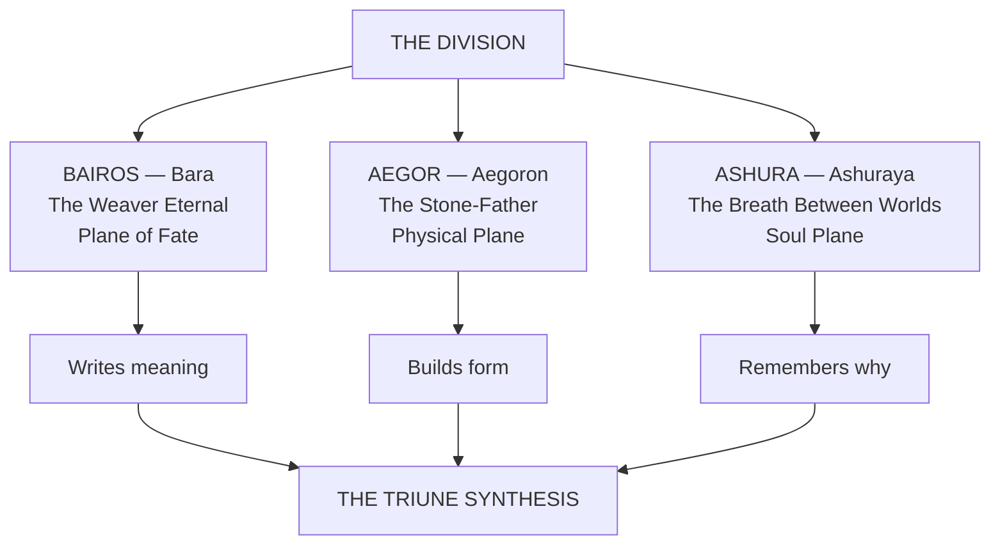

# The Three Epochs

> From the Division's three currents arose three Primordial Epochs, each one a sovereign intelligence crystallized from the raw law of a single plane. They are not gods in the mortal sense. They are the principles that make godhood possible, the load-bearing grammar beneath every subsequent expression of divine, mortal, and metaphysical power.

---

## I. Bairos, the Weaver Eternal

| **True Name** | Bara (in the mortal tongue) |
|---|---|
| **Plane** | The Plane of Fate |
| **Aspect** | Causality, Probability, Inevitability, Sequence |
| **Associated Glyphs** | `[Thd]` Thread · `[Ln]` Line · `[Seq]` Sequence · `[Knt]` Knot |

Bairos is the first Epoch, the consciousness that allowed the act of "before" and "after" to exist. Before Bairos, reality was simultaneity, an infinite compression of acts without order. He stretched the first thread across that chaos, creating distance between causes and effects, and thus gave birth to Time itself.
He dwells within the **Loom of Stars**, a construct visible only from the Astral Veil, a lattice of golden filaments intersecting at impossible angles and connecting every living soul to the pulse of its consequence. He does not decide what will happen. He defines why things can happen at all. All choices occur within the mathematical curvature of his web.
> Bairos authored the **Seven Works of Hataraki** within the Plane of Fate before measured time: the primal functions of Ruin, Purity, Spirit, Temporality, Knowledge, Balance, and Totality. These Works are the operative laws by which existence acts, divides, endures, unravels, and completes itself. Even time is merely one Work within the larger architecture he laid.
>
> *In every mortal tradition that names him at all he is Bara, and the oral sources use the short name where the archives use the long one.*
> *"I am not your destiny. I am the floor it walks upon."*

---

## II. Aegor, the Stone-Father

| **True Name** | Aegoron (in the Adamant Tongue) |
|---|---|
| **Plane** | The Physical Plane |
| **Aspect** | Matter, Mass, Endurance, Structure, Consequence |
| **Associated Glyphs** | `[Frm]` Form · `[Bd]` Body · `[Anv]` Anvil · `[Wt]` Weight |

Aegor is the hand that gives weight to thought. If Bairos wrote causality, Aegor made it heavy enough to stay. He is the body of the cosmos, the density that anchors divine law to physical reality. Where Bairos's threads stretched infinite, Aegor struck the hammer that pinned them in place.
His domain is the **Adamant Vault**, an endless cavern beneath all Realms where reality's structure hums. Every object in existence casts a metaphysical echo there: stars as mountains, thoughts as motes of dust, bodies as sculpted strata. Within it sleep the **Four Pillars**, titanic oxen carved from living basalt whose hooves pulse with heartbeat rhythm, upholding the cosmic crust of matter itself.
Aegor compacted Essence into the first strata of matter, creating gravity, pressure, and the weight of mortality.
> **The Three Laws of Aegor** · the **Covenant of Weight**, the **Anvil and the Spark**, and the **Pillar and the Root**. Together they ensure that nothing may exist freely, that endurance validates existence, and that every form survives by its unseen foundation.
> *"Ideas are smoke until struck upon my anvil."*

---

## III. Ashura, the Breath Between Worlds

| **True Name** | Ashuraya (in the Celestial Proto-Tongue) |
|---|---|
| **Plane** | The Soul Plane |
| **Aspect** | Consciousness, Emotion, Transcendence, Memory of Self |
| **Associated Glyphs** | `[Flm]` Flame · `[Sp]` Spirit · `[Drm]` Dream · `[Awk]` Awakening |

Ashura, final of the Three Epochs, is the spark that made awareness possible. Where Bairos wrote the pattern and Aegor forged its vessel, Ashura entered the clay and taught it to dream. Her essence is both warmth and motion: the unquantifiable impulse that turns observation into empathy. She is the first breath drawn by existence. Every soul, mortal, divine, or Archonic, is a micro-inhalation of her will, a reflection of the first whisper that parted silence from knowing.
Her domain, the **Empyreal Veil**, lies between dream and Aether, a sea of soft-burning auroras where memory becomes visible. Within its tides drift innumerable **Soul-Echoes**: reflections of all who have ever lived, flickering like candlelight upon an infinite wind. When she manifests, perception folds inward; every observer sees the image most needed for peace.
> *"When all light dies, close your eyes — you will see me there, still burning."*

---

## The Triune Synthesis

> The Triune Synthesis binds all three Epochs into one equation of being.
> **Bairos writes meaning. Aegor builds form. Ashura remembers why.**
