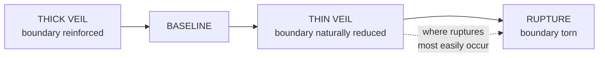

# The Veil

> The Veil is not a place. It is a condition — the state of being between planes, the moment of transition where the ordinary separation between matter, soul, and fate becomes navigable.

---

## Cosmological Classification

| **Type** | Liminal Interface / Inter-Planar Threshold |
|---|---|
| **Location** | The boundary layer between the Physical Plane, the Soul Plane, and the Plane of Fate |
| **Primary Governing Wellspring** | **Transference** · Spatium · Spatial Geometry |
| **Secondary Wellspring Associations** | **Somnalis** · Fluxia · **Oneirion**, **Eidolyn**, **Anamnesis**, **Tenebra** · Limina · **Mortalis** · Vitalia |
| **Note on the Houses** | Older registers file these under the Green Pulse, the Veil and the Black Gate. **Those Houses were sorted by feeling and do not map onto the eight Families**, which sort by Physics Domain. The House names remain in the Veil literature and are read as historical |
| **Governing Titan** | Sylorin, the Ferryman of Etherea |
| **Associated Spiritual Realms** | Etherea (Passage / Soulstream) · Virelion (Dream / Perception) |
| **Related Disciplines** | Transference Crossing · Mnemata · Harmonia · Animatria · Vocatia · Ritus |

---

## Definition

Reality is composed of three sovereign planes. The **Physical Plane** is matter and mana, the surface of existence, where form takes shape and bodies inhabit space. The **Soul Plane** is souls and spiritual energy, the stratum of continuity, where identity persists across strain, time, and the ordinary degradation of form. The **Plane of Fate** is spirits and Attraction Force, the deepest architecture, where recognition, destiny, and the lawful connections between all things are held.
The Veil is none of these.
The Veil is the threshold between them: the liminal membrane where one plane's law softens into another's, where the substance of matter thins enough to reveal the substance of souls, where the hum of spiritual energy bleeds through into audible frequency, where Attraction Force currents become perceptible to senses that normally register only form.
Every practitioner who has ever perceived a soul's resonance, entered a shared dreamspace, contacted an ancestral echo, felt a Wellspring's presence beneath the terrain, read an Attraction Force current through Harmonia, or sensed the weight of a Domain before seeing its effects has touched the Veil. They may not have named it. They may not have known they were standing at a threshold. But the perceptual shift they experienced was a Veil contact: a brief thinning of the boundary between the plane their body inhabits and the planes their soul and Attraction Layer reach into.
The formal term in Aetherica literature is the **Spiritual Stratum**. In practice, nearly everyone calls it the Veil, because the experience of encountering it feels less like entering a place and more like lifting a curtain that was always there.

---

## Structure

The Veil is not uniform. Its thickness, the degree of separation between planes at any given point, varies according to local metaphysical conditions. Understanding this variation is essential to every discipline that operates across planar boundaries.

### Thin Veil Zones

Locations where the boundary between planes is naturally reduced. The Physical Plane's material density is lower, the Soul Plane's spiritual energy is closer to the surface, and Attraction Force currents are more directly perceptible.
**Where they occur** · Near active Wellspring veins, where Wellspring processes create sustained channels between planes. Ancient ritual sites, where repeated Ritus workings have worn the boundary through use. Sacred groves and maintained Wellspring nodes, where Sage or Concordia practice has amplified local planar permeability. Sites of mass death or extreme emotional concentration, where the Soul Plane's preserving function has recorded events so intensely that the records push toward the surface. Dream Realm proximity points, where Virelion's influence softens material law into something more fluid.
**What changes** · Bifold Perception occurs spontaneously in practitioners of even moderate Temperance. Transference crossings require less Essence. Mnemata readings are sharper. Harmonia perception is clearer. Spiritual entities are closer to visibility. Dreams are more vivid and more prone to carrying genuine Wellspring content rather than mere subconscious noise.
> **The cost.** Thin Veil zones are where Veil ruptures most easily occur, where Echo Beasts most frequently manifest, and where unprotected mortal minds are most vulnerable to spiritual contamination, memory bleed, and involuntary Bifold Perception that can produce disorientation, hallucination, and in severe cases, **Soul Drift**.

### Thick Veil Zones

Locations where the boundary between planes is reinforced. Heavy material density, artificial Essence suppression (ward-networks, Silence Realm effects, anti-Harmonia fields), or natural geological features that insulate against spiritual energy all produce Thick Veil conditions.
Major cities, where overlapping ward-networks, alchemical residue, and competing Aether fields create dense metaphysical noise, tend toward Thick Veil despite (or because of) their high Essence traffic. The noise itself acts as insulation: so many competing signals that the Soul Plane's deeper frequencies are drowned out.
**What changes** · Transference crossings require significantly more Essence. Mnemata readings are muddy. Harmonia perception is degraded. Spiritual entities are invisible except to practitioners with deep Resonant Perception training. Dreams are shallow and rarely carry genuine Wellspring content.
> **The benefit.** Thick Veil zones are inherently safer for unprotected mortal populations. The reinforced boundary prevents accidental spiritual contact, involuntary Bifold Perception, and the ambient memory bleed that makes Thin Veil zones psychologically dangerous for prolonged habitation.

### Veil Ruptures

Points where the boundary between planes has been torn rather than thinned. Veil ruptures are not controlled crossings. They are structural failures in the inter-planar membrane, produced by catastrophic Essence events: Overcast Collapse, Phenomena-class discharges, failed high-order Ritus, Mechanica scarring, or the death of a World Spirit whose continuance was load-bearing for local planar stability.
Through a rupture, the planes do not interface. They collide. Soul Plane content floods into the Physical Plane without mediation. Physical Plane conditions contaminate the Soul Plane without filtering. Attraction Force currents from the Plane of Fate lose their usual depth and surface as raw, unprocessed causal pressure that warps local probability, memory, and identity.
- ****Echo Beasts** — what a rupture produces**
  Veil ruptures are the origin of Echo Beasts: entities formed when unresolved spiritual content (grief, guilt, unprocessed memory, abandoned vows, fragmented Essence Shards) passes through a rupture and condenses on the Physical Plane side.

  An Echo Beast is not a summoned creature or a natural spirit. It is a wound given form, a piece of the Soul Plane's unresolved content that has been forced into material existence by a structural failure it did not ask for.

  Echo Beasts behave according to the emotional content that formed them: grief-born Echo Beasts wander and weep, guilt-born Echo Beasts fixate on the location of the original transgression, rage-born Echo Beasts are violent and indiscriminate. None of them are conscious in any meaningful sense. They are echoes, not selves.
**Rupture containment** is among the most urgent applications of Concordia-level practice. Sealing a rupture requires realigning the planar boundary: restoring the Veil's thickness at the rupture point through sustained harmonic projection that re-establishes the separation between planes. This is Concordia work because it requires alignment of multiple Aether bodies and Wellspring processes into a coherent field capable of operating across planar boundaries simultaneously. **A single practitioner, regardless of Temperance, cannot seal a significant rupture alone.**

---

## The Veil as Soulstream Pathway

The Veil is also a medium of transit: the space through which souls, spiritual energy, and Essence move between planes during lawful crossing events.
**Sylorin**, the Ferryman of Etherea, governs the **Ethereal Flow**, the cosmic current that carries Essence between death and re-embodiment. This current runs through the Veil. It does not exist on any single plane. It exists in the threshold between them, using the Veil's liminal quality as a channel through which spiritual content can move without being subject to any single plane's laws.
A soul in the Soulstream is not on the Physical Plane (it has no body), not fully on the Soul Plane (it has not yet settled into the Soul Plane's preserving archive), and not anchored on the Plane of Fate (its Attraction Layer is in transit, its Spirit Axis temporarily dissolved). It is in the Veil: between, moving, awaiting arrival.
The **Transference** Wellspring governs lawful passage through this medium. Every **Veil Step** (short liminal crossing through a thin boundary), every **Essence Relay** (transfer of energy, memory, or consciousness between vessels), every **Echo Binding** (temporary stabilization of a fragmented spirit), and every **Soul Preservation** (holding dying Essence in harmonic stasis) operates within the Veil's liminal space. Transference practitioners do not enter the Soul Plane or the Plane of Fate. They enter the threshold between planes and perform their work in the space where the rules of all three planes are negotiable.
> This is why Transference sits in **Spatium** despite its association with death and passage, and why the old registers filed it under the Green Pulse and were not wrong about what it felt like. **Spatium is the physics of distance and position, and the physical reading of Transference is resonant energy transfer between coupled oscillators**: two systems tuned alike and held near exchange energy without a conductor between them, and the coupling falls off sharply with separation.
>
> Transference's core law — *"What must pass onward may remain itself through motion"* — is a law of continuity rather than of ending. **It teaches Essence how to survive transition.** The Veil is where that survival is tested: the space where identity must hold itself together while the laws that normally support it are temporarily absent.

---

## Access and Perception

| Mode | Temperance Gate | Principal risk |
|---|---|---|
| **Passive Veil Perception** | None — universal, unconscious | Uninterpretable somatic signal; unease without cause |
| **Involuntary Veil sensitivity** | Stage V · Splintering | Disorientation, hallucination, memory bleed |
| **Controlled Bifold Perception** | Stage VII · Refraction | Loss of coherence across two perceptual grammars |
| **Short deliberate crossings** | Stage VIII · Transcendence | Incremental Soul Drift |
| **Sustained Bifold operation** | Stage IX · Invocation | Identity degradation |
| **Sustained liminal operation** | Stage X · Realization | Accumulated Drift; the Physical Plane begins to feel thin |
| **Carrying others through crossings** | Stage XII · Emanation | Drift transferred to the carried as well as the carrier |

### Passive Veil Perception

Every Soul Crystal projects resonance patterns into the Veil as a byproduct of its normal operation. The Aether Shell's Resonant Tone, the Essence Core's emotional frequency, and the Attraction Layer's recognition hum all radiate outward through the Veil's liminal medium.
Most mortals cannot perceive these projections. Their Physical Plane senses register only form, not frequency. A mortal standing next to a Thin Veil zone might feel unease, heightened emotion, or the sense of being watched without understanding why: their body is registering Veil-adjacent phenomena through crude somatic channels (goosebumps, temperature shifts, instinctive alertness) because their Soul Crystal is detecting inter-planar signals that their conscious mind lacks the training to interpret.

### Active Veil Perception — Bifold Existence

Trained practitioners can achieve **Bifold Perception**: the deliberate simultaneous perception of the Physical Plane and the Soul Plane through the Veil's liminal medium. This is Transference at its most basic application and the gateway to all deeper Veil work.
Bifold Perception reveals what the Physical Plane normally obscures: the Resonant Tones of nearby Soul Crystals, the emotional weather stored in a location's Mnemata substrate, the presence of spiritual entities that exist primarily on the Soul Plane, the Echo Imprint Layer's recorded traces of past events, and the faint luminous tracery of Attraction Force currents connecting related presences.
The experience is disorienting for unprepared practitioners. The Physical Plane and the Soul Plane do not share the same visual grammar. Physical sight registers surfaces, edges, light, and shadow. Soul Plane perception registers frequency, emotional density, temporal depth, and relational topology. Layering both simultaneously produces a perceptual experience that the brain was not evolved to process: buildings overlaid with their emotional history, living people surrounded by the resonant haloes of their Traits, terrain annotated with the grief, prayer, and violence it has absorbed.

### Deliberate Veil Crossing

Full entry into the Veil's liminal space, beyond mere perception. The practitioner partially or fully enters the threshold between planes, their body remaining on the Physical Plane while their awareness, Essence circulation, and active Soul Crystal operation shift into the inter-planar medium.
**What deliberate crossing allows** · Direct interaction with Soulstream content (guiding spirits, stabilizing fragments, performing soul preservation). Access to spiritual Realm approaches — the paths leading toward Etherea, Virelion, and other Spiritual Realms are navigated through the Veil. Deep Mnemata reading, accessing historical echoes stored in the Soul Plane's preserving archive at a specific location. **Veil-thread tracing**, following Attraction Force currents through the Veil to their endpoints, a form of Resonant Tracking performed in the inter-planar medium rather than from the Physical Plane surface. And communication with entities that exist primarily on the Soul Plane or at the boundary between planes.
> **Soul Drift.** The condition in which a practitioner's awareness becomes more anchored to the Veil's liminal medium than to their Physical Plane body. Soul Drift is not immediate. It accumulates over repeated crossings. Each entry into the Veil loosens the practitioner's connection to Physical Plane sensation by a small increment. Each return requires the practitioner to re-establish connections that the Veil's liminal state had temporarily dissolved.
>
> Over time, the loosening accumulates. The Physical Plane begins to feel thin. The Veil's liminal depth begins to feel more real than the body it was supposed to support. A practitioner who crosses too often may stop recognizing the Physical Plane as home.
>
> The **Veil Pilgrims**, ethereal monks who never fully returned from repeated crossings, are the endpoint of this trajectory: entities patient enough to guide the lost but too thin to remember why they once wanted bodies.

---

---

---

---

## Practitioners and History

> *Merged from the Spellcraft conversion page, 2026-09-15. Unattested claims flagged.*
**Rikudoku Moto** carries the most striking tradition attached to the Veil: that he manipulated deep Veil layers to fracture spiritual continuity across battlefields, and that his soul was rumored to drift between folds even after death. The name is genuinely attested in current canon, named a philosophical ally on two other characters' sheets, but the wiki mirror flags him as needing re-identification before anything about him hardens into fact. The specific claim is kept here as an unverified tradition attributed to him, not as settled history.
**Eremund Vellsore**, credited with developing the first known method of Veil-thread weaving through song, and **the Bound Watchers**, Veil-bound entities said to sit at the outer edge of the Astral Fold in judgment over oaths and Temperance rituals, have no matching record anywhere in the wiki mirror. Both are kept because the account of who works the Veil and who judges its crossings reads thinner without them, and both are flagged **unattested in current canon**.
> **Card reconciliation note.** The old card's "Wellspring Realms" and "Utopia" are not carried forward here. Utopia is a real place in current canon (home to the Celestial Host, with its arbitration realm Midreach), but it is not attested as part of the Veil's connected architecture. The card's "Great Spirit War" is not attested as a named conflict, though Echo Beasts and Veil ruptures are confirmed canon. The card's "Spiritual Stratum" title is confirmed: the formal term in Aetherica literature for the Veil.
**Cross-references** · *The Eight Families & the Sixty Wellsprings* (Transference Family assignment, the retired Houses); *The Spirit Summoning Arts* and *The Harmonic Arts* (neighboring Disciplines operating through the Veil).

---

### The Two Accounts

> ❓ Open question (SA-CROSS-VEIL-TRANSFERENCE-CORE-LAW): The page attributes a core law to Transference in quotation marks. This section may change when it is ruled.
> ❓ Open question (SA-GAP-VEIL-CONDITION-NOT-A-WORKING): Every other entry in this section is a working with a caster, a cost and an effect. This section may change when it is ruled.
> ❓ Open question (SA-GAP-VEIL-DRIFT-HAS-NO-COUNT): The page states that Drift accumulates per crossing, in increments, without recovery, and names the endpoint of the accumulation. This section may change when it is ruled.
> ❓ Open question (SA-GAP-VEIL-GATES-WITHOUT-GRADES): The page carries seven Temperance Gates with a named principal risk each - more attested gating than any other entry in this section - and states no Grade at any of them. This section may change when it is ruled.
> ❓ Open question (SA-GAP-VEIL-NO-CARD): No Veil practitioner has a character card, so Flux Density, AU/s and the Starvation margin are null and every efficiency figure in the account is read off the Tier of Standing table at the page's… This section may change when it is ruled.
> ❓ Open question (SA-GAP-VEIL-NO-NUMBERS): The page states the cost of a crossing only comparatively - 'less Essence' in a Thin zone, 'significantly more' in a Thick one - with no EU figure at any gate, no baseline, no range and no duration. This section may change when it is ruled.
> ❓ Open question (SA-PHYS-VEIL-DRIFT-IS-REVERSE-COUPLING): The page describes Soul Drift in detail and never cites the Wellspring Failure that produces it. This section may change when it is ruled.
> ❓ Open question (SA-PHYS-VEIL-THICKNESS-VERSUS-NOISE): Two physically different mechanisms are filed under one heading and given one list of consequences. This section may change when it is ruled.
> ❓ Open question (SA-UNATT-VEIL-PRACTITIONERS): The Veil's practitioner record is one attested name flagged for re-identification and two unattested entries, so no Veil practitioner is available as a worked example and the ledger's Flux Density… This section may change when it is ruled.
> **A note on which page this account reads.** The issue lists
> `wiki/Spellcraft/The Veil.md`. That page was **retired on 2026-09-15** and is now a
> redirect: *"This page has been retired. Its unique content was merged into the
> governing entry."* The account is therefore written against
> `wiki/Cosmology & Metaphysics/The Veil.md`, which carries the definition, the
> structure, the access table and the merged Practitioners section. Logged as
> `SA-CROSS-VEIL-SPELLCRAFT-PAGE-RETIRED`.
> 
> **And a second note, because it changes the shape of this account.** The Veil is not
> a working. It is *"not a place. It is a condition — the state of being between
> planes."* The five sections below therefore account for the **operations performed in
> it** — Bifold Perception, the Transference crossings, and rupture containment — and
> for the condition itself as a medium with measurable properties. Logged as
> `SA-GAP-VEIL-CONDITION-NOT-A-WORKING`.

#### 1 · Physical account (physics)

**The phenomenon in plain words.** Two regions are separated by a barrier. Nothing
crosses the barrier by going over it; what crosses does so because the barrier is thin
enough that a little of each side is already present on the other, and the amount that
gets across depends on the thickness **exponentially** — so a barrier twice as thick is
not twice as hard, it is hard by a factor nobody plans around. Where the barrier has
failed outright rather than thinned, what crosses is not a crossing at all but a
channel that sustains itself.
**The real phenomenon.** Three, for the three conditions the page names.
*Thin and thick: evanescent coupling through a barrier.* A wave meeting a barrier it
cannot propagate in does not stop at the surface — it continues as an **evanescent
field** that decays with distance into the barrier, and if the barrier ends before the
field has died, a propagating wave resumes on the far side. Transmission goes as
**T ≈ e^{−2κd}**
with d the barrier thickness and κ set by how badly the barrier mismatches the wave.
**Thickness is the right variable and the dependence is exponential**, which is exactly
the page's own structure — a graded scale from Thin through Baseline to Thick — and it
supplies the number the page lacks: *"Transference crossings require less Essence"* in a
Thin zone and *"significantly more"* in a Thick one, and the ratio between them is
e^{2κΔd} rather than anything additive. **There is no such thing as a moderately hard
crossing.** This is also the correct reading of why Thin zones cluster where they do —
near active Wellspring veins and at *"ancient ritual sites, where repeated Ritus
workings have worn the boundary through use"* — because what wears is d.
*But the page names a second, different mechanism under the same heading, and it does
not behave the same way.* Thick Veil in cities is explained not by thickness but by
noise: *"so many competing signals that the Soul Plane's deeper frequencies are drowned
out. The noise itself acts as insulation."* That is a **signal-to-noise** statement, not
a barrier statement, and the two have opposite consequences. A thicker barrier raises
the **transmission** cost exponentially and leaves detection alone; a raised noise floor
destroys **detection** and leaves transmission alone. So a practitioner in a granite
vault can read and cannot cross, and a practitioner in a city can cross and cannot read
— and the page files both as "Thick Veil" and gives them the same list of consequences.
`SA-PHYS-VEIL-THICKNESS-VERSUS-NOISE`.
*Ruptures: breakdown, and why one person cannot close one.* Past a critical field an
insulator stops insulating: a conduction channel forms, and the channel **sustains
itself at a far lower field than it took to strike**. An arc is not extinguished by
pushing harder against it; it is extinguished by removing the current that maintains it,
or by lengthening and cooling the channel until it can no longer carry. The page's rule
is the correct engineering conclusion and it is stated as a flat prohibition:
*"A single practitioner, regardless of Temperance, cannot seal a significant rupture
alone."* And the containment method is the right one — *"restoring the Veil's thickness
at the rupture point through sustained harmonic projection that re-establishes the
separation between planes"*, which is re-insulating the channel rather than out-pressing
it.
*Echo Beasts: nucleation at an interface.* Content that was soluble on one side crosses
into a region where it is not, and precipitates. The page: entities *"formed when
unresolved spiritual content… passes through a rupture and condenses on the Physical
Plane side."* **Condenses** is the correct verb and it explains the one odd feature of
the page's account — that Echo Beasts inherit the *character* of what formed them and
none of its intelligence. A precipitate keeps the composition of its solute and none of
its context.
*Soul Drift: cumulative damage per cycle, which is the finding.* The page is unusually
precise: *"Soul Drift is not immediate. It accumulates over repeated crossings. Each
entry into the Veil loosens the practitioner's connection to Physical Plane sensation by
a small increment."* That is not a duration and not an exposure — it is a **cycle
count**, and the physics of cycle-counted irreversible damage is** low-cycle fatigue**,
where damage sums per cycle and failure arrives when the sum reaches unity
(Miner's rule, Σ nᵢ/Nᵢ = 1). The consequence is that Drift has a **number**: there is an
N at which a practitioner becomes a Veil Pilgrim, it is a property of the practitioner
and the severity of each crossing, and **the system states no N anywhere**.
`SA-GAP-VEIL-DRIFT-HAS-NO-COUNT`.
**The governing law.** **Evanescent transmission through a barrier**, exponential in
thickness, for lawful crossing; **dielectric breakdown and self-sustaining channel
formation **for ruptures; and** per-cycle irreversible accumulation** for Drift. Three
laws for three conditions, and the page's own three-way structure maps onto them one to
one.
**Measurable quantities, SI.** The page states seven Temperance Gates with named risks,
which is more attested gating than any other entry in this section, and no cost. What
the law supplies as checkable consequence:
- **Crossing cost is exponential in local Veil thickness, so terrain is a multiplier
rather than a modifier.** The page says less and more; the law says the ratio is
e^{2κΔd}. This is why every Transference discipline in canon is organised around
*where*, and why the location of a crossing chamber is worth fighting over.
- **Drift is counted, not timed.** Two practitioners with the same hours in the Veil
and different numbers of entries are not equally drifted, and the one with more
entries is worse off. That inverts the intuitive reading, and it means **the cheapest
attack on a Veil practitioner is to make them cross again** — not to keep them in.
- **Carrying is worse than crossing and the page says so.** *"Carrying others through
crossings… Drift transferred to the carried as well as the carrier."* Per-cycle damage
applied to two structures from one cycle, which is why that gate is at Stage XII and
not lower.
- **A rupture has hysteresis and a crossing does not.** A thinned barrier returns to
its thickness; a struck channel stays struck until it is actively re-insulated. This
is the physical content of the page's insistence that *"Veil ruptures are not
controlled crossings. They are structural failures."*
**The energy budget, and where the joules were.** **On both sides, and mostly not
supplied by anybody.** Evanescent coupling transports what is already present; what the
practitioner pays for is **matching** — being the right shape to have a propagating
solution on the far side — and the barrier's thickness sets the price of that match.
`Two Sets of Books` §III is satisfied in one of its cleanest forms in the corpus:
*"The practitioner does not supply the joules. They supply the boundary condition."* For
ruptures the budget is different and worse: the strike was paid for once, by whatever
catastrophe struck it — *"Overcast Collapse, Phenomena-class discharges, failed
high-order Ritus, Mechanica scarring, or the death of a World Spirit"* — and the channel
has been running free ever since, which is why containment is an expenditure and the
rupture is not.
**Precedent we are not copying.** The spirit world behind a curtain is the most
worked-over setting in the genre: *Bleach*'s Soul Society, *Naruto*'s Pure Land,
*Spirited Away*'s tunnel, the Astral Plane in every edition, *Jujutsu Kaisen*'s domain
interiors. Almost all of them make the other side **a place you go**, with geography and
inhabitants, and the crossing is a door. This one is explicitly not:
*"The Veil is none of these… the liminal membrane where one plane's law softens into
another's."* Transference practitioners *"do not enter the Soul Plane or the Plane of
Fate. They enter the threshold between planes."* The divergence that matters for scenes:
**there is no destination and therefore no return trip** — what there is, is a barrier
with a thickness and a counter on the practitioner that only goes up. The interesting
beat is not the crossing. It is the fourth crossing this week, and the person who is
keeping count.

---

#### 2 · Stratal account (metaphysics)

**Aether stratum.** The Veil is where the Aether stratum's own geography lives, and the
page is the corpus's best statement of it: *"Its thickness, the degree of separation
between planes at any given point, varies according to local metaphysical conditions."*
**Residue:** the page's Thin-zone account is a residue theory — boundaries *"worn
through use"* by repeated Ritus, and sites of mass death *"where the Soul Plane's
preserving function has recorded events so intensely that the records push toward the
surface."* **Saturation:** named and inverted. The Core Vocabulary's Aetheric Saturation
is ordinarily a hazard; here the page makes ambient noise a **protection** for
unprotected populations — *"Thick Veil zones are inherently safer for unprotected mortal
populations"* — which is the only place in the corpus where saturation reads as a civic
benefit, and it is the same sentence that carries the mechanism confusion logged in §1.
**Wellspring stratum.** **Transference · *The Living Exchange***, Family **Spatium**,
named by the page as *"Primary Governing Wellspring."* Its law, verbatim:
> **Analogue** · *"Resonant energy transfer between coupled oscillators. Flow along a
> potential gradient."*
> **Mechanism** · *"Two oscillators tuned to the same frequency and held near each other
> exchange energy without a conductor between them, and the coupling strength falls off
> sharply with separation. Transference makes the Attraction Layer such an oscillator.
> Essence moves to an ally not because it is pushed but because the two Crystals are in
> tune and near, and a gradient does the rest."*
> **Stat Effect** · *"Strengthens Harmonics Synergy, Projection, Tempering Conversion.
> Essence routes to allies and absorbs ambient Wellspring energy through relational
> proximity."*
> **Failure** · *"Reverse coupling. A gradient runs both directions, and a Transference
> practitioner beside a depleted ally will empty into them without deciding to."*
> (`wiki/The Eight Families & the Sixty Wellsprings/Spatium — Spatial Geometry.md`:26)
**The page defends this Family assignment better than any other page in the corpus
defends one**, and the defence is worth quoting because it is the model for how a
stratal account should read a physical one: *"This is why Transference sits in Spatium
despite its association with death and passage… **Spatium is the physics of distance and
position, and the physical reading of Transference is resonant energy transfer between
coupled oscillators**: two systems tuned alike and held near exchange energy without a
conductor between them, and the coupling falls off sharply with separation."* And it does
the same service for the retired Houses: *"Older registers file these under the Green
Pulse, the Veil and the Black Gate. **Those Houses were sorted by feeling and do not map
onto the eight Families**, which sort by Physics Domain."*
**One thing the page states as the register's and the register does not carry.** The
page attributes a core law to Transference — *"What must pass onward may remain itself
through motion"* — and says it *"is a law of continuity rather than of ending. It
teaches Essence how to survive transition."* That sentence appears nowhere in
`The Eight Families & the Sixty Wellsprings`, which is the register of core laws; the
Transference entry there gives the coupled-oscillator Mechanism and no aphorism. The
attribution may be to an older register the mirror does not carry, and the page's own
paragraph on the retired Houses is a warning that older registers are exactly what the
current one replaced. `SA-CROSS-VEIL-TRANSFERENCE-CORE-LAW`.
**And the Failure bears on the page's central operation and is not carried.** *"Reverse
coupling. A gradient runs both directions."* Every operation the page lists — *"every
**Veil Step**… every **Essence Relay**… every **Echo Binding**… and every **Soul
Preservation**"* — is a coupling established across a thinned boundary, and the
register says a coupling cannot be given a preferred direction. A practitioner who
couples across to stabilise a fragmented spirit has coupled the fragmented spirit to
themselves, at the same rate, for the duration. **Soul Drift is what reverse coupling
looks like when it is measured over years instead of minutes**, and the page describes
Drift in detail without noticing that its primary Wellspring has the mechanism printed
on it. `SA-PHYS-VEIL-DRIFT-IS-REVERSE-COUPLING`.
The six secondary associations the page names — **Somnalis** *(Fluxia)*, **Oneirion**,
**Eidolyn**, **Anamnesis**, **Tenebra** *(Limina)* and **Mortalis** *(Vitalia)* — each
attach to one of the page's listed capabilities, and two are load-bearing here:
- **Anamnesis · *The Wellspring of Remembrance*** *(Limina)* — *"Objects genuinely
store their history in physically readable form. Anamnesis is the instrument, not the
miracle"* — is the whole of Mnemata reading and of the page's *"emotional weather
stored in a location's Mnemata substrate."* Its **Failure is the reason deep Veil
reading is dangerous to the record rather than to the reader**: *"Thermal resetting.
Reading is not always passive, and a careless practitioner erases the record in the
act of taking it."* The page says Thin-zone readings are *"sharper"* and does not say
they are more erasive, which they must be.
- **Oneirion · *The Wellspring of Dream*** *(Limina)* — *"Oneirion lets a working act on
that manifold rather than on the room. This is the mechanical reason Oneirion
techniques reach targets no line of sight connects, and the reason they are so
difficult to describe afterward"* — is Bifold Perception's second grammar, and the
page's account of why it is disorienting is Oneirion's own: the brain is being asked
to hold a manifold and a room at once. Its **Failure, *projection error***, is the*
*characteristic Bifold mistake: *"The trajectory was correct in the manifold and lands*
*nowhere in particular when it is mapped back down into a room."*
*Four Theories.* **Residue**, primarily, and it is the only place in this section where
the theory is doing structural rather than incidental work: Thin zones are *made* by
accumulated working and accumulated death, Mnemata substrates are records that persist,
Echo Beasts are unresolved content that condensed, and Soul Drift is residue in the
practitioner. **Correspondence** is the second, governing lawful passage — Transference
works by two things being alike enough and near enough — and the page's Soulstream
section is the Doctrine's counterpart: a soul in transit is *"between, moving, awaiting
arrival"*, and nothing is being coerced.
**Essence stratum.** All three layers, and the page is the corpus's clearest statement
of what each one radiates: *"The Aether Shell's Resonant Tone, the Essence Core's
emotional frequency, and the Attraction Layer's recognition hum all radiate outward
through the Veil's liminal medium."* The **Attraction Layer** is what Transference makes
into an oscillator and what dissolves in the Soulstream — *"its Attraction Layer is in
transit, its Spirit Axis temporarily dissolved."* Developmental Tier across the gates:
**Harmonic** at Stage V, **Resonant** at VII, **Radiant** at VIII, **Sovereign** at IX
and XII (Part Twenty-One). Crystal State: `null`. **The invoice:** a per-crossing
Essence cost stated only as *"less"* or *"significantly more"*, and a **per-crossing
increment of Soul Drift that is never reversed**, which is the only permanent,
irreversible, cumulative price levied on a practitioner anywhere in this section.
**The lens: the luminiferous aether.** The nineteenth-century mechanical aether, as
Fresnel, Maxwell and Kelvin built it — Maxwell's *Encyclopædia Britannica* article on
the subject (1878) being the confident statement of a medium nobody had detected and
everybody worked in. The aether was posited because waves need something to wave in, and
its properties were then derived from the phenomena rather than observed: rigid enough to
carry transverse light at enormous speed, yet so permeable that planets pass through it
without resistance; filling all space, interpenetrating all matter, and the carrier of
every influence that appears to cross a vacuum. **That is the Veil's own definition
arrived at by a different route** — *"the liminal membrane where one plane's law softens
into another's"*, a medium that is nowhere and everywhere, *"not a place"* and yet the
thing everything crosses through. And the page's own note that the older registers
*"were sorted by feeling"* and *"were not wrong about what it felt like"* is the exact
epistemic position of the aether theorists: a real phenomenon, correctly described, in a
substance that was not doing the work they thought.
Where the lens misleads, and where it produces the Veil Pilgrims, is **frame**. The
mechanical aether was, for most of its career, held to be **stationary** — an absolute
rest frame against which motion could in principle be measured, which is precisely what
Michelson and Morley set out to detect in 1887 and precisely what they did not find. A
school reading the Veil as a stationary medium concludes that **liminal position is
absolute**: the Veil has a fixed structure, so a crossing is a displacement, and a
displacement can be reversed by measuring one's drift and navigating back. Such a school
is very good at the parts of Veil work that are real — it maps thin zones, it charts
currents, it builds excellent instruments — and its whole remediation doctrine is built
on the one thing the page denies. **Soul Drift is not displacement.** *"Soul Drift is
the condition in which a practitioner's awareness becomes more anchored to the Veil's
liminal medium than to their Physical Plane body"*, accumulating per crossing, and
*"Each return requires the practitioner to re-establish connections that the Veil's
liminal state had temporarily dissolved."* There is no coordinate to steer back to; there
is a count that only rises, and the remedy a stationary-aether school prescribes for
Drift — go back in and navigate out of it — **is another cycle.** The Veil Pilgrims,
*"entities patient enough to guide the lost but too thin to remember why they once wanted
bodies"*, are what that doctrine graduates. Offered as a school's error, not as canon.

---

#### 3 · Mechanism (the effect)

**Glyph (proposed; the page names none).** `[Ren]` **Passage** as the boundary that
moves, laid under `[Lh]` **Frequency** for the matching the crossing requires. Both from
the thirty unclassified forms, and the Index's reason applies: *"Each names a kind of
limit, applicable to any law at all."* What a Veil operation moves is the limit on
**which side of a barrier the practitioner has a propagating solution on**, which is a
limit on passage; and what it must supply to move it is a **tuning** into the liminal
medium, which is Transference's *"tuned to the same frequency"* and is the reason Bifold
Perception is described as holding two grammars rather than looking harder.
*Filing decision, not canon — Isaac's ruling (`SA-GAP-GLYPH-MIRROR`).*
**What boundary moves.** **Where the practitioner's operation is resident.** Not the
barrier — the barrier's thickness is a property of the place and the page is firm that it
is not the practitioner's to set. What moves is which side of it the Crystal's active
operation sits on: *"their body remaining on the Physical Plane while their awareness,
Essence circulation, and active Soul Crystal operation shift into the inter-planar
medium."* Everything the practitioner pays is the cost of that match, and the barrier's
thickness sets the price exponentially.
**What the law then does on its own.** It **couples**, and then it keeps coupling in both
directions for as long as the match holds. Once the practitioner is resident in the
liminal medium, the medium does not have to be worked: the Soul Plane's content is
*there*, and the page's list of what Bifold Perception reveals is a list of things that
were already radiating and were previously unmatched — *"the Resonant Tones of nearby
Soul Crystals, the emotional weather stored in a location's Mnemata substrate, the
presence of spiritual entities that exist primarily on the Soul Plane, the Echo Imprint
Layer's recorded traces of past events, and the faint luminous tracery of Attraction
Force currents connecting related presences."* **Nothing was summoned and nothing was
sent.** A boundary was matched and the far side arrived, which is what evanescent
coupling does and which is why the page can say, correctly, that everyone who has ever
felt a Wellspring beneath terrain *"has touched the Veil. They may not have named it."*
And because the coupling is symmetric — Transference's own Failure — the far side is
**also** now matched to the practitioner. This is the half of the mechanism the page
describes only in its consequences. Each crossing loosens the practitioner's anchorage
by an increment, and the increment does not come back: *"Over time, the loosening
accumulates. The Physical Plane begins to feel thin. The Veil's liminal depth begins to
feel more real than the body it was supposed to support."* Nothing did that to them. The
gradient ran both directions, once per crossing, exactly as the register says it must.
**Law V check.** **The page supplies the cleanest gate ladder in the corpus and it
brackets Law V correctly.** *"Below Stage VII, Refraction, a working requires voice,
hand, ink or blood… At Refraction the practitioner can hold the Crystal as an object of
study and the Glyph Roles compress into an internal chain that needs no material anchor
at all"* (`The Four Crafts`). The page puts **Controlled Bifold Perception at Stage VII,
Refraction** — exactly the line at which an internal chain becomes possible — and
everything below it is *involuntary*: Passive Veil Perception at no gate and unconscious,
involuntary sensitivity at Stage V with *"disorientation, hallucination, memory bleed."*
**That is Law V read exactly right without being cited**: below Refraction there is no
controlled Veil operation at all, only exposure, which is the correct consequence of a
working that cannot be given an external anchor because there is nowhere outside to put
one.
**Failure mode — Field fault, and the page names three of them.** *"The room could not
supply what the working assumed"* (`Two Sets of Books` §VII), which for this working is
the only fault that makes sense: the barrier's thickness is a property of the site and
every operation is an assumption about it. The page's three:
**in a Thin zone**, *"unprotected mortal minds are most vulnerable to spiritual
contamination, memory bleed, and involuntary Bifold Perception that can produce
disorientation, hallucination, and in severe cases, Soul Drift"* — a barrier thinner than
the practitioner planned for. **In a Thick zone**, *"Transference crossings require
significantly more Essence. Mnemata readings are muddy"* — a barrier thicker than
budgeted, with the cost rising exponentially rather than proportionally. **And at a
rupture**, the field is not a barrier at all: *"the planes do not interface. They
collide."*
A second fault, on the practitioner and not the field: **Structural, accumulated.**
*"The Crystal could not hold what the boundary permitted"* — not in one crossing, which
is the whole difficulty of noticing it, but at the Nth. Soul Drift is a structural fault
delivered in instalments, and the page's account of the Veil Pilgrims is the fault
completing.
**What the target sees and feels.** There is no target. That is the first thing to say
about this working and the reason it sits oddly in a section of workings: nothing is
done *to* anybody, and the only structure that changes is the practitioner's own.
What the **practitioner** sees, at the Bifold gate, is two incompatible renderings of one
room at once, and the page's description is the best passage in the corpus on what
double-grammar perception actually costs: *"Physical sight registers surfaces, edges,
light, and shadow. Soul Plane perception registers frequency, emotional density, temporal
depth, and relational topology. Layering both simultaneously produces a perceptual
experience that the brain was not evolved to process: buildings overlaid with their
emotional history, living people surrounded by the resonant haloes of their Traits,
terrain annotated with the grief, prayer, and violence it has absorbed."* Nothing about
that is hidden or subtle. It is a room with too much true information in it.
What a **bystander** sees is a body that stayed. Deliberate crossing leaves the physical
form on the Physical Plane while the operation moves, which makes the practitioner, for
the duration, an ordinary unattended body in a room — and `Counterplay` III is entirely
about what happens to ordinary bodies.
And what the practitioner feels **afterwards**, cumulatively, is the working's actual
effect and the reason it belongs in an account of mechanism rather than of cosmology:
each return is a re-establishment of connections that were dissolved, and each
re-establishment is slightly less complete than the last. **The Physical Plane does not
become unpleasant. It becomes less convincing.** A practitioner who has crossed enough
times is not injured, not possessed and not mistaken about anything; they have simply
stopped finding the body's claim on them the strongest one in the room. The page's last
sentence on the subject is the mechanism's own conclusion and needs no gloss:
*"A practitioner who crosses too often may stop recognizing the Physical Plane as home."*
**What bleeds, at the stated efficiency.** `null` in figures, and for once the shape of
the answer is more useful than a number would be. No Veil practitioner has a card
(`SA-GAP-VEIL-NO-CARD`), and the page states no EU cost at any gate — only *"less"* and
*"significantly more"* by terrain. At the gates the page does state, η reads
**0.60–0.70** at Stage VII under **R44-4**, **0.70–0.80** at Stages VIII–IX (Tier 6 ·
Master) and **0.85–0.90** at Stage XII (Tier 7 · Grandmaster), all Part Nineteen. What
can be said without a cost figure is that the **bleed is not the working's real waste**:
the irreversible loss here is the per-crossing Drift increment, it is not measured in EU,
it is not recovered by any efficiency, and η does not reach it.

---

#### 4 · Essence ledger (units)

| Quantity | Value | Derivation |
|---|---|---|
| EU spent, per crossing | `null` | Page states cost only comparatively: *"Transference crossings require less Essence"* (Thin) / *"significantly more Essence"* (Thick). `SA-GAP-VEIL-NO-NUMBERS`, `SA-GAP-EU-FORMULA`. |
| How that cost scales | **exponentially in local Veil thickness**, ratio e^{2κΔd} | Derived (§1). The page's *"less"* and *"significantly more"* are the two ends of an exponential, not of a range. |
| **Soul Drift, per crossing** | **one increment, never reversed** | Page: *"Each entry into the Veil loosens the practitioner's connection to Physical Plane sensation by a small increment."* The only irreversible cumulative price in this section. |
| Crossings to become a Veil Pilgrim | `null` | Damage is cycle-counted, so an N exists by the page's own description; the system states none. `SA-GAP-VEIL-DRIFT-HAS-NO-COUNT`. |
| Flux Density · AU/s | `null` | No carded practitioner. |
| η at the stated gates | **0.60–0.70** (VII) · **0.70–0.80** (VIII–IX) · **0.85–0.90** (XII) | Tier 5 under **R44-4**, Tier 6, Tier 7 (Part Nineteen). |
| Efficiency bleed | **30–40 %** (VII) · **20–30 %** (VIII–IX) · **10–15 %** (XII) | 1 − η. Absolute figures `null` with the cost. **Does not reach the Drift**, which is not an efficiency loss. |
| Gate · Passive Veil Perception | **no gate; universal, unconscious** | Page, Access table. Risk: *"Uninterpretable somatic signal; unease without cause."* |
| Gate · Involuntary Veil sensitivity | **Stage V · Splintering** | Page. Risk: *"Disorientation, hallucination, memory bleed."* Max Grade B, ceiling 350, Tier 5, Developmental Tier Harmonic (Parts Five, Twenty-One). |
| Gate · Controlled Bifold Perception | **Stage VII · Refraction** | Page. Risk: *"Loss of coherence across two perceptual grammars."* Ceiling 475, Tier 5, **Resonant**. Exactly Law V's line. |
| Gate · Short deliberate crossings | **Stage VIII · Transcendence** | Page. Risk: *"Incremental Soul Drift."* Max Grade S, ceiling 550, Tier 6 · Master, **Radiant**. |
| Gate · Sustained Bifold operation | **Stage IX · Invocation** | Page. Risk: *"Identity degradation."* Ceiling 625, Tier 6, **Sovereign**. |
| Gate · Sustained liminal operation | **Stage X · Realization** | Page. Risk: *"Accumulated Drift; the Physical Plane begins to feel thin."* |
| Gate · Carrying others through crossings | **Stage XII · Emanation** | Page. Risk: *"Drift transferred to the carried as well as the carrier."* Max Grade SSS, ceiling 950, Tier 7 · Grandmaster, **Sovereign**. |
| Rupture containment | **more than one practitioner, at any Stage** | Page, stated as an absolute: *"A single practitioner, regardless of Temperance, cannot seal a significant rupture alone."* Requires Concordia-level practice. |
| Path gate | `null` (page states none) — **and Transference's own Stat Effect reaches three** | Part Seven: Harmonics **Projection** *"requires Attraction Path at Stage III to exceed C for field weight and Stage VI to exceed A for reach"*; Harmonics **Synergy** *"requires Attraction Path at Stage V to exceed S for ambient amplification"*; Tempering **Yield** *"requires Body Path at Stage III to exceed C."* The page states no Grade at any gate, so none can be tested — which is the one thing missing from an otherwise complete ladder. `SA-GAP-VEIL-GATES-WITHOUT-GRADES`. |
| Starvation margin | `null` | No cost, no reserve, no card. |

**The arithmetic, and what it turns up.** Four lines.
*First, this is the best-gated entry in the section and the worst-priced.* Seven
Temperance Gates with a named principal risk each, plus an absolute rule on rupture
containment — more attested gating than any other page in this section carries, and the
Stage ladder is internally consistent and brackets Law V correctly at Refraction. And
there is not one number anywhere: no EU at any gate, no Grade at any gate, no range, no
duration, no count. **The page has done the hard half and none of the easy half.**
*Second, the terrain multiplier is the working's real economy and it is stated as two
adverbs.* Cost is exponential in thickness, so the difference between a Thin-zone
crossing and a Thick-zone one is not a percentage — it is the difference between an
operation and an impossibility, and it is set entirely by where the practitioner is
standing. Everything about how Veil-working orders behave in canon (maintained nodes,
sacred groves, chambers sited deliberately, cities avoided) follows from that exponent,
and the page states the behaviours without the exponent.
*Third, Drift is a count and the count is missing, which is the largest single gap in
this account.* The page's description is explicit that damage accumulates per crossing
and is not recovered, and the page's own endpoint — the Veil Pilgrims — is that
accumulation completing. So there is an N. A table cannot run a Veil practitioner
without it: no scene can say whether this is the crossing that matters, and no player can
decide whether to spend one. `SA-GAP-VEIL-DRIFT-HAS-NO-COUNT`.
*Fourth, the Drift is outside the essence ledger entirely and that may be correct.*
Every other cost in this batch is EU, or a Sub-Stat toll, or a material. This one is a
**monotone counter on the practitioner that no efficiency touches and no reserve pays
for**, which the system has no column for. It is worth ruling whether that is a defect or
a deliberate second currency, because if it is deliberate it is the most interesting cost
in the corpus.
**Does the physics close against the stratal account?** **Yes, and this page and Precept
are the two in this section where the register and the physics were plainly written
independently and arrived at the same structure.**
What closes: evanescent transmission against the Thin/Baseline/Thick ladder and against
*"the degree of separation between planes at any given point"*; the exponent against
*"less"* and *"significantly more"*; breakdown and self-sustaining channels against
*"not controlled crossings… structural failures"* and against the absolute rule that no
single practitioner can seal one; condensation against Echo Beasts inheriting composition
without context; per-cycle irreversible accumulation against Soul Drift; and Transference's
coupled-oscillator Mechanism against the page's own defence of the Spatium assignment,
which is the corpus's best piece of stratal reasoning. Six for six.
What does not close is **one heading covering two different mechanisms**: "Thick Veil"
is barrier thickness in the geological and warded cases and a raised noise floor in the
urban case, and those have opposite consequences for crossing and for reading
(`SA-PHYS-VEIL-THICKNESS-VERSUS-NOISE`). And one thing closes too well to leave
unrecorded: **Soul Drift is Transference's own reverse coupling**, measured in years
instead of minutes, and the page describes the symptom in detail without citing the
Wellspring Failure that produces it (`SA-PHYS-VEIL-DRIFT-IS-REVERSE-COUPLING`).
**Conflicts logged from this page:** `SA-CROSS-VEIL-SPELLCRAFT-PAGE-RETIRED`,
`SA-GAP-VEIL-CONDITION-NOT-A-WORKING`, `SA-GAP-VEIL-DRIFT-HAS-NO-COUNT`,
`SA-PHYS-VEIL-THICKNESS-VERSUS-NOISE`, `SA-PHYS-VEIL-DRIFT-IS-REVERSE-COUPLING`,
`SA-CROSS-VEIL-TRANSFERENCE-CORE-LAW`, `SA-GAP-VEIL-GATES-WITHOUT-GRADES`,
`SA-UNATT-VEIL-PRACTITIONERS`, `SA-GAP-VEIL-NO-NUMBERS`, `SA-GAP-VEIL-NO-CARD`,
`SA-GAP-EU-FORMULA`, `SA-GAP-AETHERIC-DENSITY`, `SA-GAP-GLYPH-MIRROR`.

---

#### 5 · Counterplay and the challenge

**The fairness check** (`.claude/skills/wotr-write/references/fair-play.md`).
| Test | Verdict | Why |
|---|---|---|
| Costs something that hurts | **pass in kind, and the cost is the most interesting in the section** | Soul Drift: one increment per crossing, never reversed, ending in *"entities patient enough to guide the lost but too thin to remember why they once wanted bodies."* No efficiency reaches it, no reserve pays it, and it is the only permanent price on any practitioner in this section. What is missing is the count, not the cost. `SA-GAP-VEIL-DRIFT-HAS-NO-COUNT`. |
| Stated limits | **pass, and it is the best-limited entry here** | Seven Temperance Gates with a named risk each; an absolute prohibition on solo rupture sealing *"regardless of Temperance"*; terrain-dependent cost; the rule that Transference practitioners *"do not enter the Soul Plane or the Plane of Fate"*; and the body left behind on every deliberate crossing. |
| Something beats it | **pass, four ways, and two are terrain** | Thick ground, Silence, the unattended body, and the Drift counter. Below. |
| It has a tell | **pass** | A practitioner in deliberate crossing leaves their body standing where it was, and a practitioner in Bifold operation is visibly handling two perceptual grammars — the page says the experience *"is disorienting for unprepared practitioners"* and describes exactly what that looks like. Neither state is concealable. |
| Numbers in band | **cannot be run** | The page states seven Stages and **no Grade at any of them**, and no EU anywhere, so no band can be tested. This is the one check a page with this much gating ought to pass and cannot. `SA-GAP-VEIL-GATES-WITHOUT-GRADES`. |

**The Counterplay routes that work**
(`wiki/The Magic System/Counterplay What Beats a Practitioner.md`).
- **Deny the field — choose Thick ground, and the exponent does the work.**
*"Choose the ground by Family. Terrain is a modifier on efficiency and the modifiers
are large."* For this discipline the modifier is exponential rather than large: the
page says a Thick zone makes crossings cost *"significantly more Essence"* and makes
readings *"muddy"*, and §1 says the cost ratio is e^{2κΔd}. **Heavy material density, a
ward-network, or simply a major city** — the page names cities as tending toward Thick
*"despite (or because of) their high Essence traffic"* — and the practitioner's whole
discipline becomes unaffordable without a blow being struck. This is administrative
counterplay of the kind the register says decides real actions:
*"Every serious action inside a Concord city begins with somebody deciding whether to
cut, and that decision is made by people who will not be present at the fighting."*
- **Deny the field — Silence, which the page files as a Thick-Veil producer itself.**
The page lists *"artificial Essence suppression (ward-networks, Silence Realm effects,
anti-Harmonia fields)"* among the causes of Thick conditions, and the register adds the
general rule: *"Lawful transformation cannot be authorised at all inside one."* A
Transference crossing is a lawful operation; a Silence is where it is not available.
- **Break the body — the body stayed.** *"The Crystal is inside a person and the person
is ordinary… Shot. Chemically cheap, mechanically simple."* Deliberate crossing leaves
the physical form on the Physical Plane *"while their awareness, Essence circulation,
and active Soul Crystal operation shift into the inter-planar medium."* For the
duration, the most dangerous practitioner in the room is an unattended body. The
register's *"Numbers, correctly used"* and *"A volley is a volley"* both apply without
modification, and nothing on the page suggests the crossing can be aborted quickly.
- **Break the man — make them cross again, which is the cruellest counter in this
section and is derived rather than stated. **Drift is** cycle-counted**, not timed
(§1), so the damage is done by the *number* of entries. An opponent who understands
this does not try to trap a Veil practitioner in the Veil and does not try to keep them
out. They arrange for the practitioner to have to go in and come back, repeatedly, for
reasons the practitioner endorses — a fragment to stabilise, a dying ally to preserve,
somebody to carry through. Every one of those is an operation the page lists as
*"lawful"*, each one is an increment, and the increments do not come back. This is
`Counterplay` IV's **Rigidity** in its exact form: *"Present him with the situation his
own law handles worst and he will handle it that way regardless, because the
alternative is not available to him."* A soulguard cannot decline a soul.
- **And its companion — carrying costs the passenger.** The page's Stage XII gate:
*"Drift transferred to the carried as well as the carrier."* Anyone who has ever been
carried through a crossing is already counting, whether or not they were told.
**The tell, stated plainly.** Two, and both are unconcealable. In **Bifold operation**
the practitioner is holding two incompatible renderings of the same room and the page
says what that does: *"a perceptual experience that the brain was not evolved to
process."* Nobody does that invisibly. In **deliberate crossing** the body remains
exactly where it was, unattended, while the operation happens somewhere that is not a
place. What is *not* a tell, and is the genuinely well-designed part, is **Drift**: it
produces no visible symptom at any single crossing, and the only way to read it is to
know how many times this person has gone in. That makes the counter a matter of records
and of asking around — which is the same shape as Vainglory's counter, and the two are
the section's best arguments that the interesting work is done before the fight.
**The lookup trail.**
1. `wiki/Cosmology & Metaphysics/The Veil.md` — the governing entry: the **Access and
Perception** table with all seven Temperance Gates and their named risks, the
**Thin / Thick / Rupture** structure, the absolute rule that no single practitioner
seals a rupture, and the **Soul Drift** box with the Veil Pilgrims at the end of it.
(`wiki/Spellcraft/The Veil.md` is a retired redirect and carries nothing.)
1. `wiki/The Eight Families & the Sixty Wellsprings/Spatium — Spatial Geometry.md`
— **Transference's Core Law** (tuned alike, held near, sharp falloff) and **its
Failure, reverse coupling** — *"A gradient runs both directions"* — which is the page
that tells a reader what Soul Drift actually is.
1. `wiki/The Eight Families & the Sixty Wellsprings/Limina — Entropy, Void and Mind.md`
— **Anamnesis's Core Law and its Failure, thermal resetting** (a careless reader
erases the record in the act of taking it, which a Thin zone makes *easier*), and
**Oneirion's projection error**, which is the characteristic Bifold mistake.
1. `wiki/The Magic System/Counterplay What Beats a Practitioner.md` — **Choose the
ground by Family**,** Silence **and its loneliness diagnostic,** Shot** and
**Numbers** against an unattended body, and **Rigidity**, which is the route the
Drift counter runs on.
1. `wiki/The Magic System/The Four Crafts.md` — Law V at **Refraction**, which is why
the page's controlled-Bifold gate sits exactly at Stage VII and why everything below
it is exposure rather than practice.
1. `wiki/The Disciplines/The Spirit Summoning Arts.md` and `The Harmonic Arts` — the
neighbouring Disciplines the page names as operating through the Veil, and where a
reader finds what a Concordia-level field is, which is what rupture containment
requires.
1. `wiki/The Magic System/The Core Vocabulary.md` — §II for **Aetheric Density** and
**Saturation**, which is the quantity the Thin/Thick ladder is a qualitative scale of
and which has no numeric scale anywhere (`SA-GAP-AETHERIC-DENSITY`).
1. `wiki/Fracture of Worlds — The Living System/VII. Aether Class, Essence Typology, Aether Flow (Parts Seventeen–Nineteen).md`
— Part Nineteen for the η by Tier of Standing the account reads at each gate, as
corrected by **R44-4**.
**Conflicts added by this section:** none beyond those already logged above.
