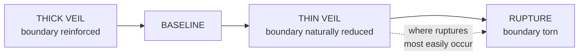

# The Veil

> The Veil is not a place. It is a condition — the state of being between planes, the moment of transition where the ordinary separation between matter, soul, and fate becomes navigable.

---

## Cosmological Classification

| **Type** | Liminal Interface / Inter-Planar Threshold |
|---|---|
| **Location** | The boundary layer between the Physical Plane, the Soul Plane, and the Plane of Fate |
| **Primary Governing Wellspring** | **Transference** · Spatium · Spatial Geometry |
| **Secondary Wellspring Associations** | **Somnalis** · Fluxia · **Oneirion**, **Eidolyn**, **Anamnesis**, **Tenebra** · Limina · **Mortalis** · Vitalia |
| **Note on the Houses** | Older registers file these under the Green Pulse, the Veil and the Black Gate. **Those Houses were sorted by feeling and do not map onto the eight Families**, which sort by Physics Domain. The House names remain in the Veil literature and are read as historical |
| **Governing Titan** | Sylorin, the Ferryman of Etherea |
| **Associated Spiritual Realms** | Etherea (Passage / Soulstream) · Virelion (Dream / Perception) |
| **Related Disciplines** | Transference Crossing · Mnemata · Harmonia · Animatria · Vocatia · Ritus |

---

## Definition

Reality is composed of three sovereign planes. The **Physical Plane** is matter and mana, the surface of existence, where form takes shape and bodies inhabit space. The **Soul Plane** is souls and spiritual energy, the stratum of continuity, where identity persists across strain, time, and the ordinary degradation of form. The **Plane of Fate** is spirits and Attraction Force, the deepest architecture, where recognition, destiny, and the lawful connections between all things are held.
The Veil is none of these.
The Veil is the threshold between them: the liminal membrane where one plane's law softens into another's, where the substance of matter thins enough to reveal the substance of souls, where the hum of spiritual energy bleeds through into audible frequency, where Attraction Force currents become perceptible to senses that normally register only form.
Every practitioner who has ever perceived a soul's resonance, entered a shared dreamspace, contacted an ancestral echo, felt a Wellspring's presence beneath the terrain, read an Attraction Force current through Harmonia, or sensed the weight of a Domain before seeing its effects has touched the Veil. They may not have named it. They may not have known they were standing at a threshold. But the perceptual shift they experienced was a Veil contact: a brief thinning of the boundary between the plane their body inhabits and the planes their soul and Attraction Layer reach into.
The formal term in Aetherica literature is the **Spiritual Stratum**. In practice, nearly everyone calls it the Veil, because the experience of encountering it feels less like entering a place and more like lifting a curtain that was always there.

---

## Structure

The Veil is not uniform. Its thickness, the degree of separation between planes at any given point, varies according to local metaphysical conditions. Understanding this variation is essential to every discipline that operates across planar boundaries.

### Thin Veil Zones

Locations where the boundary between planes is naturally reduced. The Physical Plane's material density is lower, the Soul Plane's spiritual energy is closer to the surface, and Attraction Force currents are more directly perceptible.
**Where they occur** · Near active Wellspring veins, where Wellspring processes create sustained channels between planes. Ancient ritual sites, where repeated Ritus workings have worn the boundary through use. Sacred groves and maintained Wellspring nodes, where Sage or Concordia practice has amplified local planar permeability. Sites of mass death or extreme emotional concentration, where the Soul Plane's preserving function has recorded events so intensely that the records push toward the surface. Dream Realm proximity points, where Virelion's influence softens material law into something more fluid.
**What changes** · Bifold Perception occurs spontaneously in practitioners of even moderate Temperance. Transference crossings require less Essence. Mnemata readings are sharper. Harmonia perception is clearer. Spiritual entities are closer to visibility. Dreams are more vivid and more prone to carrying genuine Wellspring content rather than mere subconscious noise.
> **The cost.** Thin Veil zones are where Veil ruptures most easily occur, where Echo Beasts most frequently manifest, and where unprotected mortal minds are most vulnerable to spiritual contamination, memory bleed, and involuntary Bifold Perception that can produce disorientation, hallucination, and in severe cases, **Soul Drift**.

### Thick Veil Zones

Locations where the boundary between planes is reinforced. Heavy material density, artificial Essence suppression (ward-networks, Silence Realm effects, anti-Harmonia fields), or natural geological features that insulate against spiritual energy all produce Thick Veil conditions.
Major cities, where overlapping ward-networks, alchemical residue, and competing Aether fields create dense metaphysical noise, tend toward Thick Veil despite (or because of) their high Essence traffic. The noise itself acts as insulation: so many competing signals that the Soul Plane's deeper frequencies are drowned out.
**What changes** · Transference crossings require significantly more Essence. Mnemata readings are muddy. Harmonia perception is degraded. Spiritual entities are invisible except to practitioners with deep Resonant Perception training. Dreams are shallow and rarely carry genuine Wellspring content.
> **The benefit.** Thick Veil zones are inherently safer for unprotected mortal populations. The reinforced boundary prevents accidental spiritual contact, involuntary Bifold Perception, and the ambient memory bleed that makes Thin Veil zones psychologically dangerous for prolonged habitation.

### Veil Ruptures

Points where the boundary between planes has been torn rather than thinned. Veil ruptures are not controlled crossings. They are structural failures in the inter-planar membrane, produced by catastrophic Essence events: Overcast Collapse, Phenomena-class discharges, failed high-order Ritus, Mechanica scarring, or the death of a World Spirit whose continuance was load-bearing for local planar stability.
Through a rupture, the planes do not interface. They collide. Soul Plane content floods into the Physical Plane without mediation. Physical Plane conditions contaminate the Soul Plane without filtering. Attraction Force currents from the Plane of Fate lose their usual depth and surface as raw, unprocessed causal pressure that warps local probability, memory, and identity.
- ****Echo Beasts** — what a rupture produces**
  Veil ruptures are the origin of Echo Beasts: entities formed when unresolved spiritual content (grief, guilt, unprocessed memory, abandoned vows, fragmented Essence Shards) passes through a rupture and condenses on the Physical Plane side.

  An Echo Beast is not a summoned creature or a natural spirit. It is a wound given form, a piece of the Soul Plane's unresolved content that has been forced into material existence by a structural failure it did not ask for.

  Echo Beasts behave according to the emotional content that formed them: grief-born Echo Beasts wander and weep, guilt-born Echo Beasts fixate on the location of the original transgression, rage-born Echo Beasts are violent and indiscriminate. None of them are conscious in any meaningful sense. They are echoes, not selves.
**Rupture containment** is among the most urgent applications of Concordia-level practice. Sealing a rupture requires realigning the planar boundary: restoring the Veil's thickness at the rupture point through sustained harmonic projection that re-establishes the separation between planes. This is Concordia work because it requires alignment of multiple Aether bodies and Wellspring processes into a coherent field capable of operating across planar boundaries simultaneously. **A single practitioner, regardless of Temperance, cannot seal a significant rupture alone.**

---

## The Veil as Soulstream Pathway

The Veil is also a medium of transit: the space through which souls, spiritual energy, and Essence move between planes during lawful crossing events.
**Sylorin**, the Ferryman of Etherea, governs the **Ethereal Flow**, the cosmic current that carries Essence between death and re-embodiment. This current runs through the Veil. It does not exist on any single plane. It exists in the threshold between them, using the Veil's liminal quality as a channel through which spiritual content can move without being subject to any single plane's laws.
A soul in the Soulstream is not on the Physical Plane (it has no body), not fully on the Soul Plane (it has not yet settled into the Soul Plane's preserving archive), and not anchored on the Plane of Fate (its Attraction Layer is in transit, its Spirit Axis temporarily dissolved). It is in the Veil: between, moving, awaiting arrival.
The **Transference** Wellspring governs lawful passage through this medium. Every **Veil Step** (short liminal crossing through a thin boundary), every **Essence Relay** (transfer of energy, memory, or consciousness between vessels), every **Echo Binding** (temporary stabilization of a fragmented spirit), and every **Soul Preservation** (holding dying Essence in harmonic stasis) operates within the Veil's liminal space. Transference practitioners do not enter the Soul Plane or the Plane of Fate. They enter the threshold between planes and perform their work in the space where the rules of all three planes are negotiable.
> This is why Transference sits in **Spatium** despite its association with death and passage, and why the old registers filed it under the Green Pulse and were not wrong about what it felt like. **Spatium is the physics of distance and position, and the physical reading of Transference is resonant energy transfer between coupled oscillators**: two systems tuned alike and held near exchange energy without a conductor between them, and the coupling falls off sharply with separation.
>
> Transference's core law — *"What must pass onward may remain itself through motion"* — is a law of continuity rather than of ending. **It teaches Essence how to survive transition.** The Veil is where that survival is tested: the space where identity must hold itself together while the laws that normally support it are temporarily absent.

---

## Access and Perception

| Mode | Temperance Gate | Principal risk |
|---|---|---|
| **Passive Veil Perception** | None — universal, unconscious | Uninterpretable somatic signal; unease without cause |
| **Involuntary Veil sensitivity** | Stage V · Splintering | Disorientation, hallucination, memory bleed |
| **Controlled Bifold Perception** | Stage VII · Refraction | Loss of coherence across two perceptual grammars |
| **Short deliberate crossings** | Stage VIII · Transcendence | Incremental Soul Drift |
| **Sustained Bifold operation** | Stage IX · Invocation | Identity degradation |
| **Sustained liminal operation** | Stage X · Realization | Accumulated Drift; the Physical Plane begins to feel thin |
| **Carrying others through crossings** | Stage XII · Emanation | Drift transferred to the carried as well as the carrier |

### Passive Veil Perception

Every Soul Crystal projects resonance patterns into the Veil as a byproduct of its normal operation. The Aether Shell's Resonant Tone, the Essence Core's emotional frequency, and the Attraction Layer's recognition hum all radiate outward through the Veil's liminal medium.
Most mortals cannot perceive these projections. Their Physical Plane senses register only form, not frequency. A mortal standing next to a Thin Veil zone might feel unease, heightened emotion, or the sense of being watched without understanding why: their body is registering Veil-adjacent phenomena through crude somatic channels (goosebumps, temperature shifts, instinctive alertness) because their Soul Crystal is detecting inter-planar signals that their conscious mind lacks the training to interpret.

### Active Veil Perception — Bifold Existence

Trained practitioners can achieve **Bifold Perception**: the deliberate simultaneous perception of the Physical Plane and the Soul Plane through the Veil's liminal medium. This is Transference at its most basic application and the gateway to all deeper Veil work.
Bifold Perception reveals what the Physical Plane normally obscures: the Resonant Tones of nearby Soul Crystals, the emotional weather stored in a location's Mnemata substrate, the presence of spiritual entities that exist primarily on the Soul Plane, the Echo Imprint Layer's recorded traces of past events, and the faint luminous tracery of Attraction Force currents connecting related presences.
The experience is disorienting for unprepared practitioners. The Physical Plane and the Soul Plane do not share the same visual grammar. Physical sight registers surfaces, edges, light, and shadow. Soul Plane perception registers frequency, emotional density, temporal depth, and relational topology. Layering both simultaneously produces a perceptual experience that the brain was not evolved to process: buildings overlaid with their emotional history, living people surrounded by the resonant haloes of their Traits, terrain annotated with the grief, prayer, and violence it has absorbed.

### Deliberate Veil Crossing

Full entry into the Veil's liminal space, beyond mere perception. The practitioner partially or fully enters the threshold between planes, their body remaining on the Physical Plane while their awareness, Essence circulation, and active Soul Crystal operation shift into the inter-planar medium.
**What deliberate crossing allows** · Direct interaction with Soulstream content (guiding spirits, stabilizing fragments, performing soul preservation). Access to spiritual Realm approaches — the paths leading toward Etherea, Virelion, and other Spiritual Realms are navigated through the Veil. Deep Mnemata reading, accessing historical echoes stored in the Soul Plane's preserving archive at a specific location. **Veil-thread tracing**, following Attraction Force currents through the Veil to their endpoints, a form of Resonant Tracking performed in the inter-planar medium rather than from the Physical Plane surface. And communication with entities that exist primarily on the Soul Plane or at the boundary between planes.
> **Soul Drift.** The condition in which a practitioner's awareness becomes more anchored to the Veil's liminal medium than to their Physical Plane body. Soul Drift is not immediate. It accumulates over repeated crossings. Each entry into the Veil loosens the practitioner's connection to Physical Plane sensation by a small increment. Each return requires the practitioner to re-establish connections that the Veil's liminal state had temporarily dissolved.
>
> Over time, the loosening accumulates. The Physical Plane begins to feel thin. The Veil's liminal depth begins to feel more real than the body it was supposed to support. A practitioner who crosses too often may stop recognizing the Physical Plane as home.
>
> The **Veil Pilgrims**, ethereal monks who never fully returned from repeated crossings, are the endpoint of this trajectory: entities patient enough to guide the lost but too thin to remember why they once wanted bodies.

---

---

---

---

## Practitioners and History

> *Merged from the Spellcraft conversion page, 2026-09-15. Unattested claims flagged.*
**Rikudoku Moto** carries the most striking tradition attached to the Veil: that he manipulated deep Veil layers to fracture spiritual continuity across battlefields, and that his soul was rumored to drift between folds even after death. The name is genuinely attested in current canon, named a philosophical ally on two other characters' sheets, but the wiki mirror flags him as needing re-identification before anything about him hardens into fact. The specific claim is kept here as an unverified tradition attributed to him, not as settled history.
**Eremund Vellsore**, credited with developing the first known method of Veil-thread weaving through song, and **the Bound Watchers**, Veil-bound entities said to sit at the outer edge of the Astral Fold in judgment over oaths and Temperance rituals, have no matching record anywhere in the wiki mirror. Both are kept because the account of who works the Veil and who judges its crossings reads thinner without them, and both are flagged **unattested in current canon**.
> **Card reconciliation note.** The old card's "Wellspring Realms" and "Utopia" are not carried forward here. Utopia is a real place in current canon (home to the Celestial Host, with its arbitration realm Midreach), but it is not attested as part of the Veil's connected architecture. The card's "Great Spirit War" is not attested as a named conflict, though Echo Beasts and Veil ruptures are confirmed canon. The card's "Spiritual Stratum" title is confirmed: the formal term in Aetherica literature for the Veil.
**Cross-references** · *The Eight Families & the Sixty Wellsprings* (Transference Family assignment, the retired Houses); *The Spirit Summoning Arts* and *The Harmonic Arts* (neighboring Disciplines operating through the Veil).
