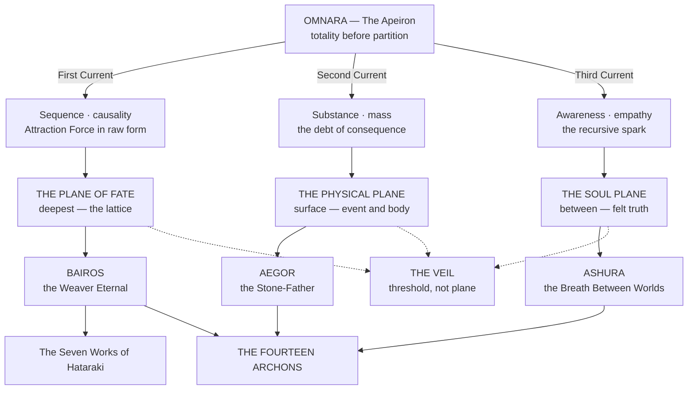

# Cosmology & Metaphysics

> Three planes, nested rather than stacked. Fourteen crowned ideas administering the principles that make the planes legible to each other. One threshold where the laws of all three become negotiable. And, running underneath the whole architecture, a count that was wrong by a factor near forty until somebody checked the ash.
> *"Reality is the shape that possibility chooses to wear for a little while. The Plane of Fate is the wardrobe."* — Fragment of the Lattice of Names

---

## The Architecture

Everything in this section descends from a single event that no surviving record explains. Before it there was **Omnara**, the state of totality before totality required compartments. After it there were three currents, and from the three currents three planes, and from the three planes three sovereign intelligences, and from the tension between those three the **Fourteen Archons** condensed into conceptual sovereignty.
The planes are nested, not stacked. The **Plane of Fate** lies deepest, the lattice upon which all possibility rests. The **Soul Plane** lies between, the stratum through which abstract law becomes a soul's felt truth. The **Physical Plane** sits at the surface, where truth becomes event, body, ruin, and mountain range. Wherever one plane's law borders another's, a transition zone must exist, and that transition zone is the **Veil**.

> **The hierarchy of law.** Titanic Law governs the geologic and cosmic architecture of the Realms. **Archonic Law** governs the conceptual forces that give physical and energetic phenomena their meaning. **Wellspring Law** governs the behaviour of Essence currents and Aether. All spells, Domains, Soul Crystal mutations, Wellspring Paths, and godlike abilities must draw from one of these three strata. No magic exists outside the lattice Omnara's Division created.

---

## The Count

The cosmological record and the historical record are two different conversations, and the Guild of Measurewrights has ruled formally that they are not to be reconciled with one another.
The **Epochs** are cosmological. Their durations survive in figures running to the tens and hundreds of thousands, and the Guild has examined every one of those figures and found that not one derives from a count. No calendar existed. No observer stood outside an Epoch to mark its passage. The **Ages** are historical, counted and attested by physical evidence, and the whole of them runs from Year −1,400 to the present.
A document giving both is giving a myth and a measurement, and expects the reader to know which is which.
> Every claim resting on antiquity is worth less than it was before the Concordance was sealed. A house that held title by right of thirty thousand years now holds it by right of six hundred. The title is not weaker in law. It is weaker in the only currency such claims actually trade in.

---

## The Registers

Three institutional voices produce the material in this section, and they do not sound alike. Reading them correctly means knowing which one is speaking.
| Register | Voice | Speaks to |
|---|---|---|
| **The Codex of Three Planes** | Liturgical and mythic. Divine Edicts quoted in the first person. Archivists naming the unnameable with visible reluctance. | Omnara, the Division, the Epochs, the Archons, Archonic Magic |
| **Aetherica literature** | Structural and clinical. Temperance gates, thickness gradients, failure modes stated as conditions rather than as omens. | The Veil, Bifold Perception, Soul Drift, rupture containment |
| **The Guild of Measurewrights** | Dry, adversarial, allergic to flattery. Records what the correction costs and declines to manufacture a mechanism it cannot evidence. | The Concordance, the Errata, the Four Ceilings |

---

## Entries

> **The reading order.** Ten documents. The path runs inward from the totality that broke, out to the beings that came of it, and then to the two corrections the Guild made to the record everyone had been reading.
>
> **1 · Omnara and the Division** — the totality before partition, and the event no surviving record explains.
> **2 · The Three Epochs** — the cosmological account. Myth, and known to be.
> **3 · The Fourteen Titans** — the geologic and cosmic architecture. Titanic Law, and the ground the Wellsprings pool in.
> **4 · The Fourteen Archons** — the crowned ideas administering the principles that make the planes legible to one another.
> **5 · The Veil** — the threshold running between all of it. **The single most cross-referenced page in the wiki.**
> **6 · The Celestial Host** — the beings Law folded in order to witness itself.
> **7 · The Crossing and the Making of the God Hand** — the one surviving account of what the far side looks like from inside.
> **8 · The Concordance of Ages** — the count, corrected. Read this before trusting any date anywhere in the wiki.
> **9 · Errata to the Received Registers** — what the correction cost, entry by entry.
> **10 · The Four Ceilings** — why the world's technology sits where it sits, and what removed the limits.
> **The two conversations.** The **Epochs** are cosmological: their durations run to the hundreds of thousands and not one of them derives from a count. The **Ages** are historical, attested by physical evidence, and run from Year −1,400 to the present. *A document giving both is giving a myth and a measurement, and expects the reader to know which is which.*
*The groupings below are the filing. The order above is the path.*

### I · The Architecture

The cosmological spine, in the order it was made: the totality before partition, the three intelligences that came out of its breaking, the ground they laid, the fourteen crowned ideas that administer the result, the threshold running between all of it, the beings Law folded in order to witness itself, and the one surviving account of what the far side looks like from inside.
- [Omnara and the Division](Cosmology & Metaphysics/Omnara and the Division.md)
- [The Three Epochs](Cosmology & Metaphysics/The Three Epochs.md)
- [The Fourteen Titans](Cosmology & Metaphysics/The Fourteen Titans.md)
- [The Fourteen Archons](Cosmology & Metaphysics/The Fourteen Archons.md)
- [The Veil](Cosmology & Metaphysics/The Veil.md)
- [The Celestial Host](Cosmology & Metaphysics/The Celestial Host.md)
- [The Crossing and the Making of the God Hand](Cosmology & Metaphysics/The Crossing and the Making of the God Hand.md)

### II · The Count

*The correction, what it cost, and what it explains. The Measurewrights speaking, and they do not sound like the other two registers.*
- [The Concordance of Ages](Cosmology & Metaphysics/The Concordance of Ages.md)
- [Errata to the Received Registers](Cosmology & Metaphysics/Errata to the Received Registers.md)
- [The Four Ceilings](Cosmology & Metaphysics/The Four Ceilings.md)
- [The Sky, the Hour and the Year](Cosmology & Metaphysics/The Sky, the Hour and the Year.md)
- [The Faiths of the Four Quarters](Cosmology & Metaphysics/The Faiths of the Four Quarters.md)
> **Time, and what people do about the owners.** Two additions sit under this section.
>
> **The Sky, the Hour and the Year** builds the setting's own sky and its own calendar. One sun, one moon whose cycle is exactly twenty-eight days so the month is never in dispute, five wanderers and a pole star, and a year of thirteen months and three hundred and sixty-four days. The day divides by **fourteen**, for the doctrinal reason the Sohai already gives. Seven unequal stations of light against seven of dark, with the Bow at the hinge, set against fourteen equal Guild hours pushed down the wire from Stannvaard. Eight times in thirteen years a nameless day is inserted that belongs to no Archon, and on it no Work falls due, nothing can be entered, no window opens and no instrument binds.
>
> **The Faiths of the Four Quarters** places Sohai and Sancta Lux against three others, two of which were already written without being called religions: the Dawi **Tally**, the Kharven **Sky**, and the originated **Current**, the folk Wellspring practice that is the largest faith by headcount and has no name for itself. Every entry answers the same six questions, and the last of them is what the faith is wrong about. Cults are handled separately, by how they recruit and how they eat.
