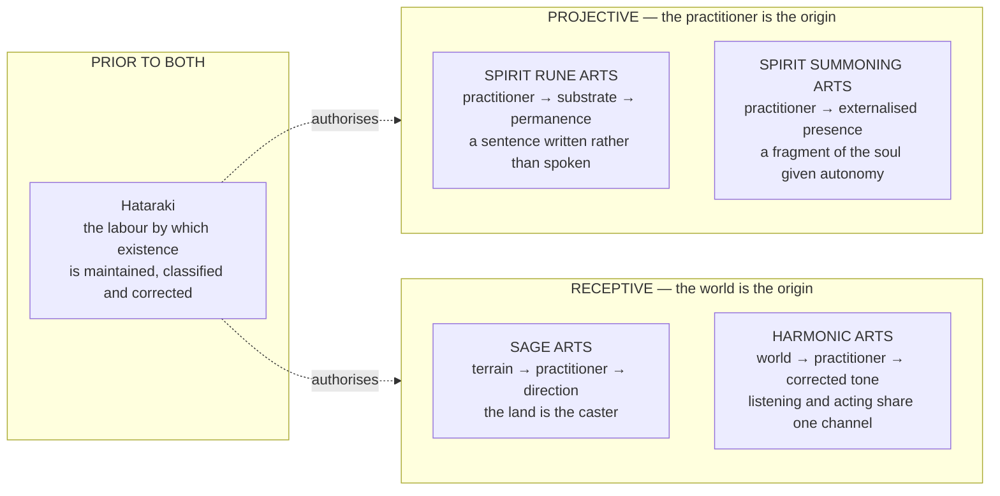

# The Disciplines

> The Families say what a working draws on. The Wellsprings say what law it obeys. The Disciplines say **what a practitioner is actually doing with their hands, their throat, their attention, and their soul** — and they differ from one another less in power than in the direction the force travels.
> *"The Family is the WHAT. The Method is the HOW. Where they intersect, you get the named discipline."*

---

## The Direction of Travel

Most magic in the Continuum is **projective**. A caster pushes Essence outward through the Aether Shell. An alchemist channels Wellspring law into a crucible. A Runesmith inscribes Parunic syntax into stone. A summoner fabricates constructs from donated Essence Core fragments. In each case the practitioner is the origin, and the world receives what they produce.
The disciplines below do not all agree on that arrangement.

---

## The Taxonomic Categories

Every named discipline in the Continuum decomposes into these categories. A discipline is rarely one of them. It is usually a braid of three or four, with an apex integration at the top that only the highest Temperance can hold together.
> **The table below is the working summary. The full taxonomy — twenty-six categories with alignment reasoning, failure modes and worked examples — lives here:**
>
> The Magical Categories — Unified Taxonom
>
> Eleven categories appeared on this page and twenty in the source taxonomy; the two have been merged there, and six further categories are proposed and flagged pending ruling. **Edit the taxonomy page. This table is a pointer.**
| Category | Alignment | What it governs |
|---|---|---|
| **Glyphica** | Spirit | The Parun-based language of law by which the Continuum recognizes and authorizes transformation. Spoken, gestured, inscribed, or internalized. |
| **Harmonia** | Spirit ↔ Attraction | Tone, vibration, and resonant frequency. A thought that stays internal is not Harmonia; a thought that becomes vibration and crosses the gap between two souls is. |
| **Vocatia** | Attraction | Invocation by recognition and correspondence. Not domination. The entity must answer because it recognizes the caller as lawfully compatible. |
| **Animatria** | Spirit | Eidolons, echo-forms, and psionic constructs fabricated from the practitioner's own Essence Core. |
| **Synergia** | Triadic | Emergent resonance from multiple souls, Wellsprings, or Domains interacting. Shared occupancy of the same Soul Plane region. |
| **Mnemata** | Spirit ↔ Attraction | Dream records, ancestral fields, temporal imprints, and historical echo-law. Memory stored as residual frequency rather than as narrative. |
| **Crystalia** | Body ↔ Spirit | The engineering, forging, and refinement of Soul Crystals themselves. |
| **Ritus** | Spirit | Ritual activation. Ceremonial, communal, and slow, and the ancestor of every field-capable discipline that later internalised what the circle used to externalise. |
| **Domain Weaving** | Attraction | Deliberate reshaping of local Continuum behaviour so that a chosen law becomes easier to sustain within a defined space. |
| **Arts** | Body | Spirit Forge techniques, Binding Arts, and Resonant Forms. The physical and material infrastructure through which the other categories are given a body. |
| **Aetherica** | Triadic Convergence | The measurement substrate. Frequency values, interaction patterns, standardized tonal profiles. |
| **Concordia** | Spirit ↔ Attraction **Apex** | Alignment of multiple Aether bodies, Wellsprings, and Domains into a single coherent field. Synergia and Harmonia scaled up and made durable rather than momentary. |

---

## The Four Glyph Roles

Every structured working, whether spoken once or carved into granite for a thousand years, must satisfy the same four roles. They are the grammar the Continuum reads.
| Role | What it tells the Continuum | What its absence produces |
|---|---|---|
| **Authorization** | Which Wellsprings are invoked, and that the practitioner is the lawful channel. Requires genuine harmonization; the Continuum reads the Attraction Layer at the moment of casting. | Mechanica by definition. Coerced transformation without lawful Wellspring participation. The Continuum treats it as debt. |
| **Boundary** | Where and how long the effect is permitted to operate. | A transformation without limits continues until it runs out of things to consume. |
| **Direction** | Vector and focus. The editorial layer of the Parunic sentence. | Draft Corruption. Law-fragments, Wellspring processes started but not completed, which keep trying to finish themselves in whatever they contact. |
| **Sealing** | That the sentence is finished, and closed against contamination and drift. Draws heavily on Fixatio chains. | An open wound in the local Aether field. The Continuum attempts to resolve the open syntax, sometimes by completing it in ways nobody intended. |

---

## The Metaphysical Pipeline

Every act of structured magic passes through five steps, whatever discipline is performing it.
| Step | Plane | What happens |
|---|---|---|
| **1 · Intent** (Volition) | — | The practitioner fixes the purpose. Guard. Strike. Scout. Heal. Carry. Witness. Intent shapes what the Essence Core will donate. |
| **2 · Pattern** (Glyphica) | — | The Crystal selects or improvises a Parunic Draft. All four Glyph Roles must be addressed, even if compressed into instinctive shorthand at high Temperance. |
| **3 · Essence Donation** | Soul Plane | The Core releases a shaped fragment of itself into the Shell. Essence Typology becomes visible here. |
| **4 · Aether Formation** | Physical Plane | The Shell conducts the fragment outward and gives it form. Aether Class determines how clean this step is. |
| **5 · Attraction Anchoring** | Plane of Fate | The Attraction Layer claims the working as a recognized presence. This is the step that grants **duration**. Without it, the form dissolves the instant concentration lapses. |

---

## Registers

The documents in this section do not share a voice, and reading them correctly means knowing which one is speaking.
| Register | Voice | Speaks to |
|---|---|---|
| **Aetherica codex** | Structural and clinical. Taxonomic classification, Temperance Gates, tiered progression, failure modes stated as conditions. | The Sage Arts, the Spirit Rune Arts, the Spirit Summoning Arts, the Harmonic Arts |
| **The Codex of Three Planes** | Liturgical. Function described as sacred labour; the Works named in the older tongue. | Hataraki |
| **Bara Moto's own hand** | Contemptuous, exact, and administrative. A founder addressing his descendants across an unmeasured gulf of time, largely to tell them where they are going wrong. | Moto no Gei |

---

## Entries

Read **Hataraki** first. Everything else in the Continuum is a way of performing a labour it already authorised.
The first five entries are the general disciplines, open in principle to any practitioner who can meet their Temperance Gates. The four that follow are **bloodline and personal arts** — the God Fist and the Binding Fate Eye descend through specific lineages and cannot be taught to anyone outside them; the Material Force is learned rather than inherited, but sits close enough to Zettai Aspect Sovereignty that the distinction has to be stated each time; and the Open Crucible belongs to one man and one ledger.

### The general disciplines and the bloodline arts

- [Hataraki — The Works of the Plane of Fate](The Disciplines/Hataraki — The Works of the Plane of Fate.md)
- [The Sage Arts](The Disciplines/The Sage Arts.md)
- [The Spirit Rune Arts](The Disciplines/The Spirit Rune Arts.md)
- [The Spirit Summoning Arts](The Disciplines/The Spirit Summoning Arts.md)
- [The Harmonic Arts](The Disciplines/The Harmonic Arts.md)
- [Kami no Kobushi — The God Fist](The Disciplines/Kami no Kobushi — The God Fist.md)
- [The Ketsumyōgan — The Binding Fate Eye](The Disciplines/The Ketsumyōgan — The Binding Fate Eye.md)
- [Matla](The Disciplines/Matla.md)
- [The Open Crucible — Kwon Mu-jin's Book of Summons](The Disciplines/The Open Crucible — Kwon Mu-jin's Book of Summons.md)

---

## The Practitioner Disciplines

These are the named arts a practitioner *trains*, as opposed to the labours the Continuum authorises. They are catalogued by Family and Method rather than by lineage, and every one of them is available in principle to anyone whose Crystal architecture and Temperance can carry it. **Talos is the single exception, and it is an exception of birth rather than of secrecy: the discipline cannot be taught, only expressed by a Crystal that was built for it.**
Three of them are not disciplines at all in the strict sense. **Moetana**, **Solution**, and **Asami** are *states* — what a Crystal does when its internal partitions come down. They are grouped here because a practitioner meets them the same way they meet everything else in this section: by going far enough into their own architecture to find them.
> **Read them in pairs.** Ainigma exists to defeat Solution. Nadi's per-strike arithmetic is the direct inverse of the Iron Bison's single compounded release. Moetana and Solution are two answers to one question about partitions, and Gisei is the third. **Recarvu and the Iron Bison both end in a body that cannot stop accumulating, by two entirely different routes.**
- [Ainigma — The Riddle Wearing a Face](The Disciplines/Ainigma — The Riddle Wearing a Face.md)
- [Ken — The Fist That Fights the Architecture](The Disciplines/Ken — The Fist That Fights the Architecture.md)
- [Talos — The Bronze That Empties the Room](The Disciplines/Talos — The Bronze That Empties the Room.md)
- [Nadi — The Art of Doing More Than Once](The Disciplines/Nadi — The Art of Doing More Than Once.md)
- [The Iron Bison — A Discipline of Internal Resonance](The Disciplines/The Iron Bison — A Discipline of Internal Resonance.md)
- [Recarvu — The Body That Builds Over What It Cannot Fix](The Disciplines/Recarvu — The Body That Builds Over What It Cannot Fix.md)
- [Rusashin — The Dust That Remembers What It Touched](The Disciplines/Rusashin — The Dust That Remembers What It Touched.md)

### The states

*Not disciplines in the strict sense. What a Crystal does when its internal partitions come down — and the three of them answer the same question three different ways.*
- [Moetana — The Vessel of Life's Essence](The Disciplines/Moetana — The Vessel of Life's Essence.md)
- [Solution — The Mind That Solves Itself](The Disciplines/Solution — The Mind That Solves Itself.md)
- [Asami and Gisei — The Two States of the Moto](The Disciplines/Asami and Gisei — The Two States of the Moto.md)
- [Techniques](The Disciplines/Techniques.md)
- [Spellcraft](The Disciplines/Spellcraft.md)

---
