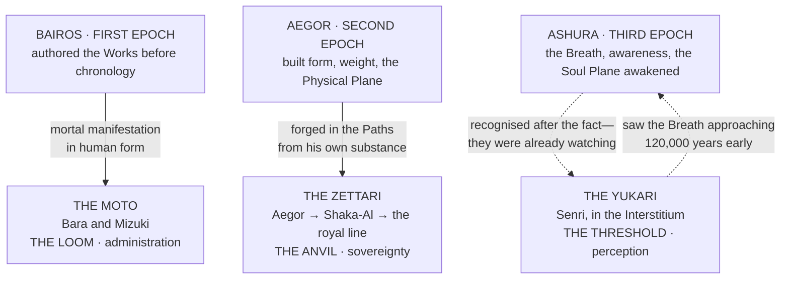

# The Archaic Bloodlines

> **Bairos wrote meaning. Aegor built form. Ashura remembered why.**
>
> The Moto carry the Scribe's mandate. The Zettari carry the Smith's endurance. The Yukari carry the Breath's awareness.
>
> **Thread, Weight, Breath. Purpose, Form, Meaning. Three Epochs. Three bloodlines. Three ways of holding reality together.**

---

## The Triune Equation

| Line | Inheritance | How the connection was made | The cost it carries |
|---|---|---|---|
| **The Moto** | The Shingan and Hataraki. **Lawful perception and lawful function** | **Contemporaneous.** Bairos selected them, marked them, and delegated authority within the same cosmic period | Every Work carries a corruption vector, and the house's own founder warned that **nothing becomes more monstrous, more quickly, than a righteous fool with correct metaphysics** |
| **The Zettari** | The Everlasting Eyes and Physical Plane authority. **The body as the first throne** | **Direct.** The Epoch shaped their bodies and their mandate from his own substance | Their bodies reach combat maturity faster than their emotional architecture. **Their greatest risk is not weakness. It is becoming powerful before they become wise** |
| **The Yukari** | The Ketsumyōgan. **Thread-sight across all three planes** | **Retroactive.** They existed 120,000 years before the Epoch that would have granted their sight. *Ashura did not create it. She recognised it, and she wept* | The Threadburn, and the founding fact that **the seeing began killing him the moment it started** |

---

## What the Three Have in Common

**None of them is a noble house.** All three predate every crown currently sitting, and all three hold an inheritance that a crown cannot confer and a coil cannot fully measure. This is the specific fact that makes them politically dangerous: **the Accord's whole legitimacy rests on measurement recognising no bloodline, and these are the bloodlines the measurement cannot fully account for.**
> And all three inheritances are **perceptual before they are martial.** The Shingan determines what layer of reality the bearer can see. The Everlasting Eyes reveal where the body, soul and Aether system can be broken. The Ketsumyōgan reads the connective tissue between planes.
>
> **Three archaic bloodlines, and every one of them is fundamentally an eye.**

---

## The Quarrel That Has Never Closed

The oldest inter-house tension in mortal history is between the Moto and the Yukari, and it **predates the Third Epoch by 160,000 years.**
> **The Moto see the threads as property.** The Loom is theirs. Bairos delegated it. Their administrative mandate gives them jurisdiction over the Plane of Fate's architecture, **and that jurisdiction extends to the perception of it.**
>
> *No one should see the threads except those authorized to see them, and authorization flows from Bairos through the Moto and nowhere else.*
> **The Yukari see the threads as reality.** Not property. Not jurisdiction. The connective tissue of everything that exists.
>
> *To claim ownership of the threads is, in the Yukari tradition, like claiming ownership of gravity: a statement that reveals more about the claimant's need for control than about the nature of the thing being claimed.*
> The Moto fear the Yukari **the way a government fears a free press**: not because the press can overthrow the government, but because the press can see what the government is doing, **and the seeing itself is an uncontrollable form of power.**
The Zettari sit outside that quarrel entirely. Their response to the Yukari has been consistent across every era: **not friendship, not alliance — respect**, in the Zettari sense. *The acknowledgment that another being's function is lawful, useful, and complementary to one's own, and that the being who performs it deserves to be left alone to perform it.*
> When a Zettari meets a Yukari, the response is typically a nod. **Not a bow. Not a salute. A nod.**
- [The Moto Bloodline](The Archaic Bloodlines/The Moto Bloodline.md)
- [The Yukari Bloodline](The Archaic Bloodlines/The Yukari Bloodline.md)
- [The Zettari](The Archaic Bloodlines/The Zettari.md)
- [The Yuno Bloodline](The Archaic Bloodlines/The Yuno Bloodline.md)
- [The Mahuo Family](The Archaic Bloodlines/The Mahuo Family.md)
