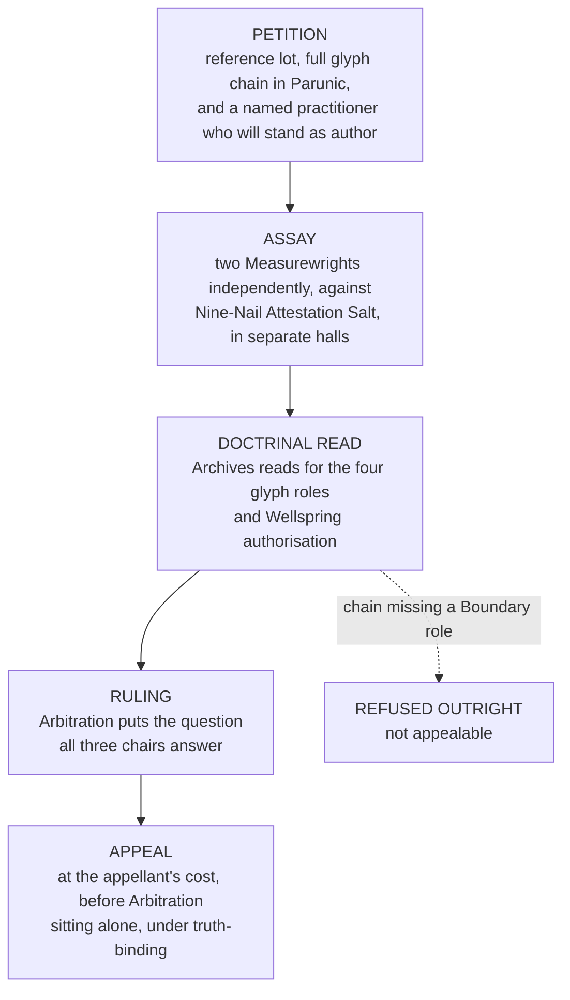

# The Bench of Attribution

*Procedure, Precedent, and the Record of Strikings*
> Issued jointly by the Research and Archives Division, the Guild of Measurewrights, and the Arbitration Division. Companion to *The Provenance Doctrine* and *the Standing Index.*
> *"The law does not govern from above. It resonates from within."*
>
> Carved over the gate of every Guild Hall, **and over the door of the Bench, where it is understood to be a joke.**

---

## What the Bench Is

The Bench of Attribution **is not a Division and has never been one.** It is a standing joint instrument of three Divisions that could not agree to give the function to any one of them, **and its entire procedure is the machinery of that disagreement operating at scale.**
It rules on what a formula is, whether it may lawfully exist in commerce, what class of material a given lot actually contains, and who is permitted to hold the result.
> Those four questions govern the alchemical economy, and the alchemical economy governs everything the Crown does not own outright.
>
> The Bench is therefore **the most consequential body in the four quarters and the only one with no seat on the Concord Council** — which is not an oversight, and has been proposed for correction eleven times.

### The three chairs

| Chair | Question | Its position |
|---|---|---|
| **Doctrine** *Research and Archives* | Whether the glyph chain constitutes lawful Parunic syntax. Whether Authorization, Boundary, Direction and Sealing are properly filled. **Whether the Wellspring invoked would recognise the invoker as an authorized channel** | That attribution is fundamentally a question of **law**, and the instrument is a convenience of the modern era |
| **Instrument** *The Measurewrights* | What the coil reads. Class, Fidelity, Carry, and the reference figures against which every subsequent lot in the world is measured | That attribution is fundamentally a question of **measurement**, and doctrine is what a party appeals to when the needle has disagreed with them |
| **Ruling** *Arbitration* | The Attribution is an adjudication. Enforceable, appealable at the appellant's cost, backed by Enforcement | That attribution is fundamentally a question of **who can be sued** — and Arbitration is the only chair that has ever stated its position aloud, in session, on the record, **and declined to withdraw it** |

> **A session requires all three. Two chairs cannot rule.**
>
> This has produced four documented deadlocks lasting longer than a year, **one of which is ongoing** — and the ongoing one concerns a formula that **eleven thousand people are currently taking.**

---

## The Four Powers

### Entry

A formula is written into the **Standing Index.** It may thereafter be lawfully rendered, sold, taught, priced, insured, and pledged as security against a debt.
**Nothing in the alchemical economy exists commercially until it is entered.** An unentered formula is not illegal in most quarters. It is simply outside every instrument the economy uses to hold a transaction together — **which in practice is worse than illegal, because a thing that cannot be insured cannot be shipped and a thing that cannot be pledged cannot be financed.**
Entry requires a petition, a reference lot, an assay against Nine-Nail Attestation Salt, a doctrinal read, and **a Fidelity reference figure the Measurewrights are prepared to stand behind for as long as the formula remains in the Index.** *The last of those is the expensive part and the reason petitions from small houses fail.*

### Striking

A formula is removed. **Every unit of stock produced under it becomes unlawful holding at the moment of publication.** Holders have forty days to surrender, after which Enforcement's interest becomes a matter of Concord Writ rather than of paperwork.
Grounds are three: **doctrinal error** discovered after entry, **a reference figure** that later assay cannot reproduce, and **material harm** demonstrated in the field. *The third is the one the public understands and the least used.*
> **What a Striking actually costs.** Consider a Threshold formula that a poor eastern district has tempered its practitioners on for six generations, struck because the rendering house cannot produce a clean provenance chain **for stock it has been buying honestly from people who did not keep records.**
>
> It costs the Bench a session and a seal. **It costs the district a generation that does not advance.**
>
> No shafts are flooded, no walls come down. The district's practitioners simply reach the quantitative floor of their Stage and sit at it, and their children inherit a place with no certified practitioners in it, and **inside forty years the district buys its wards from somewhere else at somebody else's price.**
>
> **The Legion has never taken a district this cheaply. The Legion is aware of this.**

### Attribution of lineage

The Bench rules what **Provenance Class** a lot actually contains, on assay, **without regard to the seller's warranty.**
**This is where the money lives.** A house that has bought against a Class V warranty and receives a Class III ruling **has been ruined in a sentence.** Roughly forty such rulings issue in a year, *and the Bench issues them without visible discomfort.*
> The Attribution names the class. **It does not name the source.**
>
> Archives has proposed individual source attribution on the seal in three compilations and Arbitration has opposed it in three, on the stated grounds that individual attribution **would give every Class IV holding a standing claimant among the source's surviving family**, and that the resulting caseload would exceed the Division's capacity inside a year.
>
> Which is true. **It is also the clearest statement anyone in the Accord has ever committed to writing about the actual size of the Class IV trade.**

#### Source-blindness, and what it lets through

The Attribution is **blind to source by design**, and the design is defensible on every ground the Bench has ever cited. It is also the reason the Class IV shortfall is bankable.
**Crystal Draw produced by extraction and by engine work is indistinguishable on the coil from lawfully rendered stock**, because the process was the same process performed without a warrant. It therefore passes Attribution cleanly, receives a Class IV seal, and enters commerce insured, pledgeable and financed. *The seal is honest. It reports what the lot contains. It has never claimed to report where the lot came from and nobody has ever asked it to.*
> **The gap in the procedure is one instrument wide.** Entry requires two independent assays against Nine-Nail Attestation Salt, in separate halls, by two Measurewrights. **Both are coil assays.**
>
> A coil reads Holding. A gauge reads density. **On stock taken out of an unsealed operation the two will not reconcile, and the discrepancy is the size of what was taken.** The comparison is trivial, the reagents are already in the Index, and **the procedure has never required the second reading.**
>
> *Archives has not proposed it. The Measurewrights have not proposed it. Arbitration would have to hear what came back.*

### Reservation

A formula may be entered **and simultaneously reserved**: lawful, real, indexed, and forbidden to any practitioner below a stated Tier.
> Reservation is **the most-used power and the one nobody writes treatises about**, because it denies nothing to anyone. **It merely arranges who is permitted to be capable.**
>
> Twenty-two of the forty-five entries in the current public Index carry a reservation, **and the reservations cluster with perfect regularity at exactly the Tier at which a practitioner becomes useful to the Accord and not before.**

---

## Session Procedure

*The last petition requirement — a named practitioner who will stand as the formula's author — is why a great many formulas in general use are not entered. Somebody has to put their name on it.*
Disagreement between the two assays beyond tolerance sends the lot back **and is recorded.** *A house whose lots repeatedly disagree acquires a reputation the Index does not print and every buyer knows.*
> A chain missing a **Boundary role** is refused outright without further consideration, and the refusal is not appealable, and **this is the single rule in the entire procedure that has never been challenged in six centuries.**
>
> Everyone in the trade has seen what a working without limits does **when it runs out of the material it was given and starts on the material it was not.**
**Unanimity is not required.** Two chairs may carry a ruling where the third dissents, and the dissent is entered in full — which is the mechanism by which the Measurewrights' objection to the Class VI grading practice has appeared in every compilation since the first **and been overruled in every compilation since the first.**
*Fourteen appeals have succeeded. Nine hundred and something have not, and the Division stopped publishing the denominator in Year 680 on the stated grounds that it was discouraging legitimate appeals.*

---

## The Record of Strikings

*One hundred and forty-one formulas struck in the last century. The following are the ones instructors are expected to know.*
| Year | Striking |
|---|---|
| **631** | **The Ninefold Suture** · A Vitalia binding compound in general use in field infirmaries for two centuries. Struck on doctrinal grounds after a reread found the Sealing role carried by a glyph **that had drifted in meaning since entry.** The Measurewrights recorded that the compound **had never once failed in the field** and that the Striking was doctrinally correct, *and entered both statements in the same paragraph* |
| **654** | **The Fourth Bench session** · Sealed. The formula struck is not named in the public Index. **Its existence is inferable only from a gap in the numbering** and from the fact that the Standing Index carries a product named for the session and does not explain the name |
| **668** | **Whitethroat Draught** · Struck on demonstrated harm after **eleven deaths in the goblinoid workshops of the Expanse.** The workshops had reported the failure mode themselves, in writing, **four years earlier**, and the report is in the Archives with a clerk's endorsement on it **and no action attached** |
| **691** | **Threshold Reversal Draught** · Struck on demonstrated harm. Retained in the Index for identification so field officers can recognise the product. Nine seizures since, all eastern, **and Enforcement's own assessment is that the seizures represent a small fraction of circulation** |
| **703** | **The Withdrawn Draught** · Struck, records sealed. A T8 entry with nothing in it, carried in the public Index as a name, a tier, and the word *withheld* repeated eleven times. **The shape of the row is the only public evidence that the session occurred** |
| **714** | **Four petitions concerning Stage VI** · Four houses in three quarters petitioned within eighteen months to enter formulas claimed to supply **the Glory Catalyst.** All four were refused at doctrinal read. The Bench's published reasoning is one sentence long and states that **a Catalyst is not a property of matter.** *What the four houses had actually built, and what happened to the practitioners they built it on, is not in the public record.* **The sentence is mechanically correct and the Bench does not appear to know why it is correct.** A Threshold product supplies the melt with a seed, and a seed is a law the subject survived into existence. *Matter can carry a seed. It cannot supply the surviving* |

### The standing dissent of the Measurewrights

The Guild has reviewed the assay basis of all one hundred and forty-one Strikings and finds the instrument work sound in one hundred and thirty-nine — **a better record than the Guild expected and a worse thing to have to report than it appears.**
> The Guild further records that of the one hundred and forty-one:
>
> **Ninety-six originated east of the Ring or in goblinoid workshops.**
>
> **None originated in a house holding a standing supply contract with a Concord Division.**
>
> **The Bench has never in its history struck a formula upon which a Division's own operations depend.**
>
> The Guild offers no explanation for the distribution and endorses none of the four that have been offered to it. The Guild's position is that the instrument is honest, that the Guild will continue to say what the needle says, **and that where the needle and the ruling agree it does not follow that the ruling was made because of the needle.**

---

## Crown and Bench

The Crown holds the land, the law, the levy, the tax and the right to hang. The Accord holds the assay, the rank, the credit, the writ and the arrays. Neither can abolish the other and both have costed it.
> **The Bench is where that arrangement is actually administered, and it is administered by not being discussed.**
>
> A crown that quarrels with the Bench does not lose a war. **It loses entry on the formulas its own arsenals are built around** — quietly, over two or three sittings, on grounds that are every time doctrinally impeccable.
Two crowns have tried. One withdrew the quarrel. **The other is Kaetran**, and the Kaetran arsenals are still supplied, and the terms on which they are supplied are not published, **and the Bench's Kaetran rulings since have been notably swift and notably favourable** — and the Measurewrights have entered a note observing this **and have not been asked to remove it.**
