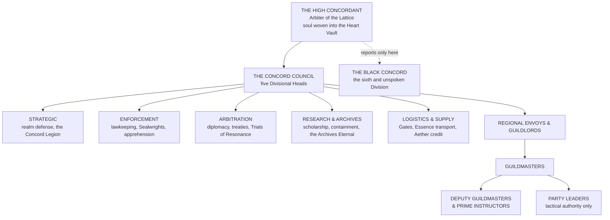

# The Guild Accord

*A Codex of Law, Rank, and Resonance* · filed under the Concord Codex, Supreme Treaty of All Wellspring Practitioners
> *"To temper the soul is to preserve the world."*

---

## Preamble — The Nature of the Accord

The Guild Accord is the supreme coalition of guilds, academies, and Orders united beneath the **Concord Codex** — a metaphysical treaty binding every Wellspring practitioner to law. Each oath sworn, each commission fulfilled, each judgment rendered echoes through the **Concord Lattice**: a living web of Essence signatures that records every deed, every betrayal, every act of mercy in harmonic permanence.
> Membership is not merely political. **It is spiritual.** To join the Accord is to offer a fragment of one's Soul Crystal to the Lattice, forever binding one's Essence to the Codex's truth.
>
> **The Crystal remembers what the mind forgets. The Lattice preserves what time would erode.**
>
> Through this covenant, the Realms endure.
> **Read the Modern Era page first.** The covenant below is unchanged and so are the Divisions, the Tiered Path, the Commission Classes and the Black Concord. What has changed is the **register**: Lattice terminals, projected sigils, Aether credits and echo marks are rendered in the Draw Age as **the board, seal colours struck in wax, draughts and letters of credit, and entries in ink.** Nothing metaphysical is lost. The Lattice still records. It is not a screen, and nobody in the four quarters has ever seen a number floating in the air.
>
> The Modern Era page also carries what this codex never had: **where the Accord actually reaches**, the Divisions as rivals rather than colleagues, the politics of the High Concordant, the company and academy structures beneath the Guildmasters, and the great offices.

---

## Structure of Authority

> *"The law does not govern from above. It resonates from within."*

> **The High Concordant.** Supreme Head, and the living voice of the Codex. Their soul is woven directly into the **Heart Vault**, the Wellspring Core at the centre of the Concord Citadel, and their breath sustains the Lattice's glow across every realm.
>
> **Should the High Concordant perish without succession, the Vault stills, and the Guild Accord collapses.**
| Division | Authority |
|---|---|
| **Strategic** | Realm defense, military coordination, cross-realm warfare, Gate logistics. Commands the Concord Legion |
| **Enforcement** | Lawkeeping, Sealwright deployment, Wellspring policing, apprehension of Codex violators. **Its High Warden's presence in a realm constitutes martial law** |
| **Arbitration** | Diplomacy, treaty enforcement, mediation between nations, adjudication of Trials of Resonance |
| **Research & Archives** | Magical scholarship, Codex preservation, artifact containment, stewardship of the Archives Eternal |
| **Logistics & Supply** | Gate travel coordination, Essence transport, Aether credit distribution, global supply infrastructure |
| **The Black Concord** | *The sixth and unspoken Division. Reports only to the High Concordant. Its existence is not acknowledged in the public Codex* |

**Regional Envoys** supervise all Accord activity within a realm or kingdom. **Guildlords** hold equivalent authority over specific territories or cultural regions, appointed to maintain harmonic stability where formal guild infrastructure is sparse. **Guildmasters** command individual guilds and academies; a Guildmaster's authority is absolute within their hall **but subordinate to Envoy directives.** **Party Leaders** are field commanders — not Guildmasters, and answerable to them. *A Party Leader's authority extends only to tactical execution; strategic decisions remain with their commanding Guildmaster or Envoy.*

---

## The Commission Framework

> *"Duty is the crucible. The soul is the metal. The Lattice remembers what emerges."*
Every sanctioned mission is classified by two axes: its **Threat Tier** (T1–T9), corresponding to the practitioner rank required, and its **Commission Class**, defining the operation's purpose. A Tier represents existential danger and Essence volatility; the corresponding Temperance Grade reflects **the minimum spiritual stability demanded of participants.**
Commissions are the primary mechanism of advancement. Each completed mission deepens the harmonic resonance engraved upon the Soul Crystal, and the Lattice records these **echo marks** as permanent proof of service.

### The five classes

| Class | Purpose |
|---|---|
| **Reconnaissance** | Mapping, scouting, Essence anomaly study, threat assessment |
| **Containment** | Wellspring stabilization, sealing, purification, corruption quarantine |
| **Retrieval** | Artifact recovery, relic salvage, spirit reclamation, asset extraction |
| **Arbitration** | Political or spiritual mediation between factions, nations, or divine entities |
| **Extermination** | Combat elimination of hostile entities, corrupted practitioners, or destabilized Domains |

### How a Commission moves

**Submission** · Civilians, scholars, or officials file at the nearest Guild Hall. **Validation** · Arbitration examines the request for legality, Essence risk, and moral justification. **Classification** · Threat Tier and Class assigned, then etched into the Lattice as a glyphic record. **Acceptance** · A party signs via Essence mark, **binding their resonance to the mission record.** **Completion** · Verified through scry-glyph or field report; the Lattice distributes echo marks. **Reward** · Aether credits, relics, or Temperance merit marks scaled to Tier.
| Sigil | Tier | Meaning |
|---|---|---|
| **Green Sigil** | T1–T3 | Open field missions |
| **Blue Sigil** | T4–T5 | Multi-party coordination |
| **Gold Sigil** | T6–T7 | Council-sanctioned mandates |
| **Obsidian Seal** | T8–T9 | **Black Concord orders. Classified** |

### Field protocols

Party Leaders hold full tactical authority but remain **metaphysically accountable** to their Guildmaster. Every decision made under a Commission's banner is recorded in the Lattice, and deviations from sanctioned parameters **trigger automatic review.**
**Cross-guild teams** must declare a Primary Commanding Party — resonance overlap between multiple guild signatures causes harmonic interference if chain of command is ambiguous. **Failure clauses:** if a Commission collapses or violates Codex Law, Enforcement intervenes immediately and survivors are brought before Arbitration. **Essence Resonance Checks are mandatory post-mission** — prolonged Wellspring exposure without cleansing destabilizes the Soul Crystal and is punishable under the Law of Stability.

---

## The Culture of Duty

Every Concord agent, from the lowest courier to the Chosen of the Codex, abides by a single maxim carved into every Guild Hall gate across every realm.
> 
> > **Balance before Dominion.**
>
> To wield Essence is to bear law. To complete a Commission is to feed the Lattice. **The Accord does not celebrate conquest; it celebrates restraint.** Not the accumulation of power, but its measured application toward the preservation of equilibrium.
>
> Practitioners are taught from their first day as Initiates that the Tiered Path is **not a ladder of ambition but a deepening of responsibility.** Each rank gained is another weight upon the scale. Each Wellspring defended is another thread woven into the fabric that holds reality together.

---

## The Codex in Full

The ranks and what they cost. The currency of remembrance and the nine ways a soul is unmade. The Division that is not named. The network that carries everything. The army bound by resonance rather than nationality. And the city that is not a city.
> **The Modern Era page** is the newest and the one to open first if you are writing a scene rather than checking a rank.
>
> **Reach.** Strongest in the New World, chartered from nothing so that the Accord is not one jurisdiction among several but *the* jurisdiction; strongest in the island nations, which cannot survive exclusion for a season; strong across the Inner World; weak throughout the Old World. And the practical seam is the conduit, because the Accord's reach ends where the wire ends, so **every district the Withering cuts is a district the Accord quietly stops governing.**
>
> **The Concordant cannot leave the Citadel.** Everything reaches them through five Divisional Heads who each decide what is worth carrying up, so the office is not exercised, it is curated. And because an unsucceeded death stills the Vault, the Council will accept almost any nominee rather than risk a gap, which means the contest happens entirely before the death.
>
> **Companies, academies and offices.** Master, Wardens and a self-appointing Court of Assistants; apprentice, freeman and liveryman, with entry to the freedom by patrimony, servitude or redemption. Academies teach and examine, societies elect and cannot be bought. And **an adventurer is somebody who ventures capital**, so a Commission is a venture with subscribers and shares, not a job with wages.
- [The Guild Accord in the Modern Era — Divisions, Companies, Academies and Offices](The Guild Accord/The Guild Accord in the Modern Era — Divisions, Companies, Academies and Offices.md)
- [The Tiered Path](The Guild Accord/The Tiered Path.md)
- [Merit and Severance](The Guild Accord/Merit and Severance.md)
- [The Black Concord](The Guild Accord/The Black Concord.md)
- [The Concord Gate Network](The Guild Accord/The Concord Gate Network.md)
- [The Concord Military](The Guild Accord/The Concord Military.md)
- [The Concord Citadel](The Guild Accord/The Concord Citadel.md)
- [The Practitioner Problem](The Guild Accord/The Practitioner Problem.md)
