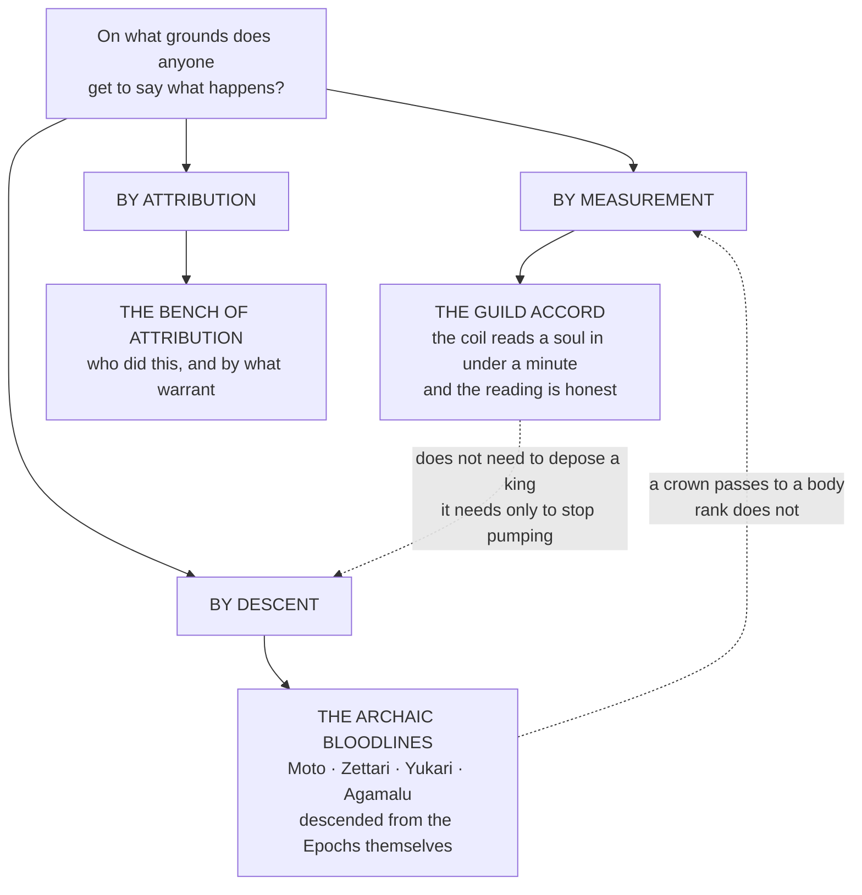

# Factions, Bloodlines & Institutions

> Two systems of legitimacy occupy the same ground and neither can abolish the other. **The Crown holds** the land, the law, the levy, and the right to hang, legitimate by descent. **The Accord holds** the assay, the rank, the credit, the writ, and the arrays, legitimate by measurement.
>
> *Neither side says this out loud. Both sides have costed it.*
> *"Balance before Dominion."* — carved into every Guild Hall gate across every realm

---

## The Argument This Section Is About

Every institution in the four quarters is an answer to one question: **on what grounds does anyone get to say what happens.**

| Institution | Its claim | Its vulnerability |
|---|---|---|
| **The Guild Accord** | Legitimacy by measurement. It recognises no bloodline, honours rank in every member polity, and issues the only portable legal identity most people will ever hold | It is a bureaucracy that compresses what it administers, and **it has a sixth Division whose existence the public Codex does not acknowledge** |
| **The archaic bloodlines** | Legitimacy by descent, and the descent is not metaphorical — three of them trace to the three Epochs directly | A crown passes to a body. **A kingdom whose heir assays weak has a strategic problem no amount of ancestry solves** |
| **The third parties** | Sancta Lux, the Bench of Attribution, and the Paths each claim an authority that answers to neither crown nor coil | Being answerable to no one is only an advantage until somebody asks who audits you |

---

## The Registers

| Register | Voice |
|---|---|
| **The Concord Codex** | Statutory and liturgical at once. Articles numbered, laws named, every section closing on an engraving with a date attached. It is a legal instrument that believes it is scripture, **and it is not entirely wrong** |
| **The bloodline codices** | Inheritance documents. Written by lineages about themselves, for their own descendants, with the specific unreliability that implies |
| **Restricted Article XII** | The Black Concord's own record, which exists to be burned. *If this record is read, you were meant to* |

---

## Entries

**The Guild Accord** carries the structure of authority, the Commission framework, and the culture of duty, with seven pages beneath it: the Tiered Path, Merit and Severance, the Black Concord, the Gate Network, the Military Divisions, the Citadel, and the Practitioner Problem.
**Sancta Lux** is the order that does not worship and says so in the first line of its own catechism. **The Bench of Attribution** is the most consequential body in the four quarters and the only one with no seat on the Concord Council.
**The Archaic Bloodlines** carries the Moto, the Zettari with the Paths beneath them, the Yukari, and the Agamalu — three Epochs, three inheritances, and a fourth house that inherited the harder portion.
**The Powers of the Imperial Age** sets the crowns, the great houses, the orders, the guilds and the chartered companies side by side: what each wants, what it holds, how it fights, who it is set against, and where the three layers of rule meet and quarrel.

### Authority by measurement, descent and attribution

- [The Guild Accord](Factions, Bloodlines & Institutions/The Guild Accord.md)
- [The Bench of Attribution](Factions, Bloodlines & Institutions/The Bench of Attribution.md)
- [The Archaic Bloodlines](Factions, Bloodlines & Institutions/The Archaic Bloodlines.md)

### Authority by doctrine

*Two bodies claim a warrant that answers to neither crown nor coil, and they are in open doctrinal conflict with each other.*
**Sancta Lux** is the order that does not worship and says so in the first line of its own catechism. **Sōhai**, the Moto True High Religion, holds that **consulting one reference exclusively for four millennia is a devotion whether or not anyone kneels**, and calls the Scale the largest **Singling** in the history of the Realms.
> **Read the two together or neither.** The charge and the answer are both recorded on the Sōhai page, in the order's own words, **because the argument is genuine and neither side is being stupid.**
>
> *No arbitration exists, and none can, because the only body with standing to arbitrate is one of the two parties.*
- [Sancta Lux](Factions, Bloodlines & Institutions/Sancta Lux.md)
- [Sōhai — The Whole Bow](Factions, Bloodlines & Institutions/Sōhai — The Whole Bow.md)
- [The Eight Great Houses of Kushara](Factions, Bloodlines & Institutions/The Eight Great Houses of Kushara.md)
- [The Ten Great Houses of Drakyssia](Factions, Bloodlines & Institutions/The Ten Great Houses of Drakyssia.md)
- [The Banner Houses of Kharven](Factions, Bloodlines & Institutions/The Banner Houses of Kharven.md)
- [The Void Vanguard](Factions, Bloodlines & Institutions/The Void Vanguard.md)
- [The Articles of the Accord, and the Kinds of Polity](Factions, Bloodlines & Institutions/The Articles of the Accord, and the Kinds of Polity.md)
> **The law, in articles.** **The Articles of the Accord, and the Kinds of Polity** gives the actual text: twenty-eight numbered articles across six titles, each with its register name, its plain name, and its penalty.
> 
> The Accord is a **jurisdiction, not a sovereign.** It holds no territory, keeps no army, and cannot hang anybody. Its sanction is exclusion, and its power is that its courts are faster and more predictable than anything else on the road. **The dusty foot** — a traveller's plea heard and determined before the market closes — is the single rule that built the whole system.
> 
> Article XV is the one to know: **the speaking is not licensed and the Accord has never found a way to license it**, because a spoken working has no author in its own grammar. The Bench spent four hundred years trying to place a mouth at a scene and then legislated around it. Liability falls on whoever paid.
> 
> The second half sets out the seven forms of polity the Accord has to reach across, from the composite monarchy of the Concord to Stannvaard's oligarchic republic, the Mandate's standing decree, the Keth-Gorrum's sealed parliament, Iampu's rotating crown, the Echo Elf confederation and Eresse's calendrical principality. **And Kharven, which sits outside the typology entirely** and never asked the Accord for an instrument until the first circle was signed in its own lower hall.
> 
> **Companion piece.** *The Guild Accord in the Modern Era*, under the Guild Accord page, covers the institution rather than its law: where its reach actually ends, the Divisions as rivals, the politics of the High Concordant, the company and academy structures, and the great offices. It also supersedes the old Accord register — no terminals, no projected sigils, no floating numbers.
>
> The Accord is a **jurisdiction, not a sovereign.** It holds no territory, keeps no army, and cannot hang anybody. Its sanction is exclusion, and its power is that its courts are faster and more predictable than anything else on the road. **The dusty foot** — a traveller's plea heard and determined before the market closes — is the single rule that built the whole system.
>
> Article XV is the one to know: **the speaking is not licensed and the Accord has never found a way to license it**, because a spoken working has no author in its own grammar. The Bench spent four hundred years trying to place a mouth at a scene and then legislated around it. Liability falls on whoever paid.
>
> The second half sets out the seven forms of polity the Accord has to reach across, from the composite monarchy of the Concord to Stannvaard's oligarchic republic, the Mandate's standing decree, the Keth-Gorrum's sealed parliament, Iampu's rotating crown, the Echo Elf confederation and Eresse's calendrical principality. **And Kharven, which sits outside the typology entirely** and has never asked the Accord for an instrument.
>
> **Companion piece.** *The Guild Accord in the Modern Era*, under the Guild Accord page, covers the institution rather than its law: where its reach actually ends, the Divisions as rivals, the politics of the High Concordant, the company and academy structures, and the great offices. It also supersedes the old Accord register — no terminals, no projected sigils, no floating numbers.
- [The Holy Inquisition](Factions, Bloodlines & Institutions/The Holy Inquisition.md)
- [The Powers of the Imperial Age](Factions, Bloodlines & Institutions/The Powers of the Imperial Age.md)
- [The Mother](Factions, Bloodlines & Institutions/The Mother.md)
