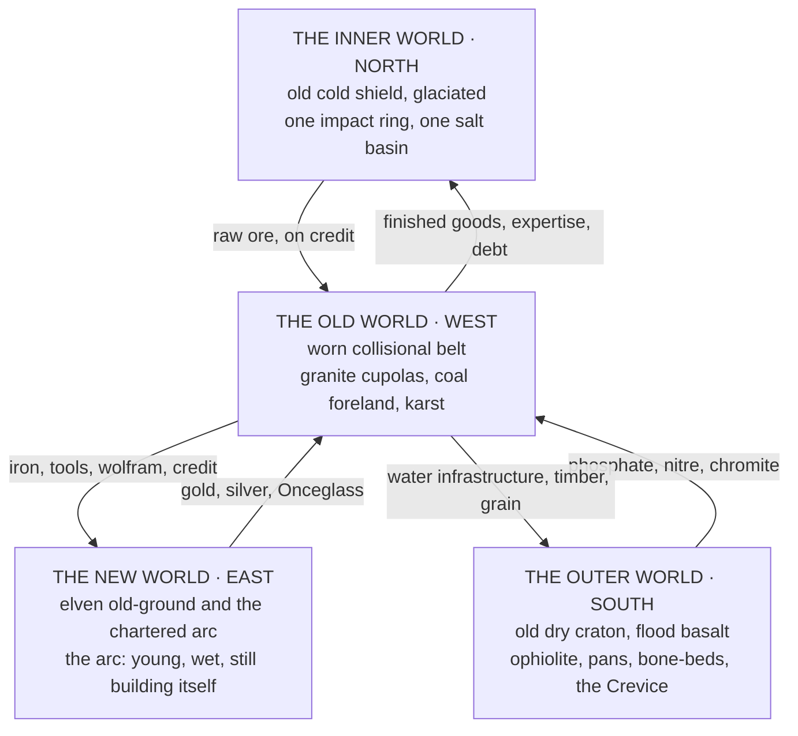

# Geography & the Four Quarters

> Borders move. **Bedrock does not.** A shaft sunk on the northern shield behaves the same whichever charter is over the headframe, and a shaft sunk in the eastern ash will kill your men the same way regardless of which flag is over it.
> *Any surveyor who reads this ledger politically has read it wrong.*

---

## The Four Quarters

All four were emplaced in the **First Eon**, which under the Concordance closes at Year −900, and nothing has been added to any of them since. The Measurewrights have been asked whether the corrected count makes the deposits younger, and answer that it does not. **It makes them nearer.** A seam emplaced fourteen hundred years ago and half drawn down in the last six hundred is a different object, politically, from a seam emplaced before memory, and every chartered company in the western quarter is presently discovering the difference.
| Quarter | Substrate | Condition | The bind it lives under |
|---|---|---|---|
| **North** · Inner World | Old cold shield, glaciated, one impact ring, one salt basin | Superb bearing stock, high ambient Essence, no infrastructure | Cheap array heat, expensive everything else |
| **West** · Old World | Worn collisional belt, granite cupolas, coal foreland, karst | Deepest workings, most complete infrastructure, exhausted ground and depleted Essence | **Total array dependency for survival, not production** |
| **East** · New World | Live volcanic arc, young, wet, mobile — the chartered arc; the elven old-ground beside it lies outside this ledger | Richest surface ore, self-supplying cement, mobile Wellsprings | Almost no array dependency outside the eastern arc |
| **South** · Outer World | Old dry craton, flood basalt, ophiolite, pans, bone-beds, Crevice | No array industry possible; materials requiring no processing | Extraction by hand at scale, value added elsewhere |

> **The pattern worth stating plainly.** The quarter with the most Essence has the least industry. The quarter with the most industry has the least Essence. And the two quarters in between have each solved the problem by refusing to build anything that would create the dependency in the first place.
>
> The Accord's standing assumption that industrial capability follows from magical capability **is not supported anywhere in the ledger.**

---

## The Twin Rating

A material has two independent worths, and the persistent error of the trade is treating them as one.
> **The Bearing** is what the material does under load. Compression, tension, shear, thermal cycling, abrasion.
>
> Measured on the press, in the ordinary way, and it has **nothing whatsoever to do with Essence.**
> **The Holding** is what the material does under Essence. How much it retains, how long, how cleanly it releases, and whether an inscription laid into it stays legible to the Continuum over years rather than weeks.
>
> Measured on the coil.
**The two do not track each other.** Forge-Iron out of Altherion bears magnificently and holds almost nothing, which is exactly why it arms the line infantry of six kingdoms and appears in no ward-network anywhere. Gloomhide is spiritually inert and physically superb. Mireclay holds a summoning totem for one night and cannot be trusted to hold a roof for one hour.
> A material that scores high on both is not called good. **It is called strategic**, and the Accord keeps a register of who owns the seams.
Trade speech has drifted into shorthand. **Bearing-grade** means a material bought for its physical work: foundations, hulls, gun-carriages, rail. **Holding-grade** means a material bought for its Essence work: substrate stock, conduit, gasket, lens, inscription medium. *A Measurewright will not sell you a single stone until you tell him which of the two you came for.*
Two further readings appear where the assay houses have agreed them. **Resonance**, the Wellspring or Wellsprings a substrate is naturally sympathetic to — basalt takes Coagula and Fixatio, quartz amplifies Fractura and Luminalis, iron conducts Manganthra and Aurevane, gold carries Benediction and Sublimatio, obsidian holds Tenebra and Oblivara. *An Engraver who fights his substrate pays for it in the lifespan of the inscription.* And **Family and Domain**, recorded so that a Caloria-family refractory is not ordered for a Fulguria-family duty by a clerk who never went underground.
The tier notation used throughout, **T0 through T9**, is the standing Accord materials scale.

---

## The Registers

Three instruments cover this ground and they do not sound alike.
| Register | Voice | Speaks to |
|---|---|---|
| **The Bearing and the Holding** | A surveyor's ledger. Every figure taken at the face rather than from a chartered claim; where a claim and a reading disagree, the reading stands. Kingdom names struck from the deposit entries in the fourth revision, on the ground that a ledger which names a seam for the crown that holds it must be reissued whenever the crown changes. | Substrate, deposits, works, hazards |
| **Value, Coin and Trade** | An economist's account, written by people who pay creditors in a fixed order and have concluded that the order is the most honest statement of value anyone has produced. | The two ledgers, the four metals, the oath, rank as property |
| **The Hobgoblin Expanse** | A world-bible entry compiled for the Archives Eternal and left unsigned, as is customary for documents whose authorship is institutional. | Vorruk-Khal, the Scattering, the Bugbear peoples, the Keth-Gorrum |

---

## Entries

Read **The Bearing and the Holding** for what the ground is and what may be made of it. Read **Value, Coin and Trade** for what any of it is worth, and why anyone accepts paper. Read **The Hobgoblin Expanse** for the one polity in the four quarters that was thrown out of the west, built a parliament on volcanic rock nobody wanted, and has run it for seven hundred and sixty-five years without a king.
- [The Bearing and the Holding](Geography & the Four Quarters/The Bearing and the Holding.md)
- [Value, Coin and Trade](Geography & the Four Quarters/Value, Coin and Trade.md)
- [News, Rumour and the Speed of Information](Geography & the Four Quarters/News, Rumour and the Speed of Information.md)
> **Distance measured in days.** **News, Rumour and the Speed of Information** sits under this section because what it actually documents is how far away anything is.
>
> Three channels. **The wire** is near-instant, priced by the word, read by the Guild, and follows the sealed conduit, which means it reaches exactly as far as the draw does and no further. A cut district is deaf, and a Withering-era quarter loses its signal net at the same rate it loses pressure. **The post** is cheap, prepaid, and the only channel still serving a cut district. **The mouth** is free, faster over short distances, and wrong.
>
> Carries a distance-and-channel table for answering on the spot when a Front's news reaches a given place, plus the standing rule that follows from all of it: **ask whether the destination is on the main before asking how far it is.**
