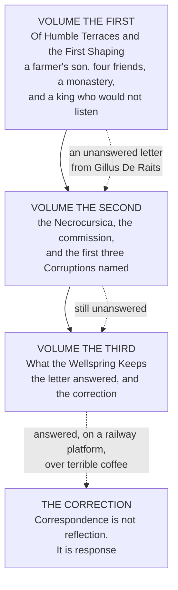

# The Alftian Codex

*Being the Recovered Journal of Vis Trismegistus, Alftian Savant · in three volumes*
> Transcribed by the Silent Archivists of Naln, Era of Voyagers. **Recovered from the sealed lower stacks of the Herald's Archivum, Urbis.**
> *Classification: Hermetic Lore — Restricted Access, High Wellspring Sensitivity*
> 
> > *"That which courseth above is as that which courseth below. That which burneth in Tempus burneth also in the Soul Crystal. There is but one law, and it is everywhere."*

---

## The Shape of the Whole

**A single unanswered letter runs through all three volumes**, and the Codex does not resolve until it is answered. *That is the structure, and Vis does not notice it is the structure until he is writing the third one.*

---

## The Company

| Name | Who they are |
|---|---|
| **Vis Trismegistus** | Elfin. Son of Trans-Alftian terrace-farmers. Astronomer by inclination, alchemist by ambush. **Sage of the Anamnetic Line, Keeper of the Correspondence.** *Called Trismegistus because he holds three parts of the wisdom of the whole world — a claim he makes once, in a king's hall, and never repeats* |
| **Furveus, called Paracelsus** | The pharmacologist. Developer of **Spagyria** and the *Tria Prima* — Sulphur, Salt, Mercury. Precise, morally ambiguous, **checks his hands after work he finds difficult.** Takes the commission |
| **Noxinus Ren** | The poet. Older, wiser, and **compelled into writing the** ***Necrocursica*** **by a bargain that looked clean from outside.** Puts the warning in the footnote. *Among the finest poets in the Trans-Alftian tradition, which suggests ethical distress is extraordinarily generative if one is also extraordinarily talented* |
| **Neros** | The astronomer. Quieter than the others, **collects charts the way farmers collect debts.** Catches the Tempus drift on instruments precise enough to register it |
| **Gillus De Raits** | Stage VII. Primary Wellspring **Mortalis**, secondary **Anamnesis** — attuned to dissolution and memory simultaneously. **Writes the letter. Waits six years for the answer.** *Looks like someone who is very good at waiting* |
| **Vaughaus Thom** | Curious to an extent that has become equivalent to malicious. **Scales the method to regional catastrophe** — and leaves the oldest Trace alone, because even his curiosity has a floor |
| **Jabir** | Roadside astrologer, emerald eyes, **from the Shaneni empire's borders.** Gives Vis the copper amulet and the Emerald Principle in a script no Genesio archive could decipher |
| **Tat** | The student. Wept for a cat and was undone by it. **Asks the question that produces the Third Corruption's definition** |
| **Madeleine Ault** | Dying, and the most precise thinker Gillus ever knew. **Designs her own commission from inside her illness** so that a discovery she had no framework for would reach the man who did |

---

## What the Codex Establishes

> **The Aphorism of Mortalis.** *The practitioner who draws from that Wellspring to reconstruct what has dissolved does not summon the departed. He summons himself, arranged in their image, and calls it resurrection.*
>
> The Wellspring is **a river, not a reservoir.** What the necromantic tradition calls retrieval is **impression** — reconstruction of an Essence-pattern from harmonic residue, *the way one reconstructs a letter from the dents left on the surface beneath the paper.*
**Three residue categories**, from the *Necrocursica*: the **Harmonic Imprint** left in the ambient Aether of inhabited places; the **Sympathetic Bond Trace**, the resonance-thread to those in deep relational connection, which attenuates but does not sever at death; and the **Parunic Echo**, the glyph-trace any Temperance-active practitioner inscribes in the fabric of the world.
> **And a fourth, which the Codex is the document that establishes.**
>
> The **Volitional Trace** — the Aetheric record of *directed intent* persisting beyond dissolution where a practitioner died mid-decision. **Not unfulfilled desire, which leaves only the Sympathetic Bond. Unfulfilled** ***decision*****.**
>
> First identified by Madeleine Ault. Independently described by Vaughaus Thom. Theoretically named by Gillus De Raits. **Entered into the formal canon by Vis Trismegistus's testimony in the third volume.**
**The Seven Cacodaemonic Corruptions.** Vis names the first three from his own life and flags the remaining four as work he has not yet begun. *The Heresiology of Alchemy is the finished version of a book this man left open.*

---

## The Correction

*What a two-hundred-and-sixty-year-old unfinished decision was waiting in a mountain hollow to say.*
> **The Principle of Correspondence is not a law of reflection. It is a law of response.**
>
> *As Above, So Below* does not mean the cosmological and personal scales mirror each other. **It means that what happens at one scale** ***answers*** **what happens at the other.** Not simultaneously. Not symmetrically. **With delay, with distortion, with the particular inaccuracy of two systems trying to communicate across the distance between them.**
>
> **The Great Work is not the alchemist bringing the Below into alignment with the Above. The Great Work is the practitioner learning to ask a question that the universe is already in the process of answering.**
>
> To be the question rather than the answer. **To hold the unfinished thing long enough for the world to finish it through you.**

---

## Cross-References

**The Corrant Papers** · Research Archives Division, Guild Accord, **Level IV Clearance.**
**The *Necrocursica** *· Restricted, Genesio Archivum.** Noxinus Ren's compelled treatise.
**The Vaughaus Thom Submission** · formally *On the Fourth Residue Category and Its Application to Anamnetic Wellspring Activation.* Newly declassified, co-authored with G. De Raits, annotated by V. Trismegistus.
*Named but not otherwise described: Halveth, Archivum annotator — and the Research Division's effective director for eleven years while appearing to be an annotator. She solves problems by appointing the people who created them to fix them, on the accurate assessment that they are the only ones who fully understand them.*
- [Volume the First](The Alftian Codex/Volume the First.md)
- [Volume the Second](The Alftian Codex/Volume the Second.md)
- [Volume the Third](The Alftian Codex/Volume the Third.md)
