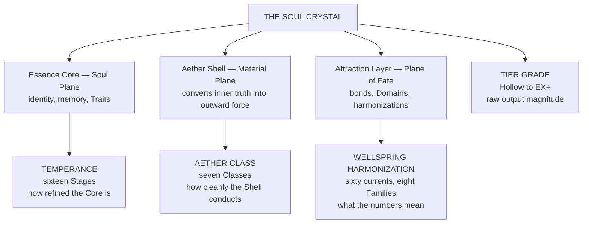

# The Magic System

> The Continuum does not grant power. It measures a soul, records what the measurement found, and permits exactly as much as the architecture will bear. Everything in this section is an account of that measurement: what it reads, what it refuses to read, and what it costs to move the needle.
> *"Temperance is not a buff. It is a confession of how much you have survived."*
> **Where the numbers live.** Everything on this page is the account. The arithmetic underneath it is **Fracture of Worlds — The Living System**, filed at the foot of this section in twenty-two Parts across eight pages. Bands and Temperance Gates, the Tier Grade thresholds, the Sub-Stat ceiling per Stage, all sixty-four Path gates, Threshold Catalysts, Resonant Pairs, Strike Force and Durability benchmarks, Aether Class efficiency, the η table, Domain costs.
>
> Read it when a value is in question, not before. This page tells you what the system is. Fracture of Worlds tells you what the number has to be.

---

## The Six Things That Carry the System

Everything after these is detail.
| Number | The rule |
|---|---|
| **One** | Reality has three planes. Matter, soul, and fate. Every act of magic crosses all three at once. Remove one and the working fails, without exception and without appeal. |
| **Two** | Aether is the ocean. Essence is your water. Aether is infinite and belongs to no one. Essence is Aether you have drawn in, circulated, and stamped with your identity, and there is only ever as much of it as you have earned. |
| **Three** | You cast through a Soul Crystal, not through a wand, a word, or a will. The Crystal has three layers, one per plane, and its architecture decides what you are capable of long before your ambition gets a vote. |
| **Four** | Power is refined, not accumulated. Temperance is subtraction. Sixteen Stages, each one a structural reorganization of the Crystal under pressure you did not ask for. You do not climb them by training. You climb them by surviving something that changes you. |
| **Five** | Everything costs. Essence is spent, not summoned. Domains bleed. Traits fatigue. Overchannel scars. A practitioner who tells you a technique is free is either lying or has not yet paid the invoice. |
| **Six** | The system does not lie and it does not forgive. Your numbers are the Continuum's honest assessment of the soul carrying them. They can be improved. They cannot be argued with. |

---

## The Four Axes

A practitioner is not described by one number. Four independent measurements run alongside each other, and the gaps between them are as diagnostic as the values themselves.

> Temperance sets the **ceiling**. Tier Grade reports the **magnitude**. Aether Class decides how much of the magnitude actually **arrives**. Wellspring harmonization changes what the magnitude **means** without changing the number by a single point.
>
> Two practitioners at identical stat values and identical Stage can produce wildly different results if one is Class III Resonant and the other is Class I Muridic. The stats are the same. The delivery is not.

---

## The Grammar of a Working

Newcomers ask how to learn a spell. The question is malformed. Workings are not learned as items; they are built through a five-part grammar, and every named discipline in the Continuum decomposes into it.
| Element | What it is |
|---|---|
| **Family** | Which of the eight domains of phenomena the working draws on. Never invented. Only worked within. |
| **Affinity** | The specific phenomenon inside that Family. Fire within Caloria. Gravity within Vectoria. |
| **Method** | How you relate to the phenomenon. Encoded directly in the suffix of every discipline name. |
| **Ability** | The internalized governing system your Crystal has developed. Pyrokinesis, for instance. It does nothing visible on its own. It is the platform. |
| **Technique** | A specific, repeatable application within that platform, with defined inputs, outputs, and limitations. This is what you actually do. |

> **The Family is the WHAT. The Method is the HOW. Where they intersect, you get the named discipline.**

### The Nine Methods

| Method | Suffix | Plane | Relationship to the phenomenon |
|---|---|---|---|
| **Manteia** | -mancy | Soul | *Perception. Reading and sensing through the element.* |
| **Kinesia** | -kinesis | Material | *Direct control. Physical manipulation in real time.* |
| **Turgia** | -turgy | Fate | *Ritual and creation. Forging lasting change.* |
| **Corporis** | -kinesis (body) | Material | *Martial integration. The body itself is the conduit.* |
| **Scriptia** | -graphy | Fate | *Inscription. Magic carved permanently into materials.* |
| **Alchemia** | -genesis / -synthesis | Material + Soul | *Alchemy. Substance transformation, Essence Draft creation.* |
| **Harmonia** | -phonia / -chord | Soul + Fate | *Resonance. Frequency-based workings.* |
| **Conjunctia** | (compound roots) | All Three | *Fusion. Simultaneous blending of two or more Families.* |
| **Synergia** | (named by working) | Fate-dominant | *Cooperative. Multiple practitioners combining workings.* |

---

## The Eight Primaries

Eight Primary Stats, eight Sub-Stats beneath each, sixty-four values in total. **A Primary is the combined total of its eight Sub-Stats.** Points are spent on the grain; the category is the arithmetic afterward. The Temperance ceiling and the Path gates bind the Sub-Stat, and a Primary's Grade is read off the mean. Two characters at identical Primary totals can be radically different practitioners because their distributions tell different stories, and a specialist can read modest on an assessor's ledger while three Sub-Stats at the ceiling do the actual work.
| Primary | What it measures | Plane |
|---|---|---|
| **Vitality** | The body's capacity to carry Essence without breaking. Fortitude, constitution, tolerance, regeneration. | Material |
| **Ardency** | Raw output. Flux, compression, penetration, overchannel. How hard the working hits and how fast it leaves you. | Material |
| **Gnosis** | Perception and comprehension. Analysis, forecast, retention, cognition. The stat that reads the room before the room moves. | Soul |
| **Dexterity** | Precision and control of the body in motion. Celerity, reflex, economy, evasion, feint. | Material |
| **Harmonics** | Resonance and bond. Attunement, empathy, breadth, synergy, axis. How honestly output reflects the inner state. | Fate |
| **Resilience** | Structural persistence under assault. Integrity, ward, anchoring, persistence, hardening. | Soul |
| **Tempering** | Refinement itself. Coherence, maturity, ceiling, capacity, longevity. The stat that governs whether you advance at all. | Soul |
| **Dominion** | Command over local metaphysical law. Radius, sovereignty, gravity, pressure, throne. The stat of sovereignty. | Fate |

> Two Sub-Stats gate everything else. **Tempering Coherence** is the structural prerequisite for Threshold eligibility, the Crystal's internal honesty meter. **Tempering Maturity** is the Sub-Stat the Crystal consults first when evaluating whether you are ready.
>
> A practitioner obsessed with Ardency and negligent of Tempering builds a very impressive engine into a chassis that will not survive the first corner.

### The Paths

Sub-Stats are gated behind Path commitment. A Path is not a class selected at registration. It is the direction advancement actually took, assessed retroactively and recorded whether the practitioner agrees or not.
**Body Path** · the shortest road and the most reliable. Direct multiplicative bonus to Strike Force, Durability, and Lifting Strength, from roughly five percent early to twenty percent at Stage XII and above. The trade is reduced Range and Aura Pressure. Body Path practitioners must close distance to spend their advantage.
**Spirit Path** · perception, inscription, clarity, processing. Gates most of Gnosis and much of Tempering's refinement architecture.
**Attraction Path** · bond, recognition, reach, sovereignty. Gates nearly all of Harmonics and the majority of Dominion.
**Fate Path** · the high gates. Persistence, Continuity, Ceiling, Fate, Throne. Almost nothing on Fate Path unlocks below Stage V, and its terminal Sub-Stats do not open below Stage XIII.
> ***The three-and-four question, settled.*** *The Physical Force chapter names three Paths and the gate tables name four, and both are correct.* **Fate carries no force**, so it takes no line in a table of force modifiers, and its absence there is a fact about force rather than a fact about Paths.
>
> The deeper difference is how commitment is recognised. **Body, Spirit and Attraction are demonstrated by routing Essence.** Fate gates Persistence, Continuity, Ceiling, Stability, Fate and Throne, none of which concern output at all, **so Fate commitment is recognised by what a soul refuses to let end.** No drill produces it and no instructor assigns it.
>
> *Which is why the Measurewrights read it as a late-tier extension. It is not late. It is simply not visible until somebody has held something long enough for the holding to count.* **Full treatment in The Four Paths.**

---

## What Corruption Looks Like, By Family

Every Family has a terminal failure state. The early symptoms are indistinguishable from enthusiasm.
| Family | Corruption | Terminal expression |
|---|---|---|
| **Caloria** | Pyromaniacal fixation | Internal heat exceeds survival |
| **Fulguria** | Sensory overload | Cognitive dissolution |
| **Vectoria** | Gravitational isolation | The soul becomes a singularity |
| **Spatium** | Spatial dissociation | The body sits at ambiguous coordinates |
| **Materia** | Petrification compulsion | Flesh mineralizes |
| **Vitalia** | Biological recursion | Growth and decay lock into a loop |
| **Fluxia** | Dissolution of boundaries | Identity disperses |
| **Limina** | Existential erosion | Solipsism, negation, or dissociation |

---

## Entries

> **The reading order.** The list below is the path, not the filing. Read it in this sequence once and the section will never need explaining again.
>
> **0 · Fracture of Worlds — The Living System** — the workbook beneath all twenty below. Not read in sequence. Opened when a number is in dispute.
> **1 · The Core Vocabulary** — the words. Nothing else here is readable without them.
> **2 · The Physical Account: Two Sets of Books** — what a working is. Two complete descriptions of every event, both true, and where the energy actually comes from.
> **3 · The Eight Families & the Sixty Wellsprings** — the laws being conditioned. Read the hub, then whichever Family you need.
> **4 · The Master Glyph Index** — the boundaries imposed on those laws.
> **5 · The Descent of Parun** — the fourteen ways of writing a boundary down, and what each one changes. Its child, **The Counted Speech**, is why almost nobody says it aloud.
> **6 · The Trait System** — what a soul carries before any of the above touches it.
> **7 · The Four Paths** — the route a working takes out of a soul, how the Crystal recognises it, and what it gates.
> **8 · The Sixteen Stages** — what advancement does to a person, told four ways per Stage.
> **9 · The Ladder and the Draft** — how the climb joins the rest of the system, and what alchemy can and cannot buy.
> **10 · Tier Grade, Bands & the Aether Shell** — the numbers, and who wins.
> **11 · The Color of Essence** — what all of the above looks like from outside.
> **12 · The Four Crafts** — the five media a working can be written into, and the class system that follows.
> **13 · The Derivation of Practice** — where a practitioner's capacity came from, and why the institutions cannot agree.
> **14 · The Standing and the Title** — the three names, and why only the third one is real.
> **15 · The Imperial Age: Aether Infrastructure** — the pipes, the meter, the seal, and who is billed for the working.
> **16 · On Walking Into the Current** — what happens to a body that meets a Wellspring without meaning to.
> **17 · Mechanica** — the practice everything above defines itself against.
> **18 · Counterplay** — what beats a practitioner, and in what order the decision is made.
> **19 · The Magical Categories** and **The Lexicon of Magic** — reference. Consulted, not read.
> **20 · The Practitioner's Field Manual** — author-facing. How magic is written rather than what it is.
*The groupings below now follow the same order as the path above.*

### I · The Foundations

*What the Continuum is made of, what a working is, and the laws and boundaries every working runs on.*
- [The Core Vocabulary](The Magic System/The Core Vocabulary.md)
- [The Physical Account: Two Sets of Books](The Magic System/The Physical Account Two Sets of Books.md)
- [The Eight Families & the Sixty Wellsprings](The Magic System/The Eight Families & the Sixty Wellsprings.md)
- [The Master Glyph Index — 136 Attested Forms](The Magic System/The Master Glyph Index — 136 Attested Forms.md)
- [The Descent of Parun — The Fourteen Hands](The Magic System/The Descent of Parun — The Fourteen Hands.md)

### II · The Soul and the Climb

*What a soul carries, what advancement does to it, and how any of it is measured from outside.*
- [The Trait System: Law, Function and the Forge](The Magic System/The Trait System Law, Function and the Forge.md)
- [The Four Paths: Routing, Recognition and the Gate](The Magic System/The Four Paths Routing, Recognition and the Gate.md)
- [The Sixteen Stages](The Magic System/The Sixteen Stages.md)
- [The Ladder and the Draft — Temperance, Advancement and Essence Drafts](The Magic System/The Ladder and the Draft — Temperance, Advancement and Essence Drafts.md)
- [Tier Grade, Bands & the Aether Shell](The Magic System/Tier Grade, Bands & the Aether Shell.md)
- [The Color of Essence](The Magic System/The Color of Essence.md)

### III · Practice, Institution and the World

*How a working is actually made, who is permitted to make it, what it is called afterward, and what it costs on a bill.*
- [The Four Crafts](The Magic System/The Four Crafts.md)
- [The Derivation of Practice — Thaumaturgic and Theurgic](The Magic System/The Derivation of Practice — Thaumaturgic and Theurgic.md)
- [The Standing and the Title — The Three Names](The Magic System/The Standing and the Title — The Three Names.md)
- [The Imperial Age: Aether Infrastructure](The Magic System/The Imperial Age Aether Infrastructure.md)
- [On Walking Into the Current — Wellspring Encounter and Recovery](The Magic System/On Walking Into the Current — Wellspring Encounter and Recovery.md)

### IV · The Adversary

*The practice the whole system defines itself against, and the four ways a practitioner is beaten.*
- [Mechanica: Extraction Without Recognition](The Magic System/Mechanica Extraction Without Recognition.md)
- [Counterplay: What Beats a Practitioner](The Magic System/Counterplay What Beats a Practitioner.md)

### V · Reference and Craft

*Consulted rather than read. The last of the three is author-facing: how magic is written, not what magic is.*
- [The Magical Categories — Unified Taxonom](The Magic System/The Magical Categories — Unified Taxonom.md)
- [The Lexicon of Magic — Master Terminology](The Magic System/The Lexicon of Magic — Master Terminology.md)
- [The Practitioner's Field Manual — The Forge](The Magic System/The Practitioner's Field Manual — The Forge.md)
> **Elsewhere in the wiki.** The named arts live under **The Disciplines.** The material register lives under **Materials, Alchemy & Trade.** *The Apprentice's Primer, the in-world first reader that condenses this entire section for a newly registered practitioner, sits under In-World Documents.*

### VI · The Workbook

*The stat framework itself. Not an essay. A reference you open with a specific question already in hand.*
> **How to use it.** *Statting a character* — open **I** for the point economy, then **II** for the ceiling their Stage permits and the Path gates on their Sub-Stats. *Writing a fight* — **II** for the Grade differential, **III** for what the strike actually does to masonry and bone. *Writing a working* — **V** for the Wellspring's stat effect, **VII** for how much of it survives the Shell. *Writing advancement* — **VI** for the Catalyst the Crystal is waiting on. *Writing a Domain* — **VIII**.
- [Fracture of Worlds — The Living System](The Magic System/Fracture of Worlds — The Living System.md)
- [The Working Vocabulary — Trade Jargon and Its Metaphysical Extensions](The Magic System/The Working Vocabulary — Trade Jargon and Its Metaphysical Extensions.md)
> **On the two.** Fracture of Worlds is machinery: Grades, Stages, Bands, Sub-Stats, Path gates. Almost none of it reaches the page. **The Working Vocabulary is the opposite** — what a fitter calls the pipe, what an assayer calls the flash, what a glasshouse calls a flaw — taken whole from real trades, extended to the metaphysical case by the people who work both, and inverted in cant. It exists so the world sounds worked rather than described, and so the metaphysics has somewhere to borrow from that is not the Codex.
