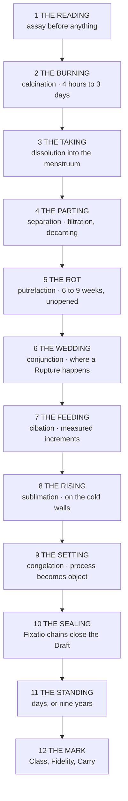

# Alchemetrica

*The Working of Wellspring Law Upon Matter*
> A practitioner's codex. Issued by the Research and Archives Division for the instruction of certified circles, with the working sections supplied by the Guild of Measurewrights **and by four masters who declined attribution.**
> **The reagents are the nouns. The Wellspring is the verb. Glyphica is the grammar that makes the sentence lawful.**
>
> Everything in this codex is an elaboration of that one line, **and every apprentice is made to say it before they are permitted to touch a vessel.**

---

## What Alchemy Is

The sixty Wellsprings are not reservoirs and are not batteries. Each is a living process, a law of transformation encoded into the Continuum since Paru's First Speech — and **eight of them are simultaneously Wellspring, cosmic principle, and alchemical operation.**
| Wellspring | Operation |
|---|---|
| **Calcination** | Burns away false structure |
| **Dissolution** | Unravels cohesion into base frequencies |
| **Coagulatio** | Binds and makes permanent |
| **Distillation** | Separates and purifies into isolated truth |
| **Sublimare** | Elevates **without passing through the states between** |
| **Transmutatio** | Reconfigures identity under catalytic force |
| **Fixatio** | Anchors and seals |
| **Materia Primordia** | Crystallises Essence into permanent mineral form |

**That correspondence is not a coincidence and it is not a metaphor the trade adopted for convenience. It is the architecture.** An alchemist working a Distillation Draft is not performing a procedure that *resembles* the Wellspring. **They are channelling it**, through a material medium rather than through their own resonance.
> **The crucible is a Soul Crystal analogue for inanimate matter.**
>
> That is the whole trick of the discipline, stated plainly, **and it took four centuries to state plainly.**
>
> A caster produces an effect once, brilliantly, **and cannot promise it twice.** A workshop produces four hundred identical ward-plates **and the four hundredth behaves like the first.**
>
> The Accord's arrays pump on that difference. So does its medicine, its inscription trade, its ordnance, **and every rank token in the four quarters.**

### The lawful frame

Alchemy is permitted because **it accelerates rather than counterfeits.** Wellspring processes run continuously across the Continuum whether or not anyone is watching. Metals ripen in the ground. Rot completes itself. Frequencies separate under time.
What the alchemist does is arrange conditions and issue an authorisation so that **a process the Continuum was already running runs here, now, faster, and under supervision.**
> Nothing is created. Nothing is stolen. **The work is a matter of hurrying a thing along and then paying for the hurry**, and every doctrinal defence the Bench has ever mounted rests on that sentence.

---

## The Two Kinds of Alchemist

*The Law of Alchemical Independence: alchemy requires no Soul Crystal, but remains bound to glyphs and vessels.*
> **THE CRYSTAL-BEARER**
>
> **Essence Core** · seeds Intention into prepared material rather than projecting it outward. **The material takes up everything the Core is broadcasting**, which is why an alchemist's state during preparation is a working variable and not a superstition. *Grief and clarity produce different seeds and the coil reads the difference.*
>
> **Aether Shell** · governs precision across duration rather than sharpness in a burst. **A muddy Shell produces muddy Drafts regardless of how perfect the inscription is, and there is no correcting it downstream.**
>
> **Attraction Layer** · the decisive variable in advanced work. A practitioner harmonised with Coagulatio runs Coagulation Drafts at **roughly a quarter of the vein depletion** of one who is not, **because the Wellspring already knows them.**
>
> *The best alchemists are not the best theorists. The formula and the practitioner are two halves of one invocation, and half of that invocation cannot be studied into existence*
> **THE PURE ALCHEMIST**
>
> No Soul Crystal, **and works anyway.** By chemistry, by inscription, and by absolute exactness — **no communion to fall back on and no margin to waste.**
>
> What they build instead, over decades of reagent exposure, is **a distributed catalyst network**: conditioned tissue that stores and reacts with Essence, conduction channels formed by long habituation, and in rare cases **induced Parunic apertures.**
>
> **A pure alchemist's body becomes the instrument their Crystal would have been.**
>
> They pay for it. **The catalyst network is grown out of exposure, which is another word for poisoning.**
>
> They are also, by a considerable margin, **the most technically precise practitioners in the discipline.** A harmonised Crystal-bearer can be sloppy and still succeed. **A pure alchemist who is sloppy dies**, and the survivors are consequently the ones the great houses hire to run the dangerous benches
> The Accord certifies both and ranks them on the same Tiered Path, **which looks equitable and is not.** Every advancement gate above Tier Five consults Temperance, **and a pure alchemist has none to consult.**
>
> So the discipline that most rewards precision is administered by an institution that measures communion, and the four quarters are full of **pure alchemists at Tier Four running the benches that Tier Seven Crystal-bearers put their seals on.**
>
> Everyone in the trade knows the arrangement. **Nobody has petitioned to change it, because the pure alchemists know exactly what a petition would cost them and the Crystal-bearers know exactly what it is worth.**
> **What a pure alchemist actually is, in the vocabulary of the other registers.** A soul with a Dormant Crystal. **Class Ø.**
> 
> Which means they do not temper and cannot, because Temperance is a melt and a Crystal that never woke is no organ to melt. **What they undergo instead is the Weathering**: refinement under sustained strain with no recasting, the soul hardening in place along the direction it was already being used. The trade word for the result is **grain**.
> 
> *The catalyst network is grain, described from the bench rather than from the coil.* Conditioned tissue, conduction channels laid down by habituation, and in rare cases induced apertures. **It is real, it is measurable, it strengthens only in the direction the work pushed it, and it can never be redirected into anything else.** A forty-year Distillation specialist is extraordinary at Distillation and will be extraordinary at nothing else for the rest of his life.
> 
> **No instrument in the Accord reads grain.** The gates above Tier Five consult Temperance because Temperance is what the coil can see, and the discipline's most precise practitioners are invisible to the apparatus that ranks them. *This is the same blind spot the Derivation Index carries and the same blind spot the screening seasons carry, and it is one blind spot rather than three.*
>
> Which means they do not temper and cannot, because Temperance is a melt and there is no organ to melt. **What they undergo instead is the Weathering**: refinement under sustained strain with no recasting, the soul hardening in place along the direction it was already being used. The trade word for the result is **grain**.
>
> *The catalyst network is grain, described from the bench rather than from the coil.* Conditioned tissue, conduction channels laid down by habituation, and in rare cases induced apertures. **It is real, it is measurable, it strengthens only in the direction the work pushed it, and it can never be redirected into anything else.** A forty-year Distillation specialist is extraordinary at Distillation and will be extraordinary at nothing else for the rest of his life.
>
> **No instrument in the Accord reads grain.** The gates above Tier Five consult Temperance because Temperance is what the coil can see, and the discipline's most precise practitioners are invisible to the apparatus that ranks them. *This is the same blind spot the Derivation Index carries and the same blind spot the screening seasons carry, and it is one blind spot rather than three.*

---

## The Four Operations

*Every Draft ever entered in the Standing Index is one of four operations or a composite of them. The operations are verb-classes.*
| Operation | Law | Physical register | Failure mode |
|---|---|---|---|
| **Coagulation** *mirrors Coagulatio* `Ur` `Ma` `Th` | Binding, solidifying, making permanent | Precipitation, setting, crystallisation — **the moment a suspension becomes a solid and stops behaving like a liquid.** Thermodynamically the least demanding, and the first any apprentice may run alone | Coagulatio is stable and **deactivates cleanly.** *A collapsed Coagulation leaves you with wasted stock and a lecture* |
| **Distillation** *mirrors Distillatio* `Ie` `Ur` `Flx` | Isolation and purification — separating a true signal from noise | Vaporisation and recondensation, fractionation. **Also the forensic operation**: high-level Distillation isolates an Essence type back to its root origin, which is how a corrupted vein is identified **and how a lot's Provenance Class is confirmed when the seller's warranty is doubted** | A Distillation without a Direction glyph **separates every signature present, including the ones you meant to keep.** *Technically successful and commercially worthless* |
| **Sublimation** *mirrors Sublimare* `Xr` `Vael` `Ora` | Elevation without intermediate states — burden converted to clarity | A solid becomes vapour and returns as a purer solid **without ever having been liquid**, and **there is no stage between at which the working can be inspected or corrected.** A harmonised alchemist can attempt workings structurally inaccessible to a purely theoretical one, *because the process already knows them and shortens the road accordingly* | **There is no partial Sublimation.** What did not rise stays in the bottom of the vessel **as a fused mass that has to be broken out with a chisel** |
| **Conjunction** *no single Wellspring mirror* | The Attraction-aligned law of merging — the same principle governing Synergia, Domain formation, and Essence fusion. **The most dangerous operation in the discipline** | Incompatible Wellsprings forced together without mediation produce **Rupture Events.** The Parunic mediation glyphs **are not decorative. They are the structural buffer the Continuum requires before it will permit two laws to occupy one substrate** | **Rupture.** The two laws do not blend and do not cancel. **They contest, inside a sealed vessel, and the vessel is the first thing to lose.** *Conjunction benches are sited against an outer wall and the outer wall is built light on purpose, so that it goes before the roof does* |

---

## The Twelve Turnings

*The operation is what the working does. The Turnings are what the workshop does. An apprentice learns the four in a week and the twelve over nine years.*

**The Reading** · *An alchemist who begins work without knowing what is in front of him is not being bold. He is guessing at which laws he has just invited into the room.*
**The Burning** · Strong dry heat until the material gives up what is false in it. *The bench smells of hot stone and scorched bone and the fume is not to be breathed.*
**The Taking** · **The Turning at which most workshops discover that their stock was not what the seller said it was**, because carry that behaved itself as a powder does not necessarily behave itself in solution.
**The Parting** · Slow, unglamorous, **and where most of a journeyman's early years are spent.**
> **The Rot** · Gentle sustained warmth over weeks, held in a dung-bed or a low bath **because nothing else supplies a steady blood-warmth for that long without watching.**
>
> **The vessel is not opened during the Rot.** The contents go black, and stay black, and this is correct, *and every year some apprentice somewhere opens a vessel because he is certain it has spoiled.*
>
> The Rot is the Turning folk tradition understands best. **It is death before the thing can be remade**, and the workshops say so without embarrassment, **and it is one of the very few places where the trade's own language and the temple's have never diverged.**
**The Wedding** · Fast, decisive, and **the point at which a Rupture happens if one is going to.**
**The Feeding** · Never all at once, because **a working that is fed too fast completes the nearest available version of its process rather than the intended one.** *A master feeds by eye. An apprentice feeds by the clock and by written weight and is not permitted to deviate.*
**The Rising** · Vapour to solid on the cold walls of the Riser, **and whatever failed to rise is a loss that cannot be recovered.**
**The Setting** · **From here the product exists as an object rather than a process.**
**The Sealing** · Drawing heavily on Fixatio's chains, closing the Draft against contamination and post-completion drift.
**The Standing** · Days for a T1, nine years for Cask-Oath Pitch. **Nothing is done to it and nothing may be done to it** — *and the Standing is where undercapitalised houses fail, because a house that cannot afford to have stock sitting idle will sell it early and the coil will say so.*
**The Mark** · Assay, Attribution, and the three marks struck into the seal. **Until this Turning the working is a substance. After it, it is a commodity, and the difference is worth more than all eleven preceding Turnings combined.**

---

## Reading the Colour

*There are no instruments inside a sealed vessel. There is glass, and there is what the working looks like through it, and four centuries of practice have reduced that to four readings.*
| Reading | What it means |
|---|---|
| **The Blacking** | Putrefaction proceeding correctly. Deep, matte, light-swallowing. **Expected, desirable, and terrifying to anyone seeing it for the first time.** *A working that never blacks has not rotted and will not conjoin* |
| **The Whitening** | Separation complete and the material purified. Pale, often pearlescent — **the point at which most workings become safe to inspect** |
| **The Yellowing** | The tincture arriving. Amber through gold. **The last stage before a decision has to be made about whether to push further, and pushing further is where fortunes are lost** |
| **The Reddening** | Completion. Deep red through to near-black in thick glass. **A working that reddens has done what it was told** |

**Colours arriving out of order mean the sentence is executing wrongly and the working should be abandoned. Colours arriving too fast mean the same.** A working that blacks and then reddens **without whitening** has skipped the purification and is carrying whatever it was supposed to have shed — *and the Bench has an entry for what that produces and it is not a product.*

---

## The Vessels

**The Crucible** · Refractory ceramic, for fusion and calcination at the top of the heat range. **Opaque, which is the trade-off: you get the heat and you lose the sight.**
**The Belly and the Hood** · The two-piece still. Belly in earthenware or copper, hood in glass wherever the budget allows, **because the hood is where the working is watched.**
**The Retort** · Belly and hood in one piece of glass with a long curving neck that condenses as it delivers. **No joint to fail, which is its entire advantage.**
**The Riser** · Tall conical earthenware, stacked in series, for sublimation. The sublimate collects on the interior walls and is scraped out cold.
**The Returner** · Two side-arms curving back into the body so condensed vapour runs continuously back down into the charge. **Permits circulation for weeks without ever opening the system, which is the only way certain workings can be run at all.**
**The Standing Egg** · Thick-walled sealed ovoid glass for the long digestions. Once shut it is not opened until the working is finished or has failed, **and a Standing Egg has no failure signal short of the colour going wrong or the glass going.**
**The Draft-circle** · Not a vessel. **The inscribed ground the vessels sit inside**, carrying the Authorization, Boundary, Direction and Sealing chains. *Scribed for one working and washed after.*
> **Why the material matters.** Glass lets the working be seen and resists the menstrua, and cracks under thermal shock, and will not take the top of the range. Refractory ceramic takes any heat and is **porous and blind.** Copper conducts beautifully and **is eaten alive by Strongwater in under an hour.**
>
> So a menstruum distillation runs in glass or luted earthen and never in bare copper, a fusion runs in a crucible **and is judged by ear and by flame colour because nothing can be seen**, and a Conjunction runs in **whatever the house can afford to lose.**
>
> *Onceglass has been proposed as vessel stock in every generation since the caldera trade opened, on the reasoning that it takes an inscription with unusual clarity. It also shatters completely on discharge, which is acceptable in a militia charge and is not acceptable in a vessel with three days of a master's work inside it.*

---

## Heat

*Every alchemist in the four quarters judges temperature by flame colour, by the sound of the charge, and by holding a hand where a hand should not go. There is no instrument. There has never been an instrument.*
| Bed | Behaviour |
|---|---|
| **The Still Bath** | Water. Gentlest, self-limiting at the boil. Named for Ithra, **credited in three traditions and attested in none.** *Cannot be overheated, which is why apprentices are given it and why masters resent being given it* |
| **The Sand** | A bed of sand between flame and vessel. Higher than water, more even than fire, **forgiving of a wandering flame. The workhorse bed of the trade** |
| **The Ash** | Slower, gentler, **holds through a night without tending** |
| **The Bed** | Fermenting dung packed around the vessel. **Holds blood-warmth for six to nine weeks without fuel, without tending, and without any possibility of overheating.** *The correct instrument for the Rot, and every attempt to replace it with something less humiliating has produced worse results* |
| **Open flame with the bellows** | The top of the range. Judged by colour — dull red through cherry through orange through white — **and a master will name a temperature off the colour to within a hundred degrees and be right** |
| **The Long Furnace** | Brick, with a fuel tower feeding charcoal down by gravity. Holds a constant low heat for weeks or months without a hand on it. **A Long Furnace that goes out mid-working has destroyed more accumulated value than any fire in the record** |

> The practical consequence of having no instrument is that **heat is a craft skill rather than a specification**, which means it cannot be written into a formula, **which means an entered formula in the Standing Index is never actually sufficient to reproduce the product.**
>
> **The Bench knows this. The Bench requires a reference lot precisely because the written formula will not get anybody there.**

---

## The Lute

*The glyph-seal keeps the Continuum honest. The lute-seal keeps the vapour in the vessel. Apprentices confuse them exactly once.*
There are no ground joints. Every junction is closed by hand with lute — **clay and hair and dung and egg and flour**, mixed by recipe, applied wet, and dried before the fire is lit.
**Joint lute** · Egg white and fine flour bound with linen strip. Seals a spirituous vapour and comes away cleanly. *Any apprentice can make it.*
**Fire lute** · Clay, sand, chopped fibre. Goes on the bottom of a vessel that will sit in flame, **and must be dried through before heat or it cracks off in sheets.** *This is the lute every workshop guards the proportions of.*
**Fat lute** · Fine clay worked with boiled oil. Stays pliable; used where a vessel will need opening again.
> **Dawi hold-forges use a fourth that they do not sell and will not discuss.** The Bench has twice attempted to require its disclosure as a condition of entry on Dawi formulas **and has twice been told, in writing, in Khazalid, that the recipe is not property and cannot therefore be surrendered.**
> **Luting is the most consequential unskilled-looking task in the discipline.** A failed lute vents Strongwater fume into a closed workshop, **and Strongwater fume in a closed workshop kills everybody in it in the order they were standing nearest.**
>
> It is also the task given to the youngest hands, because it is repetitive and requires no communion and no Temperance.
>
> **Every workshop in the four quarters therefore hangs its lives on the care of a fourteen-year-old with a bowl of clay**, and every master in the four quarters knows it, **and the ones who are honest say so to the fourteen-year-old on the first day and mean it.**

---

## The Menstrua

*Five in general trade. All of them dangerous, all of them made rather than found.*
| Solvent | What it is |
|---|---|
| **Strongwater** | Distilled from saltpetre and vitriol over roughly a day of graduated heat. Colourless when clean, yellow when not. The receiver fills with **red-orange fume that is the working's own signal it is proceeding.** Eats silver and most metals; **will not touch gold.** *The fume is the single commonest cause of death in the trade* |
| **Kingswater** | Strongwater with Ghostsalt added. Fumes yellow. **Dissolves gold, which nothing else does**, which is why it is called what it is called **and why every parting bench keeps it under a separate lock** |
| **Blackstone Oil** | Heavy, oily, **the most corrosive thing on a common bench.** Three days of continuous distillation before the oil itself comes over. **Meets water violently enough to break the vessel it is in**, *and a great many benches carry a scar from somebody who learned this in the ordinary way* |
| **Salt-spirit** | Sharp, pungent, from salt and vitriol. The general-purpose acid, **and the least feared, which is why it accounts for more ruined hands than Blackstone Oil does** |
| **Ghostsalt** | Sublimed white crystal, acrid. A flux and a component of Kingswater — **the reagent that most often arrives adulterated, because it looks identical to four cheaper things** |

> **Scribe's Wash** — the one menstruum with **no ordinary chemical analogue.** It strips a Parunic inscription off a substrate without touching the substrate, **leaving the material intact and the sentence gone.**
>
> Enforcement uses it to disarm a working that cannot be safely discharged. Engravers use it to correct a chain before the Sealing. **Forgers use it to lift a legitimate three-mark seal off a spent vessel and put it onto a lot that never earned it** — the single most common high-value fraud in the trade.
>
> The Bench's countermeasure is that **Lampblack Register Ink does not lift, and any seal that lifts was never Bench-struck.** *Which is a good countermeasure and works, and does nothing at all for a buyer who cannot tell the difference by eye, which is most buyers.*

---

## Time, and What It Costs

*The discipline is slow and the slowness is not a limitation of the practitioner. It is the process taking the time the process takes.*
A menstruum distillation runs a day for Strongwater and **three days before Blackstone Oil comes over at all.** A calcination, four hours to three days. **The Rot, six to nine weeks in the Bed, unopened.** A circulation in the Returner, weeks or months, the vessel never opened and the Long Furnace never permitted to go out.
> **A Standing Egg digestion runs months to years.** There are Eggs in the Archives Eternal that have been under gentle heat **for longer than the Accord has existed and whose contents nobody living has seen.**
> The economic consequence is that alchemy is **capital-intensive in a way that looks like nothing from outside.** A house's wealth is in what is sitting on its benches doing nothing, tended, for months — and **a house that must realise its stock early will produce inferior product forever and cannot escape by working harder.**
>
> **This is why the great houses are old houses. It is not skill. It is the ability to wait.**

### The workshop

It smells of **charcoal first**, and under the charcoal of hot stone, and under that **of the Bed**, which no amount of ventilation ever entirely removes and which every alchemist stops smelling within a month **and never smells again.** Then Strongwater, sharp enough to take the back of the throat. Sulphur off the calcination bench. Wet clay from the luting table where somebody is always working. Blood-smell from the rendering room. Old paper and lamp oil from the record desk, **which is by the door because the records leave the building and the reagents do not.**
It sounds like a bellows on a slow cycle and the tick of a Long Furnace settling as the charcoal drops. Glass on stone. Somebody counting under their breath at the Feeding. **Very little talk, because talk at the wrong moment during a Feeding costs a master a month.**
It looks dark, **because the working is read by colour through glass and bright light makes that harder.** The benches are lit low and the windows are high and small, and what light there is comes off Deadlight phials and off the fires — **and the fires are the only warm colour in the room.**
> **There are children in it.** Carrying ash, mixing lute, watching a bath that must not be allowed to go dry. **There have always been children in it.**

### What it costs the body

| Condition | Course |
|---|---|
| **Crucible palsy** | Onset at roughly nine years of bench service. Begins as a tremor in the writing hand, progresses to the head and jaw, **and is accompanied by a withdrawal of manner that families notice before physicians do**: irritability, then shyness, then a reluctance to be looked at. *Permanent, progressive, and the reason a master's later formulas are dictated rather than written* |
| **Draft-mark** | Discolouration in the sclera and under the nailbeds, keyed to what the practitioner has handled most. Cosmetic, diagnostic, **and socially ruinous, since a renderer can name a man's whole career off his hands in under a second** |
| **Vein cough** | From calcination fume, particularly sulphide roast. Twenty-year onset, chronic, **and the commonest cause of retirement in the trade** |
| **The quiet** | Documented in long-service Distillation specialists. **A flattening of affect that begins as professional detachment and does not stop there.** Practitioners describe it as **no longer finding things important, including things they know to be important.** *The Archives has classified it as an occupational condition and has not proposed a treatment* |
| **Law-fragment burn** | Acute rather than chronic. Contact with a corrupted product **in which a portion of a Wellspring process was partially invoked and then abandoned and is still attempting to complete itself.** *The injury continues after contact ends, because the fragment does not know it has left the vessel* |

*A pure alchemist accumulates all five faster, because the catalyst network that permits them to work at all is grown from exposure. The trade's private estimate is that a pure alchemist has twenty good years. The trade's public position is that the estimate is not supported by the Archives, which is true, because nobody has been assigned to gather the figures.*

---

## Failure

> **Boundary failure.** Boundary glyphs tell the Continuum **where the transformation is authorised to occur and how long it may persist.**
>
> A transformation without limits **does not stop when the intended material is consumed.** It continues until it runs out of material to act on — **and the bench is material, and the room is material, and so is whoever is standing in the room.**
>
> This is why a chain missing a Boundary role is refused at the Bench outright, without consideration, without appeal. **It is the only rule in the entire procedure that has never been challenged in six centuries, and it is the closest thing the Bench has to a soul.**
**Draft Corruption** · The Parunic sentence contains a structural error the Continuum **partially executes before the error propagates.** What comes out of the vessel is a product with **a law-fragment in it**: a piece of a Wellspring process, invoked and abandoned mid-execution, still trying to finish. **Law-fragments do not decay on any schedule the assay houses have been able to establish.** *This is the primary cause of fatalities in Guild-certified workshops, which is a sentence worth reading twice, because the certified workshops are the safe ones.*
**Preparation Failure** · The practitioner's architecture drops below the threshold needed to sustain the invocation while it is running. **What happens next depends entirely on which Wellspring was invoked.** Coagulatio and Fixatio deactivate cleanly. **Transmutatio, Dissolution and Calcination are volatile and do not deactivate at all.** They complete the nearest available version of their process, *which is almost never the intended one and is occasionally very much worse than nothing.*
**Rupture** · Two incompatible laws in one substrate with inadequate mediation. **They contest, and the vessel loses first, and then the bench, and then the wall that was built light on purpose.**

---

## Mechanica

*The prohibition is structural, not ethical. The Accord has been extremely careful about that wording and has never once explained why it needed to be.*
**Mechanica is not failed alchemy.** It is a distinct category of working that achieves the intended material effect **without drawing on lawful Wellspring process.**
> **A Mechanica product works. That is the whole difficulty.** It performs, it is reproducible, and to an ordinary buyer **it is indistinguishable from an entered Draft.**
>
> What it does instead of running the process is **take the output directly**, which creates structural debt in the local Aether field, depletes veins without reciprocal replenishment, and contributes over time to **Realm Rot.**
>
> **The structural debt has a mechanism and it is a Sealing failure.** The Four Glyph Roles are a sequence, not a checklist: the Seal closes an operation against the warrant that opened it. **A working with no Authorization has no warrant to close against, so it cannot lawfully Seal and therefore does not end.** It is interrupted, abandoned or exhausted, and the boundary it opened stays open. *That open boundary is the debt, the vein depletion and the Rot, described three ways.*
>
> It also produces practitioners with real technical skill and **no Wellspring harmonisation at all** — a gap invisible at low tiers and catastrophic at high ones, **because a Mechanica-trained alchemist at Tier Six has never once been recognised by anything and will not be when it matters.**

### The argument the Accord will not have in public

The lawful defence of alchemy is that it accelerates a process the Continuum was already running. Mechanica takes the result without running it. **Stated that way, the prohibition is coherent and the Accord's position is unanswerable.**
Stated another way, **which the eastern workshops state regularly** — the Accord's arrays draw more from the veins in a season than every Mechanica bench in the four quarters draws in a decade, **and the difference is that the arrays do it with the correct paperwork.**
> The Research and Archives Division has published a reply to this argument on four occasions. **Each reply is longer than the last.**

---

## Cover-Names

*The Bench requires a petition in plain language. The trade does not write in plain language. Everything else about the Standing Index follows from those two facts.*
A cover-name substitutes a figure for a substance. **The Green Lion** for the vitriol, or for something else entirely depending on which house's book you are reading. **Our Lead** for the antimony. The Grey Bride, the Winter Salt, the Third Cask. **Decipherable to somebody trained in the house that wrote them and opaque to anybody else, which is precisely the design, because a stolen recipe book should be worth exactly nothing.**
Three further devices are standard. **Syncope**, in which a necessary step is simply omitted and the reader is expected to know. **Parathesis**, in which a false step is inserted **that a knowledgeable reader will recognise as absurd and skip.** And **dispersion**, in which the process is scattered across three or four texts held by different people, **so that no single book is ever sufficient and no single theft is ever fatal.**
> A petition for Entry must state the formula in plain Parunic and plain trade language, with a reference lot **and a named author who will stand behind it.**
>
> So a house petitioning for Entry is being asked to hand the Bench, in writing, **the thing that four generations of that house built its living on protecting. Most houses decline.**
>
> **The Standing Index is therefore not a record of what the alchemical trade knows. It is a record of what the alchemical trade was willing to surrender**, and it is heavily weighted toward houses that could afford to lose a secret and toward formulas whose value lay in scale rather than in knowing.
>
> The Measurewrights record that ninety-six of the last century's hundred and forty-one Strikings originated east of the Ring or in goblinoid workshops, **and offer no explanation. One is available and nobody has entered it:** those are the workshops least able to afford Entry and most likely to be operating on unentered formulas — **which are lawful to hold and unlawful to sell, and the difference between those two states is a matter of who is asking.**

---

## The Ladder

| Rung | What it is |
|---|---|
| **Cinderhand** | Two to four years. Ash, fuel, sweeping, carrying, watching a bath that must not go dry. **Touches no reagent.** Learns the smell of the room and whether a Long Furnace is settling correctly, **which cannot be taught any other way and which every master relies on for the rest of their life** |
| **Luteboy** | Mixes and applies lute. **The most dangerous responsibility given to the least qualified person in the building**, and the point at which a house finds out whether it has hired somebody careful |
| **Bellows** | Heat. Learns flame colour, learns to hold a bed steady through a night, **learns that a working is lost by inattention rather than by error** |
| **Hand** | Permitted to run Turnings under a master's chain. **Never scribes a circle. Never seals** |
| **Drafter** | Journeyman. Runs Coagulations alone, Distillations under supervision, **and is not permitted near a Conjunction bench for another four years** |
| **Master of the Circle** | Scribes and seals. **Carries the liability.** In most polities personally accountable for a Boundary failure in their own workshop, **and the accountability does not transfer to the house** |
| **Alchemarch** | A title rather than a rank, conferred rather than earned, held by perhaps forty people in the four quarters. **An Alchemarch's signature on a reference lot is accepted by the Bench without independent assay** — the only such exception in the entire procedure |

*Nine years to Drafter is standard. Fourteen to Master of the Circle is fast. The trade is slow the way the work is slow, and for the same reason, and a house that promotes early is a house whose stock the assay records will eventually describe.*

---

## Heresy at the Bench

*The Heresiology treats corruption doctrinally. What follows is what corruption looks like from the stool, which is a different document and a more useful one.*
**Fermentation gone wrong** · The workshop that produces genuine good by methods that quietly poison the ground under it. Infirmaries tolerating low-level soul-splintering **because the survival figures are politically excellent.** *The corruption beloved of reformers, and the hardest to refuse — because refusing it means telling people who are being cured to stop being cured.*
**Distillation gone wrong** · Context, pain and moral texture stripped out until only technique remains. **The corrective doctrine is that every distillate must carry provenance, burden, casualty and contamination record, and that the cleaner the manuscript the harder it should be interrogated.** *This is also what the quiet looks like when it has finished with a person rather than a document.*
**Coagulation gone wrong** · Interim form mistaken for completion. A method enthroned as universal law and any further refinement treated as treason. ***Every workshop that has not changed a procedure in three generations should be read for this and almost none are.***
> **The workshop-level tell for all three is the same and it is worth committing to memory.**
>
> **A corrupted operation is sustained by refusal rather than by recognition.** The Continuum has not authorised it and the practitioner is holding it open by fixation. The working will run, and it will cost more every time it is run, **and the practitioner will not stop — because the working is no longer a thing they do. It is a thing they are.**

---
