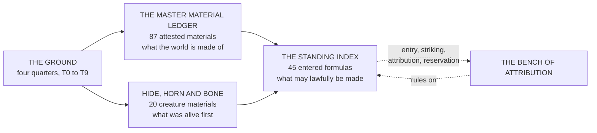

# Materials, Alchemy & Trade

> Three registers, one economy. **The Ledger** says what the world is made of. **The Standing Index** says what may lawfully be made from it. **Hide, Horn and Bone** says what was alive first.
> *A material that scores high on both is not called good. It is called strategic, and the Accord keeps a register of who owns the seams.*

---

## The Twin Rating

> **BEARING** is what a material does under load. Compression, tension, shear, thermal cycling, abrasion.
>
> Measured on the press. **It has nothing whatsoever to do with Essence.**
> **HOLDING** is what a material does under Essence. How much it retains, how long, how cleanly it releases, and whether an inscription stays legible to the Continuum over years rather than weeks.
>
> Measured on the coil.
**The two do not track each other.** Forge-Iron bears magnificently and holds nothing. Gloomhide is spiritually inert and physically superb. Mireclay holds a totem for one night and cannot hold a roof for one hour.
**Resonance** names the Wellspring or Wellsprings a substrate is naturally sympathetic to. **Family** names the behavioural family it sits in when worked. **Physics Domain** names the real-world law it answers to underneath the Parunic dressing — recorded so that *a Caloria-family refractory is not ordered for a Fulguria-family duty by a clerk who never went underground.*
> Blank cells in those three columns mean **canon is silent, not that the material is inert.** An Engraver who fights his substrate pays for it in the lifespan of the inscription.

---

## The Three Registers

| Register | Compiled from | What it settles |
|---|---|---|
| **The Master Material Ledger** | The Measurewrights' survey, the standing Accord T0–T9 list, the coin volume, the Four Ceilings technology history, and the Master Codex alchemical tab | Every material attested anywhere: building stone, structural metal, armour and weapon stock, fabric and thread, Holding substrate, precious metals, and the alchemical formula index |
| **The Standing Index** | The Bench's own register, with Provenance Class, Fidelity and Carry on every row | What is lawful in commerce. **Nothing in the alchemical economy exists commercially until it is entered** |
| **Hide, Horn and Bone** | The creature-material addendum | The organic input side, from the commonest worked bone in the four quarters to the skeleton of a confirmed World Spirit |

---

## What Reading These Registers Teaches

The registers are dry by construction and the pattern only shows at scale.
> **The world's whole high-temperature capability rests on two ores in two places.** Blacktooth wolfram out of the western tin districts and Ashfast chromite off the southern serpentine belt. The Logistics Division has flagged the dependency in every annual report for nineteen years and nothing has changed.
**The most important materials are the dull ones.** Chainsalt refuses Essence so completely that every gasket and isolation collar in every serious array is cut from it. Drawcord Sinew is the best cordage below silk and nobody has ever written a song about it. **Grey Standing Chalk is deliberately characterless**, and an apprentice who cannot make a circle work with it has made a bad circle.
**And the register's most consequential column is the one about where things came from.** The Three Marks run from **Class I Vein Draw**, taken straight off a Wellspring by array and carrying nothing, to **Class VI Archonic Residue**, which is not rendered but found, and has **no origin the instrument can locate.**
> Between them sits **Class IV, Crystal Draw** — rendered from something that carried a Soul Crystal. Three lawful sources, **and the arithmetic has never balanced.**

---

## Entries

> **The reading order.** Thirteen documents. The path runs from the ground upward: what the world is made of, what was alive first, how it is worked, what may lawfully be sold, who rules on it, what it is worth, and who does the work.
>
> **1 · The Bearing and the Holding** — the ground itself, and what Essence actually did to industry. **Read this first.** It is the only document that explains why the world looks the way it does, and everything below assumes it.
> **2 · The Master Material Ledger** — the Tier Scale, the Hazard Register, the unlocatable sources, and the Class IV shortfall.
> **3 · The Material Index, T0–T4** — the ground, the bulk supply, the first instrument grades.
> **4 · The Material Index, T5–T9** — what requires a forge-array, a rite, or a corpse, and what lies past that.
> **5 · Hide, Horn and Bone** — what was alive first, and the twentieth entry.
> **6 · Alchemetrica** — the practitioner's codex. What the work is, and what the bench costs the body.
> **7 · The Alchemical Index** — the forty-one attested formulas, each with its analogue, its mechanism and its failure.
> **8 · The Heresiology of Alchemy** — the doctrinal counterpart. Seven lawful stages, seven inversions, and the grammar a civilisation needs so it does not mistake catastrophe for genius.
> **9 · The Standing Index** — the Bench's own register. Forty-five entries, the three marks, and the three lawful sources of Class IV.
> **10 · The Bench of Attribution** — entry, striking, attribution and reservation, and the one instrument the procedure has never required.
> **11 · Value, Coin and Trade** — what any of it is worth, in two ledgers that meet at one number.
> **12 · The Works and Days** — who does the work, sorted by what the instrument can see.
> **13 · The Apparatus of the Age** — what they carry while doing it. The tallow candle before the Aethersteel plate.
> **On the two counts.** The Master Material Ledger carries **forty-one** attested formulas in its Alchemical Index. The Standing Index carries **forty-five** entries. *These are different registers and the numbers are not in conflict: one records what the trade knows, the other records what the trade was willing to surrender to the Bench.*
*The groupings below are the filing. The order above is the path.*

### I · The ground and the registers

*What the world is made of. The two Material Indices and the Alchemical Index sit beneath the Ledger.*
- [The Master Material Ledger](Materials, Alchemy & Trade/The Master Material Ledger.md)
- [The Standing Index](Materials, Alchemy & Trade/The Standing Index.md)
- [Hide, Horn and Bone](Materials, Alchemy & Trade/Hide, Horn and Bone.md)

### II · The bench

*How the work is done, what it costs the body, and how a civilisation names the ways it goes wrong.*
- [Alchemetrica](Materials, Alchemy & Trade/Alchemetrica.md)
- [The Heresiology of Alchemy](Materials, Alchemy & Trade/The Heresiology of Alchemy.md)

### III · The body that rules on it, and the money

*Filed elsewhere in the wiki and reached from here, because nothing in this section is settled without them.*
The Bench of Attribution
The Material Index · T0–T4
The Bearing and the Holding
Value, Coin and Trade

### IV · The hands that use it

*The registers say what the world is made of. These two say who touches it, with what, and what it does to them.*
**The Works and Days** sorts the whole population by **what the instrument can see** — three floors, and the register begins with the third **because they are the majority, and any account of the world's work that begins with the practitioners is describing the exception and calling it the rule.**
**The Apparatus of the Age** is its equipment appendix: *the tallow candle before the Aethersteel plate, because the candle appears in more scenes than any weapon.*
- [The Works and Days — Occupations, Trades and Technology](Materials, Alchemy & Trade/The Works and Days — Occupations, Trades and Technology.md)
- [The Apparatus of the Age — Equipment and Material Culture](Materials, Alchemy & Trade/The Apparatus of the Age — Equipment and Material Culture.md)
> **Cross-section note.** *The Works and Days* names its own unbuilt gaps — **food and cuisine, music, ground-level justice, domestic life and courtship** — which are the same items standing on the docket as **the folk world.** *That register is the closest thing to a foundation for them that exists.*
- [Weight, Measure and the Standard](Materials, Alchemy & Trade/Weight, Measure and the Standard.md)
> **What a pound is, and who never accepted it.** **Weight, Measure and the Standard** underpins the assay, the proof-mark and the Bench, none of which work without standard weights.
>
> Everything is built on a counted seed, which is also the flaw, since the Accord's grain is a Western seed. Two parallel systems: **market weight** at sixteen ounces for bulk and **assay weight** at twelve for anything the Bench touches, with the assay pound scaled so a bead reads directly as fineness. Weights carry verification stamps and a false one is **struck** with a six-point mark across them, and struck weights still in circulation are the most reliable indicator of how far the Accord's reach actually extends.
>
> Two things worth having in any market scene. A **cased** weight is a bronze shell filled with lead and gives a dull note instead of ringing, so every inspector taps before he does anything else. And the whole grain trade turns on one word, **level or heaped**, which makes the strike-board the most political object in the market.
