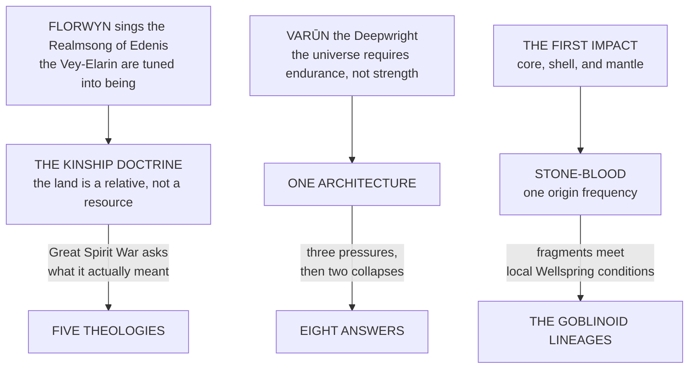

# Races & Peoples

> The pattern that runs under every people in this section: **one origin, several sincere and mutually incompatible answers to what that origin demanded.** Not a family tree of decline from a purer ancestor. A set of arguments that nobody won.
> *"She sang one note. We have spent every Eon since arguing about how it should be sung back."*

---

## The Shape of Every Schism

Every major people in the four quarters was made once, from one source, with one instruction. And in every case the instruction turned out to admit more than one honest reading, and the readings turned out to be irreconcilable, and the irreconcilability was discovered under maximum pressure rather than in a seminar.

| People | The one source | The instruction | What split it |
|---|---|---|---|
| **The Elven Peoples** | Florwyn's Realmsong | The Kinship Doctrine | The Great Spirit War asked, under maximum pressure, what the Doctrine actually demanded. **Five sincere and incompatible answers came back** |
| **The Dawi Peoples** | Varūn the Deepwright | Endurance, not strength | Two doctrinal divergences in the deep halls, then two collapses that stranded five populations on ground that shared nothing with a mountain's interior |
| **The Goblinoid Peoples** | The First Impact | Stone-Blood, one origin frequency | Core, shell, and mantle became three different kinds of body before anyone had an opinion about it. The Scattering did the rest |

> The useful reading is that **none of these branches is the degraded version of another.** Each is a complete and internally consistent answer to a question the source left genuinely open, and each is living with what its own answer cost.

---

## On Reading These Entries

The codices in this section are not neutral. Each people's entry is written from a position close enough to that people to make their reasoning legible, which means the same event is described three different ways depending on which page you are standing on.
**The Betrayal of the Mountain** and **the First Rational Act** are the same refusal. **The Sylvaar Rebellion Schism** is a rebellion from one side of the forest and a homecoming from the other. **The Sundering of the Deep Halls** has a trigger that the surviving branches' oral records and the High Dawi archives describe differently, and the difference has never been resolved because neither party has offered to open the question.
> Where a document records both accounts, both are reproduced. **Where the record contains only one, that is itself a fact about who kept the record.**

---

## Entries

**The Elven Peoples** carries all five surviving branches and, beneath it, **The High Empire of Eresse** — the single people they all were, described as it stood before it knew it was about to end.
**The Dawi Peoples** carries the origin, the fractures, and all eight branches in summary, with **The Reach Dwarves** beneath it for the five that were put somewhere else entirely and had to decide, from first principles, what enduring even meant once the mountain was no longer underfoot.
**The Goblinoid Peoples** carries the First Impact, all six lineages, the languages that branched from a metaphysical event rather than a spoken root, and Za'tarch — which is not a refuge and insists on the distinction.
**The Beastkin and Demihuman Peoples** carries the Labor Provision and what it actually means, the demihuman categories, and the languages, with **The Five Beastkin Lineages** beneath it at full architectural depth.
- [The Elven Peoples](Races & Peoples/The Elven Peoples.md)
- [The Dawi Peoples](Races & Peoples/The Dawi Peoples.md)
- [The Goblinoid Peoples](Races & Peoples/The Goblinoid Peoples.md)
- [The Beastkin and Demihuman Peoples](Races & Peoples/The Beastkin and Demihuman Peoples.md)
- [The Tongues of the Realms](Races & Peoples/The Tongues of the Realms.md)
> **Tongues.** The constructed languages live here rather than under The Magic System, because a tongue belongs to a people before it belongs to a working. **The Tongues of the Realms** is the framework: what counts as a language against what is only a naming register, the seven conventions binding every grammar, the family tree, and the build order. **The set is complete.** Old Vaross, Eressean and Varrisak, Runic Dawi, Accord Latin with its two spoken registers, and Common. **Accent** sits under Common as a menu for placing a speaker without spelling a single vowel.
>
> *Parunic is the exception and stays where it is. It is a script for writing boundaries onto laws, not a tongue anyone was raised in, so it lives under The Magic System with the Descent of Parun and the Counted Speech.*
>
> *Still open: Drow Shadow-Veil notation, described from outside in three places and never given an entry, and Mirror-Sign, named as a full manual language with its own grammar and never given one.*
