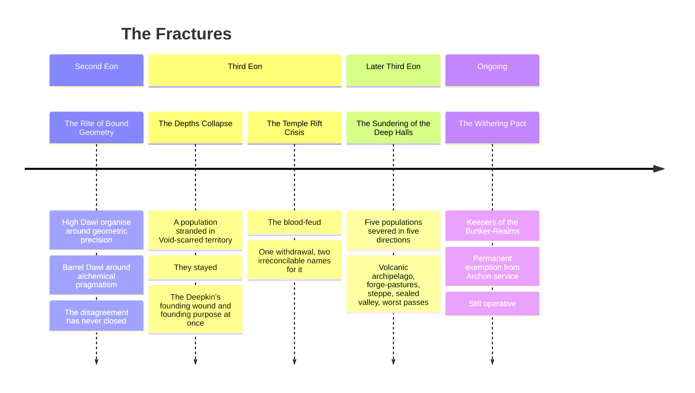

# The Dawi Peoples

*Eight Answers to One Endurance · Revised Codex*
> *"Varūn did not make us strong. He made us the thing still standing after strength finished arguing with itself."*
> — Dawi saying, lineage of origin disputed by all eight branches equally

---

## One Architecture, Three Original Pressures

The Dawi were made from one thing: **Varūn the Deepwright's understanding that the universe requires endurance, not strength.**
| Lineage | Varūn's face | Origin |
|---|---|---|
| **High Dwarves** | His **geometry** | The Rite of Bound Geometry, Second Eon — structure as the ground of reality |
| **Barrel Dwarves** | His **fermentation** | The Subterranean Crucibles, Second Eon — patience as transformation over time |
| **Deepkin** | His **threshold** | The Third Eon's Depths Collapse — the principle of endurance stripped to its minimum and found, against all expectation, to still be standing |

These three held the deep halls for the whole of recorded Dawi history. **What happened afterward is why there are eight lineages now instead of three.**

---

## The Fractures

Each fracture is still operating. **Understanding current Dawi politics requires reading them not as ancient history but as ongoing conditions.**

### The Rite of Bound Geometry · First Divergence

**Not hostile in origin.** Varūn's two primary aspects were understood as complementary by practitioners close to the Titan's original intent, and as competing by those who needed to govern populations. High Dawi communities organized around geometric precision; Barrel Dawi around alchemical pragmatism.
> The disagreement about which was truer to Varūn's nature has been running ever since and has never produced a resolution, **because both positions are correct and neither side is willing to say so.**

### The Depths Collapse · Second Divergence

A catastrophic failure deep beneath the Innerworld's foundations left a population stranded in Void-scarred territory with **no way back to the lit halls.**
They did not merely survive it. **They stayed, and have guarded the collapsed zones ever since**, uncredited by most formal Accord record. This is the Deepkin's founding wound and their founding purpose at once.

### The Temple Rift Crisis · The Blood-Feud

> The **High Dwarf record** describes a strategic withdrawal from an untenable position during a Void-incursion into collapsed temple zones.
>
> The **Deepkin record** — maintained in Mirror-Sign, not translated for external publication — describes what the Deepkin experienced on the other side of that withdrawal: **being left alone with the Void while the people who shared their Titan and their bloodline left.**
>
> The Deepkin held the collapsed zones. They have been holding them since. The distinction between *the High Dawi withdrew* and *the Deepkin were abandoned* has never been formally adjudicated.
>
> **The blood-feud is the Deepkin's position on who gets to name what happened.**

### The Sundering of the Deep Halls · Third Divergence

A separate, subsequent collapse — **the exact trigger still disputed** between what the surviving branches' oral records claim and what the High Dawi archives admit to — severed five further populations from the tunnel-network entirely, in five different directions, stranding each in terrain that shared nothing with a mountain's interior.
**None of the five could simply wait to be rescued.** Each rebuilt Varūn's teaching from the ground up, in whatever shape the new ground demanded.

### The Withering Pact · The Barrel Dawi Withdrawal

When the Archons made their claim on the Dawi people's service, the High Dawi's refusal produced confrontation that ended in autonomous status. The Barrel Dawi's refusal produced **the Withering Pact** — an agreement in which they accepted the designation of **Keepers of the Bunker-Realms** in exchange for permanent exemption from Archon service.
> The Pact is still operative. The vaults are still maintained. **The contents of those vaults are the primary reason external powers treat the Barrel Dawi with considerably more diplomatic care than their surface-level political profile would otherwise warrant.**

---

## The Eight Answers

| Branch | Doctrine | Endurance means… |
|---|---|---|
| **High Dwarves** | Permanence as Truth | the correct structure never needing to change |
| **Barrel Dwarves** | Transformation as Truth | patience applied to something that is allowed to change slowly, on its own schedule |
| **Deepkin** | Threshold as Truth | standing guard in the one place no one else can stand at all |
| **Kuntur Reach** | Verticality as Truth | claiming every elevation a body can reach as one territory |
| **Tallow Clans** | Season as Truth | moving between two homes so completely that neither one is ever truly left |
| **Windward Herds** | Motion as Truth | never needing a fixed place to still be whole |
| **Tower-Kin** | Debt as Truth | remembering exactly what is owed for as many generations as it takes to pay it |
| **Passwardens** | Passage as Truth | being the one fixed, trustworthy point in everyone else's movement |

---

## The Three Deep Lineages

### High Dwarves — Rune-Forgers of the Bound Geometry

Varūn's geometric will given biological form. **Reality is not chaos tolerating order, in their understanding, but order tolerating the illusion of chaos.**
A High Dwarf inscription is not decoration. It is the actual Aetheric vibration a concept is made of, rendered so exactly that **reality stops needing to be told what to do.**
**Essence Typology** · Terra (primary, geometric permanence) / Speculum (secondary, reflection — pattern revealing structure)
**Soul Path Bias** · Spirit 70% / Body 20% / Attraction 10%
**Wellsprings** · Monolithion (primary), Judicium (strong secondary), Fixatio and Basilithe (accessible). **Rejects Nyxial, Tenebra, and Void-aspected Wellsprings outright** — Geometric Cohesion is constitutionally antithetical to Void
> **Advantages** · The most corruption-resistant Crystal architecture in the Continuum; hostile intrusion shatters against its lattice the way glass shatters against stone.
>
> Geometric Domains where **lies leave measurable Aetheric residue** — not by punishment, but because inaccurate description is structurally detectable.
> **Limitations** · **Stage VII Refraction is disproportionately hard** for this lineage: an architecture built to describe the world accurately struggles badly to turn that same precision on itself.
>
> **Geometric Lock** overgrowth risk — an overextended Domain can produce zones of absolute spatial permanence that trap the unwary before the practitioner even notices.

### Barrel Dwarves — Alchemical Architects of Kegshard Hold

Where High Dwarves are Varūn's geometry, Barrel Dwarves are his fermentation: **the understanding that not all structure is stone, that some endurance is brewed.**
Kegshard Hold's Deepvault and the Great Cask-Oath are the same instinct in two forms — the conviction that **the most dangerous and the most precious things both deserve to be aged, watched, and never rushed.**
**Essence Typology** · Terra (primary, alchemical transmutation) / Manganthra (secondary, transformation through contradiction)
**Soul Path Bias** · Body 85% / Fate 15% — **the only Fate Path access in the Continuum to emerge from watching barrels rather than the sky**
**Wellsprings** · Basilithe (primary), Manganthra (strong secondary), Fungor (accessible, and uniquely so among Dawi lineages), Verdantia (accessible). Poorly compatible with Aurevane, Luminalis, and high-frequency Celestial Wellsprings
> **Advantages** · **Alchemical aging** — their Crystal genuinely compounds potency the longer it holds Essence rather than spends it, so veterans outperform beginners in ways Level comparisons do not capture.
>
> The **Great Cask-Oath** makes their word structurally, not just socially, reliable; breaking one costs the Crystal's own Coherence automatically.
> **Limitations** · **Spirit-Blindness.** Roughly **40%** of Barrel Dwarves approaching Stage VIII without deliberate Spirit Path supplementation plateau or enter an unrecognized slow spiritual compression.

### Deepkin — Guardians of the Collapsed Zones

Varūn's threshold: **endurance reduced to its bare minimum and found to still hold.** Stranded by the Depths Collapse in Void-scarred territory nothing else can safely enter, they stayed, and have guarded it since — continuously, largely uncredited, **in a single paragraph of Third Eon Accord record that has never been updated.**
Their names, in the Deepkin's own record, are kept in Mirror-Sign and **deliberately not transliterated for outside use.**
**Wellsprings** · Nihiloth (primary, native), Basilithe-Earthfold collapsed variant (accessible), corrupted and collapsed Wellsprings generally (primary access unique to this lineage). **Rejects Celestial, Dream, and Divine Wellsprings outright** — 2× damage from Divine Light or Holy-frequency glyphs
> **Advantages** · **Aura Dead-Zone** — passive Aetheric suppression, +35% AoE resistance, reduced enemy technique efficiency in radius.
>
> **Dissonance Anchor** — passive Stage X zone stabilization within 15m, allowing others to work briefly in collapsed zones under their coverage.
>
> Total immunity to Madness and Spiritual Fragmentation; **100% efficiency Void-aspected access no other lineage safely approaches.**
> **Limitations** · **Psychological Void at Stage VIII** — roughly **30% risk of permanent Catatonic Stasis** on a failed Transcendence check without prior Soul-Caving preparation.
>
> The Aura Dead-Zone **is not selective.** It suppresses the Aetheric environment for allies as thoroughly as for enemies, complicating any collaboration with Wellspring-dependent partners.

---

## Languages of the Dawi

Dawi languages share one structural feature: **they are built for endurance rather than efficiency.** Each is physically adapted to what the lineage needs to survive.
- ****Lattice Tongue** · High Dawi**
  Not a separate language — **the foundational Parunic access level at which phonemes are not symbolic representations but Aetheric vibrations that constitute the concepts they represent.** High Dawi do not translate from language to glyph; they produce the glyph directly through speech.

  Non-High-Dawi practitioners who have attempted to learn it through immersion describe the experience as **learning to think geometrically rather than learning a new vocabulary.** Some succeed. Most find that the architecture required to produce Lattice Tongue phonemes correctly is not available to them without significant Crystal restructuring.
- ****Runic Dawi / Barkstone Dialect** · Barrel Dawi**
  The working language — material-world resonance built into the phonemic structure. **Old Alchemic Song** is the tonal register used in brewing chants: it physically vibrates the liquids being crafted, producing a direct mechanical-acoustic effect on the alchemical substrate.

  A Grand Brewmaster singing the Alchemic Song into a fermentation vessel produces measurably different results from a silence-brewed equivalent. **The Alchemic Song is not spiritual; it is physical. The physical effect is real.** Non-Barrel-Dawi practitioners can reproduce it with sufficient practice and an adequately calibrated voice range.
- ****Low Dawi Hollow Dialect** and **Mirror-Sign** · Deepkin**
  Their spoken language is produced by vocal cords that operate within the Aura Dead-Zone's dampening field. **Sound dies in their throats before achieving full resonance** — this is not stylistic, it is the physical consequence of their Void-fold architecture. The Hollow Dialect carries information in the specific quality of the sound-absence as much as in the sound itself, and trained Deepkin listeners read the hollow quality's variations as a secondary channel of meaning.

  **Mirror-Sign is the primary operational language** — micro-reflections, hand gestures, and Entropic Vein micro-movements that communicate through reflected absence. It cannot be detected by standard Harmonics Attunement. It produces no Aetheric signature. **It is, in the most precise sense, undetectable by anyone who has not been taught to see it.**
> 
> > *"You are still here."*
>
> Varūn the Deepwright's singular principle, expressed to each of his three peoples **in the specific language each of them needed to hear it in.**

---

## Discrepancies of Record

*Attested, not reconciled.*
**The parties to the Temple Rift Crisis.** The detailed record places the blood-feud between the **Deepkin and the High Dawi**, arising from a withdrawal from collapsed temple zones during a Void-incursion, and this account is reproduced above. A second register describes the Temple Rift Crisis instead as ongoing tension between **High Dawi and Barrel Dawi** lineages. Both cannot describe the same event. The Measurewrights note that only the first account names what the feud is actually about.
**The count of fractures.** One register lists three fracture events and omits the Depths Collapse and the Sundering. Another lists four and omits the Withering Pact. **All five are reproduced above**, on the reasoning that no register has withdrawn any of them.
**The count of branches.** An earlier framework describes seven Dawi branches — two deep lineages plus five surface — while the current codex describes eight, counting the Deepkin as a full branch rather than as an adjunct of the deep halls. **This register follows the eight.**

---

> *"Eight ways to still be standing, and Varūn has never once told any of us which one he actually meant."*
> — Attributed to a joint Kegshard–Qori Anka trade summit, exact speaker disputed
- [The Reach Dwarves](The Dawi Peoples/The Reach Dwarves.md)
