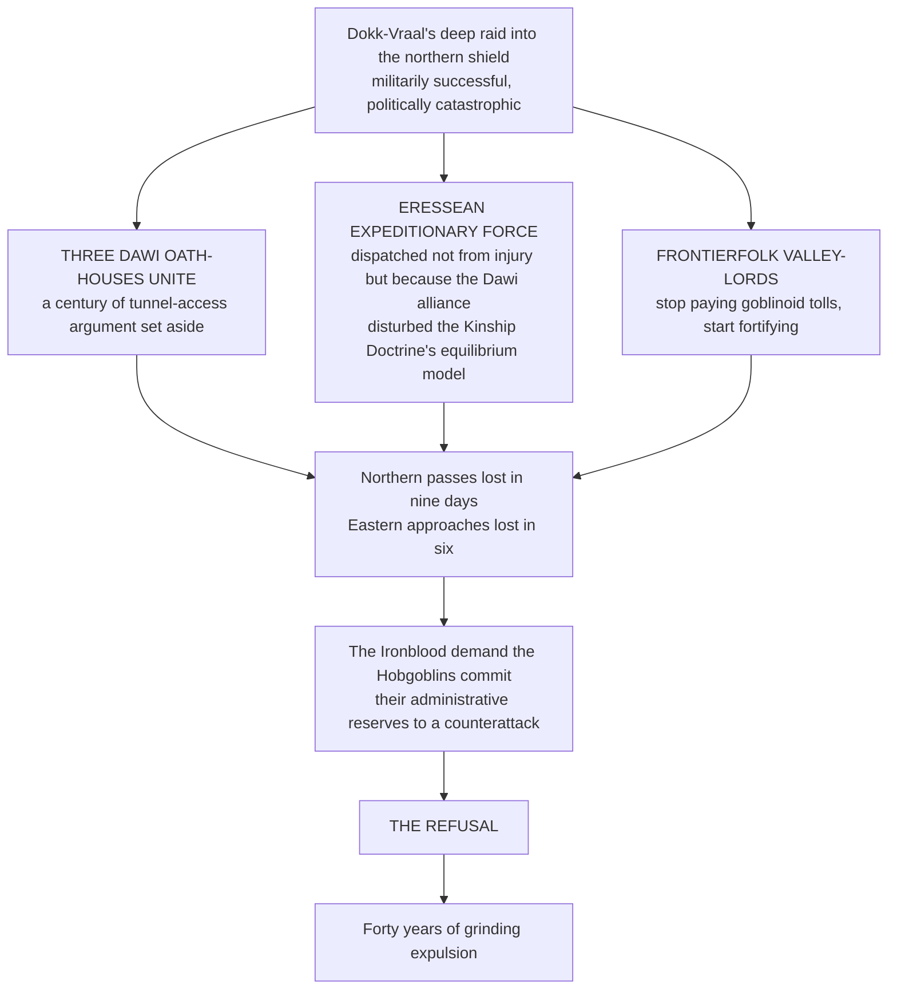

# The Hobgoblin Expanse

**Say it** · HOB-gob-lin ek-SPANS · *Vorruk-Khal* VORR-ook KHAHL
**Vorruk-Khal · The Held Ground**
> *Vorruk* does not mean ground the way a farmer means ground. **It means ground that tried to move and was stopped.** *Khal* does not mean held the way a hand holds a cup. **It means held the way a wound holds together after stitching.**

---

## Overview

A volcanic archipelago of **forty-three islands** strung across the waters where the Old World's southern coast drops toward the Outer World's western shelf. The Concord charts name it Vorruk-Khal, which is Old Vaross, though the phrase carries a weight the translation does not.
The islands are young. Geologically they belong to the same volcanic arc that built the New World's eastern seaboard, a chain of andesite peaks pushed up by the same subducting plate at a different angle. The tallest, **Gorr-Keth**, reaches four thousand feet above the waterline and glows orange at night when the wind shifts. The smallest are little more than basalt shelves a few hundred paces across, colonised by lichen and by Tinker Goblin signal-relay stations that have been there long enough that nobody remembers who built the first one.
Fourteen of the forty-three are inhabited year-round. The rest serve as seasonal fisheries, volcanic-glass quarries, sulphur fields, or navigational markers. **Three are forbidden entirely** — not because anyone enforces the prohibition, but because the ground shakes there in frequencies that make Stone-Blood vibrate at the wrong harmonic, and the Bugbear population discovered this the hard way four centuries ago and has not needed to rediscover it.
> The Expanse is the largest self-governing goblinoid polity in the four quarters. **It is not a kingdom.** It has no king, no warlord, no hereditary seat of any kind.
>
> What it has is a parliament, and the parliament is older than most of the kingdoms that regard it as a curiosity.

---

## The Scattering · Grr-Vashuum

In the early First Eon, the goblinoid peoples held territory in the western quarter's mountain passes, where the rock was closest to the asteroid's original composition and the Stone-Blood ran strongest.
They were governed, loosely, by **Ironblood Orc warchief coalitions.** The word *governed* does too much work. What the Ironblood provided was a chain of command running on kinetic hierarchy: the strongest warband held the best passes, the passes controlled the trade, and the trade funded the war-parties that held the passes. It was circular. It functioned. *It functioned the way a wheel functions on a slope, which is to say it kept moving and the movement was its own justification.*
The **Crimson Order** existed within this structure, but uncomfortably. Hobgoblin discipline and Ironblood volatility occupied the same valleys the way two predators share a forest when neither can afford to leave. The Hobgoblins administered the granaries, maintained the glyph-wards, and trained the mixed formations that held the passes against Dawi incursion from the north and Elven pressure from the east. They were, by every measure except the one the Ironblood cared about, **the architecture of the goblinoid presence in the Old World.**
*The measure the Ironblood cared about was violence, and they were better at it, and they said so with the regularity of a church bell.*

### The three stages of collapse

> The refusal is the moment the Ironblood call **the Betrayal of the Mountain**, and that the Crimson Order calls **the First Rational Act.**
What followed was not a single event but a grinding expulsion over approximately forty years. Ironblood warbands broke into raiding parties and scattered to every quarter that would tolerate them. Verdant Orc bands slipped into the deep wetlands of the southern interior and were not seen again for centuries. The Crimson Order, with whatever Tinker Goblins and Fleshshaper enclaves would follow, withdrew southwest along the coast **until they ran out of coast** and found the volcanic chain rising out of the water.
The Hobgoblin name for this is ***Grr-Vashuum***, built from *grr-* (a force event, kinetic, percussive) and *vashuum* (a thing that opens where it should not). **It is the word for a fault line that splits a load-bearing wall.**
> The Ironblood use it too, but they pronounce the second syllable shorter, as if the breaking was quick and clean. The Hobgoblins hold the vowel. **The breaking was not quick.**

---

## The Seventh Lineage · The Bugbear Peoples

**Mantle-Born · Gorr-Veshaal**
| **Type** | Major Race — Asteroidal Depth-Kin / Endurance-Forged |
|---|---|
| **Origin** | Second Epoch. Born from the **mantle layer** of the First Impact — the intermediate mass between the core that compressed and the shell that shattered |
| **Metaphysical Anchor** | Essence (Gravitational / Passive) — inertial mass, not kinetic force or structured lattice |
| **Spiritual Lineage** | **The Weight-That-Stayed.** Where the core compressed and the shell exploded, the mantle did neither. It absorbed |

They are the largest of the goblinoid peoples, standing between seven feet and eight feet four, and they carry their height differently. **An Ironblood Orc's body is built for output. A Bugbear's body is built for absorption.** The shoulders are wider than a Hobgoblin's and sloped rather than squared, distributing load across a frame that was never designed to throw a punch first. The chest is deep, not broad. The waist does not taper. The legs are short relative to the torso, thick, rooted, set wide in a stance that looks casual until someone tries to move it.
Their skin runs darker than any other goblinoid lineage: deep charcoal grey to near-black, matte, absorbing light in a way that is difficult for other races to look at directly. Their Stone-Blood runs thickest but slowest, and the asteroidal mineral deposits in their tissue are arranged in **layered striations** rather than the Ironblood's jagged scars or the Hobgoblin's geometric etchings. Under the skin the layers are visible as faint banded patterns, grey on darker grey, that shift when they move. *A Bugbear in motion looks as if the mountain itself is rearranging its strata.*
> Their hair is not decorative. **It is sensory.** Bugbear hair follicles contain a density of Aetheric nerve endings that allow them to read ambient Essence pressure changes through the scalp. They feel weather, Wellspring fluctuation, and hostile intent **before any other sense registers it.**

### Axiomatic traits

| Trait | Function |
|---|---|
| **Gravitational Anchor** | Passive weight multiplication. A Bugbear who plants and chooses not to move becomes functionally immovable by any force below Grade A kinetic output. Stone-Blood increases effective mass by a factor of **six to eight**, involuntarily, under threat. Knockback, displacement, and forced-movement glyphs lose **60% to 80%** of their effectiveness against a set Bugbear |
| **Inertial Dampening** | The mantle's inheritance. Impact force is reduced by **transmission rather than deflection**, dispersed across the entire layered tissue structure. Where an Ironblood converts received force into stored kinetic energy, a Bugbear simply takes less damage — permanently, passively, without activation cost. **25% baseline, scaling to 40%** under sustained bombardment as the tissue compresses and hardens |
| **Presence Gravity** | At Stage VI and above, a passive Aetheric gravity field within roughly fifteen paces. It does not pull physically. **It pulls metaphysically.** Ambient Essence flows toward the Bugbear rather than dispersing, and practitioners inside find their own expenditure increased by roughly **+8% AU cost** on all active techniques. The Bugbear does not benefit from the gathered Essence. It simply pools and dissipates slowly. *A high-Stage Bugbear warps the tactical economy of an engagement merely by standing in it* |

> **Key limitation · Inertial Lock.** A Bugbear who has activated Gravitational Anchor cannot transition to full combat speed for **2.4 seconds** after release, during which their reaction time drops to human-baseline. **This is the window.** Every opponent who has fought a Bugbear and survived learned to read the release.
>
> **Speed Deficit.** Travel speed caps at roughly 60% of an equivalent-Grade Ironblood Orc. They are not slow. They are slower than the thing they are most often compared to, *which has been enough to get them killed in open-field engagements where mobility determined survival.*

### Cultural lattice

**Language** · Low Goblintongue for working. **Gorr-Vaross** among themselves, a Bugbear dialect of Old Vaross distinguished by extended vowels held at sub-bass registers that physically vibrate the listener's ribcage at conversational distance. *Formal Bugbear speech is felt before it is understood.*
- ****The Laying of Weight** — responsibilities as part of the body**
  When a Bugbear assumes a new responsibility — a seat in the Keth-Gorrum, a wardship, a marriage, a sworn contract — they carry a stone from the shore to the peak of the nearest island summit without stopping. The stone must be heavy enough that the climb takes effort.

  **The act is not symbolic. It is structural.** Bugbear Stone-Blood responds to sustained gravitational load by deepening its layered compressions, and a Bugbear who has carried many stones has a measurably denser Aetheric signature than one who has not.

  Their responsibilities are, in a literal metaphysical sense, part of their body.
- ****The Long Silence** — grief felt in the follicles**
  When a Bugbear of consequence dies, every Bugbear within earshot of the announcement stops speaking for one full day. Not as a vow. Not as a rite. **As a fact.**

  The sub-bass frequencies of Gorr-Vaross carry a harmonic signature unique to each speaker, and when a known signature ceases, the absence is physically perceived by every Bugbear whose hair has ever registered it.

  The silence is not grief performed. It is grief felt in the follicles, and **it takes a day for the sensory absence to stop triggering a searching reflex.**
**Signature imagery** · Layered basalt columns, deep shadow, carried stones, and the Closed Fist resting on a flat surface — the gesture that means *I am staying.*
**Relations** · Permanently allied with the Crimson Order by parliamentary integration. **Respectful contempt for the Ironblood Orcs**, whom they regard as an argument for governance that has been losing since the First Eon and has not yet noticed. Cautious trade with the Dawi Reach peoples, who share their experience of building a civilisation on volcanic rock nobody else wanted. They describe Elves as *"people who have never carried a stone in their lives and it shows."*

---

## Geography of the Expanse

The forty-three islands are arranged in a rough crescent running southwest to northeast, following the volcanic arc's surface expression. The crescent opens toward the Old World's coast, approximately two hundred leagues north. The southern horn trails toward the Outer World's western shelf, where the water shallows over ancient craton, the fishing is good, and **the Crevice's influence is not yet measurable.**
| Tier | Count and elevation | Function |
|---|---|---|
| **The High Islands** | Seven, peaks above 2,000 ft | The oldest Hobgoblin settlements, built into caldera walls and leeward slopes where the volcanic soil is deep enough to farm. Terraced agriculture produces taro, breadfruit, volcanic-ash grain (a Tinker Goblin cultivar of three centuries ago that they have been failing to improve ever since), and **thurr-kep**, a root that grows nowhere else and tastes, according to every non-goblinoid who has tried it, *exactly like charcoal mixed with honey* |
| **The Shelf Islands** | Twenty-two, 300 – 2,000 ft | The working backbone. Forges, shipyards, obsidian quarries, sulphur processing, and the parliamentary complex on Vesh-Undaal. Densest population: mixed Hobgoblin-Bugbear communities with Tinker Goblin workshop enclaves and a persistent Fleshshaper quarter on **Krev-Mol**, where the ambient Essence is irregular enough that their self-modification practices find raw material more easily |
| **The Low Reefs** | Fourteen barely above the waterline, plus uncounted tidal shelves | Fisheries, kelp farms, signal relays, and the geothermal vent-forges the Dawi Reach peoples taught the Hobgoblins to build. Permanent residents are predominantly Bugbear fishing families who regard the high-island parliament with **the tolerant disinterest of people who have never needed its help and expect never to** |

---

## The Keth-Gorrum · The Open Assembly

The parliament meets on **Vesh-Undaal**, a shelf-tier island whose entire western face is a sheer basalt cliff carved with seven hundred years of parliamentary records.
> The records are not decorative. **They are load-bearing.** Every motion passed, every treaty ratified, every war declared and every war refused is inscribed into the cliff-face in High Concord script, and the inscriptions are Engraved in the Crimson Order sense: they carry Aetheric weight.
>
> **A law written into the Parliament Rock is not a piece of paper that can be lost. It is a fact about the stone, and the stone remembers.**
The name combines the Open Palm gesture (*Keth-ur*) universal to goblinoid culture with the Old Vaross root *gorr-*, meaning assembly, or mass, or the-weight-of-many-standing-together. **The name is a statement of method:** governance by open deliberation among those who carry weight. Not by hereditary right. Not by combat supremacy. By the accumulated mass of argument, evidence, and responsibility.

### Composition

**One hundred and twelve delegates**, apportioned by island population and adjusted every twelve years by census. The current apportionment gives the seven high islands thirty-eight seats, the shelf islands fifty-six, and the low reefs eighteen. Delegates serve six-year terms.
**There is no executive. There is no judiciary separate from the parliament.** What there is, is a **Speaker of the Rock**, elected from among the seated delegates for a single twelve-year term, who controls the order of debate and nothing else.
**Bugbear delegates hold thirty-one seats**, a proportion that has increased steadily over three centuries. They vote as a bloc on maritime law and fishery rights and as individuals on everything else, *a pattern the Hobgoblin delegates find alternately reassuring and infuriating depending on the issue.*
**Tinker Goblin guild-seats number four**, allocated by trade guild rather than island: the Forge Guild, the Signal Guild, the Quarry Guild, and the Alchemical Compact. These carry voice but not vote on military matters, a restriction the Tinker delegates have protested formally in every session for ninety years **and informally by building increasingly alarming signal-relay devices on the parliament roof.**
**Fleshshaper representation is consultative.** Two appointed advisors attend on matters of public health, Aetheric contamination, and biological infrastructure. They do not vote. *They do not want to vote.* They have made this clear in language the parliamentary records describe as "direct."

### The Orc Exclusion

No Ironblood Orc has ever held a seat. **This is not written into the parliamentary charter. It does not need to be.** The charter requires twelve continuous years of residency before standing for election, and no Ironblood Orc has ever lived in the Expanse for twelve continuous years.
> Several have tried. The longest residency on record is **Vorrak the Patient**, who lasted eleven years, two months, and six days before breaking a shelf-island dock in half during an argument about fish pricing and departing by the next available vessel.
The Hobgoblin position is not exclusionary in principle. It is exclusionary in practice, **and the practice is the point.** The Crimson Order's founding argument is that governance requires the discipline to sit still, to listen to an argument one disagrees with, and to respond with words rather than with the nearest heavy object. Individual Orcs of remarkable self-control exist and are welcomed as residents, traders, and workers. They are not welcomed as legislators, because **the parliament cannot survive a single session in which a delegate overturns a table**, and the Ironblood have not yet produced a generation in which no tables were overturned.

---

## Timeline

| Date | Event |
|---|---|
| **Second Epoch** *cosmological, pre-reckoned* | **THE FIRST IMPACT.** The asteroid strikes the mortal world. Core becomes Hobgoblin, shell becomes Orc, mantle becomes Bugbear. The six goblinoid lineages emerge over the centuries that follow as impact fragments interact with local Wellspring conditions. **Stone-Blood encodes all lineages to a single origin frequency** |
| **c. −1,380** | Goblinoid Old World settlement. Ironblood coalitions govern by kinetic hierarchy; Hobgoblin infrastructure supports the military structure; Bugbear clans anchor the interior valleys |
| **c. −1,340 to −1,300** | **THE SCATTERING.** Forty-year compression and expulsion from the Old World |
| **c. −1,290** | **LANDFALL ON GORR-KETH.** First permanent settlement in the caldera. Bugbear clans claim the shelf tier. The name Vorruk-Khal enters the record |
| **c. −1,250** | **THE FIRST ASSEMBLY.** A dispute over freshwater access between three Hobgoblin settlement-commanders and a Bugbear fishing cooperative escalates to the edge of violence. A Bugbear elder named **Thaal-Gorr** proposes the dispute be settled by open argument in a public forum rather than by rank or force. *The precedent holds* |
| **c. −1,200 to −1,100** | **THE QUIET CENTURY.** Consolidation. Terraced agriculture. First obsidian quarries. Gorr-Vaross develops as a distinct dialect. The Crimson Order's Vow of Silence adapts to island conditions with a maritime variant permitting speech during navigation emergencies, *a pragmatic exception the mainland fortress-monasteries have never formally acknowledged* |
| **c. −1,050** | **FORMAL CHARTER.** **Kethaal the Inscriber** carves the charter into the cliff-face of Vesh-Undaal with her own hands over eleven days. Establishes residency requirements, population-based apportionment, term limits, and the prohibition on hereditary seats. *It does not mention Orcs. It does not need to* |
| **c. −900** | An established polity of roughly twelve thousand across nine islands. The Hobgoblin merchant marine, built from volcanic-glass-hulled vessels of a design found nowhere else, makes its first recorded crossing to the Old World coast |
| **c. −700** | **FIRST BUGBEAR SPEAKER.** Gor-Thuum of the Shelf Islands. His term is remembered as the most procedurally uneventful in parliamentary history, *which is the highest compliment the Hobgoblin delegates know how to pay* |
| **c. −500** | **THE ANTEDILUVIAN CONTACT.** Trade is attempted and fails. **The Antediluvians regard goblinoids as raw material.** The Expanse withdraws entirely from eastern waters and maintains a defensive perimeter. *The first recorded instance of the Keth-Gorrum voting unanimously* |
| **c. −450** | The Antediluvian civilisation collapses. The Expanse is unaffected. The parliament debates whether to send aid and decides, after eleven days, not to. **The margin is four votes. The debate is inscribed in the Rock in full** |
| **c. −200** | **POPULATION PEAK.** Roughly forty-five thousand across fourteen islands. The Bugbear population exceeds the Hobgoblin population for the first time and the apportionment adjusts accordingly. **No civil unrest accompanies the shift.** The Hobgoblin delegates note that the system worked as designed and say this with the specific tone of people who designed the system |
| **c. −100** | **TREATY OF THE WESTERN SHELF.** Negotiated by a Bugbear trade delegation and notable for being written in Low Goblintongue rather than High Concord, *a choice the Hobgoblin Foreign Affairs committee approved through gritted teeth* |
| **Year 000** | The Expanse sends an observer to the founding of the Concord **but does not sign the Codex.** Stated reason: the Codex concentrates enforcement authority in a manner incompatible with parliamentary sovereignty. Unstated reason: the Concord is built on the Old World's institutional logic, **and the Old World is the place that threw them out.** They trade with the Accord. They do not belong to it |
| **c. 100–150 IC** | **THE GOLD FLOOD.** Eastern placer gold destabilises western currencies. The Expanse's sulphur and obsidian exports, priced in weight-barter rather than coin, are suddenly among the most stable commodities in the four quarters. The parliament raises export volumes by twelve percent and holds prices constant |
| **c. 350 IC** | **IRONBLOOD INCURSION.** The warchief **Grakh-Tuul** attempts to seize the low reefs. The response is not military: the Keth-Gorrum votes to cut off freshwater resupply and wait. Unable to find potable water on the tidal shelves, the warband withdraws after sixteen days. **No Hobgoblin or Bugbear soldier draws a weapon.** Recorded in the Rock under the heading *"Resolved by Geography"* |
| **c. 500 IC** | **DAWI REACH CONTACT.** The Kuntur Reach Dwarves, themselves a volcanic-island people, establish formal trade. The Dawi teach geothermal vent-forging; the Hobgoblins teach glyph-inscription under seawater pressure. *Both sides deny learning anything from the other in public and acknowledge it freely in private, which is the foundation of every durable trade partnership in the four quarters* |
| **c. 650–715 IC** *present* | Roughly sixty thousand across fourteen permanent islands. The parliament is in its **seven hundred and sixty-fifth year of continuous operation.** The current Speaker is **Vaal-Gorrum**, a Bugbear, the ninth non-Hobgoblin to hold the position. The Withering has not measurably affected the Expanse's Wellspring access — which Hobgoblin scholars attribute to the arc's independent magmatic Essence source, and **everyone else attributes to nobody wanting the islands badly enough to deplete them** |

---

## Historical Figures

**Dokk-Vraal, the Breaker** · Ironblood warchief whose northern shield raid triggered the coalition that expelled the goblinoid peoples. Not a member of the Expanse. Remembered in the Keth-Gorrum's records as the author of the exile, **cited in every debate about Ironblood participation as evidence that force without counsel produces exactly one outcome.**
**Thaal-Gorr, the First Voice** · Bugbear elder who proposed public argument as an alternative to violence during the freshwater dispute. Did not hold formal office. Did not seek it. The tradition that grew from his proposal now governs sixty thousand people, and *the only thing recorded about his personal life is that he was a fisherman who hated mornings.*
**Kethaal, the Inscriber** · First Speaker of the Rock. Carved the charter in eleven days. **Served one twelve-year term and refused a second**, on the stated ground that a Speaker who serves twice has begun to believe the Rock needs them specifically, *and it does not.*
**Gor-Thuum, the Shelf-Speaker** · First Bugbear Speaker. His term was so procedurally smooth that the historians describe it as "unremarkable," which is the word the Keth-Gorrum reserves for governance that required no crisis management, no emergency sessions, and no personal heroism. **He took this as the compliment it was.**
**Grakh-Tuul, the Thirsty** · Ironblood warchief who withdrew after sixteen days without water. *The epithet was given by the Hobgoblin record-keepers and has survived because it is funnier than anything the Ironblood call him.*
**Vaal-Gorrum, the Current Speaker** · Bugbear, ninth non-Hobgoblin Speaker, serving in Year 715 IC. Known for a deliberation style other delegates describe as *"waiting until everyone else has finished being wrong."* Has held the Speaker's gavel for four years without using it to call order, **because the gavel is a Bugbear-forged basalt weight that would crack the Speaker's podium, and everyone in the chamber knows it, and that knowledge has been sufficient.**
**Gorrum Ashentusk** · Za'tarch Elder, not of the Expanse. The most prominent living advocate of cross-lineage goblinoid unity. Za'tarch is a village of two hundred. The Expanse is a nation of sixty thousand. **He is doing with philosophy what the Keth-Gorrum did with law, and both sides are watching the other to see whose proof holds longer.**

---

## The Orc Question

Every Hobgoblin child in the Expanse learns the Scattering before they learn to read. Every Ironblood child in the four quarters learns the Betrayal of the Mountain before they learn to hold a weapon.
> **They are learning the same event. They are not learning the same lesson.**
> **The Ironblood position**, unchanged in fourteen hundred years: the goblinoid peoples were strong enough to hold the Old World if they had fought together, and the Hobgoblin refusal to commit their reserves was the act that lost the homeland. Force was the answer. More force was the better answer. **The Hobgoblins chose cowardice disguised as wisdom, and everything that followed is their fault.**
> **The Hobgoblin position**, equally simple and equally unchanged: the peoples were driven out because Ironblood leadership made enemies of every other race on the continent simultaneously, refused every diplomatic alternative, and then demanded that everyone else die for the mistake. **The homeland was lost the day Dokk-Vraal crossed into the northern shield without counsel. Everything that followed was consequence.**
**The Bugbear position is the one nobody asks for and both sides find uncomfortable: both are correct.** The Ironblood were right that more force might have held the passes for another generation. The Hobgoblins were right that holding them for another generation would have delayed the expulsion, not prevented it, because the fundamental problem was not military but political.
And the Bugbears, who were in the interior valleys growing grain while the passes changed hands, **were the ones who carried the heaviest load during the withdrawal and received credit from neither side for doing it.**
> The Bugbear position is therefore not neutrality. It is the specific irritation of someone who did the carrying while two other people argued about direction.
>
> They chose the Hobgoblin road because the Hobgoblin road went somewhere. **The Ironblood road went in circles, and the circles were getting smaller, and the Bugbears could see the bottom.**

---

> *Compiled for the Archives Eternal. Unsigned, as is customary for documents whose authorship is institutional.*
