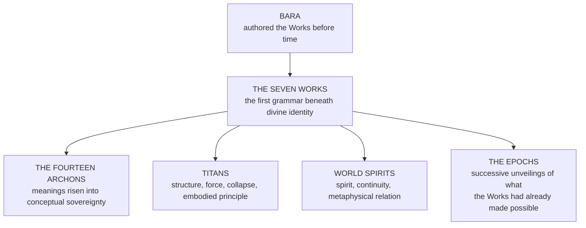

# Hataraki — The Works of the Plane of Fate

*Hataraki, literally translated as Work, is the governing function of the Plane of Fate.*
> It is not merely a form of magic, nor simply a source of power. It is the labour by which existence is maintained, classified, corrected, and moved toward its appointed outcome. Where other systems channel force, **Hataraki administers purpose.**

---

## Overview

In this framework, the Plane of Fate is not a passive realm where destinies drift. It is an active plane of order, motion, judgment, and unfolding design. Hataraki is the operative current running through that plane. Through it, ruin destroys when destruction is required, purity establishes what must endure, spirit governs the traffic between life and death, temporality arranges sequence and history, knowledge reveals meaning, balance reconciles opposition, and totality gathers all functions into one complete law.
Each expression of Hataraki is called a **Work** because each one performs a necessary labour inside reality. A Work does not simply symbolize an idea. It enacts that idea as a law-bearing process within the world.

### Origin

Before measured time, before chronology, and before the later unfolding of the epochs, **Bara** created the Works of the World within the Plane of Fate. These Works were not made as techniques or schools of sorcery, but as primal functions: the first operative laws by which existence could act, divide, endure, unravel, and complete itself.
For this reason the Works are older than history and older than sequence. Even time itself is not prior to them, because temporality is only one Work within the larger order of Hataraki. The Plane of Fate therefore stands as **the chamber of function before event**, the unseen order beneath becoming, where reality is not yet merely happening, but being assigned its labour.

### The Three Levels

Hataraki operates on three levels at once.
| **Conceptual** | It defines what a thing means within the order of existence. |
|---|---|
| **Operational** | It determines what that thing does and how it affects reality. |
| **Judicial** | It determines when that function is permitted, necessary, excessive, or forbidden. |

Under this model, fate is not blind prediction. **Fate is labour.** It is the continuous work of assigning, preserving, undoing, measuring, and completing the roles of all things.

---

## The Works, the Archons, and Higher Being

The Archons exist as sovereign intelligences of conceptual law, but the Works are more basic than Archonic personhood. The Archons exist because these meanings rose into conceptual sovereignty; the Works represent what those meanings are at their most stripped-down and fundamental level.
> If an **Archon** is a crowned idea, then a **Work** is that idea at its first and barest function.
The Archons are not identical to the Works, nor do they replace them. The Works are more primordial. They are the first grammar beneath divine identity, the raw operative meanings from which higher law could later become conscious, named, enthroned, and cosmically administered. The Archons embody, judge, and exalt meanings already latent within the Works.
This also explains the existence of World Spirits and Titans. Such beings do not arise in a void. World Spirits can exist because Spirit, continuity, and metaphysical relation already function. Titans can exist because structure, force, collapse, world-law, and embodied principle were already written into reality by the Works. **The Works are the precondition for those greater beings to manifest at all.**

---

## Attraction Force and Obsession Force

No Work can endure as more than a passing occurrence unless existence recognizes it.
**Attraction Force** is the law of recognition, the binding principle that allows one presence to acknowledge another and for that acknowledgment to persist as continuity. Through it, vows remain binding, relics remember their bearers, lineages preserve their echo, Domains remain stable, and spiritual relations survive time, death, distance, and change. Within Hataraki, Attraction Force is what allows a Work to stay lawful, sustained, and recognized inside reality. A Work functioning through it binds through recognition rather than captivity, preserves continuity without erasing distinction, and remembers without devouring freedom.
> **Obsession Force** is the corrupted inversion. It arises when recognition loses mercy and release. Then connection no longer preserves. It imprisons. What was once lawful continuity becomes fixation, recursion, possession, and spiritual suffocation. Under Obsession Force a Work does not merely act. **It clutches, repeats, saturates, and narrows until its function becomes a cage.**
Every Work therefore possesses both a lawful expression and a corruption vector.

---

## The Seven Works

> The Works do not replace the canonical Sixty Wellsprings. Each Work gathers, administers, and gives higher functional direction to clusters of Wellspring law. The alignments below are **representative affinities rather than exclusive ownership**, because a single Wellspring may lean toward more than one Work depending on context, rite, and metaphysical use.

### Hametsu no Gō · the Work of Ruins

The function of collapse, devastation, despair, madness, entropy, and the residue of chaos. It governs the necessary unmaking of corrupted, exhausted, or unsustainable structures. **Ruin is not evil by default; it is the divine labour of ending what can no longer remain whole.**
Its function within the Plane of Fate is to break false continuities. When a kingdom, soul, law, pact, age, or structure has become diseased beyond repair, Hametsu no Gō performs the work of severance through destruction. It strips away delusion, tears down decayed order, and returns excess creation to ash, silence, or fragmentation. It is one of the oldest conditions by which reality is permitted to stop.
**Common functions** · Dissolution of corrupted structures · acceleration of collapse where rot has already begun · infliction of despair, insanity, or existential pressure · exposure of instability hidden beneath beauty, power, or sanctity · reduction of excess order into raw aftermath.
**Through Attraction Force** · lawful ending, necessary severance, corrective destruction. **Through Obsession Force** · recursive annihilation, compulsive devastation, fixation upon collapse for its own sake.
**Representative Wellsprings** · Cataclysm · Fractura · Abython · Exuroth · Cinerion · Nihiloth · Oblivara · Tenebra

### Junketsu no Gō · the Work of Purity

The function of foundation, creation, order, clarity, sanctity, and sacred sanity. The stabilizing labour that establishes what ought to stand, what ought to be protected, and what ought to remain uncontaminated by corruption.
Its role is not merely to heal, but to **define proper structure**. Purity creates sound foundations, restores rightful form, and enforces integrity upon matter, law, spirit, and intention. Where Ruin strips away what has failed, Purity builds and preserves what is worthy of endurance. It is the primitive act by which existence becomes fit to remain.
**Common functions** · Construction of stable forms, laws, and sanctified structures · cleansing of corruption, distortion, or metaphysical stain · reinforcement of sanity, order, and inner coherence · illumination of truth through refinement · protection of sacred systems from defilement or breach.
**Through Attraction Force** · consecration, restoration, rightful stability, sacred protection. **Through Obsession Force** · sterilization, fanatic correction, purgation without mercy, and the violent refusal of all stain or deviation.
**Representative Wellsprings** · Benediction · Fixatio · Judicium · Absolution · Redemption · Aurevane · Basilithe · Petralon

### Seirei no Gō · the Work of Spirit

The function of life, death, soul-traffic, communion, and metaphysical continuity. It governs the movement and condition of spiritual existence, including the transition between mortal life, death, afterlife, and any intermediary states between them.
Spirit does not only animate life; it regulates endings, hauntings, remembrance, reincorporation, severance from the flesh, and the weight of the dead upon the living. **It is the labour that keeps the unseen world from becoming disorderly**, and what makes spiritual existence administrable at all.
**Common functions** · Governance of life-force and soul integrity · passage between life, death, and posthumous states · communion with spirits, echoes, shades, and divine presences · regulation of necrotic imbalance, spiritual corruption, or soul-loss · maintenance of the boundary between the living and the dead.
**Through Attraction Force** · communion, ancestor echo, lawful death, soul continuity, sacred rebirth. **Through Obsession Force** · soul-hoarding, memory imprisonment, parasitic haunting, spiritual fixation that refuses release.
**Representative Wellsprings** · Anima Spirare · Mortalis · Rebirthine · Anamnesis · Transference · Phreatis · Letheveil · Contrition

### Jikan no Shigoto · the Work of Temporality

The function of time, sequence, duration, causality, space, history, and timeline management. It governs not only the passage of moments, but the lawful arrangement of events into coherent chains of before, during, and after.
Temporality ensures that existence unfolds in ordered progression. It maintains historical continuity, guards the relationship between cause and consequence, and stabilizes the architecture through which timelines branch, converge, repeat, or terminate. **Without this Work, reality would not merely become chaotic; it would become unreadable.**
This Work is especially important because it proves that Hataraki precedes chronology. Time is not the source of the Works. Time itself is one Work beneath the larger order of function established by Bara.
**Common functions** · Regulation of time-flow, duration, and sequence · oversight of historical continuity and memory of events · structuring of timelines, branches, loops, and convergences · enforcement of causal consequence · alignment of spatial position with temporal order.
**Through Attraction Force** · preserved sequence, history, causality, meaningful progression. **Through Obsession Force** · loop-prison, recursive inevitability, frozen causality, and the inability of events to move beyond one wound, one vow, or one decisive moment.
**Representative Wellsprings** · Transmutatio · Ascensio · Cymorath · Anamnesis · Somnalis · Oneirion · Mirithane · Lethegraal

### Chishiki no Shigoto · the Work of Knowledge

The function of understanding, revelation, perception, liberty of thought, interpretation, and meaningful cognition. **The labour that permits reality to be known rather than merely suffered.**
Knowledge gives shape to comprehension. It governs learning, memory, discernment, discovery, and the power to correctly interpret the laws of existence. It also has a liberating aspect, because knowledge breaks imprisonment by ignorance, false naming, and imposed blindness. It is the primitive permission for truth to become intelligible.
**Common functions** · Revelation of hidden truths, names, patterns, and laws · expansion of intellect, memory, and interpretive power · liberation from deception, ignorance, and imposed limitation · clarification of symbols, histories, and divine mechanisms · recognition of the proper meaning or use of a thing.
**Through Attraction Force** · revelation, teaching, inheritance of truth, lawful interpretation, lucid understanding. **Through Obsession Force** · fixation, devouring certainty, interpretive mania, enslavement to one consuming idea or forbidden truth.
**Representative Wellsprings** · Judicium · Luminalis · Aurevane · Eidolyn · Anamnesis · Mirithane · Oneirion · Phreatis

### Baransu no Shigoto · the Work of Balance

The function of reconciliation, measure, proportion, unity, and reason between opposites. **The labour that prevents dualities from destroying the world through unchecked excess.**
Balance governs the tension between Ruin and Purity, death and life, law and freedom, creation and destruction, motion and stillness. It does not erase opposition. It assigns proper weight to each force so that existence can endure strain without tearing itself apart. It is the first mediation.
**Common functions** · Mediation between opposing principles · restoration of measure when one force becomes excessive · harmonization of conflicting laws, systems, or essences · preservation of unity without requiring sameness · establishment of reasoned equilibrium in unstable conditions.
**Through Attraction Force** · harmony, lawful arbitration, coexistence, measured equilibrium. **Through Obsession Force** · suffocating stasis, forced symmetry, paralysis in the name of fairness, and the refusal to permit necessary imbalance where reality requires it.
**Representative Wellsprings** · Coagula · Coagulatio · Thalor · Transference · Manganthra · Chthonica · Basilithe · Petralon

### Zentai-sei no Hataraki · the Work of Totality

The highest and widest expression of Hataraki. The function of wholeness, integration, reality-completion, and the convergence of all subordinate Works into one governing total system.
> Totality is not merely another branch beside the others. It is the **crown-function** that contains, coordinates, and gives context to every Work beneath it. If Ruin ends, Purity builds, Spirit transfers, Temporality orders, Knowledge reveals, and Balance reconciles, then Totality is what makes all of those functions belong to the same universe without contradiction.
>
> It is the first permission for reality to be **one** reality rather than a shattered multitude of unconnected processes.
**Common functions** · Integration of all Works into a single coherent order · oversight of reality as a complete functional system · governance of existential wholeness and cosmic relation · resolution of conflicts that exceed the authority of any single Work · manifestation of Hataraki in its most complete and universal state.
**Through Attraction Force** · coherence, relation, cosmic unity, lawful integration. **Through Obsession Force** · total dominion, subsumation, enforced oneness, and the hunger to gather all distinctions into one captive frame.
**Representative Wellsprings** · Materia Primordia · Coagula · Transmutatio · Ascensio · Ignivale · Monolithion · Abyntheus · Sublimatio

---

## The Functional Relationship Between the Works

The Works are not isolated domains. They are interdependent functions inside a single greater order.
| Work | Its labour in one line |
|---|---|
| **Ruin** | clears what must end |
| **Purity** | establishes what must remain |
| **Spirit** | governs what must pass between states of being |
| **Temporality** | arranges when and how things unfold |
| **Knowledge** | reveals what things are and how they may be understood |
| **Balance** | prevents opposition from becoming annihilating excess |
| **Totality** | gathers every Work into one complete architecture |

Together these Works transform the Plane of Fate from a realm of simple prophecy into a realm of **active divine administration**. Fate does not merely predict outcomes through Hataraki. It performs the work necessary to produce, preserve, alter, terminate, and complete those outcomes.

---

## Epochal Manifestation

Because the Works were created before time, they stand beneath the later sequence of epochs rather than arising from them. The Second Epoch and Third Epoch do not invent these functions. **They inherit and express them.**
This is part of the reason Aegor appears in the Second Epoch. His emergence is not the birth of those meanings, but a later historical manifestation of functions already authored in the Plane of Fate. In the same way, Ashura in the Third Epoch exists because the deeper functional lattice had already been laid before that age arrived. Each epoch comes after the one before it, but each unfolds on a foundation established long before chronology.
The epochs are not replacements for Hataraki. They are **successive unveilings of what the Works had already made possible**.

---

## Discrepancies of Record

*Attested, not reconciled.*
> **The second roster.** The system source preserves a differently-named set of seven Works, given with Sub-Stat clusters rather than with functions. Only two names are common to both rosters. The Archives has never issued a ruling on whether these are alternate names for the same seven labours, a superseded enumeration, or a distinct register describing the Works as they present to a practitioner rather than as they operate in the Plane of Fate.
| Work, as the system source names it | Sub-Stat clusters | Character |
|---|---|---|
| **Zentai-sei no Hataraki** · Totality | Dominion (Sovereignty, Reach, Throne) · Tempering (Ceiling, Maturity) · Resilience (Persistence, Continuity) | The Work of wholeness and cosmic maintenance. Practitioners whose doctrine encompasses rather than excludes. |
| **Hametsu no Gō** · Ruins | Ardency (Flux, Detonation, Cascade) · Resilience (Severance, Nullity) · Dominion (Pressure, Command) | The Work of necessary collapse. Practitioners whose doctrine dismantles what can no longer sustain itself. |
| **Zayaniin Tort** · Fate’s Cage | Dominion (Fate, Command, Sovereignty) · Harmonics (Attunement, Axis) · Resilience (Oath, Dimensional) | The Work of binding and consequence. Practitioners whose doctrine enforces the debts reality owes itself. |
| **Ariun Gerel** · Sacred Light | Harmonics (Fidelity, Projection, Synergy) · Gnosis (Perception, Diagnosis) · Tempering (Clarity, Maturity) | The Work of illumination and purification. Practitioners whose doctrine reveals truth as a structural force. |
| **Mönkhiin Kharankhui** · Eternal Dark | Resilience (Nullity, Persistence, Severance) · Harmonics (Voidance, Suppression) · Dominion (Sovereignty, Rift) | The Work of negation and sovereign silence. Practitioners whose doctrine erases rather than creates. |
| **Düürleltiin Toirog** · Cycle of Rebirth | Vitality (Regeneration, Constitution, Hemostasis) · Tempering (Processing, Yield, Acceleration) · Harmonics (Confluence, Recovery) | The Work of renewal. Practitioners whose doctrine treats ending as the first motion of beginning. |
| **Ev Nairaliin Duu** · Voice of Harmony | Harmonics (Chord, Synergy, Empathy, Fidelity) · Dominion (Command, Reach, Projection) · Gnosis (Resonance, Cognition) | The Work of concordance. Practitioners whose doctrine synchronizes rather than commands. |

---

## Final Definition

Hataraki is the active labour of the Plane of Fate. It is the system by which existence functions according to divine purpose. Every Work within it is a sacred operation: a law-bearing duty that sustains one necessary part of reality.
Bara created the Works before time. The Archons stand as higher sovereign expressions of meanings already present within them. World Spirits and Titans can exist because the Works first made such realities functionally possible. Attraction Force allows the Works to endure as lawful recognition and continuity, while Obsession Force corrupts those same labours into captivity and recursive need.
> To wield Hataraki is therefore not just to use power. **It is to invoke function.** It is to call upon the labour of fate itself and command one of the fundamental works by which the world is kept in motion, judgment, structure, and completion.
- [Hataraki no Sho — The Martial Application of the Works](Hataraki — The Works of the Plane of Fate/Hataraki no Sho — The Martial Application of the Works.md)
