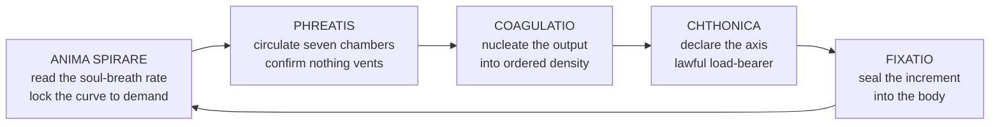

# The Iron Bison — A Discipline of Internal Resonance

> **The Iron Bison is the art of refusing to spend.**

---

## Classification

| Field | Value |
|---|---|
| **Type** | Internal-Resonance Discipline |
| **Families** | Materia primary, Vitalia secondary, Fluxia tertiary via Phreatis cross-listing |
| **Method** | Corporis. **No external projection, no sigil, no chant** |
| **Temperance Floor** | Stage VII (Refraction) for preliminary training. **Stage IX (Dominion) for sustained combat application.** Stage XII (Emanation) for indefinite maintenance under duress |

> The discipline sits across three Families because the problem it solves is not the problem of any single physics. **It needs material science to seal, biochemistry to fuel, and fluid memory to circulate.**
>
> A practitioner holding fewer than three harmonisations cannot run the full loop. Most who attempt it carry only Fixatio and Anima Spirare and call themselves adherents. **The literature calls them half-sealed, and the literature is not being generous.**

---

## The Principle

Where conventional practitioners convert Essence into Aether and release it outward, the Iron Bison practitioner declares **the body itself the only lawful destination of every unit of soul-fuel they generate.**
> The Aether Shell is not a window through which force leaves. **It is a kiln in which force accumulates.**
Each of the seven Resonance Nodes becomes a sealed compression chamber rather than a venting valve, and the Crystal cycles its own output back through itself in a closed loop, densifying with every pass.
Anima Spirare's cooperative binding means **the delivery curve steepens with demand**: the harder the body draws, the more readily the soul gives. Fixatio's thermoset cure means **what is sealed does not unseal by wanting it to.** Together they produce a practitioner whose resting density climbs with every breath they do not spend, **and whose body, over years, becomes denser at idle than another fighter's at peak invocation.**
> The discipline's adherents believe the loop is indefinite. **The discipline's critics point out that indefinite and infinite are separated by the distance between a philosophy and a funeral.**

### The three propositions

**First** · Aether that never leaves is Aether that never depletes. **Externalization is a tax.** The Iron Bison refuses the tax. Nothing crosses the Shell boundary; nothing is spent that cannot be re-spent on the next cycle.
**Second** · The seven Nodes are not valves, **they are chambers.** Conventional practice treats them as waypoints Essence passes through on its way out. The Iron Bison reverses their polarity: each accepts Essence from above and below, compresses it, and hands it back denser than it arrived.
**Third** · **The bottleneck is containment, not generation.** Most practitioners fail because they run out. An Iron Bison practitioner fails because they cannot hold what they have. *Containment is the entire discipline. Everything else is footnote.*

---

## The Five Wellsprings

*Fixatio and Anima Spirare are load-bearing — remove either and the discipline collapses. The other three form the lattice that keeps soul-fed compression from destroying the vessel that holds it.*
| Wellspring | Analogue | Role in the loop | Failure mode |
|---|---|---|---|
| **Fixatio** *The Binding Flame · Materia* | Covalent cross-linking. Thermoset cure | **The seal.** Every node, junction and escape coordinate is cross-linked shut. The practitioner does not clench against leakage — **leakage ceases to be geometrically possible.** This is why an adherent registers as inert to Essence-readers: **a sealed thermoset emits nothing** *Strengthens Vitality Fortitude, Resilience Anchoring* | **Irreversibility.** A binding placed in error is permanent. **A practitioner who seals a damaged node seals the damage inside it** |
| **Anima Spirare** *The Soul's Breath · Vitalia* | Coagulation cascade; cooperative oxygen binding | **The engine.** Because the curve is cooperative rather than linear, **the harder the sealed system draws, the more readily the soul provides.** This is the mechanical basis of the central claim: a body that never spills can in theory be fuelled indefinitely *Strengthens Vitality Hemostasis, Regeneration, Harmonics Confluence* | **Disseminated activation.** They do not run out of fuel — **they burn all of it simultaneously, in every chamber, with no directional control** |
| **Coagulatio** *The Returning Stone · Materia* | Crystallisation from supersaturated solution | **The densifier.** Each pass deposits a thin crystalline layer of compressed Essence at the chamber walls, **accumulating laminated density the way nacre accumulates inside a shell.** *The training is the refusal. The deposition is automatic* *Strengthens Ardency Compression, Tempering Compression* | **Uncontrolled nucleation.** Too many sites at once yields disordered mass. **The chambers fill with powder instead of plate, and the next compression shatters what should have held** |
| **Chthonica** *The Root Deep · Materia* | Static friction and molecular adhesion; setal contact | **The column.** Without a stabilising axis the accumulated load would buckle the practitioner from within. Chthonica roots the axis crown to root and treats gravity as an ally. **They do not fight the weight they have accumulated. They trust it to hold them in place, the way stone trusts the arch** *Strengthens Vitality Absorption, Dexterity Equilibrium, Dominion Anchoring* | **Contact-surface contamination.** No partial stage — **the column fails at once, and the accumulated density lands on a body no longer braced for it** |
| **Phreatis** *The Waters of Memory · Vitalia / Fluxia* | Long-term potentiation; aquifer recharge and residence time | **The circulation.** The seven nodes are not independent containers — Phreatis makes each chamber's pressure state known to every other. **The upper waters know what the lower waters hold.** Without it, seven sealed jars sitting in a body; with it, a single aquifer breathing as one reservoir *Strengthens Gnosis Retention, Harmonics Memory, Resilience Coherence* | **Aquifer contamination.** What enters cannot be selectively removed, **and a falsified pressure reading recharges as readily as a true one** |

---

## The Seven Chambers

| Chamber | Function | What is converted |
|---|---|---|
| **The Crown** *apex of the skull* | Cognitive density | Fuel meant for outward illumination is rerouted downward. **They do not radiate perception. They compress it.** The capacity to hold an entire engagement as one composed reading rather than a stream of reactions. *The light stays inside the bone of the skull* |
| **The Brow** *between and behind the eyes* | Internal cartography | **The eye that opens here looks inward.** At any instant the practitioner knows which chamber is loudest, which is nearest capacity, and which has room for the next deposit |
| **The Throat** *anterior neck* | Conduction and gating | The lock between the upper three and lower four. Keeps the heart's compression from flooding the crown's clarity and the root's weight from strangling the brow. **The throat does not speak. It conducts, and its silence is a design feature** |
| **The Heart** *centre of the sternum* | Emotional conversion | **Love that would have been spent on a person becomes load-bearing capacity. Grief that would have leaked as silence becomes Flux Density.** The cost is that the emotional register flattens to an outside observer. *They appear patient, impassive, unyielding. They are not calm. They are full* |
| **The Solar Plexus** *below the diaphragm* | Wilful compression | Every act of refusal stacked as compressed conviction. **Where the Iron Bison stores the difference between what the practitioner could have done and what they chose not to — and that difference compounds** |
| **The Sacral** *below the navel* | Kinetic potential | Creative and reproductive Essence held and converted into readiness. **The hips and legs move with the accumulated weight of every unspent generation of force.** Usually the primary source of a released strike's payload |
| **The Root** *pelvic floor* | **The seal of seals** | The floor of the entire system. **If it leaks, the column drains.** Held not as muscular effort but as Wellspring law. *A compromised root is the single most common cause of Iron Bison failure in combat, because opponents who understand the discipline target it first* |

### The cycle

> Read, circulate, gather, ground, seal. **The next breath begins from the new baseline, not the old one.**

---

## Synergies

**Petralon affinity** · A load-bearing skeletal lattice that does not splinter under compounding compression — bone with the same engineering as stone in compression, **strongest exactly where the Iron Bison places the most weight.** The practitioner stops fearing additional cycles because the structure reports, breath by breath, how much more it can hold.
**Orrenthal-tempered marrow** · Electromagnetic coherence through the bone's mineral lattice, letting compression express as **field strength as well as physical density.**
**Basilithe ground-resonance** · Locks the Crystal's natural frequency against external forcing. Combined with the sealed system this makes the practitioner **nearly immune to resonance-based disruption.**
> A practitioner carrying both the Iron Bison and a Petralon-tempered frame does not simply hit harder. **They harvest every fight**, converting every refused projection into a permanent increment of load-bearing infrastructure.

---

## Why It Is Dangerous

**It scales without visible ceiling**, so long as the Crystal holds, because the expenditure side of the equation has been removed.
**It is invisible.** The cured Shell emits no Carrier Wave Modulation. **Veteran Gnosis-users and dedicated Essence-readers have stood beside adepts and read them as untrained.** *This stealth is not a technique. It is a structural consequence of the design.*
**It compounds against anyone who projects.** Every cycle the opponent expends, the Iron Bison practitioner has been refusing to expend for longer. **Time favours containment.**
**It demands no outward signature.** No chant, no glyph, no posture. **Disruption-based counters require a target to disrupt, and the Iron Bison provides none.**
> They take blows that should have killed them. They let the fight stretch. They answer with a single gathering — **and somewhere around the second hour, the opponent realises the practitioner has been compounding the entire time.**

---

## Counters and Weaknesses

**Root disruption** · Resonance-disruption, spatial displacement or Chthonica-fouling compounds against the pelvic region. **Once the root fails, accumulated density drains downward through the practitioner's own legs into the ground, and the loss is not recoverable mid-fight.**
**Contamination** · Introduce a foreign signature into the sealed system and **it circulates to every chamber on the next cycle.** Toxokinetics, Nihiloth-aspected void contamination and Oneirion-class interference all exploit this.
**Uncontrolled nucleation** · Rapid successive strikes, resonance bombardment, or forced emotional surges that flood the heart chamber trigger Coagulatio's failure mode.
**Irreversibility** · **The cure does not reverse.** A practitioner at terminal expression has sealed themselves so thoroughly that release, when it comes, is not a controlled strike but a detonation the body cannot survive. *Opponents with sufficient patience can simply wait for the crossing from sealed vessel to bomb.*
**Anti-resonance and null fields** · Without Phreatis circulation the chambers operate independently, pressure differentials build between adjacent nodes, and **the system tears itself apart along its own internal boundaries.**

---

## Philosophical Tension

The discipline carries a worldview, and the worldview is not incidental — **it is Trait-formation pressure.** Resilience Anchoring and Tempering Compression both structurally reward the practitioner for believing that containment is virtue, **and the belief compounds with the density.**
It treats outward miracle as waste and waste as moral failing. A practitioner deep into the discipline views other casters as profligate: **people who pour their inheritance onto the ground and call it strength.**
> It interprets every leakage, every involuntary spark of projection, as personal corruption. **Imperfection of seal becomes imperfection of self.** At advanced stages the practitioner regards their own emotions as leaks to be plugged rather than signals to be read, **which is the point at which the Iron Bison stops being a discipline and starts being a pathology.**
>
> Materia's terminal corruption is **Petrification Compulsion.** The Iron Bison does not accelerate this failure. **It provides the philosophical justification for it.**
> Used with discipline, the Iron Bison is a quiet, indefinite well of soul-fed strength that lets a mortal endure what should have ended them.
> Used without restraint, it is **a sealed reactor walking among people, denser by the breath, unable to spend, and one bad day from going off inside its own ribcage.**

---

## Archival Note

This describes the discipline as available to any practitioner meeting the Wellspring and Temperance requirements. Character-specific expressions — individual Node glyph assignments, Overdrive variants, personalised cost structures — live in the relevant character's codex entry.
> Wellspring mechanisms follow the Guild of Measurewrights' **Mechanism of the Sixty** register. Stat effects follow the *Fracture of Worlds* source. **Where the consolidated Magic System table and the source disagree, the source governs.**
