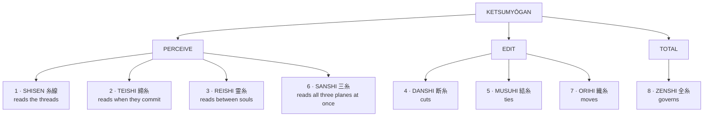

# The Ketsumyōgan — The Binding Fate Eye

**結命眼 · The Binding Fate Eye · Yukari Ocular Codex**
> **結** *ketsu*, to bind, to tie, to conclude · **命** *myō*, fate, life, command, destiny · **眼** *gan*, eye
>
> Archaic Ocular Bloodline Ability, Yukari lineage exclusive. One of the only known ocular abilities with **simultaneous triplanar perceptive authority** across the Physical, Soul, and Fate planes.

---

## The Eye of the Loom

Where the Moto Shingan perceives layers of reality and imposes sovereign judgment upon them, the Ketsumyōgan perceives **the connective tissue between those layers.** It does not see territory. It sees the threads that hold territory together. It does not judge. It reads, and in reading, it gains the capacity to edit.
> **The Shingan is the eye of the throne.**
>
> Its four branches — Meigan, Reigan, Tengan, Kamigan — each govern a domain of reality through perception and imposition.
>
> *"I see what is hidden, broken, coming, or true, and I impose law upon it."*
> **The Ketsumyōgan is the eye of the loom.**
>
> Its eight types each govern a function of the causal web through perception and manipulation.
>
> *"I see what is connected, tensioned, converging, or fated, and I reshape the pattern."*

### Cosmological basis

Every entity, event, object, and outcome in existence is connected to every other through threads running between and through the three planes. A sword's trajectory is connected to the intention of the hand that swings it and to the fate of the person it is aimed at. A promise spoken aloud creates a resonance in the soul of the speaker and registers as a binding in the causal architecture of consequence. A death severs threads in the Soul Plane's continuity register and rewrites the Plane of Fate's probability web around the absence.
Where ordinary Wellspring perception registers one plane at a time, filtered through the Veil's liminal medium, **the Ketsumyōgan reads the Veil itself as a text.** It sees the weave.
This is why the Yukari are called the Weavers, the Thread-Readers, the Crows of Fate. The crow sits above the battlefield and sees the pattern. The Ketsumyōgan is the crow's eye.

---

## Manifestation and Awakening

Unlike the Shingan, which manifests in both eyes simultaneously with a single dominant branch, **the Ketsumyōgan manifests asymmetrically**: one type in the left eye, a different type in the right. The combination produces a paired configuration that defines the bearer's operational identity.
**Awakening conditions** · Sustained exposure to causal stress, in which the bearer's Monlithion registers Thread-Lock events with sufficient frequency and intensity that the Soul Crystal's ocular pathways reorganize to accommodate the data load. This typically occurs during moments of extreme consequence: a death, a betrayal, a decision that rewrites the bearer's position in the causal web irrevocably.
**Visual manifestation** · A deep violet-black corona surrounding the pupil, within which thin luminous thread-like patterns rotate in configurations specific to the active type. The patterns are not decorative. Each corresponds to a different reading mode, and **the rotation speed indicates the depth of planar engagement.** At rest the corona is faint, visible only to those with Resonant Perception or Bifold Existence. When active it brightens, the threads glow crimson, and the bearer's irises darken to near-black as the visual processing pathways redirect from physical light to causal thread data.
**Asymmetric activation** · Either eye can be engaged independently. Activating both engages the paired configuration, which produces a combined function greater than the sum of its parts at significantly higher Essence cost.
> Types are **permanent once manifested.** They cannot be changed, traded, or artificially imposed.

---

## The Eight Types

### 1 · Shisen 糸線 — the Sight Thread

*Thread Line · Thread Sight.* Foundational thread perception, and the most common type. It sees the causal threads connecting entities, events, and objects across all three planes. **It does not manipulate. It reads.**
**Passive** · Continuous visualization within a range determined by Monlithion development, baseline 20 to 40 metres and expandable with training. Threads appear as luminous filaments whose colour, thickness, and tension encode the nature, strength, and plane of origin of the connection. **Physical-plane threads appear silver-white. Soul-plane threads appear deep blue. Fate-plane threads appear gold-violet.** Damaged, corrupted, or artificially severed threads appear frayed, discoloured, or flickering.
**Thread Map** 糸図 · *Shizu.* Reads every thread connected to a single entity simultaneously, producing a comprehensive relational map: allies, enemies, debts, bonds, curses, fate-links, active contracts, dormant obligations, and the relative tension of each. Overwhelming against complex targets, and disorienting without Judicium to sort the input.
**Tension Read** 張読 · *Haridoku.* Reads the tension gradient of threads in a localized area, identifying which connections are under strain, which are about to break, and which are tightening toward a convergence point. The foundational diagnostic for Thread-Lock identification.
**In combat** · Primarily defensive and informational. The bearer sees which enemies are coordinated (shared threads), which are isolated (no threads), where causal tension is building toward a decisive event, and which combatant is the thread-hub whose removal would collapse the web. **An intelligence eye, not a combat eye — devastating when paired with a combat-oriented type in the other socket.**

### 2 · Teishi 締糸 — the Lock Thread

*Locking Thread · Thread of Tightening.* Sees the exact moment when causality hardens from possibility into consequence. Where the Shisen reads the threads' current state, **the Teishi reads their future state**: the instant each thread will commit, the order in which a cascade will lock into inevitability, and the precise window in which intervention is still possible.
**Passive** · Threads approaching their Lock-point glow brighter, tighten visibly, and produce a subsonic harmonic the bearer perceives as a tonal shift. Time remaining before a Lock resolves is perceptible as a compression gradient. The bearer can distinguish natural Locks from imposed ones.
**Lock Sight** 締視 · *Teishi.* Reads an entire Lock sequence: every branching possibility already eliminated, every one still open, and the exact moment each remaining branch will close. **Not prophecy. Causal architecture.** The bearer does not see the future. They see the present so completely that the future becomes structurally obvious.
**Lock Delay** 締延 · *Teien.* Presses Essence against a thread approaching its Lock-point, slowing convergence. Does not prevent the Lock. Delays it. Cost scales with the weight of the event: delaying a falling stone costs almost nothing; delaying a killing blow costs enormously.
**Lock Acceleration** 締速 · *Teisoku.* The inverse. An opponent's attack commits before their body is fully aligned. A collapsing structure fails before the occupants can evacuate. A decision forming in someone's mind crystallizes before they have finished weighing their options. **Ethically complex. The Yukari who use this carry the weight of consequences they chose to hasten.**
**In combat** · The duelist's eye. Against a Teishi bearer, **feints are useless**, because the eye distinguishes a committed causal chain from an uncommitted one. The feint's thread never tightens. The real attack's thread tightens unmistakably.

### 3 · Reishi 霊糸 — the Spirit Thread

*Spirit Thread · Thread of Souls.* Sees the threads between souls: ancestral bonds, emotional connections, spiritual debts, curse-chains, love, grief, grudges, oaths. Where the Moto Reigan sees **inside** souls, and can find them as far as four hundred miles off, the Reishi sees **between** souls, the space where one identity ends and another's influence begins.
**Passive** · Distinguishes living connections from dead ones, which persist as ghostly filaments anchored to the Soul Plane's archive. Emotional content is perceptible as colour temperature: **warm bonds glow amber-gold, cold bonds glow blue-silver, corrupted bonds glow red-black.** Ancestral threads run deep, connecting a living soul to its lineage backward through the Veil into the generational record.
**Soul Read** 霊読 · *Reidoku.* Reads a single soul-thread's complete history: when the bond formed, what created it, how it has changed, what it currently carries, and whether it has been artificially manipulated. A forensic tool — it identifies curses by reading the thread between cursed and curser, verifies oaths, and **detects imposters by reading whether the soul-threads that should connect a person to their claimed identity actually exist.**
**Grief Trace** 哀跡 · *Aiseki.* Follows a dead-connection thread backward through the Veil to the archive, reading the echo of the departed soul's final state: their last emotion, their last thought's resonance, the shape of the grief they left behind. Not necromancy. Not communion. A reading of the wound death left in the causal web. **Painful to use. Exhausting.**
**In combat** · Excels against curse-based combatants, summoners, and practitioners fighting through bonded entities. It sees the thread connecting a summoner to their summon, a puppeteer to their puppet, a curse-caster to their victim. Sever the controlling thread, if paired with Danshi, and the summon loses coherence, the puppet collapses, the curse unravels.

### 4 · Danshi 断糸 — the Severing Thread

*Severing Thread · Thread of Cutting.* Thread severance. The surgical eye. The destructive eye.
> **The eye the Yukari fear most in their own bloodline**, because a thread once severed does not reconnect naturally, and the consequences of cutting a bond that was load-bearing for someone's fate, someone's soul, or someone's connection to reality itself are permanent and frequently catastrophic.
**Passive** · All threads in range are visible with enhanced clarity around their structural weak points. Previously severed threads appear as scarred stumps, allowing the bearer to read the surgical history of a target's causal web. **The bearer's own threads are visible too, including their weak points**, which produces the uncomfortable self-knowledge of exactly where one's own connections are most vulnerable.
**Thread Cut** 糸斬 · *Itozan.* The bearer looks at the thread, the eye's energy reaches through the Veil along the thread's path, and the thread breaks. Range limited to visual contact. The heavier the bond, the greater the Essence cost. Cutting a casual acquaintance's thread is trivial. Cutting an ancestral bond costs enormously. **Cutting a Fate-Plane destiny thread is theoretically possible and practically suicidal.**
**Causal Disconnect** 因断 · *Indan.* Rather than cutting between two entities, the bearer severs the causal connection between an action and its intended consequence. A sword swings but the thread connecting the swing to the cut is severed mid-flight. The action occurs. The consequence does not follow. **This is not a block. It is an edit.** The bearer is telling the Continuum that this cause does not produce this effect, and the Continuum will only tolerate that lie for a heartbeat before reasserting natural law.
**In combat** · The most feared application. A Danshi bearer can cut the thread connecting an opponent to their weapon (muscle memory disrupted), to their Wellspring (harmonization stutters), to their allies (formations dissolve), or **to their own confidence** — severing the thread connecting past success to present certainty, producing sudden, profound self-doubt. *The Yukari who carry Danshi are often the quietest members of the family, because they understand intimately what it means to hold the scissors.*

### 5 · Musuhi 結糸 — the Joining Thread

*Joining Thread · Thread of Binding.* The Danshi's complement. Where the Danshi cuts, the Musuhi ties. **The constructive eye. The healer's eye. The eye that understands that the web of fate is not a fixed structure but a living document that can be amended.**
**Passive** · Perceives the negative space in the causal web: gaps where threads should exist but do not, disconnections producing downstream instability, potential connections whose formation would resolve existing tensions. Dormant connections — bonds that existed in potential but were never actualized — are faintly visible as ghostly filaments, **the unlived possibilities of the causal web.**
**Thread Forge** 糸鍛 · *Itotan.* Creates a new causal thread between two entities, events, or concepts. Artificial, sustained by the bearer's Essence, and dissolving when that Essence is withdrawn — unless the two genuinely develop a bond the causal web recognizes as organic, in which case the forged thread becomes permanent.
**Thread Mend** 糸治 · *Itochi.* Repairs a severed thread by bridging both stumps with the bearer's own Essence. The repaired thread carries a scar, a visible marker that the connection was broken and remade, but it functions. **It repairs the connection, not the consequence** — if cutting the thread killed someone, mending it afterward does not resurrect them.
**In combat** · Primarily supportive. Forges emergency coordination links between allies who have never fought together, simulating the instinctive synchronization of lifelong partners. Reinforces a failing harmonization. Repairs Danshi damage. Offensively, it can forge a thread between an opponent and an environmental hazard, causing the causal web to treat them as connected and increasing the probability of their intersection.

### 6 · Sanshi 三糸 — the Three-Plane Thread

*Triplanar Sight.* Does not read individual threads. **It reads the weave itself.** Where Bifold Perception allows a practitioner to see two planes at once with significant disorientation, the Sanshi sees all three in perfect overlay without perceptual degradation.
**Passive** · The Veil is not a boundary to a Sanshi bearer but **a lens.** Spiritual entities are fully visible without Resonant Perception training. Attraction Force currents appear as golden-violet streams flowing through the landscape. Thin Veil zones shimmer with triplanar overlap; Thick Veil zones appear muted, the deeper planes obscured by the reinforced boundary.
**Planar Overlay** 界重 · *Kaijū.* A building is seen as its physical structure, its soul-signature (the accumulated emotional residue of everyone who has lived in it), and its fate-position (its causal threads, its probability of enduring, its place in the Continuum's ledger) at once. A person is seen as their body, their soul, and their destiny in a single glance. **Information density is extreme.** Without strong Judicium to sort the input, the overload produces nausea, migraines, and temporary perceptual breakdown.
**Veil Walk** 帳歩 · *Chōho.* Not full Veil crossing, which requires Transference harmonization, but the navigational component — the ability to see where the Veil is thin enough to step through and where it is too thick to attempt. **A map-maker's eye for the space between worlds.**
**In combat** · The Sanshi bearer cannot be surprised by any attack originating from or passing through any of the three planes. They see not just the sword but the intention behind it and the fate-thread driving it. **Defensively unparalleled. Offensively limited, as the Sanshi does not manipulate. It only sees.**

### 7 · Orihi 織糸 — the Weaving Thread

*Thread of the Loom.* Rearranges, redirects, and reweaves existing threads without cutting or creating them. **It adjusts the pattern.** It changes the angle at which two fates intersect, redirecting probability by adjusting the weave's geometry so that events converging toward one outcome begin converging toward another.
**Passive** · The bearer perceives the causal web as a loom, with **warp threads** (fixed structural connections defining the web's backbone, visible as thicker brighter filaments that resist manipulation) and **weft threads** (mobile connections that can be repositioned without collapsing the structure).
**Thread Redirect** 糸転 · *Itoten.* Moves a weft thread. The endpoints remain the same but the path changes, and this alters how the connection manifests. A thread running through the Physical Plane (two people who would meet by chance) can be redirected through the Soul Plane (they now meet through a shared emotional experience) or the Fate Plane (they meet because probability architecture has rearranged to make their intersection inevitable). **The outcome changes based on the path, not the endpoints.**
**Pattern Shift** 紋移 · *Mon'i.* Rearranges multiple weft threads simultaneously. Large-scale probability manipulation. A battlefield whose causal web favoured the enemy can be reweaved so the threads converge on the bearer's allies. **Not guaranteed** — the weave resists unnatural patterns, and the more the rearrangement deviates from the web's natural tendency, the harder the threads fight back and the greater the risk of Resonance Trauma.
**In combat** · The strategist's eye. It does not fight. It repositions. An incoming attack's thread can be redirected to converge on a different target, an obstacle, or **the attacker's own thread**, folding the strike back toward its origin. The cost is sustained concentration and heavy Essence expenditure, and the manipulation must be continuously maintained or the web snaps back.

### 8 · Zenshi 全糸 — the Absolute Thread

*All Threads.* The apex manifestation, equivalent to the Kamigan's Crown Judgment. It combines all seven preceding functions into a single unified ocular authority available through one eye. **The Zenshi does not specialize. It governs.**
> **Rarity.** Fewer than a dozen manifestations in the recorded history of the Yukari bloodline. It appears only in bearers whose Crystal has achieved sufficient depth across all Wellspring harmonizations to support the triplanar processing load, and whose causal stress at awakening was so comprehensive that the eye's response was not specialization but totality. **Most Zenshi manifestations occur during events that threaten the Yukari lineage itself.**
**Loom Sight** 機視 · *Kishi.* The complete vision. Every thread, every Lock-point, every severed connection, every dormant bond, every plane, every transition, every weight. Only a Crystal with deep, balanced harmonization across multiple Houses can sustain it without catastrophic Resonance Trauma. **A Crystal dominated by a single Affinity will shatter under the triplanar data load.**
**Sovereign Weave** 機命 · *Kimyō.* The apex technique. The bearer imposes a deliberate pattern upon the causal web within a defined radius, simultaneously perceiving, severing, joining, redirecting, and locking threads to produce a specific outcome. **This is not probability manipulation. This is fate authorship.** The bearer writes a sentence in the language of causality and the Continuum executes it.
> The cost is existential. Sovereign Weave **consumes the bearer's own fate-threads as fuel**, shortening their remaining destiny by an amount proportional to the complexity of the pattern imposed. Every use costs a piece of their own future.
>
> The Yukari who have used Sovereign Weave have, without exception, died young. **The loom does not forgive those who presume to operate it at full capacity.**
**In combat** · There is no combat application. The Zenshi is not a combat eye. **It is a civilization eye.** A Zenshi bearer does not fight battles; they determine which battles need to occur and what threads must be cut, joined, or moved to ensure the causal web survives. If a Zenshi bearer enters combat, something has gone so catastrophically wrong that the web itself is at stake, and the bearer is not fighting an opponent but **operating on reality.**

---

## The Pairing System · Sōshi 双糸

The left eye is traditionally called the **Inshi** 因糸, Cause Thread. The right is the **Kashi** 果糸, Effect Thread. The pairing is not arbitrary; the Soul Crystal's architecture determines which types manifest where. When both are activated simultaneously, the configuration produces a combined function neither type can achieve alone, named separately from its components and representing the bearer's unique contribution to the tradition.
| Sōshi | Pairing | Reputation |
|---|---|---|
| **Ingaken** 因果剣 *Blade of Cause and Effect* | Teishi + Danshi | The most feared duelist's configuration in Yukari history |
| **Enmusubi** 縁結び *Fate-Bond Tying* | Reishi + Musuhi | The Sōshi the elders debate most frequently |
| **Meikaimon** 冥界門 *Gate of the Dark Realm* | Sanshi + Reishi | Perception of, and limited communication with, the dead |
| **Tenmō** 天網 *Heaven's Net* | Shisen + Orihi | The strategist's apex configuration |
| **Kokudan** 刻断 *Engraved Severance* | Danshi + Musuhi | The editor's configuration. Reality's track-changes |
| **Inzenshō** 因全照 *Illumination of Total Cause* | Zenshi + Teishi | Manifested three times in recorded history |

- ****Ingaken** — the attack is allowed to commit**
  The bearer sees the Lock-point of an incoming causal chain and severs the thread at the exact moment of commitment. The attack is not blocked. The attack is not dodged. **The attack is allowed to commit**, and then the thread connecting the committed action to its consequence is cut at the instant when it is tightest, when the cut is cleanest, when the severance carries maximum disruptive force backward through the attacker's causal architecture.

  The attacker experiences the full commitment of their strike — the Essence expenditure, the physical motion, the opening of their guard — without any of the consequence it was supposed to produce. **The cause occurred. The effect did not follow.** Their body executed a technique their causal web says should have produced a result, the result did not arrive, and the gap between expectation and reality is so jarring that their next action is delayed by a fraction of a second while the Crystal attempts to reconcile what happened.

  In that fraction of a second, the Ingaken bearer strikes.
- ****Enmusubi** — and the question the elders keep returning to**
  The deliberate forging of deep Soul-Plane-level connections between people, places, or entities. Not surface bonds. **Soul threads** — the kind that ordinarily form only through years of shared experience, love, grief, or oath.

  The bearer can create a bond between two strangers carrying the emotional weight and causal significance of a lifelong relationship. **The bond is not false. It is architecturally real.** The Soul Plane recognizes it. The Fate Plane factors it into probability calculations. The Physical Plane manifests it as instinctive trust, involuntary protectiveness, and the subtle behavioural shifts that accompany genuine connection. It fades if not reinforced by actual experience, but while it holds it is indistinguishable from organic attachment.

  **Ethical weight.** This is the Sōshi the Yukari elders debate most frequently. Creating real bonds between people who did not choose them raises questions of consent, autonomy, and the right of any individual, however gifted, to write on another person's soul.
- ****Meikaimon** — one-directional**
  The bearer can see the dead's remaining threads, follow them through the Veil to their archival position, and read the echo's state: preserved personality, unresolved bonds, lingering intentions, and the shape of the grief-wake left in the causal web.

  In exceptional cases the bearer can communicate with the echo — not as a living being but as a preserved pattern retaining enough structure to respond. **The communication is one-directional.** The echo speaks through the thread and the bearer hears through the Reishi. The echo cannot perceive the bearer's world. It can only respond to what the thread carries.
- ****Tenmō** — one thread moved, twelve outcomes altered**
  With the full map visible, the bearer identifies the single thread whose repositioning produces the maximum cascade of downstream effects, and adjusts it.

  A formation that was holding collapses because the coordination thread between its commander and its left flank was redirected. A retreat route that was open closes because the probability thread connecting the fleeing enemy to the exit was rerouted through a convergence zone.

  **The net falls. Everything it touches changes direction.**
- ****Kokudan** — substitution, not a gap**
  The bearer severs a thread and simultaneously forges a replacement. The old bond is cut. A new bond is tied in the same instant. **The causal web does not experience a gap. It experiences a substitution.**

  Replace an enemy's connection to their weapon with a connection to the ground, and the weapon feels like an extension of the earth, immovable and alien. Replace a curse-chain with a blessing-thread, and the curse's structure remains but its content changes. Replace the thread connecting an attacker to their target with one connecting them to empty space, and the attack lands where the target was supposed to be but no longer is, because the causal web was rewritten to exclude the target from the convergence point.
- ****Inzenshō** — architecture, not prophecy**
  The bearer sees the entire web *and* sees when every thread in it will commit: what is connected to what, how those connections will resolve, when each resolution becomes irreversible, and in what order the cascade of Locks will fire.

  **They see the building's blueprints while standing inside the building**, and they know which walls are load-bearing, which can be removed, which are about to fail, and when. In combat this renders the bearer effectively precognitive within range, with every moment of intervention mapped to microsecond precision.

---

## Costs and Consequences

**Essence Drain** · Every active function consumes Essence at a rate proportional to the number of threads being processed. Passive perception is sustainable for extended periods. Active manipulation drains at combat-rate output, and sustained Sōshi use at full resolution **can empty a well-developed Crystal in minutes.**
**Resonance Trauma** · The Ketsumyōgan processes triplanar data through a Crystal that was not designed for triplanar operation. Prolonged use produces micro-stress in the lattice, particularly in the Aetheric interfaces bridging the Crystal's Physical-Plane housing with the Soul-Plane and Fate-Plane data streams. This manifests as **the Threadburn**.
| Threadburn symptom | Presentation |
|---|---|
| **Phantom thread-perception** | Seeing threads that do not exist |
| **Involuntary Lock-reading** | The brain begins sorting all sensory input into causal chains whether the eye is active or not |
| **Emotional flattening** | Empathic responses suppressed by the continuous processing of soul-thread data, making it increasingly difficult to *feel* connections rather than merely *see* them |

> **Fate-Thread Consumption.** Advanced techniques, particularly Sovereign Weave and high-cost Danshi severances, consume the bearer's own fate-threads as fuel. **This is not a metaphor.** The bearer's remaining lifespan, their uncompleted connections, their unrealized potential, is burned to power the manipulation. The Ketsumyōgan does not draw from an external source. It draws from the bearer's own position in the web.
>
> Use too much, and the web has nothing left to hold you in place.
> **The Yukari Paradox.** The more clearly you see the web, the less you belong to it. A fully active bearer is simultaneously the most informed person in any room and the most disconnected, because they perceive connections as data rather than experiencing them as feelings.
>
> The Threadburn's emotional flattening is not a side effect. **It is a structural consequence of an eye that was designed to read fate and was never meant to live inside it comfortably.**

---

## Historical Note

The Ketsumyōgan has existed for as long as the Yukari bloodline has existed. Its eight types have been documented, debated, feared, and revered across every era of the Inner World's history. The Yukari who carry it are not warriors in the traditional sense. **They are readers. Editors. Architects of causality.**
The crow that sits above the battlefield does not fight. It watches. It remembers. And when the battle is over, it is the crow that knows which threads were cut and which were tied and which were moved, because the crow was the one who saw the loom.
> The Ketsumyōgan is the loom's eye.
> And the loom never closes.
