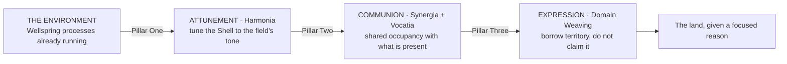

# The Sage Arts

> Most magic in the Continuum is projective. The Sage Arts invert that architecture entirely. **A Sage does not project. A Sage receives.** The terrain is the caster. The Sage is the instrument.
| **Primary Categories** | Harmonia (Spirit ↔ Attraction) · Synergia (Triadic) · Domain Weaving (Attraction-Aligned) |
|---|---|
| **Secondary Categories** | Vocatia (Attraction-Aligned Recognition) · Ritus (Spirit-Aligned Ritual) · Mnemata (Spirit ↔ Attraction Memory) |
| **Apex Integration** | Concordia (Spirit ↔ Attraction Apex) |
| **Wellspring Home** | House of the Green Pulse — Verdantia, Anima Spirare, Benediction, Transference, Rebirthine |

---

## The Inversion

A Sage opens their Soul Crystal to the Wellspring processes already active in their environment, aligns their Aether Shell with the local Continuum's existing resonant frequency, and becomes a living junction through which the landscape's own metaphysical current can be directed, amplified, or harmonized.
This is not passivity. Alignment is among the most demanding disciplines in the Continuum, because it requires the practitioner to subordinate their own Essence Typology to the environment's dominant Wellspring dialect **without losing identity coherence**. A Sage standing in a Verdantia-saturated forest must let their Shell resonate at the forest's frequency, conduct the forest's Essence through their own circulation, and direct that conducted force toward a purpose, all while maintaining enough Equilibrium to prevent the forest's Wellspring from overwriting their own Crystal state.
> The Sage does not become the forest. The Sage becomes **the forest's voice**, and the distinction between those two things is the entire discipline.
The result is magic that looks effortless and feels borrowed. A Sage's constructs are not fabricated from personal Essence; they are condensations of the terrain's own spiritual memory. A Sage's healing is the local Verdantia current flowing through their Shell into the patient, with the Sage acting as a low-resistance conductor the vein can use more efficiently than the ambient field alone. A Sage's battlefield influence is the amplification of whatever Wellspring processes the terrain already favours, turned from background hum into directed force.
This makes the art profoundly location-dependent. A Sage harmonized with Verdantia is devastating in a living forest and nearly useless on a salt flat. One attuned to Manganthra operates at full capacity near volcanic vents and produces almost nothing in a temperate meadow. One aligned with Phreatis commands astonishing force near deep water and withers in dry stone corridors.
> The discipline's greatest power is also its most honest limitation: **the Sage can only speak what the land already knows.**

---

## The Three Pillars

### Pillar One · Attunement (Harmonia)

**Environmental Attunement** is the foundational discipline of all Sage practice, and it begins with perception. Every location carries a resonant signature: the sum of all Wellspring processes currently operating there, layered with the historical echoes of processes that operated there previously. A Verdantia-saturated grove hums with growth-renewal. A Manganthra vent pulses with compressed catalytic force. A Phreatis-fed riverbank murmurs with memory-depth. A Tenebra-shadowed ruin vibrates with quiet dissolution.
Matching requires adjusting the Shell's own resonant frequency, governed by **Gate Cycling** (how smoothly resonance gates open and close) and **Turbulent Flow** (how much noise contaminates the Essence stream). Clean Gate Cycling and low Turbulent Flow attune within seconds. Poor Shell discipline takes minutes, loses Essence to friction, and risks dissonant interference that alerts the local field to the Sage's presence **as a foreign body rather than a compatible conductor**.
**Shallow Attunement** borrows surface-level environmental force: ambient wind, existing moisture, loose soil, surface Essence currents. **Deep Attunement** accesses the environment's **Root Memory**: the historical Wellspring processes recorded in the terrain's Mnemata substrate. A Sage deep-attuned to a battlefield can feel the grief still stored in the soil. One deep-attuned to a sacred grove can hear the prayers that have saturated the wood for generations. One deep-attuned to a Wellspring vein can conduct the vein's raw process-current through their own body, which is the most powerful and most dangerous expression of the art.
**Temperance Gate** · Stage VI (Glory) for surface Attunement · Stage VIII (Transcendence) for Root Memory access · Stage X (Realization) for direct Wellspring vein conduction.

### Pillar Two · Communion (Synergia + Vocatia)

Communion is not summoning. A summoner fabricates constructs or negotiates with external entities. A Sage in Communion enters shared resonance with what is already present, **the way a singer joins a chorus rather than performing a solo**.
Synergia governs the mechanics: the Sage's Essence Core briefly shares occupancy of the same Soul Plane region as the environmental presence, creating a relational bridge through which the Sage can perceive what the spirit perceives, feel what the terrain remembers, and direct the presence's existing capacity toward a purpose. **The spirit is not controlled. It is conducted.** Controlled entities resist and degrade; conducted entities amplify and sustain. A terrain spirit conducted through Communion operates at its natural capacity, sustained by its own Wellspring vein, rather than at the reduced capacity of a dominated construct draining its master's Core.
Vocatia enters at higher levels, when Communion reaches entities with genuine identity rather than ambient presence. A **Wellspring Echo** is ambient; Synergia suffices. A **Guardian Spirit** has identity; Vocatia's recognition-correspondence is required.
> This is why Sage practice requires **emotional authenticity** in a way most magic does not. A Runesmith can inscribe a Verdantia rune without loving forests. An alchemist can brew a Benediction Draft without personal compassion. A Sage cannot commune with a Verdantia spirit without carrying genuine resonance with the Wellspring's core law. The entity reads the Sage's Attraction Layer during Communion. **If the relationship is performative, the entity withdraws.**
**Temperance Gate** · Stage VII (Refraction) for ambient Communion · Stage IX (Invocation) for identity-bearing entities · Stage XI (Dissonance) for multi-entity simultaneous Communion.

### Pillar Three · Expression (Domain Weaving)

Standard Domain Weaving imposes the practitioner's Attraction Layer outward, claiming territory on the Plane of Fate. The Sage inverts this. Their Attraction Layer does not claim territory. **It borrows territory.** The landscape's existing law becomes temporarily louder, more precise, and more directed, because a living Soul Crystal is now serving as a resonance amplifier for what the land was already doing.
This is why Sage constructs look different from summoned ones. A summoner's eidolon is crisp, defined, clearly artificial, unmistakably a projection of someone's interior. A Sage's construct is a condensation of the terrain's own spiritual memory: it looks like the landscape given temporary presence. A mist-form born of a swamp Communion carries the marsh's own emotional memory, its grief, its patience, its slow hunger. A root-guardian born of a forest Communion moves with the deliberation of old wood, not the programmed efficiency of a summoned eidolon.
The construct persists as long as Attunement and Communion hold. When the Sage breaks alignment it dissolves back into the ambient field. **The construct was never separate from the environment. It was the environment, briefly given direction through a living intermediary.**
**Temperance Gate** · Stage VII (Refraction) for single-construct expression · Stage IX (Invocation) for multi-construct field expression · Stage XII (Emanation) for Concordia-level regional amplification.

---

## Progression Tiers

| Tier | Pillars active | Temperance range | Expression |
|---|---|---|---|
| **I · Surface Attunement** | Harmonia (surface) | Stage IV – VI | Borrowing ambient environmental force |
| **II · Root Communion** | Harmonia (deep) + Synergia | Stage VI – VIII | Environmental constructs, terrain sensing, emotional weather reading |
| **III · Spirit Bonding** |   • Vocatia | Stage VIII – X | Bonded entity partnership, directed constructs, healing conduction, battlefield terrain manipulation |
| **IV · Living Junction** | All three fully integrated | Stage X – XII | Multi-entity Communion, terrain-network operation, Domain amplification, Wellspring stabilization |
| **V · World Voice** | All pillars + Concordia | Stage XII – XIV | Regional-scale Wellspring communion, ecosystemic direction, terrain awakening |

- ****Tier I · Surface Attunement** — where most apprentices spend years**
  The Sage can feel the local field's dominant frequency and make crude use of surface-level elements: directing existing wind, loosening soil, encouraging moisture, sensing temperature gradients and Essence density variation. There is no Communion at this stage. Constructs are impossible. Effects are limited to what the terrain's ambient force can provide without amplification.

  The discipline's entire architecture depends on the quality of this foundation. A Sage who advances to Communion with poor Attunement discipline produces dissonant interference that degrades every subsequent working.
- ****Tier II · Root Communion** — the terrain remembers**
  Constructs become possible: mist-forms, root-guardians, water-voices, wind-scouts, condensed from the environment's own Essence rather than the Sage's personal reserves. These carry the terrain's emotional memory and behave according to the landscape's own temperament rather than the Sage's directives. A swamp-born construct is patient and enveloping. A mountain-born construct is immovable and slow to anger. A storm-born construct is volatile and brief.

  The Sage can read **emotional weather**: the accumulated grief, joy, violence, or peace stored in a location's Mnemata substrate. This makes Tier II Sages invaluable as scouts, diagnosticians, and spiritual historians. They can walk a ruined village and feel what happened there. They can stand on a battlefield and identify which Wellspring processes were invoked during the fighting. They can enter a corrupted zone and sense where the corruption originated, because the terrain remembers.
- ****Tier III · Spirit Bonding** — mutualism, not hierarchy**
  A **Bond** is a sustained Communion relationship in which entity and Sage develop mutual recognition on the Plane of Fate, an Attraction Force current running between them that persists beyond individual working sessions.

  A Bonded entity is not a servant. It is a partner whose cooperation the Sage has earned through authentic Wellspring resonance and sustained relational investment. The Bond grants the Sage access to the entity's perception, memory, and environmental influence, while the entity gains access to the Sage's mobility, intentionality, and structured Glyphica.

  Bonded Sages produce **directed constructs**: environmental condensations that follow complex behavioural instructions because the Bonded entity is co-directing them. A swamp Sage bonded to a marsh Guardian can create mist-stalkers that hunt, surround, and isolate with tactical precision, because the Guardian's centuries of territorial awareness inform the construct's behaviour.

  Healing becomes possible through **Wellspring conduction**. The Sage attunes where Verdantia, Benediction, or Anima Spirare are naturally active, enters Communion with the local current, and conducts it through their Shell into the patient. Personal Essence expenditure is minimal because the vein provides the force; the Sage provides the direction. This is why Sage healers seek groves, springs, and sacred sites rather than carrying alchemical supplies. **Their medicine is the land itself, and their body is the needle.**
- ****Tier IV · Living Junction** — the forest given a reason**
  Multiple Bonded entities operate in coordinated Communion. Attunement covers not a single clearing but an entire terrain network: a forest's root system, a river's branching tributaries, a mountain range's geological strata. Constructs emerge from multiple locations simultaneously, coordinated through the Sage's conducted Synergia field.

  **Domain amplification** becomes the primary combat expression. A forest under Tier IV amplification does not merely grow defensive roots. The forest's Verdantia current becomes the governing law of the space: wounds heal faster inside its boundary, hostile constructs degrade as incompatible Essence is composted into growth-energy, and the trees become sensory extensions of the Sage's conducted perception. **The forest is not fighting for the Sage. The Sage has given the forest a focused reason to fight.**

  Tier IV Sages also become essential for **Wellspring stabilization**: a vein weakened by overuse, Mechanica damage, or corruption can be stabilized by a Sage who attunes to its frequency, enters Communion with its residual process-current, and conducts supportive Essence through their own circulation to reinforce its coherence.
- ****Tier V · World Voice** — the land recognizes them**
  The rarest and most sacred expression. A World Voice Sage has attuned so deeply and for so long that their Crystal has developed **permanent** harmonic compatibility with a specific Wellspring region. They do not need to attune when they enter this terrain. They are already attuned. *The land recognizes them the way a body recognizes its own heartbeat.*

  At this tier the Sage can awaken dormant Wellspring processes across regional scale: restarting failed Essence circulation in a dying forest, reigniting volcanic activity in a cooled vent system, restoring seasonal rhythm to terrain disrupted by Mechanica or Hollowing. They are not healing individual wounds. They are conducting the land's own recovery.

  World Voice Sages are the primary practitioners behind the cultivation of **Wellspring Groves**: prepared sacred sites where Wellspring processes have been carefully amplified and stabilized over generations. A Grove is not a rune array. It is a living Wellspring node that a succession of Sages have tended until the site's natural activity achieved self-sustaining intensity.

  The Guild Accord classifies World Voice Sages as **strategic environmental assets**. A single Sage at this tier can stabilize an entire province's Wellspring ecology, which makes them both invaluable and politically complicated: **they owe loyalty to the land, not to any government.**

---

## Wellspring Affinity Profiles

Theoretically compatible with any Wellspring, practical mastery clusters around environmental resonance. Each affinity produces a distinct operational character, and each carries its own way of ending.
| Affinity | Terrain and constructs | Character | Corruption risk |
|---|---|---|---|
| **Verdantia** *House of the Green Pulse* | Forests, groves, farmland. Root-guardians, bloom-barriers, vine-networks. | The most common affinity. Regenerative healing conducted through living wood and fertile soil. They smell of loam and rain-wet herbs, and flowers tend to open as they walk past. | **Endless Spring.** The inability to let anything end, growth consuming everything as fertilizer. |
| **Anima Spirare** *House of the Green Pulse* | Volcanic vents, deep caverns with geothermal breath, ley junctions. Breath-forms: warm, pulsing, ember-edged. | Rarer and more volatile. Their healing is rhythmic stabilization rather than regeneration — they restore the patient's Essence pulse rather than rebuilding tissue. They carry the scent of warm stone and clean smoke. | **Radiant Fever.** Life-force overdriven until the soul burns hollow. |
| **Phreatis** *House of the Veil* | Rivers, aquifers, rain-heavy terrain, tidal coastlines. Memory-forms: fluid, reflective, carrying historical echo. | Deeply Mnemata-inflected. A Phreatis Sage at a riverbank can feel every grief, prayer, and oath spoken over that water for centuries. | **Drowning Memory.** The inability to distinguish personal history from absorbed environmental memory, until identity dissolves into the water's record. |
| **Manganthra** *House of the Forge* | Geothermal activity, fault lines, mountain cores. Stone-forms that move with seismic deliberation. | Domain amplification turns terrain into a pressure cooker, ambient force concentrated until the ground itself becomes a weapon. | **Eruption Dependence.** Compulsive suppression of all emotional experience until catastrophic release becomes inevitable. |
| **Tenebra** *House of the Black Gate* | Ruins, old battlefields, abandoned structures, shadowed forests. Shadow-forms: quiet, erosive. | The most unsettling affinity. Their healing is **subtractive** — they remove what should not be present rather than adding restorative force. | **Self-Erasure.** Identity dissolving into the absence they conduct, until they become a walking silence that forgets its own name. |
| **Cymorath** *House of Ascent* | Plains, mountain ridges, coastal cliffs, high deserts. Wind-forms: fast, perceptive, ephemeral. | The finest scouts in the tradition, their conducted Attunement turning an entire wind system into a sensory network. | **Voicelessness.** Their own convictions scattered by the winds they conduct, until they can amplify everyone else's truth but no longer remember their own. |

---

## Key Figures

**Ristra of Mirehollow** · A swamp-born Sage whose Crystal developed permanent harmonic compatibility with the Mirehollow marsh before his twentieth year. Verdantia-dominant with secondary Phreatis resonance, giving him simultaneous access to the marsh's growth-renewal substrate and its deep-water memory layer. His Bonded entity is a marsh Guardian Spirit older than the village at the swamp's edge. Through the Bond he produces **mist-stalkers** (constructs condensed from the marsh's fog-memory, carrying centuries of predatory territorial instinct) and **memory-laced willows** (living trees whose Root Memory functions as a Mnemata archive, recording everything that passes beneath their branches). His operational range never extends beyond the Mirehollow watershed, and he has no interest in extending it. *The marsh is his instrument. He has spent his life learning to play it well.*
**Aramil Senn, the Stone-Veined Seer** · A Manganthra-dominant Sage who achieved Tier IV during the Great Spirit War. During the siege of the Karrveth Valley he amplified the valley's natural Manganthra current through sustained Concordia-level Communion until the terrain itself became a directed defensive system: cliff faces shifted to seal passes, fault lines opened beneath enemy formations, and the valley's stone produced resonant vibration that destabilized hostile constructs at their structural frequency. The Accord's post-war assessment noted that Aramil did not create these effects. He conducted them. **The valley had been trying to close for geological ages; Aramil gave it a reason to close now.** He died still attuned, and the valley's geological behaviour has been subtly unusual since, as though the stone remembers the direction he gave it.
**Virelsa the Breathweaver** · A Cymorath Sage whose wind attunement allowed her to walk air. Not flight through Aether projection, but genuine wind-walking: her Shell resonated so precisely with atmospheric Cymorath current that the wind treated her body as a compatible presence rather than an obstacle. Her guidance constructs, dreamlike gusts carrying perception and intent across miles, were famous for uncanny precision — she could send a wind-form through a forest canopy and know which branches were diseased before any druid examined them. Her operational limitation was **stillness**; in calm air she had nothing to conduct. Her journals describe deep wind Communion as *"hearing the sky confess what it has carried,"* and her research into atmospheric Mnemata remains the foundational text for Cymorath training.
**The Verdant Synod** · A reclusive circle operating in the wilds of Nalūn, dedicated to the cultivation and protection of Wellspring Groves. They practice the **Doctrine of Gentle Resonance**: Wellspring processes should be conducted, never coerced, and the Sage's role is stewardship rather than instrumentalization. This places them at odds with military applications of the art, which the Synod views as a violation of the discipline's foundational principle: *you do not force the land to fight; you listen until the land tells you what it needs.*
The Synod maintains **seventeen active Wellspring Groves**, the oldest predating the Guild Accord by centuries. Their activity is intense enough to produce ambient effects on anyone who enters: accelerated healing in Verdantia Groves, emotional clarity in Judicium Groves, memory restoration in Anamnesis Groves. The Concord tolerates the Synod's independence because their Grove maintenance stabilizes Wellspring ecology across a region that would otherwise require expensive Guild infrastructure to keep balanced.

---

## Historical Importance

The Sage Arts predate formalization. Their roots reach into the earliest spiritual traditions of elven, dryadic, and sylvan peoples, who lived in such sustained proximity to natural Wellspring activity that alignment was not a technique but a way of life. **The earliest Sages did not train. They grew, the way a tree grows toward light.**
Formal codification came during the late Third Epoch, when expanding mortal civilization began disrupting Wellspring ecology at a scale requiring deliberate intervention. Natural Sages were recruited to diagnose Wellspring damage, stabilize failing veins, and establish the first Groves as protected reserves. The Guild Accord's earliest environmental statutes were drafted in consultation with Sage practitioners who could articulate, in Aetherica-compatible terms, what was happening to terrain that civilization was strip-mining for Essence.
During the **Era of Grace** they served roles no other discipline could fill. As peacekeepers, their Communion with terrain spirits gave them intelligence networks that bypassed all conventional surveillance. As wayfinders, their Attunement let them navigate terrain that defeated normal scouts. As guardians of sacred land, they cultivated the Groves that became focal points for spiritual convergence, healing, and Temperance training across the Concord.
The **Age of Calamity** proved the discipline's combat value. A standard caster projects Essence outward through their own Shell, and chaotic terrain disrupts that projection. A Sage conducts the terrain's own force, and chaotic terrain is still terrain: it still carries Wellspring current, however distorted. Sages who could attune to corrupted environments, **reading the distortion's frequency rather than fighting it**, could redirect hostile Wellspring processes, stabilize terrain undergoing Hollowing, and provide environmental intelligence conventional reconnaissance could not gather.
By the **Voyager Era** the Sage Arts have retreated from metropolitan practice. Urban environments, with their layered artificial Essence fields, alchemical residue, and competing Wellspring invocations, are hostile terrain for Attunement. *A Sage in a city hears noise, not music.* The art persists primarily in frontier lands, wild territories, and the sacred sites maintained by orders like the Verdant Synod.
> In a Continuum where most magic projects, imposes, inscribes, and claims, the Sage Arts remain the discipline that asks what the land already knows, and listens long enough for the answer to arrive.

---

*First appearance: Chronicles of the Exiles, Volume III, "Of Root and Rain" (Chapter 2: The Willow-Faced Thing That Sang in the Fog).*
