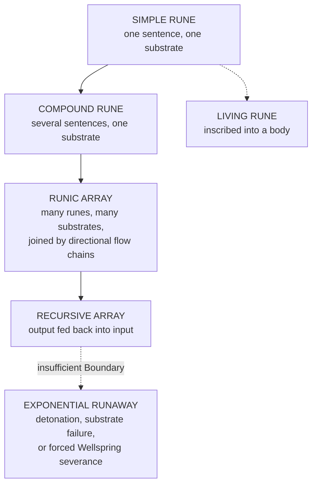

# The Spirit Rune Arts

> A spell is a sentence **spoken**. A rune is a sentence **written**. The medium changes. The grammar does not.
| **Primary Category** | Glyphica (Spirit-Aligned) |
|---|---|
| **Secondary Categories** | Drafts (Spirit-Aligned) · Arts (Body-Aligned) · Crystalia (Body ↔ Spirit) |
| **Supporting Disciplines** | Alchemy (Wellspring-Process Application) · Harmonia (Resonant Calibration) · Ritus (Ritual Activation) |

---

## Permanence

Every act of structured magic passes through Glyphica. In most casting this syntax is ephemeral. A spoken mantra dissolves after the working ends. A gestured mudra holds no shape once the hands relax. An internally chained glyph sequence persists only as long as the Soul Crystal sustains it. **Glyphica, in these forms, is grammar spoken aloud and then forgotten by the air.**
The Spirit Rune Arts make Glyphica permanent.
An Engraver takes the same Parunic sentence a caster would speak and carves it into matter: stone, metal, bone, crystal, alchemically prepared wood, or in the most advanced cases directly into the Aether Shell or Soul Crystal lattice of a living being. The inscription becomes a **standing instruction** to the Continuum. As long as the substrate retains enough Essence coherence to maintain the carving, the authorized Wellspring process remains active. It does not need to be re-cast. It does not need the Engraver's attention. It persists because the Continuum reads it the way a reader reads a sentence left on a page: **the author can leave, but the meaning remains legible.**
A ward-glyph carved into a fortress wall by a Runesmith who died three centuries ago still suppresses hostile Essence if the stone has not degraded below its retention threshold. A binding sigil inscribed into a relic's core still holds its prisoner if the Sealing glyphs remain unbroken. A living rune etched into a warrior's bone still redirects Aether flow through their body even when they are unconscious, because the instruction is written into the substrate, not sustained by the will.
> This permanence is the art's greatest power and its most dangerous liability. A spoken spell misfires and dissipates. **A written rune misfires and keeps misfiring**, potentially for generations, until someone finds and breaks the inscription. The Continuum does not distinguish between a rune written with careful intent and a rune written with a structural error. It reads what is written. **It executes what it reads.**

---

## The Four Glyph Roles in Inscription

### Authorization

Notifies the Continuum which Wellsprings are being invoked and establishes the original inscriber as the lawful channel. In ephemeral casting this dissolves when the spell ends. In runic inscription it persists as a permanent claim: *this Wellspring process is lawfully permitted here, by this authority, until the seal breaks.*
Authorization requires the Engraver to possess **genuine Wellspring harmonization** with whatever process they inscribe. A Runesmith cannot authorize a Judicium rune without carrying Judicium harmonization in their own Crystal. The Continuum reads the Engraver's Attraction Layer at the moment of inscription, and that reading becomes part of the rune's permanent structure. A forged authorization is **Mechanica by definition**, and the Continuum treats it as debt.

### Boundary

Defines spatial and temporal limits. A ward covering a doorway needs Boundary glyphs specifying the doorway's dimensions. A healing rune on a relic needs Boundary glyphs specifying that the restorative process acts only on the bearer, not on everything within the relic's Essence field.
Most runic accidents begin here. **A transformation without limits continues until it runs out of things to consume.** This is why the *Rite of the Cracked Stone*, a Fractura awakening practice, teaches fault-reading before inscription: an Engraver must understand what the substrate can and cannot sustain before committing Boundary glyphs to permanent material.

### Direction

Specifies vector and focus. Without it, a Calcination rune burns indiscriminately and a Distillatio rune strips every Essence type including what was meant to remain.
In arrays, Direction also governs flow: which rune activates first, which feeds into which, how the circuit resolves when multiple processes operate simultaneously. A poorly directed array does not just fail. It creates interference patterns between its own elements, producing **Draft Corruption**: law-fragments, Wellspring processes started but not completed, which keep trying to finish themselves in whatever they contact.

### Sealing

Closes the inscription to contamination and drift. Draws heavily on Fixatio chains, which is why Fixatio harmonization is the foundational Wellspring for all serious runic work.
An unsealed rune is an open wound in the local Aether field. Environmental Essence bleeds into it. Nearby workings contaminate it. The Continuum attempts to resolve the open syntax, sometimes by completing it in ways the Engraver never intended. **Unsealed runes are the leading cause of runic hauntings**: locations where a rune's unfinished sentence has been completed by ambient Wellspring pressure into something the original inscriber would not recognize.

---

## Inscription Media

Parunic syntax written into matter inherits the material's Essence retention properties, and those properties determine how long, how stably, and how powerfully the rune can operate.
| Substrate | Retention | Character | Limit |
|---|---|---|---|
| **Mineral** stone, crystal, metal, refined ore | High | Law frozen in place: reliable, enduring, and inflexible. A rune carved into granite holds for millennia if the stone is not fractured. | Cannot modify its own behaviour in response to changing conditions |
| **Organic** wood, bone, hide, sinew, preserved tissue | Moderate | Responds to the body's Essence circulation, flexing output in rhythm with the bearer's Shell. Ideal for personal enhancement, medical stabilization, combat augmentation. | Organic matter decays. When the substrate loses coherence, the Continuum stops reading it |
| **Alchemical** Draft-prepared materials, Heartstones | Very high | The intersection of Alchemy and Glyphica. A **Heartstone** — crystallized Wellspring Essence sealed during containment — inscribed with compatible syntax becomes a **self-powering rune**, drawing on the crystallized process to sustain itself indefinitely. | Reserved in practice to Accord ward-networks, enforcement seals, and city foundations |
| **Aetheric** the Shell, lattice, or Attraction Layer of a living being | Permanent while the bearer lives | No material anchor. Functionally indistinguishable from a Trait at the level the Continuum reads it. The difference is origin: a Trait emerges organically; an Aetheric rune is imposed from outside. | **Resonance Shear** — two patterns competing for the same lattice space, producing instability, Trait flickering, and in severe cases Crystal cracking |

> **Substrate resonance.** Basalt resonates with Coagula and Fixatio. Quartz amplifies Fractura and Luminalis. Iron conducts Manganthra and Aurevane. Gold carries Benediction and Sublimatio. Obsidian holds Tenebra and Oblivara. An Engraver who inscribes a Verdantia healing rune into obsidian is fighting the substrate's natural resonance, and the rune degrades faster than the same inscription in living wood or warm stone.
**Bone** is the preferred medium for living runes. Its proximity to the Essence Core gives the inscription access to the bearer's own harmonization, allowing the rune to draw power from their circulation rather than an external source. The cost: a living rune carved into bone **becomes part of the bearer's Soul Crystal architecture**. Removing it requires Crystalia intervention, not simply chiselling it out.

---

## Runic Architectures

**Simple Runes** · A single Parunic sentence in a single substrate. Ward-marks on doors, strengthening glyphs on weapons, stability sigils on load-bearing walls, identification marks on Accord credentials. One function, minimal Essence demand, predictable degradation.
**Compound Runes** · Multiple sentences in one substrate, each addressing a different aspect of the same function. A compound healing rune might combine a Benediction Authorization, an Anima Spirare Direction, and a Fixatio Seal. More powerful, but incompatible Wellsprings forced into the same substrate without mediation glyphs create **Rupture Events**.
**Runic Arrays** · Multiple runes across multiple substrates, connected by Directional flow chains into a single circuit. The **Measurewrights**, the Thalen-aligned guild of architect-engravers, maintain hexagonal Grid-arrays beneath major cities: subterranean sigil-frameworks that distribute Essence stress and prevent Realm-quakes. Ward-networks protecting fortress complexes operate as arrays. Hospital recovery fields use array architecture to synchronize Benediction, Anima Spirare, and Verdantia runes into a single restorative environment. Array work requires Harmonia expertise; poorly calibrated arrays produce interference patterns that degrade every rune in the circuit.
> **Recursive Arrays** feed their own output back into their input, creating a self-sustaining loop that amplifies or refines its function with each cycle. They do not generate infinite power, but they reduce external Essence demand to near-zero by recycling their own output as fuel.
>
> The danger is escalation. Each cycle adds power. Each addition increases the next cycle's output. The result is exponential runaway: the array reaches catastrophic Essence density and detonates, or the substrate fails under mounting pressure, or the Continuum intervenes by forcing a Wellspring severance **that leaves the location Withered.**
>
> Regulated under Accord law. Construction requires certification, Boundary verification by independent Engravers, and periodic inspection of Sealing integrity.
**Living Runes** · The closest the art comes to Trait engineering. A living strengthening rune increases output when the bearer's Shell registers combat stress. A living healing rune activates on detecting injury-pattern fluctuation. Forced removal, by cutting, burning, or overwriting without Crystalia precision, causes Crystal cracking, Trait corruption, and in severe cases **partial identity collapse** as the Crystal loses coherence in the damaged region.

---

## Parunic Phonemes in Runic Practice

Each phoneme carries a meaning the Continuum reads as an operational instruction.
| Class | Phonemes |
|---|---|
| **Structural** | `Ur` Balance/Continuum · `Ky` Structure · `Th` Foundation · `En` Lattice · `Al` Edge · `Cal` Craft |
| **Identity** | `Ma` Memory · `Ci` Order/Honor · `Wy` Truth · `Ie` Insight · `Ra` Transcendence |
| **Force** | `Se` Fire · `Ir` Endurance · `Ka` Cycle · `Zo` Echo · `Fi` Passion · `Ae` Sound |
| **Negation and Limit** | `No` Negation · `Tar` Weight/Consequence · `Sa` Silence · `Si` Binding/Sentence |
| **Temporal** | `Va` Moment · `Len` Line/Sequence · `Cro` Cycle with Variation · `Ae` Era |
| **Dangerous** · restricted under Accord regulation | `El` Illusion — creates perceptual distortion the Continuum sustains indefinitely · `Zu` Decay — accelerates entropy in its target · `No` Negation — negates existence within its Boundary, and with insufficient Boundary glyphs can erase substrate, surroundings, and Engraver alike |

Sentences are constructed by chaining phonemes in role-order. A Benediction healing rune might read **Ma-Ur-Ie** (Authorization: memory-balanced, insight-guided permission) + **Ky-Al** (Boundary: structured edge) + **Ra-Ka** (Direction: transcendent cycling, repeating until the target stabilizes) + **Ci-Ir** (Sealing: ordered endurance, locking against drift).
> The elegance of a rune is measured by its **economy**. A masterwork inscription achieves its full function with the fewest phonemes possible. Excess phonemes create noise: additional invocations the Continuum must resolve, each one a potential point of failure.

---

## Key Figures

**Kessian Yorul** · A Runesmith of the Age of Deliberation who pioneered living rune inscription into bone. Before Yorul, runic practice was exclusively substrate-external. His breakthrough was recognizing that bone, as the structural core nearest the Essence Core's radiation field, could serve as a medium drawing Authorization directly from the bearer's own harmonization. This eliminated the need for external Essence sources and allowed the rune to adapt to the bearer's state. His early experiments produced as many casualties as successes. **The modern Living Rune certification process exists because Yorul's failures demonstrated, through tragedy, exactly what happens when an inscription conflicts with the host Crystal's Trait architecture.**
**Eira of the Fifth Sigil** · A Harmonizing Engraver whose reputation was forged during the Pyrrhean Epidemic, when corrupted Wellspring discharge destabilized Soul Crystals across an entire province. She designed restorative arrays combining Benediction, Anima Spirare, and Fixatio into compound inscriptions applied directly to the afflicted, stabilizing fractured lattices long enough for natural Temperance to reassert and preventing thousands of Crystal collapses. **The Fifth Sigil** — a five-phoneme compound rune, `Ur-Ma-Ra-Ir-Ci` — remains the standard emergency stabilization inscription taught in Accord medical training. Her real contribution was not raw power but diagnostic precision: she demonstrated that a rune designed to **read the patient's Essence Typology before activating** could avoid the compatibility failures that had plagued earlier healing inscriptions.
**High-Runist Aro Valdred** · Grandmaster of the **Tenfold Circuit**, a ten-node recursive array in which each node's output fed into the next node's Authorization layer, creating a self-amplifying resonance loop. Valdred theorized it could compress years of Temperance development into weeks of sustained runic amplification. **The technique worked. It also killed him.** The Circuit's recursive amplification exceeded the Boundary glyphs he had inscribed, and the escalating pressure fractured his Soul Crystal from within. The Tenfold Circuit is now a lost art, not because the design was destroyed but because the Accord declared it a Mechanica-adjacent hazard and sealed all surviving documentation.
**The Veydrun Covenant** · A secretive Innerworld order specializing in suppression and containment. They use Destruction inscriptions built on Hametsu-aligned Wellsprings (Fractura, Cataclysm, Nihiloth) and Binding inscriptions built on Coagula, Fixatio, and Coagulatio to suppress rogue spiritual entities, contain corrupted discharge, and neutralize Mechanica artifacts. Sanctioned by the Concord under emergency containment law, though their operational secrecy and willingness to use Wellsprings from the House of the Hollow and the House of the Black Gate place them at the ethical boundary of lawful practice.
Their most closely guarded technique is the **Silence Seal**: a compound rune combining Oblivara and Fixatio that **erases a target entity's name from Continuum recognition**, rendering it unsummonable, untraceable, and effectively nonexistent without physically destroying it.

---

## Historical Importance

Inscription predates formal Glyphica codification. The earliest known runes, carved into Wellspring-adjacent stone during the late Third Epoch, were not designed according to the Four Glyph Role framework. They were intuitive markings, Essence-reactive scratches that happened to approximate Parunic syntax closely enough for the Continuum to **partially** read them. These proto-runes produced unpredictable effects: wards that sometimes worked and sometimes attracted what they were meant to repel, strengthening marks that occasionally shattered their own substrates, healing inscriptions that healed the stone instead of the patient.
Formalization followed the recognition that the Continuum's behaviour was **grammatical**. It read inscriptions the way a mind reads sentences: Authorization told it who was speaking, Boundary told it where the sentence applied, Direction told it what was being said, and Sealing told it when the sentence was finished. Once this grammar was understood, runic inscription transformed from folk art into engineering.
During the **Era of Grace**, Runesmiths became essential to civilization. Ward-networks in city walls, stabilization arrays in hospital floors, strengthening runes in bridge foundations, identification sigils in legal documents. **Runic practice was infrastructure. It was medicine. It was law made permanent in stone.**
The **Age of Calamity** militarized the art. Destruction runes built on Fractura, Exuroth, and Cataclysm were inscribed into fortification walls as automated defensive systems. Binding runes became the primary containment method for captured aberrations. Summoning runes, hybrid inscriptions combining Glyphica with Vocatia-compatible Authorization chains, enabled **etched portals**: permanent inscription sites from which pre-authorized spiritual presences could be invoked without a summoner's active participation.
> The post-Calamity regulation era introduced the certification and inspection frameworks that now govern runic practice across Accord territories. **The irony persists: the art that writes law into matter is now the art most bound by law written on paper.**

---

*First appearance: Book of Wellspring Resonance, Volume I, "The Ninefold Bark and the Spirit That Sang" (Chapter 6: Etchings Beneath the Soul-Tree).*
