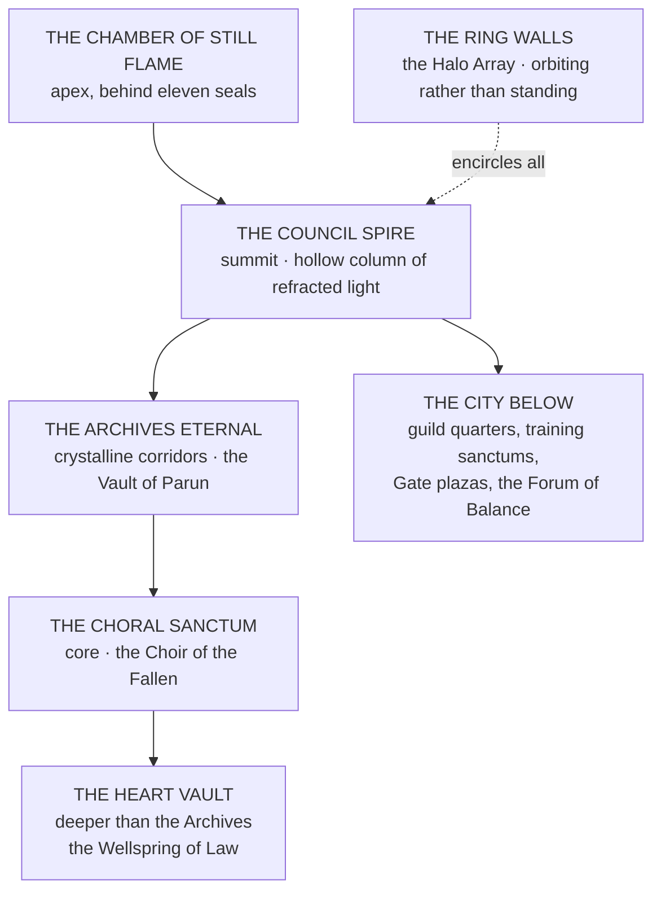

# The Concord Citadel

**Say it** · the KON-kord SIT-ah-del
*Filed under the Codex of Absolute Magical Law, Article XVI: "On the Heart of Law and the Architecture of Order."*
> The Concord Citadel, called the **City of Latticeglass**, does not exist in one realm alone. **It is a nexus suspended between planes**, visible only to those bound to the Lattice. To mortals, a towering crystal spire encircled by radiant bridges of light. To spirits, **a song made structure.**
>
> The city does not simply house the Accord. **It is the Accord.**

---

## The Citadel's Nature

**The Citadel was not built by human hands.** It grew around the **Heart Vault**, a massive Wellspring Core that crystallized into self-awareness after the Harmonial Age. The High Concordant's soul is woven into this Vault; **their breath sustains the Citadel's glow.**
Within its translucent walls, **time flows by resonance, not sequence.** Couriers cross days in minutes. Archives update themselves before events occur. *Those who dwell too long forget what direction means.*

---

## The Council Spire

A hollow column of refracted light where the Concord Council convenes. **The chamber's floor is an unbroken mirror of living Aether; its surface ripples whenever truth is spoken.**
The High Concordant presides from the **Throne of Resonance**, surrounded by **seven empty chairs — one for each Division, and one for the silence of the Black Concord.**
> Every decree issued here **becomes law the moment it is spoken.** The Lattice records the words before the speaker finishes them, binding them into metaphysical permanence.
>
> *It is said that even gods tremble when their names echo in this hall.*

---

## The Archives Eternal

A labyrinth of crystalline corridors containing the sum of all Accord knowledge. **Each document is alive** — runic paper that breathes, scrolls that whisper their own memories. The walls hum with a low tone known as the **Librarian's Chord**, believed to be the voice of Urion, Archon of Memory.
> The most sacred texts are stored within the **Vault of Parun**, accessible only through ritual bloodline resonance or divine authorization. Inside rests **the original Concord Codex**, a tome of translucent glass pages **that rewrites itself according to the world's balance.**
>
> **When the Codex's pages still, it means the world's rhythm is dying.**

---

## The Choral Sanctum

At the Citadel's core lies the **Choir of the Fallen**, a cathedral housing the souls of those who died in service. Their echoes drift through luminous air, **singing endlessly in harmonic frequencies that stabilize the Lattice across realms.**
Every Accord member can feel their hum in moments of silence — *a comforting vibration at the edge of hearing.* **The song grows louder during Wellspring crises**, guiding Sealwrights and field agents toward equilibrium.
> *"In service, the soul is not lost — it becomes the sound that keeps the world awake."*

---

## The Heart Vault

Beneath the Sanctum, deeper than even the Archives, **the High Concordant communes directly with the Lattice.** This chamber holds the **Wellspring of Law**, the first metaphysical convergence ever stabilized by mortal and divine cooperation. *It glows with a blinding white that casts no shadow.*
Every Concord Seal, Commission, and Merit flows first through this light before reaching the rest of creation.
> The Vault hums in rhythms that mirror the High Concordant's pulse. **If they die, the Vault stills — and the Guild Accord collapses.**
>
> **Only three beings have ever entered the Vault and returned alive. None spoke of what they saw.**

---

## The City Below

A sprawling complex of halls, guild quarters, training sanctums, and Gate plazas. Here agents from every realm converge: soldiers, mages, Sealwrights, and scholars walking side by side. **The air is perpetually filled with light rain — the condensation of Aether in its purest form.**
At its centre stands the **Forum of Balance**, where citizens bring disputes before minor Arbiters. Every verdict echoes upward to the Council Spire, imprinting itself in the Codex as precedent.
> **Justice in the Accord is circular — born below, judged above, recorded forever.**

---

## The Outer Defenses

Encircling the Citadel are the **Ring Walls**, colossal shields of prismatic stone **that orbit rather than stand.** They refract incoming attacks — magical, divine, or otherwise — **turning them into auroral storms that feed the Wellspring Core.** The system, called the **Halo Array**, was designed by the Titans Atla'zon and Maelor themselves.
> Only twice in history have the Ring Walls fallen: **once during the Eclipse Wars, and once during the Silent Rebellion of the Black Concord.**
>
> Each collapse left scars in the sky **still visible to this day.**

---

## The Chamber of Still Flame

Hidden at the apex of the Spire, behind eleven seals, rests the High Concordant's sanctum. Here the leader communes directly with the Wellsprings, receiving the law's will as whisper and light. The chamber's floor is a pool of liquid radiance upon which the Codex manifests messages through reflected glyphs.
> **No guards stand watch. None are needed.**
>
> The room itself devours intruders, **rewriting them into the Citadel's architecture.** It is said the walls are made from the bones of those who broke their oaths while standing in its light.

---

## The Citadel's Living Law

**The Citadel is not static. It rearranges its halls to reflect the Accord's state.** When peace reigns, the city glows golden and wide. When corruption festers, the corridors narrow and darken, the glass thickens, and whispers grow faint.
> The Citadel's architecture is both reflection and prophecy — **a mirror of the world's soul.**
Sealwrights claim to navigate by tone rather than sight. **If the city sings in minor key, danger is near. If it falls silent, the end of an era approaches.**

---

> *"Here the world is written, erased, and written again. Here every breath is weighed against eternity. We are the keepers of order, the stewards of Wells, and the witnesses of our own decay. Let the Citadel endure — for while it stands, so too does the Law."*
> — Final engraving of the Heart Vault's inner seal, Imperial Year 013, Voyager Era
