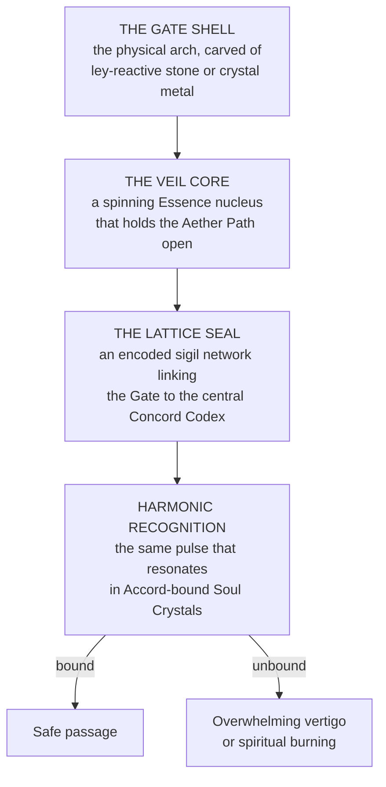

# The Concord Gate Network

*Filed under the Codex of Absolute Magical Law, Article XIII: "On Movement, Distance, and the Passage Between Realms."*
> The circulatory system of the Guild Accord — a web of metaphysical corridors linking the Mortal Kingdoms, Wellspring sanctums, and the Outer Realms through the living fabric of the Lattice. **Each Gate is a stabilized wound in space**, held open by Parun Glyph geometry and Aether compression.
>
> Every Gate breathes, hums, and remembers. **To step through one is not to travel, but to be rewritten elsewhere.**

---

## Origin of the Network

The first Gates were forged during the **Withering Age**, when the mortal world fractured into isolated Wellspring territories. The High Concordant ordered the creation of the **Great Arches** — immense ritual structures capable of bending the Aether between distant points, built atop ley intersections and reinforced by the Titans' residual laws of gravity and continuity.
When the Accord unified, these became **the first nine Concord Gates**, immortalized as divine constructs anchored by the Lattice itself. Every Gate thereafter was patterned on these originals.

---

## Structure and Function

*Transit feels like walking through wind and heartbeat. The world collapses into light, and the traveller reassembles where the Gate's twin awaits.*

### Classifications

| Type | Function |
|---|---|
| **Major Arches** | Realm-to-Realm conduits for mass transport of armies, cargo, and Wellspring material. Attended by a Logist and Sealwright team |
| **Minor Arches** | Local teleportation routes within continents or nations, managed by regional guilds |
| **Hidden Gates** | Restricted or classified pathways maintained by Research & Archives **or the Black Concord** |
| **Mobile Gates** | Experimental Gate fragments that move with fleets or armies. **Highly unstable and forbidden for civilian use** |
| **Dead Gates** | Collapsed portals from prior epochs, **dormant until restored by Sealwrights or accidental resonance events** |

### Command

Maintained by Logistics & Supply, directed by the **Chief Logist**, formally titled the **Gate-Warden of the Lattice.** Every Gate has three overseers: a **Sealwright Prime** who maintains Parun glyph synchronization, a **Transit Keeper** who monitors Essence drift and arrival stability, and a **Concord Clerk** who records every crossing in the Lattice Ledger.
Only authorized guild members bearing valid **Transit Sigils** may pass freely. Unauthorized use violates the Law of Passage and is punishable by Essence seizure or full Severance.

---

## The Law of Passage

*Five inviolable principles.*
| Principle | Meaning |
|---|---|
| **The Gate Recognizes Oath** | Only souls bound to the Lattice can survive the fold |
| **The World Demands Balance** | Every departure must equal an arrival. The Lattice prevents displacement paradox |
| **Distance Is a Cost** | Each jump burns Aether proportional to distance and Essence mass |
| **Silence Protects Transit** | Speaking or casting during travel **risks dimensional fragmentation** |
| **The Lattice Remembers** | Every crossing, **even unauthorized**, leaves a resonance trace that cannot be erased |

---

## The Transit Corridors

Between Gates exist extradimensional veins of light and hum that form the connective tissue of the multiverse. To most travellers, a corridor appears as **endless mirrored pathways reflecting a thousand possible versions of themselves.** To the trained mind, it is a silent river of law — pure, directionless Aether.
> **Time does not behave normally inside.** A journey that takes seconds outside might last hours, days, or entire lifetimes in perception, depending on the stability of the traveller's Essence. Veteran operatives call this **the Drift** — a test of Temperance and clarity of will.
>
> Those who panic or lose mental cohesion **can split, arriving in multiple incomplete forms across several realms.** Enforcement calls this **Echo Fragmentation** — a form of metaphysical death worse than Severance.

### Malfunctions and hazards

When a Gate destabilizes, the Veil Core emits a **Lattice Surge** — violent feedback of Aether that can shred travellers into resonance dust or open rifts to the Outer Realms. Causes include Wellspring collapses, Essence overdraw, or interference by divine entities. *During such events, light bends inward, sound becomes inverted, and gravity abandons direction.*
Some Gates, long abandoned, become corrupted — birthing **Echo Lairs** inhabited by entities known as **Drifters** or **Gateborn**, creatures assembled from failed travel resonance and fragmented souls.

---

## The Great Lattice Lines

The entire network is built upon **Lattice Lines** — metaphysical arteries channelling Essence between Wellsprings. These intersect at major Gates, forming **Nodes of Concord**: immense energy nexuses **visible from orbit as luminous rings.**
> Each Lattice Line hums with a different harmonic tone, recorded in the Accord's archives **as musical scales.** The Pratorian March's Gates hum in **low C tones**, representing Order, while the Eressean lines sing in **high E**, representing Dream.
>
> When all tones align, it creates the **Chord of Passage** — the sound that holds the worlds together.

---

## Gate Warfare

In times of large-scale conflict, Gates become **both weapon and vulnerability.** The Strategic Division can seal or weaponize a Gate by converting its Veil Core into a **Resonance Bomb**, releasing compressed transit energy into the enemy's realm. Such acts are **forbidden under Concord Law**, but precedent exists from the Eclipse Wars and the Outer Incursions.
Defensive techniques include **Aether Sink Fields**, which absorb Gate resonance, and **Temporal Locks**, which slow entry and create false exit points.
*Legends speak of Gatewalkers — rare Chosen operatives capable of stepping between realms without any physical Gate, walking the Lattice Lines themselves.*
> *"Every journey bends the law. Every return reaffirms it. The Lattice is not a road — it is a memory of where you chose to go."*
> — Engraved upon the first Gate of Eresse, Imperial Year 003, Voyager Era
