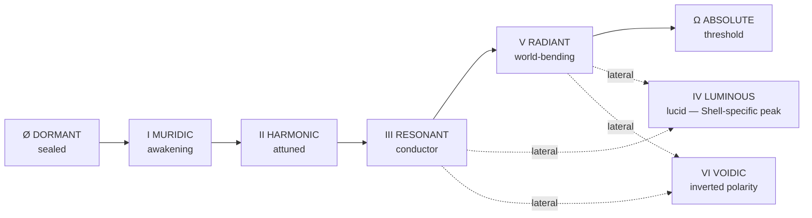

# Tier Grade, Bands & the Aether Shell

> *"Power is not what you hold, but how cleanly you pass the infinite through the finite."*
> Three separate measurements, constantly confused for one another. **Level** counts how many times a Crystal has densified. **Tier Grade** reports raw magnitude. **Aether Class** reports how much of that magnitude survives the trip out through the Shell. A practitioner is described by all three and by the gaps between them.

---

## Level and the Five Bands

Level is the count of how many times a Soul Crystal has meaningfully densified. It is not a measure of age. It is not a measure of training hours. It is the sediment of genuine contact with consequence, counted, compressed, and expressed as a number.
The ceiling is **500**. This is the structural limit of what a mortal Soul Crystal can contain before the distinction between practitioner and Principle collapses entirely. Characters who reach Level 500 and continue to accumulate pressure do not advance in level. They begin the Apotheosis approach, a qualitative event outside the scope of numbered progression.
> No character can breach a Band ceiling without first passing the Temperance Threshold that cluster demands. The System will simply halt the level counter and build pressure, called **Residual Strain**, until the Threshold is passed or the character fractures under the weight.
| Band | Levels | Temperance cluster | Gate |
|---|---|---|---|
| **I · Mortal Foundation** | 1 – 100 | Stage I through IV · Murmuring to Flourishing | Stage IV before Level 100 can be surpassed |
| **II · Awakened** | 101 – 200 | Stage V through VII · Splintering to Refraction | Stage VII before Level 200 can be surpassed |
| **III · Sovereign** | 201 – 300 | Stage VIII through X · Transcendence to Realization | Stage X before Level 300 can be surpassed |
| **IV · Mythic** | 301 – 400 | Stage XI through XII · Dissonance to Emanation | Stage XII before Level 400 can be surpassed |
| **V · Absolute** | 401 – 500 | Stage XIII through XIV · Principality and Zenith | None. There is no Band beyond Band V |

> **Read the last two columns differently.** The **Gate** binds. The **Temperance cluster** describes where practitioners in that Band usually sit and binds nothing.
>
> A soul accumulates Level by contact with consequence and Stage by Catalyst, and the two arrive on unrelated schedules. Nothing stops a practitioner from grinding to the top of Band II at Stage IV if no Catalyst has ever reached them. They will be strong, wrong-shaped, and stopped dead at the gate, and the file will read as an error to anyone who does not understand the difference between the columns.
>
> The reverse case is rarer and worse. A soul that takes Catalysts faster than it takes pressure arrives at a high Stage on a thin Level, holding architecture it has not earned the density to fill.
**Band I** is the era of first contact. The Crystal is porous, receptive, and relatively unformed. Growth here is the fastest in a character's life because the Crystal is still learning the shape of Essence. Practitioners of genuine but bounded power, dangerous to mortals, irrelevant to Archons.
**Band II** follows the first genuine encounters with forces larger than the self. The Crystal has begun to show its character, the specific resonance signature that will define this practitioner across every future stage. Techniques cohere. A Domain seed becomes possible.
**Band III** exercises genuine metaphysical authority. Aura suppresses weaker resonances without effort. Techniques carry the weight of doctrine rather than improvisation. The world responds to their presence before they act.
**Band IV** is no longer measured in individual techniques. It is measured in how significantly a practitioner's existence reshapes the metaphysical landscape of the space they occupy. Domain becomes law. Crystal density generates passive environmental effects.
**Band V** are cosmological presences. Metaphysical output is measured against Archon and Titan-scale phenomena. Individual combat becomes a secondary concern. The primary arena is the contest of Domains, Principles, and accumulated doctrine pressing against the laws of the Continuum itself.

---

## The Tier Grade System

Tier Grade is the qualitative bracket that determines what scale of force, phenomenon, or entity a stat can meaningfully engage, resist, or overcome. It is derived from the stat's raw numeric value and confirmed by Temperance Stage. **A stat cannot hold its Tier Grade if the Soul Crystal has not undergone the Threshold required to sustain that density.**
> **The table measures a Sub-Stat.** The Temperance ceiling and the Path gates both bind the Sub-Stat, and every Grade letter in the gate tables and the Resonant Pairs is a threshold on that Sub-Stat's own number.
>
> **A Primary is the combined total of its eight Sub-Stats, and its Grade is read off the mean.** Points are spent on Sub-Stats only; the Primary is the arithmetic afterward. Eight Ardency Sub-Stats totalling 2,400 give a mean of 300 and an A-Grade Ardency, which is the figure a character sheet has always carried on the Primary line. The total is what the sheet records. The mean is what an assessor reads. Full treatment in **Fracture of Worlds**, Parts One to Three and Parts Four to Ten.
> **The differential rule.** A character one full Tier Grade above their opponent in the relevant stat wins a direct exchange of that stat category without meaningful contest. **Two Tiers above is overwhelming to the point of one-sided. Three Tiers above means the lower-grade character is not engaging in a battle, they are surviving an event.**
| Grade | Stat range | Attack output | Travel speed |
|---|---|---|---|
| **Hollow** | 1 – 10 | Below 60 J. The kinetic energy of a thrown fist at human speed | below 12.4 m/s · below 44.7 km/h |
| **F** | 11 – 25 | 60 – 300 J. Human to trained athlete | 12.4 – 60 m/s · 44.7 – 216 km/h |
| **E** | 26 – 50 | 300 J – 15 kJ. Street to low Wall level | 60 – 150 m/s · 216 – 540 km/h |
| **D** | 51 – 100 | 15 kJ – 2.092 × 10^7 J. Wall level, 0.005 tons TNT at the ceiling | 150 – 340 m/s · 540 – 1,224 km/h |
| **C** | 101 – 175 | 2.092 × 10^7 – 1.046 × 10^9 J. Small Building to low Building, 0.005 – 0.25 tons TNT | 340 – 500 m/s · Mach 1.0 – 1.5 |
| **B** | 176 – 275 | 1.046 × 10^9 – 4.6024 × 10^10 J. Building to Large Building, 0.25 – 11 tons TNT | 510 – 1,372 m/s · Mach 1.5 – 4 |
| **A** | 276 – 400 | 4.6024 × 10^10 – 4.184 × 10^12 J. City Block to Multi-City Block, 11 – 1,000 tons TNT | 1,715 – 8,575 m/s · Mach 5 – 25 |
| **S** | 401 – 550 | 4.184 × 10^12 – 2.42672 × 10^13 J. Small Town to Town, 1 – 5.8 kilotons TNT | 8,575 – 68,600 m/s · Mach 25 – 200 |
| **SS** | 551 – 725 | 4.184 × 10^13 – 4.184 × 10^14 J. Town to Large Town, 10 – 100 kilotons TNT | 68,600 – 343,000 m/s · Mach 200 – 1,000 |
| **SSS** | 726 – 950 | 4.184 × 10^14 – 4.184 × 10^21 J. Large Town to Small Country, 100 kilotons – 1 teraton TNT | Sub-Relativistic, 1% – 10% c |
| **X** | 951 – 1,200 | 4.184 × 10^21 – 1.24 × 10^29 J. Country to Moon, 1 teraton – 29.6 exatons TNT | Relativistic, 10% – 50% c |
| **EX** | 1,201 – 1,500 | 1.24 × 10^29 – 6.906 × 10^37 J. Moon to Large Planet, 29.6 exatons – 16.512 ronnatons TNT | Relativistic+, 50% – 100% c |
| **EX+** | 1,501 and above | 6.906 × 10^37 J and above. Brown Dwarf level and beyond, scaling toward stellar and solar-system scale | FTL and above, beginning at c |

> **Within-Tier resolution.** When two characters operate at the same Tier Grade, exchanges are resolved by technique quality, tactical intelligence, positioning, and Sub-Stat architecture. A character at the upper boundary of B-Grade, stat value 275, produces roughly **five times** the Strike Force of one at the lower boundary, stat value 176. Both are B-Grade. The five-fold differential is real and significant but not automatically decisive, because technique architecture, Wellspring affinity, and Path bonuses can compress or invert the raw advantage.

### The Sharp-Blunt Asymmetry

Edged weapons and piercing techniques concentrate energy into smaller contact areas, producing higher local pressures than blunt-force equivalents at the same total energy yield.
A swordsman at B-Grade delivering 2 GN of force through a blade edge contacting roughly one square centimetre produces a local pressure of **200 GPa**, exceeding the compressive strength of virtually all natural and most Essence-reinforced materials at that Tier. The same 2 GN delivered through a fist contacting one hundred square centimetres produces **20 MPa**, sufficient to crack stone but not to bisect steel.
The Continuum tracks total energy for Tier Grade comparison but tracks local pressure for material interaction. This is why a B-Grade swordsman can cut through materials that a B-Grade brawler can only dent, and why a B-Grade brawler can shatter structures that a B-Grade swordsman can only slice.

### Overchannel Spikes

> The benchmarks above represent **sustainable** output. Overchannel events, where a character forces their Crystal to produce output above its structurally safe ceiling, can temporarily spike Strike Force and Lifting Strength by factors of **two to five times** the sustainable ceiling, depending on the Ardency Overchannel Sub-Stat's current Grade and the character's tolerance for Crystal Fracture risk.
>
> These spikes are not free. Every Overchannel event deposits structural damage that must be healed through rest, alchemical treatment, or Temperance advancement. A character who regularly Overchannels accumulates fracture density that eventually becomes permanent. **Some fractures become architectural features. Most become liabilities.**

---

## Reaction Speed by Grade

Speed divides into three components: **Attack Speed** (velocity of technique execution), **Reaction Speed** (capacity to perceive and respond to incoming force), and **Travel Speed** (movement velocity across space). All three are influenced by Dexterity Sub-Stats, particularly Celerity, Reflex, and Sequence, but each responds differently to Temperance advancement.
| Grade | Reaction Speed | Attack Speed |
|---|---|---|
| **Hollow** | 150 – 300 ms, purely biological | Does not exceed the physical mechanics of the body without Essence involvement |
| **F** | 80 – 150 ms, Essence-enhanced neural routing | Begins to exceed unaugmented human limits |
| **E** | 40 – 80 ms | Low Subsonic, independently of Travel Speed |
| **D** | 15 – 40 ms | Mach 0.5 – 1.0. Can react to gunfire but cannot outrun it |
| **C** | 5 – 15 ms | Mach 1.0 – 2.0 |
| **B** | 1 – 5 ms | Mach 2.0 – 5.0. Can engage firearms without significant reactive disadvantage |
| **A** | Sub-millisecond, roughly 0.2 – 1 ms | Mach 10 – 30. Movement generates heat buildup and pressure waves without deliberate technique |
| **S** | 0.05 – 0.2 ms | Mach 50 – 500. The air itself becomes a weapon; characters below S-Grade Resilience sustain damage from proximity alone |
| **SS** | Below 0.05 ms. Biological neural processes insufficient; Essence-mediated sensory routing becomes primary | Mach 1,000 – 8,810. Passage perceived as an instantaneous event by anyone below S-Grade |
| **SSS** | Entirely Essence-mediated | 1% – 5% c. Dodging requires SSS Reaction Speed at minimum to register the attack as having occurred |
| **X** | Combat perceived in Essence-time rather than physical time | 10% – 50% c. Practitioners below SSS cannot perceive, let alone react |
| **EX** | — | Approaching c. Movement generates relativistic effects causing localized temporal distortion as a byproduct rather than an intention |
| **EX+** | — | FTL parameters. Movement is Essence-mediated spatial restructuring where distance is subject to Domain authority |

> **At Zenith, Stage XIV**, speed is no longer assessed by conventional metrics. The Continuum's standard measurement framework requires metaphysical recalibration to register Zenith-level movement as a phenomenon rather than an event. Zenith characters do not move faster than light. In the limit case, they exist in all relevant positions simultaneously until they choose otherwise.

---

## The Aether Shell and the Seven Classes

Where Temperance measures the refinement of the Essence Core on the Soul Plane, and Tier Grade measures raw output magnitude, the Aether Class System measures one thing only: **how cleanly the Aether Shell conducts Essence outward into form.** It is the Shell's transparency. When the Essence Core speaks, how much of what it says actually arrives?

### The Three Constants

Every Aether Shell radiates an Aetheric Signature described by three constants.
| Constant | What it measures | Governed by |
|---|---|---|
| **Lattice Conductivity** *Equilibrium and Vitae aligned* | How easily Essence moves through the Shell without resistance. Low means blockage and backlash. High means smooth passage. | Vitality (Constitution, Fortitude) · Tempering Clarity |
| **Resonant Purity** *Intent aligned* | How closely the Shell's output matches the Core's intention. Low means static and misfires. High means near-instant Formation. | Gnosis Fluency · Ardency (Compression, Density) |
| **Continuum Retention** *Resonance aligned* | How long coherence endures after strain. Low means brief flares. High means sustained resonance. | Harmonics (Stability, Attunement) · Resilience (Integrity, Continuity) |

> **The Aether Index** · Conductivity multiplied by Purity, plus a Retention bonus. This is a **clarity score, not a power level.** The Continuum Coherence Ladder measures how much force moves through the Shell. The Aether Index measures how little gets lost on the way through.

### The Seven Classes

| Class | The Shell | Efficiency loss |
|---|---|---|
| **Ø · The Dormant** | The unawakened Shell. Sealed, unresponsive, nearly silent. The soul dreams without memory and moves through the world without leaving lasting metaphysical trace. Precedes Initiate entirely; corresponds to the Dormant Crystal. **Traits are unaffected by any of this.** A Class Ø soul carries its laws in the ordinary material of itself, refines by the Weathering rather than by Temperance, and is missing only the organ that would arm what it already holds. | No output above Hollow Grade is possible |
| **I · The Muridic** | The awakening Shell. It flickers with first resonance. Essence leaks unevenly into space. Emotion distorts weather and mood. Will echoes unpredictably through Aether. The bearer may appear unstable when their lattice is simply learning to speak. Initiate through Adept, Awakened Crystal. | Roughly 30 – 40% |
| **II · The Harmonic** | The attuned Shell. It begins to hold rhythm. Essence and Aether find a recurring pattern. Simple spellwork stabilizes. Wellspring whispers find purchase. Bonds form without tearing the self. Harmony is structured tension that no longer shatters. Early Expert. | Roughly 15 – 25% |
| **III · The Resonant** | The conductor Shell. Essence and Aether exchange freely. Power moves even in silence. Magic ceases to feel like performance and begins to feel like breathing. Dual-casting, Synergia, and complex techniques awaken naturally. Late Expert. **The first Class at which stat values translate into output at near-full fidelity.** | Roughly 5 – 10% |
| **IV · The Luminous** | The lucid Shell. It thins. Light and thought draw close. Wellsprings respond with minimal prompting. Aether behaviour mirrors the bearer's emotional and moral alignment with unnerving precision. **Lateral.** No single corresponding Crystal Tier; a Shell-specific peak, most often in Intent-aligned Spirit Path souls whose Shell has clarified faster than their Core or Layer. | Negligible. Precision exceeds baseline stat values |
| **V · The Radiant** | The world-bending Shell. Aether bends toward the bearer. Currents curve around their presence. They can stabilize Realmgates, hold Domains against collapse, and speak Parun motifs into matter. The line between intention and environment begins to blur. Early Master, Radiant Crystal, where the first true Domain forms. | Output begins **exceeding** what the raw numbers suggest |
| **VI · The Voidic** | The inverted Shell. Polarity reverses. Instead of emitting, the Shell devours, remembers, and reflects. Voidic conductors channel absence, silence, and negation without erasing themselves. They interface most directly with Limina Wellsprings and Titanic depths. **Lateral** — can appear alongside Resonant, Luminous, or Radiant. | Qualitatively different. Their Ardency does not deal damage. **It removes things** |
| **Ω · The Absolute** | The threshold Shell. The Aether Shell dissolves as a distinct boundary. Being and Continuum interpenetrate. Every fragment of the self conducts law with minimal deviation. Paragon, Absolute Crystal. Archons, Titans, and World Spirits who have crossed the Apotheosis Threshold exist at this clarity. | Stat output is no longer meaningful as a separate measurement |

> The interaction is **not linear**. The jump from Class II to Class III produces the largest single improvement in stat-to-output fidelity. The jump from Class V to Class VI produces the most dramatic qualitative shift, from conventional force expression to inverted, negation-based expression. The jump to Class Ω produces output the stat system can no longer meaningfully track.

### How a Shell Ascends

Aether Class ascends through refinement, not conquest. Each step removes interference: ego noise, denial, unprocessed fracture, clinging to false narratives.
**Temperance Refinement** · gradual clarity through discipline and self-confrontation. The most common and safest path. The Core refines, and the Shell learns to match.
**Wellspring Baptism** · deep immersion into a Wellspring current, forcibly realigning the Shell's resonance. Potent, perilous, often irreversible.
**Aether Forge Rites** · Mechanica and ritual that widen conductivity or restructure the Shell directly, sometimes at the cost of memory, autonomy, or Essence stability.
**Higher Resonance Infusion** · alignment with Archonic principle, Titanic depth, or world-bearing law that rewrites the Shell from above.

### Variants and Anomalies

> **Rot-Born Conductors** channel Aether through damaged or corrupted Shells. Output can be immense, but each working corrodes the lattice further. Every stat expression carries a hidden cost in Crystal integrity.
> **Synthetic Aetherics** bear engineered or grafted Shells. They may rise quickly through lower Classes yet suffer accelerated decay, instability, or identity drift. Their Class can outpace their Core's actual Temperance by a dangerous margin.
> **Split-Shell Entities** possess dual polarity, luminous and voidic channels braided through one soul. Capable of rare paradoxical feats but prone to fracture, inversion, or self-annihilation. May register as Luminous and Voidic simultaneously.

---

## The Soul Crystal's Developmental Tiers

> *"To refine the soul is not to polish it. It is to remove everything that was never truly part of the design."*
The Crystal evolves through Developmental Tiers representing the synthesis of all three layers at once. These Tiers are **correlated with but not identical to** Temperance Stages or Aether Classes. A Crystal can run ahead of or behind its Shell or Core, and the gap is itself diagnostic.
| Tier | Condition | Corresponds to |
|---|---|---|
| **Dormant Crystal** | Sealed and silent. Precedes all awakening. The Crystal exists but does not yet function as a metaphysical organ. The soul around it is fully furnished and continues to refine by the Weathering, which is why the great majority of the world's Traits sit in bodies that will never be screened. | Class Ø · pre-Initiate |
| **Awakened Crystal** | The Crystal has opened and begun to circulate Essence. Traits that were already present in the soul become armed, expressible, and expensive. The first layer to activate is always the Essence Core, which is where they were sitting all along. | Class I · Initiate to Apprentice · Stages I–II |
| **Harmonic Crystal** | The three layers have found a recurring rhythm. Essence, Aether, and Attraction circulate in a pattern the Continuum can read consistently. Wellspring harmonization becomes structurally possible without tearing the lattice. | Class II · Expert · Stages V–VI |
| **Resonant Crystal** | The Crystal self-conducts. Power moves even in silence. The resonance signature becomes a permanent feature of the Continuum's local accounting. | Class III · Expert · Stage VII |
| **Radiant Crystal** | The Attraction Layer gains territorial durability. The first true Domain becomes possible. The Crystal's existence exerts topological pressure on its surroundings. | Class V · Master · Stage VIII |
| **Sovereign Crystal** | Trait law and Domain law begin to be the same law. The Crystal is no longer merely a container for power. It is a generator of local metaphysical conditions. | Master to Grandmaster · Stages IX–XII |
| **Crystallized Soul** | Self and law correspond with near-perfect precision. The Crystal becomes an exact instrument of identity. Thought carries causal weight. | Archmaster · Stages XIII–XIV |
| **Absolute Crystal** | The Crystal dissolves as a distinct boundary between self and Continuum. Being and law interpenetrate. | Class Ω · the Apotheosis approach |

### Crystal States

Separate from Tier. A Crystal at any Tier can occupy any of these.
**Fractured** · split by contradiction or strain. The Core leaks, the Shell destabilizes, the Layer weakens. Thought becomes difficult to trust. Can heal through Temperance advancement, alchemical treatment, or the integration of fracture into architectural feature, which is the Dissonance path.
**Refined** · balanced and coherent. Essence moves in rhythm, Aether conducts cleanly, Attraction Force binds without overreach. The standard healthy state, and rarer among veterans than recruitment posters suggest.
**Overgrown** · swollen with more pressure than integrated. Power spills outward, emotions distort nearby space, the soul wounds its own surroundings. Common at Stage transitions when Essence accumulates faster than Temperance can shape it. This is what forced advancement produces.
**Crystallized** · the self has become law. Thought carries causal weight. Very few reach this. Fewer remain recognizable afterward.

---

## Reserve, Rate, and Efficiency

| **EU · Essence Units** | The raw reserve. Total volume of usable Essence stored in the Crystal at any given moment, also called Essence Volume. Scales with Temperance Stage. A practitioner operating below ten percent EU suffers **Essence Starvation**: reduced stat expression, Shell degradation, Trait flickering. |
|---|---|
| **Flux Density · EU/g** | The compression ratio. How much Essence is packed per unit of Crystal mass. Higher Flux Density means greater output drawn from the same reserve. |
| **AU/s · Aether Units per second** | The output rate. How much Essence a practitioner converts into active Aetheric expression per second of sustained operation. Governed by Ardency Flux, Ardency Alacrity, and Tempering Yield. **AU/s = Flux Density × η** |
| **Eta · η · Efficiency** | The ratio of Essence spent to Essence that arrives as intended effect. An η of 0.50 wastes half of every expenditure as heat, noise, and structural bleed. **The single most important variable in sustained combat**, because it determines how long the reserve lasts under continuous output. Governed by Aether Class, Tempering Clarity, and Ardency Compression. |

### Efficiency by Tier of Standing

| Tier | η | What changed |
|---|---|---|
| **1 · Initiate** · Murmuring | ~0.30 | Enormous waste. Techniques feel like shouting into wind. |
| **2 · Apprentice** · Welling | ~0.35 | The leak is still the loudest thing about the practitioner. |
| **3 · Journeyman** · Ascension | ~0.40 | Waste becomes predictable, which is the first thing that can be trained against. |
| **4 · Adept** · Flourishing | ~0.45 | The last tier at which more than half of every expenditure is lost. |
| **5 · Expert** · Splintering to Refraction | 0.50 – 0.60 | First genuine efficiency; the Crystal has learned to stop leaking. Dual sight at Refraction allows the practitioner to observe and correct their own waste in real time. |
| **6 · Master** · Transcendence to Realization | 0.70 – 0.80 | First true Domain, providing a feedback loop that recycles ambient bleed. Pacts, artifacts and law imprint on terrain, creating persistent gains in familiar ground. |
| **7 · Grandmaster** · Dissonance to Emanation | 0.85 – 0.90 | Traits become local physics. Mere presence begins optimizing Aether flow in the vicinity. |
| **8 · Archmaster** · Principality to Zenith | 0.95 – 1.2 | Biomes carry the practitioner's doctrine. Above 1.0 the practitioner produces more coherent output than they spend. This is not free energy. It is the Continuum recognizing their expression as law and supplementing it with ambient flow. **The environment becomes a co-author.** |
| **9 · Paragon** · Revelation to Apex | above 1.2, unbounded | No source figure exists. The lettered scale had no rung here. Flagged as an open gap rather than filled with an invented number. |

> **The efficiency conflict, unresolved.** The Aether Class table above rates **Class I Muridic** at roughly thirty to forty percent loss, which is η 0.60 to 0.70. The table here places the same practitioners, Initiate through Adept, at η 0.30 to 0.45, which is fifty-five to seventy percent loss.
>
> *Both describe how much of a working survives the trip out through the Shell. Both are reproduced as written. Neither has been withdrawn.*

---

## Domains

> *"When belief holds, the world begins to answer."*
A Domain is a space where a character's inner law becomes local reality, the moment the Attraction Layer claims territory on the Plane of Fate and that claim reflects downward into physical and spiritual law. Inside a Domain, the character's doctrine outranks ambient physics for as long as the Domain is sustained.
> Domains are not techniques. They are consequences of sufficient Temperance, Dominion Sub-Stat development, and Aether Class clarity. A character does not choose to deploy a Domain the way they choose to throw a punch. **A Domain forms because the character's soul has become heavy enough to dent reality, and reality has stopped resisting the dent.**
| Stage | What the Domain is |
|---|---|
| **VII · Refraction** | Domain seed activation. The first fragile, flickering territory. Lasts minutes rather than hours. Requires active concentration. Collapses if attention fractures. The seed is the Attraction Layer's first territorial claim. |
| **VIII · Transcendence** | The Domain stabilizes. A piece of the lattice accepts the soul's signature permanently. Can be held for hours and survives minor disruption. This is where the first true Domain forms. |
| **IX – X · Invocation to Realization** | The Domain consolidates into a Realm capable of holding other Domains. Pacts, artifacts, and law begin to imprint on terrain. The Domain becomes a reality the Continuum must accommodate. |
| **XI – XII · Dissonance to Emanation** | Passive Domain effects leak without active maintenance. Traits become local physics. The Domain transitions from a deliberate expression to an ambient consequence of existing. |
