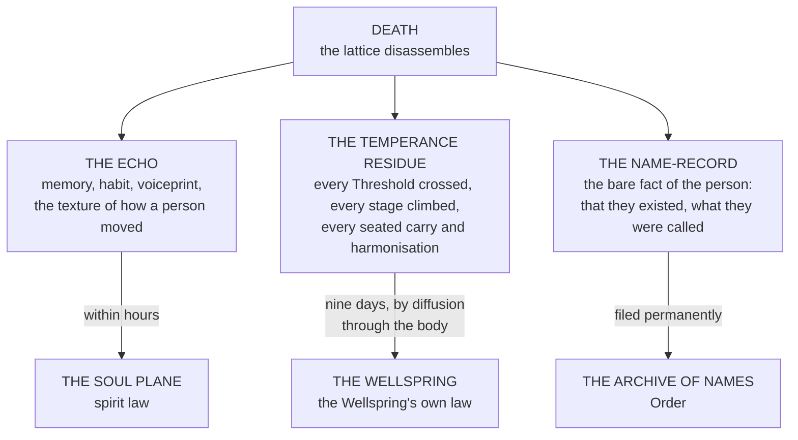

# The Crossing

*What Happens to a Soul Crystal When the Body Stops*
> Issued by the Research and Archives Division. **Section VI was prepared at the request of the Arbitration Division and the Bench of Attribution jointly, and neither has acknowledged it.**
> 
> *Seventh of the War Cycle. Companion to The Rites.*

---

## Three Things Leave

> **The Crystal does not depart. It comes apart** — into three products with three destinations and three separate laws.
>
> **Everything difficult about death in the four quarters follows from the fact that they do not leave together.**

**These three were one lattice for the whole of a life. Death separates jurisdiction, and the separation is the actual event.**
> What people mean when they say a person has died is not that the heart stopped, **which is a physical fact of no metaphysical consequence.** It is that **the three products have parted and are now the property of three different laws.**

---

## The Sequence, and the Windows

### The Echo goes first

Within hours, **and the departure is perceptible to anyone with even passive Veil sensitivity** — which is most people at a deathbed even if they have no vocabulary for it.
**This is how death is actually determined in the four quarters.** A body whose Echo has departed is dead in the sense the law means. **A body whose Echo has not is not, whatever the breath and the pulse are doing** — and the practice of sitting with the dying until the room changes is universal, ancient, **and correct.**
> It is also why the fear that troubles other traditions **runs the opposite direction here.**
>
> **Nobody in the four quarters fears being buried alive. They fear being buried too late, because the second window is closing while the family argues.**

### The Temperance residue takes nine days

**The residue does not depart. It diffuses**, slowly, back into the Wellspring — **and it diffuses through the body, which remains its medium until the process completes.**
Nine days is the figure. It varies with Stage, with the Wellspring concerned, with saturation at the site, and with what the body is doing, **but nine is the number the practice is built on and the number the law uses.**
> On the ninth day the residue is gone, the Wellspring has received what it was owed, **and what remains is meat.**
**Everything difficult in this document occurs inside those nine days.**

### The Name-record files last and does not close

The Archive receives the Name-record **and the Archive does not release it.** A name entered is entered permanently — which is why the Law of Silence forbids naming captured Outer Realm entities, **and why the destruction of a Name is a category of violence distinct from killing and considerably worse.**

---

## What a Corpse Is Holding

> *Prepared at the request of the Arbitration Division and the Bench of Attribution. Neither has acknowledged receipt and both hold copies.*
**A body inside the nine days is a medium through which a Wellspring is being repaid.**
> **Class IV rendering, correctly described, is the interception of that repayment.**
>
> The Crystal Draw taken from a corpse is **not taken from the person, who has already gone**, and is **not taken from the family, who never owned it.**
>
> **It is taken from the Wellspring, in transit, before arrival.**
**Class IV material is stolen from the world rather than from the dead.** This is the correct account **and it is not the comforting one.** The dead are not harmed. **The Wellspring is short.** Every unit of Class IV in circulation represents Temperance a Wellspring did not receive — and the arithmetic of that shortfall across four centuries **has never been performed, because performing it would require knowing the volume of the trade, which is the figure the Bench has declined to establish.**
**The nine-day window explains the entire trade's structure.** Why Class IV must be rendered fast. **Why the rendering houses sit near the assizes and the battlefields and the workhouses.** Why a body that has been argued over is a body worth nothing. And why Gravemark Ink specifies grinding within nine days of the donation — ***and every alchemist knows the figure without knowing why it is nine.***
> **The Law of Return is an anti-rendering provision and has never been read as one.**
>
> The Codex Protocol states that any Accord soldier who dies defending a Wellspring becomes part of its flow **and that their Essence cannot be reclaimed.** This is presented as an honour.
>
> **Structurally it is a prohibition on Class IV rendering of Accord war dead, drafted before the trade existed, in language that does not mention the trade.** Whether it was foresight or accident is not recorded.
>
> **It has held for four centuries and it protects only the soldiers who died at a Wellspring.**

---

## Necromancy

*The prohibition is structural, not moral, and the distinction is the whole of the law.*
Necromancy **does not raise the dead**, which is not a thing that can be done, and **does not summon them**, which is a different discipline governed elsewhere.
> **Necromancy holds the three products together after they should have parted.**

### What that produces

A construct that is not a person and is not a corpse. **The Echo is present and cannot reach the Soul Plane.** The Temperance residue is present and is not diffusing, **so the Wellspring is not repaid and will not be.** The Name-record is filed and is therefore in the Archive **as a completed entry attached to something that has not completed.**
*The construct behaves. It moves, it may speak, it may retain skill and preference and something an observer would call recognition.* **Families have kept them. This is the reason the prohibition requires enforcement rather than merely announcement.**

### Why it is prohibited

**The debt does not clear** · A Wellspring owed Temperance that is not returning does not merely go unpaid. **The shortfall persists as a standing deficiency at the vein**, and the deficiency is cumulative across every construct maintained anywhere that draws on it.
**The Archive holds a false entry** · A completed Name attached to an incomplete thing is **a corruption of the Archive itself** — and the Archive is what every oath, every Lattice binding and every Trial of Resonance is measured against.
> **The Echo does not survive it.** An Echo held out of the Soul Plane degrades. **What is left after a year is not the person's memory. It is the residue of the person's memory being prevented.**
>
> Proximity produces the documented **Melancholic Erosion**: uncontrollable weeping and the taking-on of memories that are not yours.
>
> **The families who keep constructs are the first casualties of keeping them, and they are always the last to be persuaded of it.**
So the prohibition is not that necromancy is disrespectful. **It is that a necromantic construct is a hole in three separate systems, maintained deliberately, and that the hole does not close when the construct is destroyed.** It closes when the residue finally diffuses — **which for a construct maintained past its nine days can take decades, and for some has not yet.**

---

## Drift, Echoes, and the Hollow

| Form | What it is |
|---|---|
| **Lawful Echo** *Class II* | Desaturated, grey, tied to an anchor. **Not dangerous in itself and hazardous by proximity** — sustained exposure produces Melancholic Erosion. The remedy is removal from the site, **and the folk remedy is grounding tea, which does nothing and helps** |
| **Soul Drift** | Involuntary partial crossing by a living person. Commonest in thin-Veil zones **and in the recently bereaved, whose Attraction Layer is reaching for an anchor that has moved.** Treated as a medical emergency requiring re-anchoring. ***Grief is the commonest cause of Veil injury in the four quarters and is not classified as a cause of anything in the Accord's own returns*** |
| **Echo Beasts** | Corrupted soul-forms condensed from unresolved Soul Plane content pouring through a rupture. **Produced in volume by battlefields** |
| **The Hollow** *Class V* | Static, purple silence. **What is left where the Crossing was prevented at scale and long enough.** Contact produces Dissonance: cracks in the Crystal, misfiring, apathy. *The field guides advise fire or flight* *and the field guides are not being dramatic* |

---

## Battlefields

> *The Division was asked to explain why old battlefields are what they are. This is the explanation and it has not been circulated.*
An engagement produces several thousand bodies in one place inside one hour, **each entering the nine-day window simultaneously**, at a site whose ambient saturation **has just been violently disturbed by whatever was done there.**
**Nothing in any funerary tradition in the four quarters is built for that.** Rites assume a household, a body, a parish, and nine days of attention. **A battlefield supplies none of those and supplies four thousand of them at once.**
> **The Echoes go together** · Thousands departing across a few hours through a membrane already strained. **This is the rupture, and it is not caused by the fighting. It is caused by the dying, afterward, in the quiet.**
>
> **The residue does not diffuse cleanly** · Thousands of simultaneous returns into one saturation basin. **The Wellspring cannot take it at that rate.** What does not diffuse **pools**, and pooled residue at a disturbed site is the precondition for the Echo Beast and the Hollow.
>
> **The bodies are not buried in nine days** · They are stripped in one, left for two or three, and pitted by conscripted locals on the fifth or the eighth or the twelfth. **Every day past the ninth is a body that has completed its diffusion in the open at a site that cannot absorb it.**
>
> **The rendering houses arrive** · Inside the window, lawfully or otherwise. **This is the largest single source of Class IV material in the four quarters and it is legal** — and the legality is the reason **Enforcement releases fields on a schedule that the rendering houses know in advance.**
> The result is that a battlefield is **a metaphysical wound with a known aetiology, a known progression, and no treatment** — and that the districts which hold old fields have been telling the Accord about it for four hundred years **and have been recorded as superstitious in the Division's own summaries of their complaints.**

---

## Unresolved Entries

**The nine days** · Varies by Stage, Wellspring and site, **and the variance has never been characterised.** The law uses nine because the practice uses nine **and the practice uses nine because it always has.**
**Cumulative Wellspring shortfall** · Four centuries of Class IV rendering represents Temperance that was not returned. **No estimate exists.** Producing one requires the volume of the trade, **which the Bench has declined four times to establish.**
**Constructs whose residue has not completed** · **At least three are known to the Enforcement Division.** The oldest is not dated in the public record. *The entry states that the matter is monitored.*
**Whether the Law of Return was drafted as a rendering prohibition** · No record survives of the drafting. **The Division's position is that the question is unanswerable and that the provision should not be amended in either direction until it is.**
**Old fields** · **Nine districts have petitioned. All nine petitions are held.** The Division's standing summary describes the complaints as *consistent with local tradition*, **which is true and is not a finding.**
