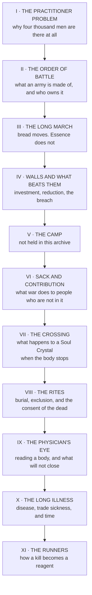

# The War Cycle

> **A practitioner converts Essence into effect. An army converts time into ground.**
>
> Every document in this cycle is an elaboration of that distinction, **and every failure in the record is a commander who did not believe it.**

---

## The Cycle

Eleven documents issued across four Divisions, each answering a question the one before it opened. **The first six are about the army. The last five are about the body.**

| Document | Issuing Division | The finding it rests on |
|---|---|---|
| **I · The Practitioner Problem** | Strategic | **Ground is held by bodies. It has never been held by anything else** |
| **II · The Order of Battle** | Strategic, distributed to Crown staffs | **An army is a town that walks**, and the fighting establishment is the smallest part of it |
| **III · The Long March** | Logistics and Supply, jointly with Strategic | **A practitioner is refilled by a Wellspring, or not at all** — so the vein map is the road map |
| **IV · Walls and What Beats Them** | Strategic | **No practitioner has ever invested a fortress.** Investment is time converted into ground and there is no other instrument for it |
| **V · The Camp** | — | *Cited by every other volume. Not held here* |
| **VI · Sack and Contribution** | Arbitration. **Strategic was invited to comment and declined** | **A legal standard which cannot reach the conduct it exists to govern is not a standard but a description of where the record stops** |
| **VII · The Crossing** | Research and Archives | **Class IV is not stolen from the dead. It is intercepted from the Wellspring, in transit, before arrival** |
| **VIII · The Rites** | Research and Archives, **over the objection of the Bench** | **Seven traditions, one problem.** The body has nine days of work to do and somebody has to see it is left alone to do it |
| **IX · The Physician's Eye** | Legion surgeons and Anima Harmonic assessors | **The wound is not a hole. It is an instruction, partially executed, still executing** |
| **X · The Long Illness** | Research and Archives | Every occupational mechanism has been understood for a century **and no polity operates a scheme** |
| **XI · The Runners** | Compiled for the Guild of Measurewrights. **No trade association was consulted because none exists** | **The factor sets the grade and the runner has no instrument** |

---

## What the Cycle Argues

Read in order, the eleven documents make one case and it is not a flattering one.
**An army cannot be beaten by a practitioner and a practitioner cannot be beaten by an army**, so wars are fought over ground, and ground is held by ordinary men in numbers. **Those men are chained to fodder arithmetic**, and the practitioners among them are chained to **geology** — which means campaign routes run vein to vein and half the sieges in the record are of places nobody valued.
Most of a campaign is therefore spent **sitting outside somewhere, digging, waiting, and dying of camp fever.** And the reliable instrument for actually breaking an enemy is neither the battle nor the siege. **It is riding through his country and burning the means by which he pays for an army.**
> Which puts the Accord in a specific position. **It is constitutionally incapable of a war of conquest** — the Law of Reversal sees to that. It is also the institution whose own after-action record for stormed towns contains a consistent discrepancy between the Scribe's account and the returns of the surviving population.
>
> **Nine reviews. No prosecutions.** The explanation is evidentiary and is technically correct.

---

## The Missing Fifth

**Sack and Contribution is the sixth of the cycle. The Practitioner Problem is the first, the Order of Battle the second, the Long March the third, and Walls the fourth.**
The fifth is **The Camp**, cited by name in the Long March as the document describing what happens to an army's water and to the men who drink it. It is not held in this archive.
Its absence is load-bearing. **Every document in the cycle points at camp disease as the largest killer in warfare** — the Order of Battle records more Legion men lost to it than to every enemy in the field, and Walls records besieging camps losing more to it than the garrison loses to everything.
> **The cycle's largest cause of death is the one volume nobody has.**

---

## Entries

**The Practitioner Problem** sits with the Guild Accord, under the Strategic Division that issued it. **The Camp** is not held in this archive. The remaining nine are here.
- [The Order of Battle](The War Cycle/The Order of Battle.md)
- [The Long March](The War Cycle/The Long March.md)
- [Walls and What Beats Them](The War Cycle/Walls and What Beats Them.md)
- [Sack and Contribution](The War Cycle/Sack and Contribution.md)
- [The Crossing](The War Cycle/The Crossing.md)
- [The Rites](The War Cycle/The Rites.md)
- [The Physician's Eye](The War Cycle/The Physician's Eye.md)
- [The Long Illness](The War Cycle/The Long Illness.md)
- [The Runners](The War Cycle/The Runners.md)
- [The Fisc — Paying for a Siege](The War Cycle/The Fisc — Paying for a Siege.md)
